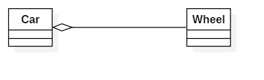

## 0.1 Overview

UML类图(Class Diagram)的作用是描述程序中类的信息及各个类之间的关系。

所有的面向对象（Object Oriented）语言都离不开类的概念，理解了程序中类的设计也就理解了程序的一半。但类的具体描述方式在各个类中都不一样，UML类图的提出是为了能够脱离语言的限制，抽象地描述各个类的信息及各个类之间的关系。这是UML类图的作用。

## 0.2 类的基本表示方式

一般的类图分为三个部分。部分类图有五个部分。类图具体规范如下:

* 第一部分为类名，如果类名用正体书写则说明这是可以实例化的普通类。如果类名用斜体书写，则说明这是抽象类。如果类名有下划线修饰则说明这是静态类。
* 第二部分为类内的属性，格式为修饰符 属性名 ：属性类型。修饰符为“+”说明该属性为public型，“#”说明该属性为protected型，“-”说明该属性为private型。
* 第三部分为类内的方法，格式为修饰符 方法名 （参数名1：参数类型1，……）：方法返回值类型。修饰符为“+”说明该方法为public型，“#”说明该方法为protected型，“-”说明该方法为private型。如果方法名有下划线修饰则说明这是静态方法。
* 如果类图中需要描述类的性质，则放在第四部分描述。如果类内有内部类，则放在第五部分描述。
* 如果类图描述的是一个接口，在接口名的上方需要加上《interface》的修饰符。同时该类图仅有两个部分，接口名和接口的方法。

下图介绍了三种示例:

Car是一个实体类, 上面既有属性, 也有方法. Animal是一个接口. Number是一个实现类Comparable接口的实体类.

## 0.3 类间关系的表示

类之间的关系有: 泛化(Generalization)关系，实现(Realization)关系，组合(Composition)关系, 聚合(Aggregation)关系, 关联(Association)关系, 依赖(Dependency)关系.

**1. 泛化关系**  

【泛化关系】：是一种继承关系,它指定了子类如何特化父类的所有特征和行为. 例如：老虎是动物的一种.  
【箭头指向】：带三角箭头的实线，箭头指向父类.  

**2. 实现关系**  

【实现关系】：是一种类与接口的关系，表示类是接口所有特征和行为的实现  
【箭头指向】：带三角箭头的虚线，箭头指向接口  

**3. 关联关系**  

【关联关系】：是一种拥有的关系,它使一个类知道另一个类的属性和方法；如：老师与学生，丈夫与妻子  
【箭头指向】：带普通箭头的实心线，指向被拥有者  
【代码体现】：一般情况下是成员变量  

**4. 聚合关系**  

【聚合关系】：是整体与部分的关系.如车和轮胎是整体和部分的关系.  
【箭头指向】：带空心菱形的实心线，菱形指向整体  
【代码体现】：成员变量  

**5. 组合关系**  

【组合关系】：是整体与部分的关系. 如:公司和部门(没有公司, 就不存在部门)  
【箭头指向】：带实心菱形的实线，菱形指向整体  
【代码体现】：成员变量  

**6. 依赖关系**  

【依赖关系】：是一种使用的关系,所以要尽量不使用双向的互相依赖。  
【代码表现】：局部变量、方法的参数或者对静态方法的调用  
【箭头指向】：带箭头的虚线，指向被使用者  

> 人们需要依赖电脑工作, 但是并不是一直需要电脑.

**关联, 聚合, 组合, 依赖的区别**  

* 关联关系仅仅表示对象与对象间的***拥有***关系.
* 组合与聚合在这层关系的基础上, 又添加一层***整体与部分***的关系.
* 组合的整体与部分同生共死, 而聚合则不是. 
* 依赖关系是最弱的关联关系, 不需要成员变量, 表示一种偶然性的、临时性的、非常弱的关系, 但是B类的变化依旧会影响到A.

各种关系的强弱顺序：泛化= 实现> 组合> 聚合> 关联> 依赖

## 0.4 参考文章

* [UML类图总结(浅显易懂实用)](https://blog.csdn.net/ibukikonoha/article/details/80643959)
* [UML类图](https://blog.csdn.net/qq_32252957/article/details/82799943)
* [ 继承、实现、依赖、关联、聚合、组合的联系与区别](https://www.cnblogs.com/jiqing9006/p/5915023.html)