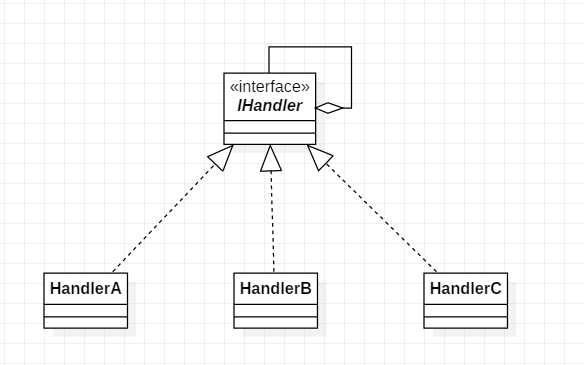

# 责任链模式

## 17.1 概述

为请求创建了一个接收者对象的链，每个接收者都包含对另一个接收者的引用，当某个接受者不能处理该请求时，会将该请求转给下一个接受者处理.

## 17.2 结构

**UML类图**



**代码**

```java
public interface IHandler {

    void doIt(int value);

    void setNext(IHandler handler);

}
public class HandlerA implements IHandler{

    private IHandler nextHandler;

    @Override
    public void doIt(int value) {
        if(value < 60){
            System.out.println("handler a : i can do it.");
            // do something
        }else{
            if(nextHandler == null) throw new IllegalArgumentException("none can deal it.");
            else nextHandler.doIt(value);
        }
    }

    @Override
    public void setNext(IHandler handler) {
        this.nextHandler = handler;
    }
}
public class HandlerB implements IHandler {

    private IHandler nextHandler;

    @Override
    public void doIt(int value) {
        if(value < 80 && value >= 60){
            System.out.println("handler b : i can do it.");
            // do something
        }else{
            if(nextHandler == null) throw new IllegalArgumentException("none can deal it.");
            else nextHandler.doIt(value);
        }
    }

    @Override
    public void setNext(IHandler handler) {
        this.nextHandler = handler;
    }
}
public class HandlerC implements IHandler {

    private IHandler nextHandler;

    @Override
    public void doIt(int value) {
        if(value >= 80 && value <= 100){
            System.out.println("handler c : i can do it.");
            // do something
        }else{
            if(nextHandler == null) throw new IllegalArgumentException("none can deal it.");
            else nextHandler.doIt(value);
        }
    }

    @Override
    public void setNext(IHandler handler) {
        this.nextHandler = handler;
    }
}
```

Client:
```java
    public static void main(String[] args){
        IHandler handlerA = new HandlerA();
        IHandler handlerB = new HandlerB();
        IHandler handlerC = new HandlerC();

        handlerA.setNext(handlerB);
        handlerB.setNext(handlerC);

        handlerA.doIt(14);
        handlerA.doIt(65);
        handlerA.doIt(89);
    }
```

输出:
```txt
handler a : i can do it.
handler b : i can do it.
handler c : i can do it.
```

> 上面Client中定义了责任链每一级处理者, 一般情况下使用责任链与定义责任链是分开的.

## 17.3 分析

**优点**

1. 解耦了处理者和请求者之间的关系:
    发出请求的人只需要向第一个具体的处理者发送请求，然后就可以不用管了，处理者会在责任链上自己寻找处理的方法;
2. 可以动态的改变责任链:任链还有的好处就是可以动态的改变责任，删除或者添加或者改变顺序;
3. 让各个处理者专注于实现自己的职责

## 17.4 应用

java web程序的Filter使用的就是责任链模式