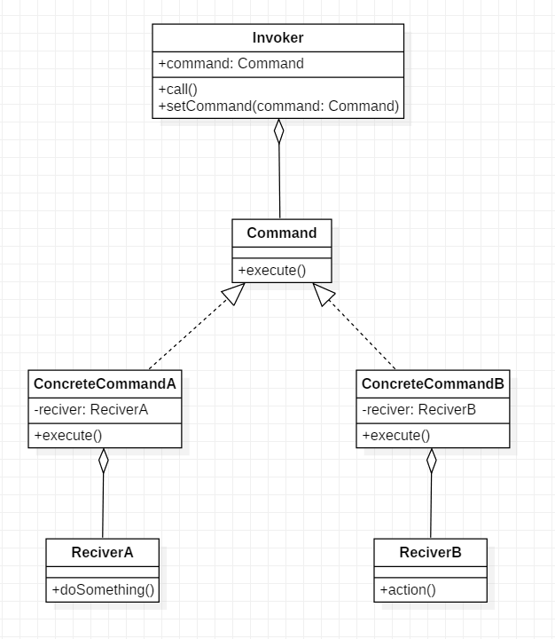

# 命令模式

## 18.1 概述

对命令请求者（Invoker）和命令实现者（Receiver）的解耦，方便对命令进行各种控制。

将请求封装成对象，以便使用不同的请求、日志、队列等来参数化其他对象, 支持撤销操作等。

## 18.2 结构

**角色**

1. Command : 定义命令的统一接口
2. Concrete Command : Command接口的实现者，用来执行具体的命令，某些情况下可以直接用来充当Receiver
3. Receiver : 命令的实际执行者
4. Invoker : 是请求的发送者，它通常拥有很多的命令对象，并通过访问命令对象来执行相关请求，它不直接访问接收者。

**UML类图**




**代码**

```java
public class ReciverA {
    public void doSomething(){
        System.out.println("do something. -A");
    }
}
public class ReciverB {
    public void action(){
        System.out.println("do action. - B");
    }
}
public interface Command {
    void execute();
}
public class ConcreteCommandA implements Command {

    private ReciverA reciver = new ReciverA();

    @Override
    public void execute() {
        reciver.doSomething();
    }
}
public class ConcreteCommandB implements Command {
    private ReciverB reciver = new ReciverB();
    @Override
    public void execute() {
        reciver.action();
    }
}
public class Invoker {
    private Command command;

    public void setCommand(Command command) {
        this.command = command;
    }

    public void call(){
        command.execute();
    }
}
```

```java
    public static void main(String[] args){
        Invoker invoker = new Invoker();

        invoker.setCommand(new ConcreteCommandA());
        invoker.call();

        invoker.setCommand(new ConcreteCommandB());
        invoker.call();

    }
```

> 从代码或者UML类图可以看出, Reciver并不是同一个接口的不同实现.

## 18.3 分析

**ONE**

命令模式实际上就是在Invoker与Reciver之间加了一层Command做隔离.

**优点**

1. 降低系统的耦合度, 命令模式能将调用操作的对象与实现该操作的对象解耦.
2. 可以动态的添加新的命令.

**缺点**  

* 可能产生大量具体命令类。因为计对每一个具体操作都需要设计一个具体命令类，这将增加系统的复杂性。

**扩展**

* 命令模式可以与组合模式结合, 将多个命令装配成一个组合命令, 即宏命令.
* 命令模式可以与后面介绍的备忘录模式结合, 实现命令的撤销与恢复.

## 18.4 应用