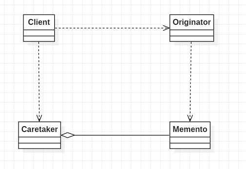

# 备忘录模式

## 概述

在不破坏封装性的前提下，捕获一个对象的内部状态，并在该对象之外保存这个状态，以便以后当需要时能将该对象恢复到原先保存的状态。该模式又叫快照模式。

## 结构

**角色**

* 发起人（Originator）角色：记录当前时刻的内部状态信息，提供创建备忘录和恢复备忘录数据的功能，实现其他业务功能，它可以访问备忘录里的所有信息;
* 备忘录（Memento）角色：负责存储发起人的内部状态，在需要的时候提供这些内部状态给发起人;
* 管理者（Caretaker）角色：对备忘录进行管理，提供保存与获取备忘录的功能，但其不能对备忘录的内容进行访问与修改.

**UML**



**代码**

```java
public class Memento {

    private final double money;

    private final int status;

    public Memento(double money, int status) {
        this.money = money;
        this.status = status;
    }

    // 宽接口
    double getMoney() {
        return money;
    }

    // 窄接口
    public int getStatus() {
        return status;
    }
}
public class Caretaker {

    private Stack head = null;

    public void addMemento(Memento memento) {
        Stack stack = new Stack(memento);
        if(head == null){
            head = stack;
        }else{
            stack.setNext(head);
            head = stack;
        }
    }

    public Memento popMemento(){
        if(head != null){
            Memento memento = head.getMemento();
            head = head.getNext();
            return memento;
        }else{
            return null;
        }
    }

    private static class Stack{
        private Memento memento;

        private Stack next;

        public Stack(Memento memento){
            this.memento = memento;
        }

        public Memento getMemento() {
            return memento;
        }

        public void setMemento(Memento memento) {
            this.memento = memento;
        }

        public Stack getNext() {
            return next;
        }

        public void setNext(Stack next) {
            this.next = next;
        }
    }
}

public class Originator {

    private double money;

    private int status;

    public Memento createMemento(){
        return new Memento(this.money, this.status);
    }

    public void run(){
        money++;
        status++;
    }

    public void restoreMemento(Memento memento){
        this.setMoney(memento.getMoney());
        this.setStatus(memento.getStatus());
    }

    double getMoney() {
        return money;
    }

    void setMoney(double money) {
        this.money = money;
    }

    public int getStatus() {
        return status;
    }

    public void setStatus(int status) {
        this.status = status;
    }
}
```

client:

```java
    public static void main(String[] args){
        Originator originator = new Originator();
        Caretaker caretaker = new Caretaker();

        originator.run();
        caretaker.addMemento(originator.createMemento());

        originator.run();
        caretaker.addMemento(originator.createMemento());

        originator.run();
        caretaker.addMemento(originator.createMemento());

        originator.run();
        caretaker.addMemento(originator.createMemento());

        Memento memento = null;
        while((memento = caretaker.popMemento()) != null){
            originator.restoreMemento(memento);
            System.out.println(originator.getStatus());
        }

    }
```

输出

```txt
4
3
2
1
```

## 分析

**优点**

* 提供了一种可以恢复状态的机制。当用户需要时能够比较方便地将数据恢复到某个历史的状态。
* 实现了内部状态的封装。除了创建它的发起人之外，其他对象都不能够访问这些状态信息。
* 简化了发起人类。发起人不需要管理和保存其内部状态的各个备份，所有状态信息都保存在备忘录中，并由管理者进行管理，这符合单一职责原则。

**缺点**

资源消耗大。如果要保存的内部状态信息过多或者特别频繁，将会占用比较大的内存资源。

**宽接口与窄接口**

宽接口是获取到信息多的接口, 窄接口是获取到信息少的接口.

因为备忘录模式是在不破坏封装的情况下, 把对象的状态保存起来. 备忘录中的一部分数据是可以对外展示的(窄接口), 但是大部分数据是只允许发起人可以访问得到的(宽接口).