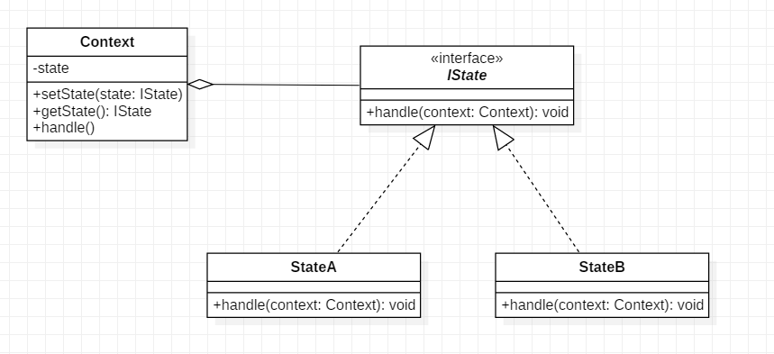

# 状态模式

## 23.1 概述

在软件开发过程中，应用程序中的有些对象可能会根据不同的情况做出不同的行为，我们把这种对象称为有状态的对象，而把影响对象行为的一个或多个动态变化的属性称为状态。当有状态的对象与外部事件产生互动时，其内部状态会发生改变，从而使得其行为也随之发生改变。如人的情绪有高兴的时候和伤心的时候，不同的情绪有不同的行为，当然外界也会影响其情绪变化。

对这种有状态的对象编程，传统的解决方案是：将这些所有可能发生的情况全都考虑到，然后使用 if-else 语句来做状态判断，再进行不同情况的处理。但当对象的状态很多时，程序会变得很复杂。而且增加新的状态要添加新的 if-else 语句，这违背了“开闭原则”，不利于程序的扩展。

以上问题如果采用“状态模式”就能很好地得到解决。状态模式的解决思想是：当控制一个对象状态转换的条件表达式过于复杂时，把相关“判断逻辑”提取出来，放到一系列的状态类当中，这样可以把原来复杂的逻辑判断简单化。 

状态模式的定义:
**对有状态的对象，把复杂的“判断逻辑”提取到不同的状态对象中，允许状态对象在其内部状态发生改变时改变其行为。**

## 23.2 结构

**角色**

* 环境角色(Context): 也称为上下文，它定义了客户感兴趣的接口，维护一个当前状态，并将与状态相关的操作委托给当前状态对象来处理;
* 抽象状态(State): 定义一个接口, 用以封装环境对象的特定状态所对应的行为;
* 具体状态(ConcreteState): 实现抽象状态所对应的行为.

**UML**



**代码**

```java
public interface IState {
    void handle(Context context);
}
public class Context {

    private IState state;

    public IState getState() {
        return state;
    }

    public void setState(IState state) {
        this.state = state;
    }

    public void run(){
        state.handle(this);
    }
}
public class StateA implements IState {
    @Override
    public void handle(Context context) {
        System.out.println("state A");
        context.setState(new StateB());
    }
}
public class StateB implements IState {
    @Override
    public void handle(Context context) {
        System.out.println("state B");
        context.setState(new StateA());
    }
}
```

client

```java
    public static void main(String[] args){
        Context context = new Context();
        context.setState(new StateA());
        for(int i = 0; i < 10; i++){
            context.run();
        }
    }
```

输出:

```txt
state A
state B
state A
state B
state A
state B
state A
state B
state A
state B
```

## 23.3 分析

**优点**

* 状态模式将与特定状态相关的行为局部化到一个状态中，并且将不同状态的行为分割开来，满足“单一职责原则”
* 减少对象间的相互依赖。将不同的状态引入独立的对象中会使得状态转换变得更加明确，且减少对象间的相互依赖
* 有利于程序的扩展。通过定义新的子类很容易地增加新的状态和转换

**缺点**

* 状态模式的使用必然会增加系统的类与对象的个数
* 状态模式的结构与实现都较为复杂，如果使用不当会导致程序结构和代码的混乱

**解读**

状态模式的定义是: 当一个对象的内在状态改变时允许改变其行为，这个对象看起来像是改变了其类. 

这也是状态模式之所以是行为型模式的原因, 因为突出了一个类行为的改变.

上面的结构中可以看出, 我们关注的对象是context, 在不断运行的过程中, 其行为是不断变化的.