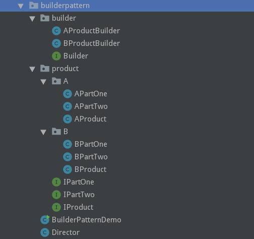

# 建造者模式

## 4.1 建造者

Effective Java中提到了一种建造者, 以及建造者的应用场景. 当构建一个由多个域变量(或者说是状态)组成的对象时, 直接构建可能会比较复杂, 这时可以通过建造者作为一个缓冲或者中介, 将构建这个对象所需的"材料"逐步交给建造者, 最终由建造者完成构建.

StringBuilder类就是一个String对象的建造者, 我们通过不断向StringBuilder实例中传递字符串变量, 并在最后使用toString()方法, 最终构建出一个String对象.


代码示例如下:

```java
// 需要构建的目标对象
public class ObjectA {

    private final int a;

    private final int b;

    private final int c;

    private final boolean d;

    private final String e;

    private final long f;

    private final double g;

    public ObjectA(int a, int b, int c, boolean d, String e, long f, double g) {
        this.a = a;
        this.b = b;
        this.c = c;
        this.d = d;
        this.e = e;
        this.f = f;
        this.g = g;
    }
}

// 建造者
public class ObjectABuilder {

    private int a = 0;

    private int b = 1;

    private int c;

    private boolean d = false;

    private String e = null;

    private long f = 0;

    private double g = 0;

    public ObjectABuilder() {
    }

    public ObjectA builder(){
        if(c == 0){
            throw new IllegalStateException("c can not be 0.");
        }
        return new ObjectA(a, b, c, d, e, f, g);
    }

    public int getA() {
        return a;
    }

    public void setA(int a) {
        this.a = a;
    }

    public int getB() {
        return b;
    }

    public void setB(int b) {
        this.b = b;
    }

    public int getC() {
        return c;
    }

    public void setC(int c) {
        this.c = c;
    }

    public boolean isD() {
        return d;
    }

    public void setD(boolean d) {
        this.d = d;
    }

    public String getE() {
        return e;
    }

    public void setE(String e) {
        this.e = e;
    }

    public long getF() {
        return f;
    }

    public void setF(long f) {
        this.f = f;
    }

    public double getG() {
        return g;
    }

    public void setG(double g) {
        this.g = g;
    }

}
```

如上所示, ObjectA的构建必须要保证多个参数一同传入, 并且假设我们需求需要保证构建的ObjectA中c变量不能为0. 这时通过建造者就达到了以上要求, 并且简化构建过程. 从上面可以看出, 如果在建造者对象中, 没有给某一个变量赋值, 构建器会给它一个默认值, 这也是一项构建器的特点.

建造者是将构建的一组对象形成一个组装好的产品. 有时候, 建造过程还是有顺序存在, 这时就需要考虑构建顺序; 或者构建的一组对象中有些存在依赖关系, 这时还需要考虑构建一个一个对象的构建, 之后再组装起来. 总之, 建造者模式将复杂的构建过程封装, 对外提供简单的访问接口, 这样很好的符合迪米特法则.


## 4.2 建造者模式

上面的建造者示例很简单, 建造者本身只是对需要的变量进行暂存, 在最终执行构建时, 直接将暂存的对象组装起来即可. 但是如果像上面最后考虑的那样, 构建过程中存在顺序依赖, 并且各个组件间存在依赖关系, 那么将这一起都放在建造者中实现不符合单一职责原则. 这样会导致, 如果多个具有相同构建过程的同类产品, 每一个产品都需要重新定义构建过程以及构建的具体实现. 所以, 可以把建造者中的构建过程的控制从建造者本身抽取出来. 这样, 不同的产品如果具有相似的构建过程, 那么这个构建过程是可以复用的, 此外, 如果整个构建过程修改, 只需修改一个控制构建过程的类即可.

上面的建造者是简单的建造者模式, 不考虑多组产品复用构建过程的情况下, 完全够用了. 下面介绍标准的建造者模式:

1. Director -- 导演, 即上面说的抽离出来的, 负责控制组装过程
2. Builder  -- 抽象建造者, 提供构建者模板
3. ConcreteBuilder  -- 具体建造者, 负责变量的收集, 以及最终组装
4. Product  -- 产品

**UML类图**: 


## 4.3 例程

**文件结构如下**: 



**Product**:

```java
// 接口
public interface IPartOne {
    void one();
}
public interface IPartTwo {
    void two();
    IPartOne getPartOne();
}
public interface IProduct {
    IPartTwo getPartTwo();
    String getName();
    int getValue();
}

// A
public class APartOne implements IPartOne {
    @Override
    public void one() {
        System.out.println("A one");
    }
}
public class APartTwo implements IPartTwo {
    private final APartOne aPartOne;

    public APartTwo(APartOne aPartOne){
        this.aPartOne = aPartOne;
    }

    @Override
    public void two() {
        System.out.println("part");
    }

    @Override
    public IPartOne getPartOne() {
        return this.aPartOne;
    }
}
public class AProduct implements IProduct {

    private APartTwo aPartTwo;

    private String name;

    private int value;

    public String getName() {
        return name;
    }

    public void setName(String name) {
        this.name = name;
    }

    public int getValue() {
        return value;
    }

    public void setValue(int value) {
        this.value = value;
    }

    @Override
    public IPartTwo getPartTwo() {
        return this.aPartTwo;
    }

    public void setaPartTwo(APartTwo aPartTwo) {
        this.aPartTwo = aPartTwo;
    }
}

// B
public class BPartOne implements IPartOne {
    @Override
    public void one() {
        System.out.println("B one");
    }
}
public class BPartTwo implements IPartTwo {
    private final BPartOne bPartOne;

    public BPartTwo(BPartOne bPartOne){
        this.bPartOne = bPartOne;
    }

    @Override
    public void two() {

    }

    @Override
    public IPartOne getPartOne() {
        return this.bPartOne;
    }
}
public class BProduct implements IProduct {

    private BPartTwo bPartTwo;

    private String name;

    private int value;

    public String getName() {
        return name;
    }

    public void setName(String name) {
        this.name = name;
    }

    public int getValue() {
        return value;
    }

    public void setValue(int value) {
        this.value = value;
    }

    @Override
    public IPartTwo getPartTwo() {
        return this.bPartTwo;
    }

    public void setbPartTwo(BPartTwo bPartTwo) {
        this.bPartTwo = bPartTwo;
    }
}
```

**Builder**: 

```java
public interface Builder {

    // 部件一构建实现
    void buildPartOne();

    // 部件二构建实现
    void buildPartTwo();

    IProduct build();

    Builder setName(String name);

    Builder setValue(int value);

}
```

**ConcreteBuilder**: 

```java
public class AProductBuilder implements Builder {

    private APartOne aPartOne;

    private APartTwo aPartTwo;

    private String name;

    private int value;

    @Override
    public void buildPartOne() {
        this.aPartOne = new APartOne();
    }

    @Override
    public void buildPartTwo() {
        this.aPartTwo = new APartTwo(this.aPartOne);
    }

    @Override
    public IProduct build() {
        AProduct product = new AProduct();
        product.setaPartTwo(this.aPartTwo);
        product.setName(this.name);
        product.setValue(this.value);
        return product;
    }

    @Override
    public Builder setName(String name) {
        this.name = name;
        return this;
    }

    @Override
    public Builder setValue(int value) {
        this.value = value;
        return this;
    }
}
public class BProductBuilder implements Builder {

    private BPartOne partOne;

    private BPartTwo partTwo;

    @Override
    public void buildPartOne() {
        this.partOne = new BPartOne();
    }

    @Override
    public void buildPartTwo() {
        this.partTwo = new BPartTwo(this.partOne);
    }

    private String name;

    private int value;

    public Builder setName(String name){
        this.name = name;
        return this;
    }

    public Builder setValue(int value){
        this.value = value;
        return this;
    }

    @Override
    public IProduct build() {
        BProduct product = new BProduct();
        product.setbPartTwo(this.partTwo);
        product.setName(this.name);
        product.setValue(this.value);
        return product;
    }
}
```

**Dircetor**: 

```java
public class Director {

    private Builder builder;

    public Director(Builder builder) {
        this.builder = builder;
    }

    public IProduct construct(){
        builder.buildPartOne();
        builder.buildPartTwo();
        return builder.build();
    }
}
```

**Demo**: 

```java
public class BuilderPatternDemo {

    public static void main(String[] args){
        // 构建产品A
        Builder builderA = new AProductBuilder().setName("A").setValue(12);
        IProduct productA = new Director(builderA).construct();

        // 构建产品B
        Builder builderB = new BProductBuilder().setName("B").setValue(20);
        IProduct productB = new Director(builderB).construct();


        System.out.println("----A----");
        userProduct(productA);


        System.out.println("----B----");
        userProduct(productB);
    }

    public static void userProduct(IProduct product){
        System.out.println(product.getName() + " - " + product.getValue());
        product.getPartTwo().getPartOne().one();
    }

}
```

## 4.4 小结

以上两中Builder都是建造者模式, 只不过一个将Builder与Director和在一起, 一个将其拆分开. 不同的场景都有应用. 如果construct()方法较为复杂，待构建产品的组成部分较多，建议还是将construct()方法单独封装在Director中.

此外, construct方法其实也可以是静态方法.

> 钩子方法: 不同的ConcreteBuilder构建过程可能存在差异, 并不一定Director规定的每一个构建方法都要执行, 这时可以在Builder和ConcreteBuilder加入"isXxx"方法, Director进行构建的时候, 会检查该方法返回的布尔值, 判断是否需要执行该步构建.