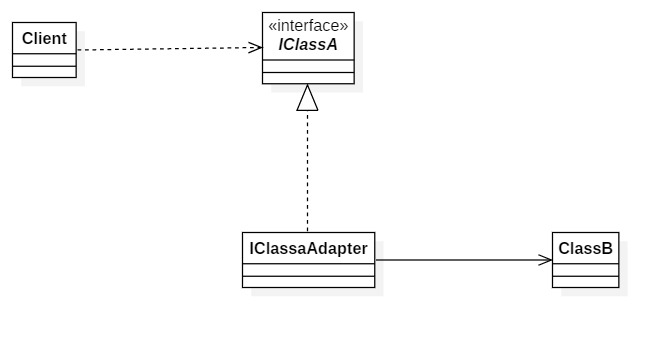
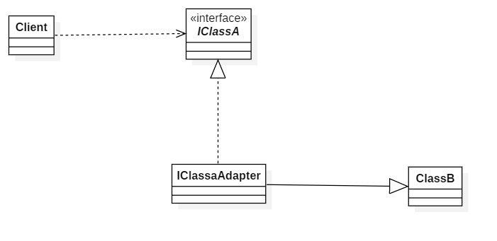

# 适配器模式

## 7.1 概述

一个地方需要使用类A的对象, 但是现在只有类B的对象, 类B可以胜任类A的工作, 但是类B仍然不是类A, 所以不能被使用, 这时就需要用到适配器模式, 将类B伪装成类A, 来使用.

适配器模式一般分为两种:

1. 类适配器模式
2. 对象适配器模式

## 7.2 背景

有一个方法, 形参是IClassA:

```java
    public static void operation(IClassA classA){
        classA.show();
        System.out.println(classA.add(10, 12));
    }
```

现在有的是:

```java
public interface IClassA {

    void show();

    int add(int a, int b);

}


public class ClassB {

    public void introduce(){
        System.out.println("hello!");
    }

    public int sub(int a, int b){
        return a - b;
    }

}
```

经过分析, 发现ClassB的行为与IClassA的行为相类似, 但是类型不一样, operation方法没有办法使用ClassB. 这时就需要adapter来做适配.

## 7.3 对象适配器模式



```java
public class IClassaAdapter implements IClassA {

    private ClassB classB;

    public IClassaAdapter(ClassB classB) {
        this.classB = classB;
    }

    @Override
    public void show() {
        classB.introduce();
    }

    @Override
    public int add(int a, int b) {
        return classB.sub(a, 0 - b);
    }
}
```

```java
    public static void main(String[] args){
        IClassaAdapter adapter = new IClassaAdapter(new ClassB());
        operation(adapter);
    }
```

## 7.4 类适配器模式



```java
public class IClassaAdapter extends ClassB implements IClassA {
    @Override
    public void show() {
        this.introduce();
    }

    @Override
    public int add(int a, int b) {
        return this.sub(a, 0 - b);
    }
}
```

```java
    public static void main(String[] args){
        IClassA classA = new IClassaAdapter();
        operation(classA);
    }
```

> 由于java是单继承, 类适配器模式在java中存在局限性.

> 有时候ClassB与IClassA的行为只有部分一致, 这时候可以根据需要, 选择性的进行适配.