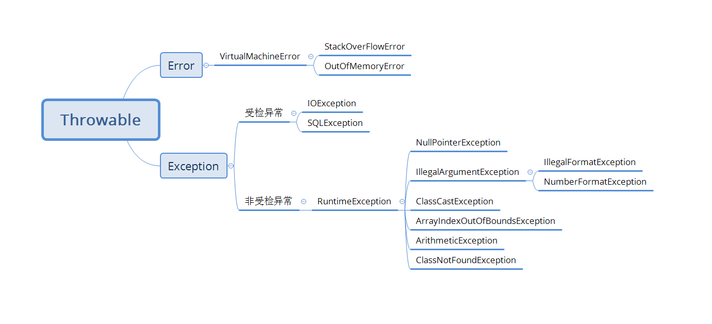

## 错误及异常

结构:



* Error是程序运行期间出现的错误, 该错误是不可恢复的. 因此程序中不建议捕获Error, 即catch中不应捕获Error.
* Exception表示可恢复的异常, 是编译器可以捕捉到的. 它包含两种类型: 受检异常和运行时异常.

```java
public class ExceptionDemo {

    public static void triggerThrowable() throws FrogThrowable {
        throw new FrogThrowable();
    }

    public static void triggerError(){
        throw new FrogError();
    }

    public static void triggerCheckException() throws FrogCheckException {
        throw new FrogCheckException();
    }

    public static void triggerRuntimeException(){
        throw new FrogRuntimeException();
    }


    public static class FrogThrowable extends Throwable{
        public FrogThrowable() {
            super("frog throwable.");
        }
    }

    public static class FrogError extends Error{
        public FrogError(){
            super("frog error");
        }
    }

    public static class FrogCheckException extends Exception{
        public FrogCheckException() {
            super("frog check exception.");
        }
    }

    public static class FrogRuntimeException extends RuntimeException{
        public FrogRuntimeException() {
            super("frog funtime exception.");
        }
    }
}
```

通过上面代码可以Throwable和Exception是受检的, 必须catch或者抛出. Error和RuntimeException是非受检的, 不必catch或抛出. 另外非受检异常虽然也可以抛出或catch, 但是Error不建议catch.