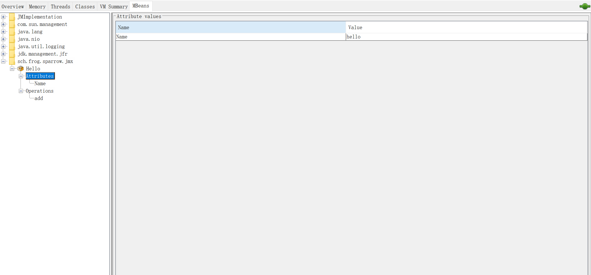

# JMX

## 概述

JMX（Java Management Extensions，即Java管理扩展）是一个为应用程序、设备、系统等植入管理功能的框架.

## 本地JMX

本地使用jmx很简单:

1. java_home下的bin目录中, 找到jconsole.exe, 双击启动;

2. 选择要查看的应用, 点击connect;
3. 接下来就可以看到这个应用的各种指标了:


这些指标包括:
1. 内存使用情况:
   1. 堆内存使用
   2. 非堆内存使用
   3. 新生代, 老年代等等
2. 线程使用情况:
   1. 当前线程数;
   2. 每一个线程的栈信息;
3. 类加载情况:
   1. 已加载的类数量;
4. 虚拟机相关信息:
   1. 进程id, 启动时间, jvm版本等;
   2. 线程概览信息;
   3. 内存概览信息;
   4. 操作系统信息;
   5. 启动参数等;
5. 被jmx管理的bean信息(这个下面会额外说)

## 远程JMX

本地连接不需要什么配置, 但是远程连接, 需要对外开放相关端口.

1. 新建访问配置文件```jmxremote.access```

```
frog readonly
```

2. 新建密码配置文件```jmxremote.password```

```
frog pass123
```

3. 启动应用```java -Dcom.sun.management.jmxremote.authenticate=true -Dcom.sun.management.jmxremote.ssl=false -Dcom.sun.management.jmxremote.port=9890 -Dcom.sun.management.jmxremote.password.file=jmxremote.password -Djava.rmi.server.hostname=172.28.48.143 -Dcom.sun.management.jmxremote.access.file=jmxremote.access -jar sparrow.jar```

这里介绍一下各个参数的含义:

* com.sun.management.jmxremote.authenticate: 是否使用授权(true-使用, false-不使用)
* com.sun.management.jmxremote.ssl: 是否启用ssl(true-启用, false-不启用)
* com.sun.management.jmxremote.port: 对外暴露的端口, jmx远程访问时, 就需要使用这个端口
* com.sun.management.jmxremote.password.file: 指定密码文件, 这个文件必须是只对当前用户可读可写, 对其他用户没有访问权限的, 否则启动会报错
  * linux下的话, 执行```chmod 600 <filename>```
* java.rmi.server.hostname: 本机ip地址
* com.sun.management.jmxremote.access.file: 访问控制文件, 内部需要配置用户名和用户名所对应的权限

4. 使用jconsole远程访问


## MBeans

MBean是被管理的Java对象. 一个MBean可以代表一个设备, 一个应用程序或者任何需要被管理的资源. 简单的说, MBean就是应用程序中暴露出来的接口, 供JMX调用. MBean暴露一个管理接口, 包括以下内容:

* 一组可读可写的属性, 或者两者都有;
* 一组可调用的操作;
* 一个自我描述.

在MBean实例的声明周期中, 其管理接口不变. 当预定义的事件发生时, MBeans也可以发出通知.

JMX定义了5种规范的MBean:

1. 标准的MBeans;
2. 动态的MBeans;
3. Open MBeans;
4. Model MBeans;
5. MXBeans.

下面介绍一下标准MBeans:

定义一个普通的接口:

```java
public interface HelloMBean {

    String getName();

    int add(int a, int b);
}
```

实现这个普通的接口:

```java
public class Hello implements HelloMBean{
    @Override
    public String getName() {
        return "hello";
    }

    @Override
    public int add(int a, int b) {
        return a + b;
    }
}
```

将这个类的实例注册为MBean:

```java
import org.slf4j.Logger;
import org.slf4j.LoggerFactory;
import org.springframework.boot.ApplicationArguments;
import org.springframework.boot.ApplicationRunner;
import org.springframework.stereotype.Component;
import sch.frog.sparrow.jmx.Hello;

import javax.management.MBeanServer;
import javax.management.ObjectName;
import java.lang.management.ManagementFactory;

@Component
public class MBeanApplicationRunner implements ApplicationRunner {

    private static final Logger logger = LoggerFactory.getLogger(MBeanApplicationRunner.class);

    @Override
    public void run(ApplicationArguments args) throws Exception {
        MBeanServer platformMBeanServer = ManagementFactory.getPlatformMBeanServer();
        ObjectName objectName = new ObjectName("sch.frog.sparrow.jmx:type=Hello");
        Hello hello = new Hello();
        platformMBeanServer.registerMBean(hello, objectName);

        logger.info("mbean {} init finish.", objectName);
    }

}
```

接下来, 通过jconsole连接上这个应用, 就可以看到效果了:




> 标准的MBean操作的方法以及返回值类型只能是基本类型, 例如String, int等.

## 参考文档

* [MBeans](http://www.tianshouzhi.com/api/tutorials/jmx/34)