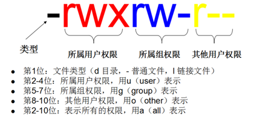

# Linux文件权限

chmod --> (change mode)变更文件或目录的权限 --> 格式: chmod [参数] [<权限范围><符号><权限代号>]

参数: -R或--recursive 递归处理，将指定目录下的所有文件及子目录一并处理

权限范围的表示法如下：
* u：User，即文件或目录的拥有者。
* g：Group，即文件或目录的所属群组。
* o：Other，除了文件或目录拥有者或所属群组之外，其他用户皆属于这个范围。
* a：All，即全部的用户，包含拥有者，所属群组以及其他用户。

符号：
* \+ 添加权限
* \- 取消权限

有关权限代号的部分，列表于下：
* r：读取权限，数字代号为"4"。
* w：写入权限，数字代号为"2"。
* x：执行或切换权限，数字代号为"1"。
* -：不具任何权限，数字代号为"0"。

举例:
chmod u-rwx xxx		#取消xxx目录，用户“读写执行”权限
chmod g-rwx xxx 	#取消xxx目录，组“读写执行”权限
chmod 777 xxx		#给xxx目录添加所有权限

linux权限格式:

