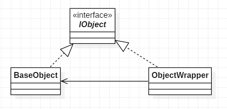
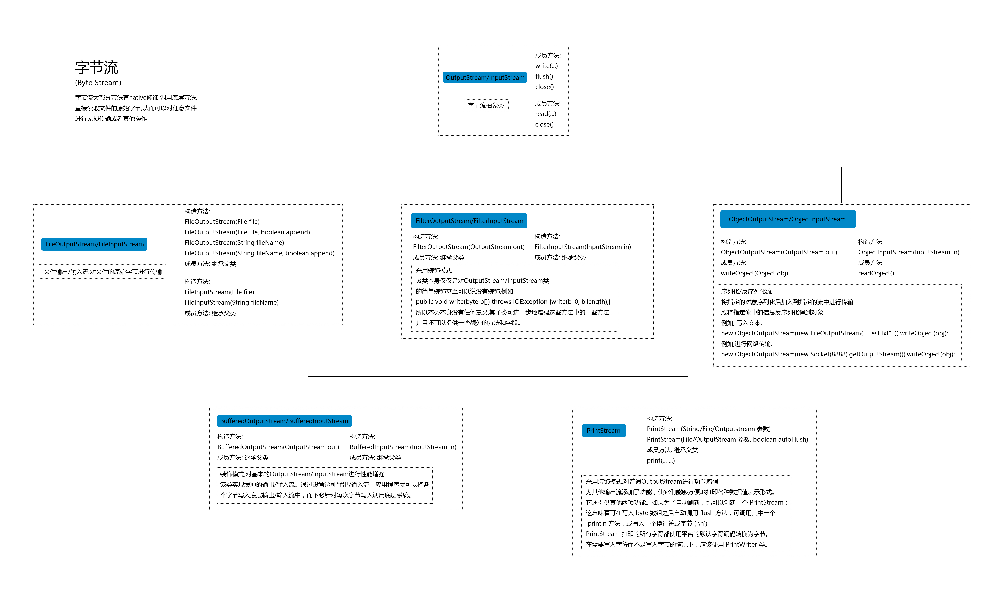
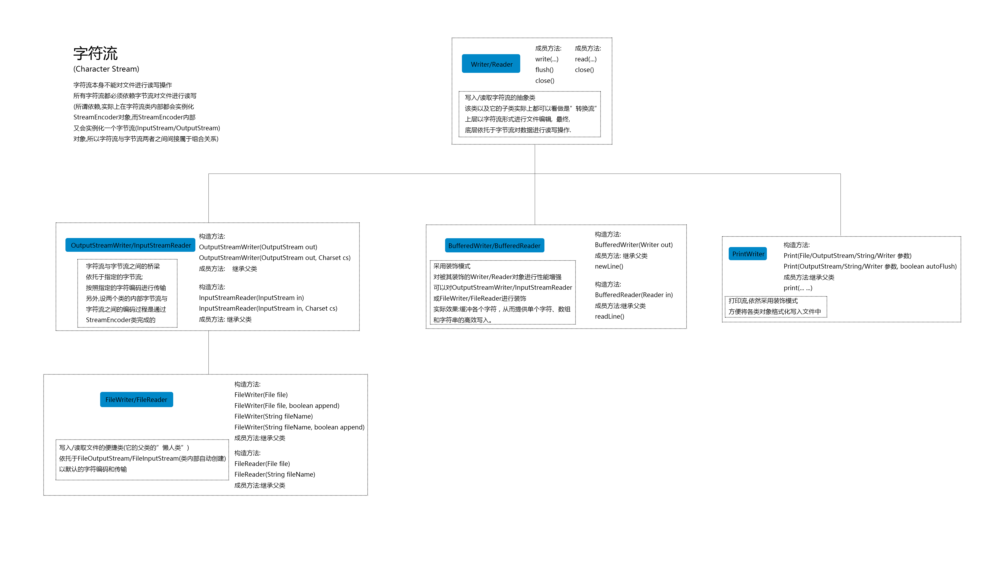

# 装饰器模式

## 10.1 概述

装饰器模式是一种用于代替继承的技术，无需通过继承增加子类就能扩展对象的新功能。使用对象的关联关系代替继承关系，更加灵活，同时避免类型体系的快速膨胀。

## 10.2 结构

**UML类图**



**代码**

```java
public interface IObject {
    void show();
}

public class BaseObject implements IObject {
    @Override
    public void show() {
        System.out.println("hello");
    }
}

public class ObjectWrapper implements IObject {

    private IObject iObject;

    public ObjectWrapper(IObject iObject) {
        this.iObject = iObject;
    }

    @Override
    public void show() {
        iObject.show();
        System.out.println("world");
    }
}
```


## 10.3 应用

装饰器模式在java文件IO流中应用广泛:



从图上可以看出, 字节流的基本实现类是: FileOutputStream和FileInputStream, 剩下的所有字节流实现都是装饰器.

顺便提一下字符流:



可以看出, OutputStreamWriter/InputStreamReader的构造传参为字节流对象, 这里应该是适配器模式. 然后BufferedWriter/BufferedReader, PrintWriter都是装饰器. 然后这里还有FileWriter/FileReader, 可以看下源代码:

```java
    public FileWriter(String fileName) throws IOException {
        super(new FileOutputStream(fileName));
    }
    
    public FileReader(String fileName) throws FileNotFoundException {
        super(new FileInputStream(fileName));
    }
```

就是把OutputStreamWriter/InputStreamReader中构造时需要传入的字节流对象进行了默认设置.