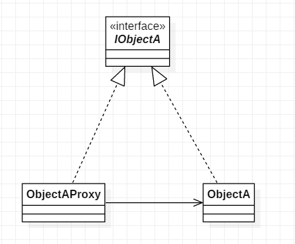

# 代理模式

## 11.1 概述

给某一个对象提供一个代理对象，并由代理对象控制对原对象的引用。通俗的来讲代理模式就是我们生活中常见的中介。

> java中, 代理可以分为静态代理和动态代理, 动态代理目前有两种一种是jdk本身提供的动态代理, 另一种是第三方Cglib动态代理

## 11.2 结构

**角色**
1. 抽象主题: IObjectA, 通过接口或抽象类声明真实主题和代理对象实现的业务方法
2. 真实主题: ObjectA, 实现了抽象主题中的具体业务，是代理对象所代表的真实对象，是最终要引用的对象
3. 代理: ObjectAProxy, 提供了与真实主题相同的接口，其内部含有对真实主题的引用，它可以访问、控制或扩展真实主题的功能

**UML类图**



**代码**

```java
public interface IObjectA {
    void show();
}
public class ObjectA implements IObjectA {
    @Override
    public void show() {
        System.out.println("object a");
    }
}
public class ObjectAProxy implements IObjectA {

    private ObjectA objectA;

    public ObjectAProxy() {
        objectA = new ObjectA();
    }

    @Override
    public void show() {
        System.out.println("output log");
        objectA.show();
    }
}
```

## 11.3 分析

**代理模式与装饰器模式的区别**

通过UML类图, 可以看出代理模式与装饰器模式的结构基本一样. 他们之间的区别如下:

1. 装饰器模式的装饰器只是一个"壳子", 被装饰的目标类需要由客户端传入, 客户端"知道"被装饰对象的存在; 代理模式中, 客户端一般不知道被代理对象的存在.
2. 装饰器模式是对继承关系的替代, 强调功能的扩展. 代理模式强调代理类对被代理类的控制, 代理类对实际对象进行控制操作.