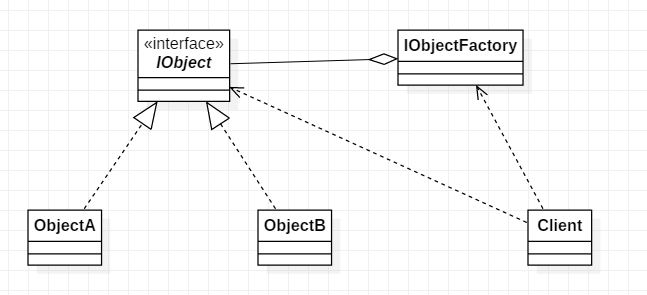

# 享元模式

## 13.1 概述

享元模式是一种应用广泛的模式, 所谓享元模式实际上就是对象池. 例如字符串常量池, 数据库连接池, 线程池等等. 有些对象的创建的开销很大, 这时可以通过享元模式进行对象共享, 是的不会去频繁的创建对象.

> 所谓享元模式就是运行共享技术有效地支持大量细粒度对象的复用

## 13.2 结构

**UML类图**



**代码**

java内的Integer就使用了享元模式:

```java
    // Integer的内部类, 也就是Integer对象池
    private static class IntegerCache {
        static final int low = -128;
        static final int high;
        static final Integer cache[];

        static {
            // high value may be configured by property
            int h = 127;
            String integerCacheHighPropValue =
                sun.misc.VM.getSavedProperty("java.lang.Integer.IntegerCache.high");
            if (integerCacheHighPropValue != null) {
                try {
                    int i = parseInt(integerCacheHighPropValue);
                    i = Math.max(i, 127);
                    // Maximum array size is Integer.MAX_VALUE
                    h = Math.min(i, Integer.MAX_VALUE - (-low) -1);
                } catch( NumberFormatException nfe) {
                    // If the property cannot be parsed into an int, ignore it.
                }
            }
            high = h;

            cache = new Integer[(high - low) + 1];
            int j = low;
            for(int k = 0; k < cache.length; k++)
                cache[k] = new Integer(j++);

            // range [-128, 127] must be interned (JLS7 5.1.7)
            assert IntegerCache.high >= 127;
        }

        private IntegerCache() {}
    }
```

```java
    // Integer的valueOf方法, 不会去创建新的对象, 而是, 从Integer对象池中获取对象
    public static Integer valueOf(int i) {
        if (i >= IntegerCache.low && i <= IntegerCache.high)
            return IntegerCache.cache[i + (-IntegerCache.low)];
        return new Integer(i);
    }
```

```java
	public static void main(String[] args) {
		Integer a = new Integer(10);
		Integer b = Integer.valueOf(10);
		Integer c = 10;
		
		System.out.println("a == b : " + (a == b));
		System.out.println("b == c : " + (b == c));
	}
```

输出结果:
```
a == b : false
b == c : true
```

在使用Integer时, 满足以下情况时, 将会使用享元模式直接从Integer对象池中获取对象:
1. 不使用Integer的构造方法来创建对象
2. int值在[-128, 127]之间

## 13.3 分析

**注意事项**  
享元模式需要保证共享的对象是不可变对象, 否则, 不同时刻, 或者不同的线程访问时得到的对象是不同的, 这就会产生问题. 也就是说共享的状态必须是不可变状态, 即内部状态:

* 内部状态：在享元对象内部不随外界环境改变而改变的共享部分
* 外部状态：随着环境的改变而改变，不能够共享的状态就是外部状态

## 13.3 应用

下几种情形适合采用享元模式。
1. 系统中存在大量相同或相似的对象，这些对象耗费大量的内存资源。
2. 大部分的对象可以按照内部状态进行分组，且可将不同部分外部化，这样每一个组只需保存一个内部状态。
3. 由于享元模式需要额外维护一个保存享元的数据结构，所以应当在有足够多的享元实例时才值得使用享元模式。
