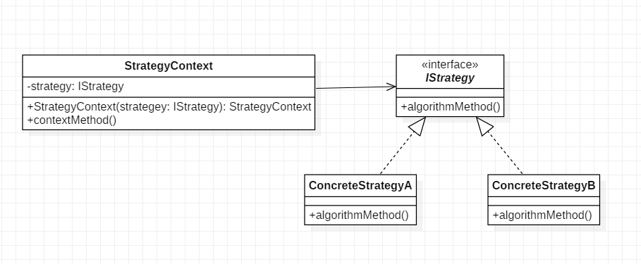

# 策略模式

## 15.1 概述

策略模式定义了一系列的算法，并将每一个算法封装起来，使每个算法可以相互替代，使算法本身和使用算法的客户端分割开来，相互独立。

1. 把变化的代码从不变的代码中分离出来
2. 针对接口编程而不是具体类
3. 多用组合，少用继承

## 15.2 结构

**角色**
1. Strategy : 抽象的策略
2. ConcreteStrategy : 具体的策略
3. Context : 上下文环境, 持有 Stragegy 的引用

**UML类图**



**代码**

```java
public interface IStrategy {
    void algorithmMethod();
}

public class StrategyContext {

    private IStrategy strategy;

    public StrategyContext(IStrategy strategy) {
        this.strategy = strategy;
    }

    public void contextMethod(){
        strategy.algorithmMethod();
    }
}

public class ConcreteStrategyA implements IStrategy {
    @Override
    public void algorithmMethod() {
        System.out.println("concrete strategy a");
    }
}

public class ConcreteStrategyB implements IStrategy {
    @Override
    public void algorithmMethod() {
        System.out.println("concrete strategy b");
    }
}
```

```java
    public static void main(String[] args){
        StrategyContext context = new StrategyContext(new ConcreteStrategyA());
        context.contextMethod();
    }
```

> 具体策略的选择权依然属于客户端代码

## 15.3 分析

**上下文Context角色**

* 实现行为的共享. 一个策略可能不止调用一次, 策略上下文持有一个策略, 保证多次从上下文中获取到的都是同一个策略.

可以将上下文理解为行为的持有者. 

> 在行为型设计模式中, 经常出现"上下文"这一角色

**优点**

1. 策略模式恰当使用继承可以把公共的代码移到父类里面, 从而避免重复的代码
2. 代码耦合度降低, 具体策略与调用者隔离, 独立变化.
3. 使用策略模式可以避免使用多重条件判断语句(实际上是把判断的任务交给了客户端)

**缺点**
1. 客户端必须知道所有的策略类，并自行决定使用哪一个策略类。策略模式只适用于客户端知道所有的算法或行为的情况
2. 策略模式造成很多的策略类

**扩展**

* 策略模式和简单工厂结合, 将策略的选择交由策略上下文.

## 15.4 应用

java中使用Comparator接口就是策略模式的应用. 此外, 线程池ThreadPoolExecutor的构造方法:

```java
public ThreadPoolExecutor(int corePoolSize,
                              int maximumPoolSize,
                              long keepAliveTime,
                              TimeUnit unit,
                              BlockingQueue<Runnable> workQueue,
                              ThreadFactory threadFactory,
                              RejectedExecutionHandler handler){...}
```

这里的RejectedExecutionHandler参数即为策略模式的应用.

> 策略模式实际上就是函数对象的传递和使用, java中不支持函数对象, 需要使用SMI(Single Method Interface)来实现.

