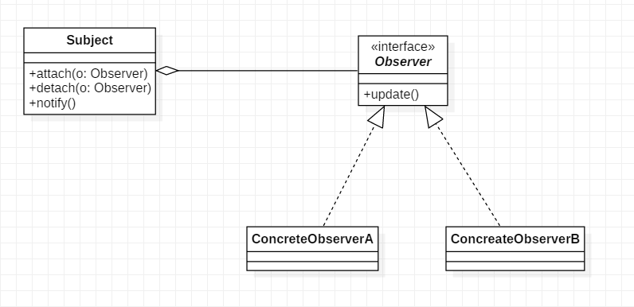

# 观察者模式

## 16.1 概述

在对象之间定义了一对多的依赖，这样一来，当一个对象改变状态，依赖它的对象会收到通知并自动更新。其实就是发布订阅模式，发布者发布信息，订阅者获取信息，订阅了就能收到信息，没订阅就收不到信息。

> 观察者模式在开发过程中应用十分广泛, 比如C#中的event(委托, 多播委托等).

## 16.2 结构

**角色**

1. Subject : 被观察者, 它将所有观察者对象的引用保存在一个集合中
2. Observer : 它定义了一个更新接口，使得在被观察者状态发生改变时通知自己。
3. ConcreteObserver : 具体的观察者.

**UML类图**



**代码**

```java
public interface Observer {
    void update();
}
public class ConcreteObserverA implements Observer {

    private String name;

    public ConcreteObserverA(String name) {
        this.name = name;
    }

    @Override
    public void update() {
        System.out.println(name + " 收到通知! 准备执行xxx工作.");
    }
}
public class ConcreteObserverB implements Observer {

    private String name;

    public ConcreteObserverB(String name) {
        this.name = name;
    }

    @Override
    public void update() {
        System.out.println(name + " 收到通知, 准备停止yyy工作.");
    }
}
public class Subject {

    private Set<Observer> observers = new HashSet<>();

    public void attach(Observer o){
        observers.add(o);
    }

    public void detach(Observer o){
        observers.remove(o);
    }

    public void doSomething(){
        int i = 0;
        while(i < 10000){
            // do something...
            i++;
        }

        // after a while ...
        this.notifyObserver();  //工作执行完成, 通知所有观察者
    }

    private void notifyObserver(){
        for(Observer o : observers){
            o.update();
        }
    }

}
```

使用

```java
    public static void main(String[] args){
        Subject subject = new Subject();

        ConcreteObserverA a1 = new ConcreteObserverA("A1");
        subject.attach(a1);
        ConcreteObserverA a2 = new ConcreteObserverA("A2");
        subject.attach(a2);
        ConcreteObserverB b1 = new ConcreteObserverB("B1");
        subject.attach(b1);
        ConcreteObserverB b2 = new ConcreteObserverB("B2");
        subject.attach(b2);

        subject.doSomething();
    }
```

输出结果:
```txt
A2 收到通知! 准备执行xxx工作.
B2 收到通知, 准备停止yyy工作.
A1 收到通知! 准备执行xxx工作.
B1 收到通知, 准备停止yyy工作.
```

## 16.3 分析

**策略模式与观察者模式**

策略模式与观察者模式除了UML类图看起来很像以外, 其实完全不同.

* 策略模式强调的是: 不同情况下应用不同的"算法"; 
* 观察者模式强调的是: 异步回调指定的方法.

**优缺点**

* 没有什么优缺点了, 这是一种特定应用场景很具有针对性的设计模式