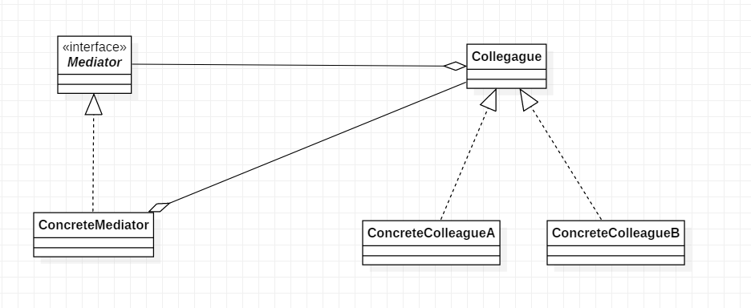
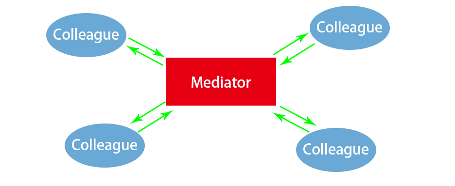

# 中介者模式

## 21.1 概述

***所谓中介者模式就是用一个中介对象来封装一系列的对象交互，中介者使各对象不需要显式地相互引用，从而使其耦合松散，而且可以独立地改变它们之间的交互。***

如果对象与对象之间存在大量的关联关系, 会使耦合性增大, 导致很多问题:

1. 可维护性降低. 系统的结构变得很复杂, 同时若一个对象发生改变，我们也需要跟踪与之相关联的对象，同时做出相应的处理。
2. 对象的可复用性降低.
3. 系统的可扩展性低. 增加一个新的对象，我们需要在其相关连的对象上面加上引用，这样就会导致系统的耦合性增高，使系统的灵活性和可扩展都降低。

所以对于关系比较复杂的系统，我们为了减少对象之间的关联关系，使之成为一个松耦合系统，我们就需要使用中介者模式。

通过中介者模式，我们可以将复杂关系的网状结构变成结构简单的以中介者为核心的星形结构，每个对象不再和它与之关联的对象直接发生相互作用，而是通过中介者对象来与另一个对象发生相互作用。

> 系统中出现了“多对多”交互复杂的关系群时，千万别急着使用中介者模式，你首先需要做的就是反思你的系统在设计上是不是合理。

## 21.2 结构

**角色**

* Mediator: 抽象中介者, 提供了同事对象注册与转发同事对象信息的抽象方法;
* ConcreteMediator: 具体中介者, 协调各个同事角色之间的交互关系，因此它依赖于同事角色;
* Colleague: 抽象同事类;
* ConcreteColleague: 具体同事类。每个具体同事类都只需要知道自己的行为即可，但是他们都需要认识中介者.

**UML**



**代码**

```java
public interface Mediator {

    void doSomething(String arg, Colleague caller);

    void setColleague1(Colleague c);

    void setColleague2(Colleague c);

}

public class ConcreteMediator implements Mediator{
    private Colleague colleague1;

    private Colleague colleague2;

    @Override
    public void doSomething(String arg, Colleague caller) {
        if(caller != colleague1){
            colleague1.run(arg);
        }else if(caller != colleague2){
            colleague2.run(arg);
        }
    }

    @Override
    public void setColleague1(Colleague c) {
        this.colleague1 = c;
        c.setMediator(this);
    }

    @Override
    public void setColleague2(Colleague c) {
        this.colleague2 = c;
        c.setMediator(this);
    }
}
public interface Colleague {

    void setMediator(Mediator mediator);

    void run(String arg);

}
public class ConcreteColleagueA implements Colleague {

    private Mediator mediator;

    @Override
    public void setMediator(Mediator mediator) {
        this.mediator = mediator;
    }

    @Override
    public void run(String arg) {
        System.out.println("A: hi!" + arg);
        mediator.doSomething(arg, this);
    }
}
public class ConcreteColleagueB implements Colleague {

    private Mediator mediator;

    @Override
    public void setMediator(Mediator mediator) {
        this.mediator = mediator;
    }

    @Override
    public void run(String arg) {
        System.out.println("B: hi!" + arg);
        mediator.doSomething(arg, this);
    }
}
```

```java
    public static void main(String[] args){
        Colleague c1 = new ConcreteColleagueA();
        Colleague c2 = new ConcreteColleagueB();

        Mediator m = new ConcreteMediator();

        m.setColleague1(c1);
        m.setColleague2(c2);

        // 无限递归!!!
        c1.run("哈哈");

    }
```

运行结果:
```txt
A: hi!哈哈
B: hi!哈哈
A: hi!哈哈
B: hi!哈哈
A: hi!哈哈
... ...
```

> 这里写成了一个死递归, 主要是说明中介者模式的特点就好了.

## 21.3 分析

中介模式最终效果大致如下:



中介者作为通信的中心, 实现多个Colleague之间的交互.

**优点**

* 简化了对象之间的关系，将系统的各个对象之间的相互关系进行封装，将各个同事类解耦，使得系统变为松耦合
* 提供系统的灵活性，使得各个同事对象独立而易于复用


**缺点**

* 中介者模式中，中介者角色承担了较多的责任，所以一旦这个中介者对象出现了问题，整个系统将会受到重大的影响
* 新增加一个同事类时，不得不去修改抽象中介者类和具体中介者类，此时可以使用观察者模式和状态模式来解决这个问题

## 21.4 应用

在web项目中, Controller与Model和View之间的关系就是中介者模式. Model和View之间不进行直接的交互, Controller作为中介者.