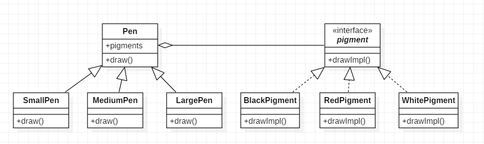

# 桥接模式

## 8.1 概述

桥接模式是一种将类的功能层次和实现层次分离的模式.

假如我们需要大中小3种型号的画笔，能够绘制12种不同的颜色，如果使用蜡笔，需要准备3×12 = 36支，但如果使用毛笔的话，只需要提供3种型号的毛笔，外加12个颜料盒即可，涉及到的对象个数仅为 3 + 12 = 15，远小于36，却能实现与36支蜡笔同样的功能。如果增加一种新型号的画笔，并且也需要具有12种颜色，对应的蜡笔需增加12支，而毛笔只需增加一支。为什么会这样呢？通过分析我们可以得知：在蜡笔中，颜色和型号两个不同的变化维度（即两个不同的变化原因）融合在一起，无论是对颜色进行扩展还是对型号进行扩展都势必会影响另一个维度；但在毛笔中，颜色和型号实现了分离，增加新的颜色或者型号对另一方都没有任何影响。如果使用软件工程中的术语，我们可以认为在蜡笔中颜色和型号之间存在较强的耦合性，而毛笔很好地将二者解耦，使用起来非常灵活，扩展也更为方便。在软件开发中，我们也提供了一种设计模式来处理与画笔类似的具有多变化维度的情况, 即桥接模式.

使用桥接模式前:


使用桥接模式后:



> 如果系统存在两个独立变化的维度, 那么就应该考虑使用桥接模式

## 8.2 桥接模式

颜料类:

```java
public interface Pigment {
    void drawImpl();
}
public class BlackPigment implements Pigment {
    @Override
    public void drawImpl() {
        System.out.println("black");
    }
}
public class RedPigment implements Pigment {
    @Override
    public void drawImpl() {
        System.out.println("red");
    }
}
public class WhitePigment implements Pigment {
    @Override
    public void drawImpl() {
        System.out.println("white");
    }
}
```

笔类:

```java
public abstract class Pen {
    private Pigment pigment;

    public Pen(Pigment pigment){
        this.pigment = pigment;
    }

    public void draw(){
        pigment.drawImpl();
    }
}
public class SmallPen extends Pen {

    public SmallPen(Pigment pigment) {
        super(pigment);
    }

    @Override
    public void draw() {
        System.out.println("small pen");
        super.draw();
    }
}
public class MediumPen extends Pen {

    public MediumPen(Pigment pigment) {
        super(pigment);
    }

    @Override
    public void draw() {
        System.out.println("medium pen");
        super.draw();
    }
}
public class LargePen extends Pen {

    public LargePen(Pigment pigment) {
        super(pigment);
    }

    @Override
    public void draw() {
        System.out.println("large pen");
        super.draw();
    }
}
```

客户端:

```java
    public static void main(String[] args){
        Pen pen = new SmallPen(new RedPigment());
        pen.draw();
    }
```

原则|符合|描述
--|--|--
开闭原则|√|任何变化只需要抽象或者实现就可以了
单一职责原则|√|保证了只有一个引起该类变化的原因
里氏代换原则|√|
合成复用原则|√|将功能单元脱离出来, 实现了不同场景下的复用
迪米特法则|×|在架构设计和使用上都需要对整个系统有深入的了解
依赖倒转原则|N/A|
接口隔离原则|N/A|

## 8.3 参考资料

[java设计模式之桥接模式](https://www.cnblogs.com/lfxiao/p/6815760.html)