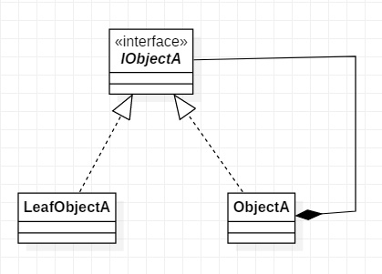

# 组合模式

## 9.1 概述

如图, 就是组合模式, 这里的关系可以是关联, 聚合, 组合. 组合模式主要体现在"自己拥有自己的同类".


稍微复杂一点, 可以是这样:



## 9.2 代码实现

```java
public class ObjectA {

    List<ObjectA> children = new ArrayList<ObjectA>();

    public List<ObjectA> getChildren() {
        return children;
    }

    public void setChildren(List<ObjectA> children) {
        if(children != null) this.children = children;
    }

    public void addChildren(ObjectA obj){
        children.add(obj);
    }

    public void removeChildren(ObjectA obj){
        children.remove(obj);
    }

    public void show(){
        for(ObjectA objA : children){
            System.out.println(objA);
        }
    }
}
```