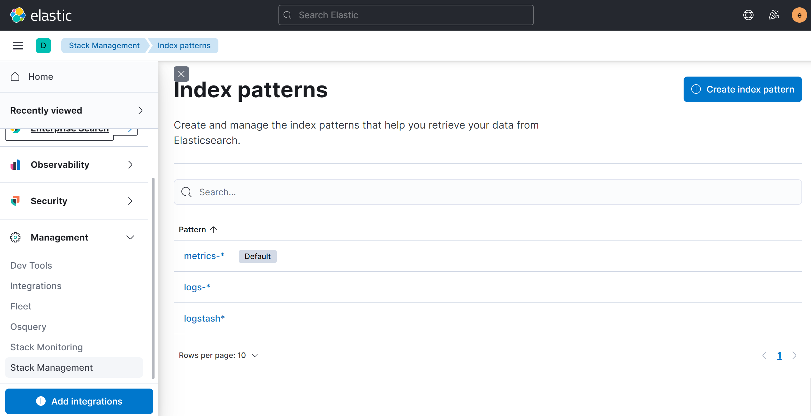
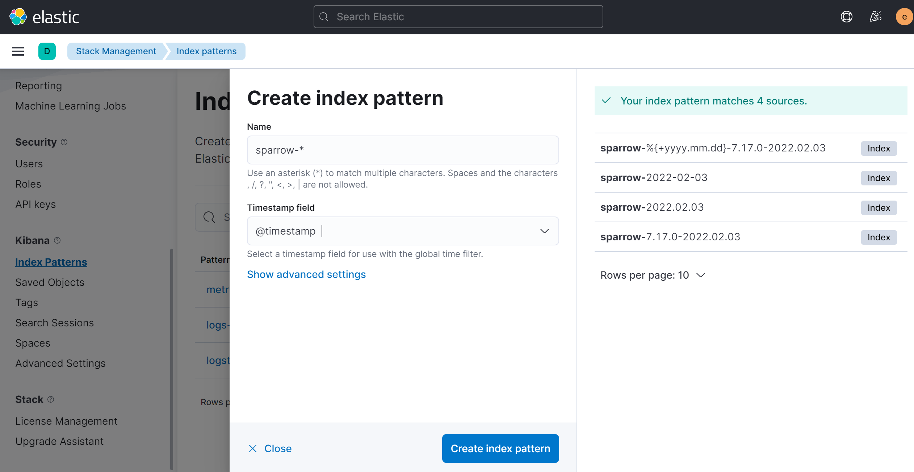
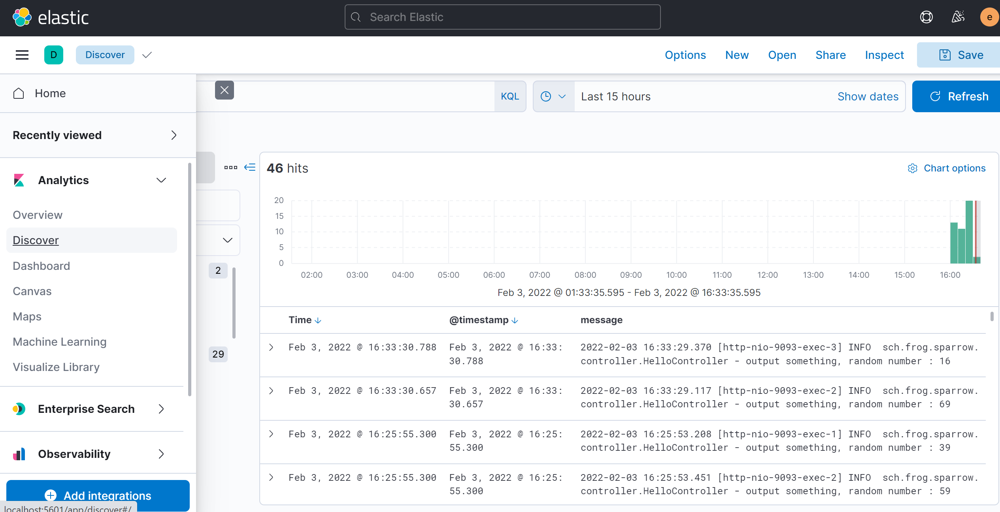
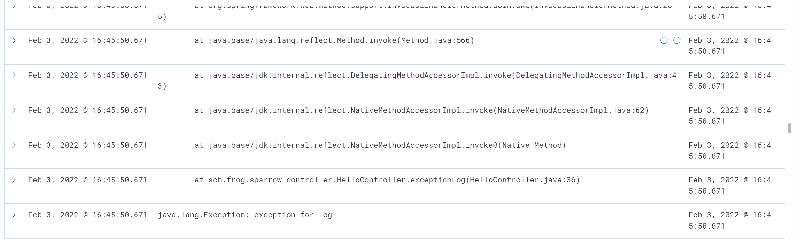
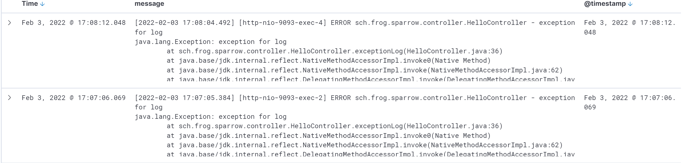

# ELK

## 概述

在分布式架构中, 日志分散, 一旦遇到问题, 需要翻看每一个日志, 去定位问题, 效率低, 操作复杂. 这时可以通过Elastic Stack全家桶中的支持, 来解决这个痛点, 具体如下:

1. 收集 -- LogStash
2. 存储 -- ElasticSearch(也可以用Redis/kafka等)
3. 搜索+统计+展示 -- Kibana

> 这一套组合简称为ELK


## ElasticSearch安装

这里介绍在Liunx Ubuntu环境下, 安装ElasticSearch. 

1. 下载安装包: [ElasticSearch](https://www.elastic.co/downloads/elasticsearch);
2. 解压
3. 执行bin目录下的```nohup ./elasticsearch &```(这样会后台执行);
4. 查看已安装插件```./elasticsearch-plugin list```;
5. 安装集群管理插件``````
6. 访问```http://localhost:9200/```, 成功.

但是, 这时的elasticsearch是没有密码的, 下面配置密码:

1. 修改```config/elasticsearch.yml```文件, 并重启.
```
xpack.security.enabled: true
xpack.license.self_generated.type: basic
xpack.security.transport.ssl.enabled: true
```
2. 执行```bin/elasticsearch-setup-passwords interactive```, 这里需要为多个不同的账号设置密码:
```
Enter password for [elastic]:
Reenter password for [elastic]:
Enter password for [apm_system]:
Reenter password for [apm_system]:
Enter password for [kibana_system]:
Reenter password for [kibana_system]:
Enter password for [logstash_system]:
Reenter password for [logstash_system]:
Enter password for [beats_system]:
Reenter password for [beats_system]:
Enter password for [remote_monitoring_user]:
Reenter password for [remote_monitoring_user]:
```
3. 访问```http://localhost:9200/```, 发现需要输入密码.(这时输入elastic的账号密码即可)

## LogStash安装

LogStash是具备实时输出传输能力的管道, 负责将信息从管道的输入端传输到管道的输出端, 同时这根管道还可以在中间加上滤网. 相对应的概念就是:

* input: 负责产生事件, 常用的有: File, syslog, redis, beats
* filter: 负责数据处理和转换, 常用的有: grok, mutate, drop, clone, geoip
* output: 负责数据的输出, 常用的有: elasticsearch、file、graphite、statsd

安装步骤:

1. 下载[LogStash](https://www.elastic.co/downloads/logstash);
2. 解压
3. 修改配置```config/pipelines.yml```
```
- pipeline.id: froglog
  pipeline.workers: 1
  pipeline.batch.size: 1
  path.config: "/data/frog/logstash/config/*.cfg"
  queue.type: persisted
```
4. 增加配置```config/frog.cfg```
```
input{
    beats{
        port => "5044"
    }
}
output{
    elasticsearch {
        hosts => ["localhost:9200"]
        user => "elastic"
        password => "123456"
        index => "%{[@metadata][beat]}-%{+YYYY.MM.dd}"
    }
}
```
5. 启动```nohup ./logstash &```完成.


logstash也可以直接指定input为一个文件, 例如:

```
input{
    file{
        path => "xxxx"
    }
}
```

## Filebeats安装

接下来安装filebeats用来采集日志, 并发送给logstash. 这里在windows下安装一个filebeats演示一下.

1. 下载[FileBeats](https://www.elastic.co/cn/downloads/beats/filebeat)
2. 解压
3. 修改配置文件```filebeat.yml```
```
filebeat.inputs:
- type: filestream
  enabled: true
  paths:
    - D:\Development\sparrow\logs\*.log

output.logstash:
  hosts: ["localhost:5044"]
  index: 'sparrow'
```
4. 启动filebeat.exe, 就会收集```D:\Development\sparrow\logs\*.log```的内容了.

> 实际上, filebeat可以直接将数据发送给es, 不需要经过logstash.

## Kibana安装

1. 下载[Kibana](https://www.elastic.co/downloads/kibana)
2. 解压
3. 修改```config/kibana.yml```配置.

```
server.name: "kibana"
elasticsearch.hosts: ["http://localhost:9200"]
elasticsearch.username: "kibana_system"
elasticsearch.password: "123456"
```
4. 后台启动 ```nohup ./kibana &```
5. 访问```http://localhost5601/```, 成功!

> 访问成功的页面输入账号密码: elastic/123456和上面配置中的是不一样的.


接下来, 进行配置, 使得可以在Kibana上面看到日志. 这里使用的ELK全套版本都是7.17.0版本.

1. 首先, 打开管理菜单```Management-Stack Management```:



2. 在左侧找到"Index Patterns":


3. 点击右上角"Create index pattern", 输入Name以及timestamp等字段, 进行配置, 然后点击下方的"Create index pattern"保存配置.



4. 最后, 在```Analytics - Discover```中, 选择指定的index, 就可以看到相关日志了:



## 优化

有时候, 输入的日志会有多行, 上面的配置, 会导致kibana中展示的信息也将本属于一条日志的信息分多行显示了. 如图:



这时需要调整filebeats的配置, 来优化日志收集:

```
filebeat.inputs:
- type: log
  enabled: true
  paths:
    - D:\Development\sparrow\logs\*.log
  multiline:
   type: pattern
   pattern: ^\[ 
   negate: true
   match: after
```

> 注意, type必须改为log, 否则没有效果.

解释一下几个配置:

* pattern：正则表达式
* negate：true 或 false；默认是false，匹配pattern的行合并到上一行；true，不匹配pattern的行合并到上一行
* match：after 或 before，合并到上一行的末尾或开头

修改配置之后的显示效果如下:



> 实际使用过程中, 日志输出格式不一样, pattern配置也就不一样, 需保证pattern和实际日志相互匹配.

## 其他

kibana界面上展示的@timestamp字段和日志里输出的timestamp不是一个, 有时候, 由于日志量过大, 写入es速度过慢, 导致两者会差很多.