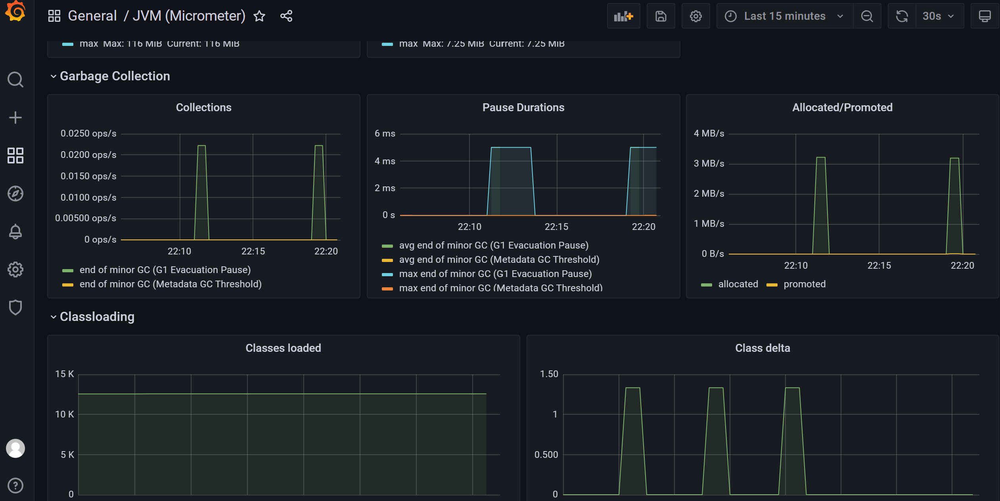

# Grafana

# Overview

Grafana是一个跨平台的开源的度量分析和可视化工具，可以通过将采集的数据查询然后可视化的展示，并及时通知. 有以下特点:

1. 展示方式：快速灵活的客户端图表，面板插件有许多不同方式的可视化指标和日志，官方库中具有丰富的仪表盘插件，比如热图、折线图、图表等多种展示方式；
2. 数据源：Graphite，InfluxDB，OpenTSDB，Prometheus，Elasticsearch，CloudWatch和KairosDB等;
3. 通知提醒：以可视方式定义最重要指标的警报规则，Grafana将不断计算并发送通知，在数据达到阈值时通过Slack、PagerDuty等获得通知;
4. 混合展示：在同一图表中混合使用不同的数据源，可以基于每个查询指定数据源，甚至自定义数据源；
5. 注释：使用来自不同数据源的丰富事件注释图表，将鼠标悬停在事件上会显示完整的事件元数据和标记；
6. 过滤器：Ad-hoc过滤器允许动态创建新的键/值过滤器，这些过滤器会自动应用于使用该数据源的所有查询.

## 安装部署

1. 这里采用压缩包的方式进行安装, 首先下载压缩包```wget https://dl.grafana.com/oss/release/grafana-8.3.4.linux-amd64.tar.gz```
2. 解压;
3. 在解压后的文件夹根目录执行:```./bin/grafana-server web```, 启动成功;
4. 在启动日志中, 能找到:```INFO[02-05|19:47:33] HTTP Server Listen                       logger=http.server address=[::]:3000 protocol=http subUrl= socket=```, 说明访问端口是3000. 直接访问即可[http://localhost:3000/](http://localhost:3000/)
5. 首次登陆时, 默认的账号密码是:admin/admin;


> 也可以修改访问端口, 在conf文件夹中, 将```defaults.ini```复制一份, 并命名为```custom.ini```, 然后, 找到里面的```http_port```, 修改为指定的值就可以了.

## 接入Prometheus

这个, Prometheus官网提供了详细的说明[https://prometheus.io/docs/visualization/grafana/](https://prometheus.io/docs/visualization/grafana/), 这里再复述一下:

1. 添加数据源, 位置"齿轮 - Data Sources - Add data source";
2. 选择类型Prometheus;
3. 配置url, 以及其他配置;
4. 点击"Save&test".

接下来创建一个图表, 这里Prometheus官网也提供的详细的步骤:

1. 新建Dashboard


2. 选择"Add a new panel"


3. 在下方query中, 选择metric, labels等


最终效果图如下:


## 导入已有的Dashboards

如果所有的指标都这样一个一个配置, 工作量是会很大的, 幸运的是, Grafana官网提供了很多现有的例子, 可以在[这里](https://grafana.com/grafana/dashboards/)找到. 下面就尝试一个.

在Grafana提供的页面找到[JVM(Micrometer)](https://grafana.com/grafana/dashboards/4701), 这里采用json的方式导入, 还有通过id直接联网导入的方式, 但是有些环境中, 是没有办法访问到外网的.

1. 在页面中"Copy ID to Clipboard"下方有一行小字"Download JSON", 下载json;
2. 点击"加号 - import";
3. 点击上传json文件, 选择好数据源;


4. 点击import, 就完成了. 就可以在"DashBoards - Browser"中找到了.


这个仪表的内容非常丰富, IO, 线程, 堆内存, 非堆内存, 垃圾收集暂停等等:




> 注意, 这个Dashboard中, 会自动根据labels中的application进行区分, 将不同的jvm的数据拆分开, 可以在上面的Application下拉选中选择要查看的应用. 所以, java应用中, 接入时注意需要配置一个label, 这个label的key是application, value是应用名.
> 还要注意, 这个Dashboard只能监控通过spring集成micrometer-registry-prometheus的方式, 不支持jmx_exporter.

再试一个mysql的, 看下效果, 下载[Mysql Overview](https://grafana.com/grafana/dashboards/7362), 然后导入.


## 参考文档

* [可视化工具Grafana：简介及安装](https://www.cnblogs.com/imyalost/p/9873641.html)