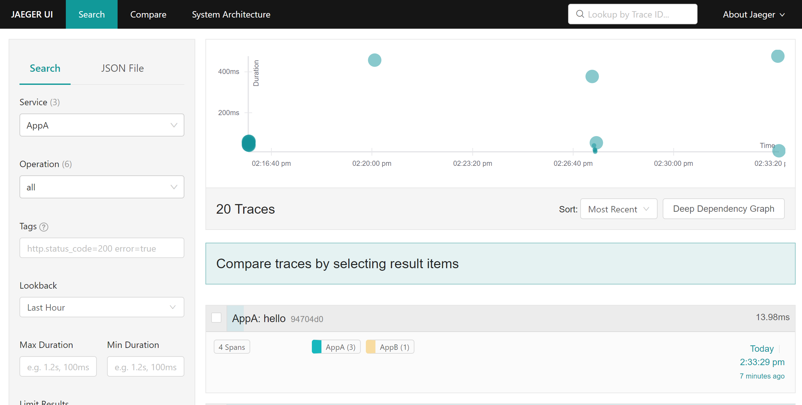
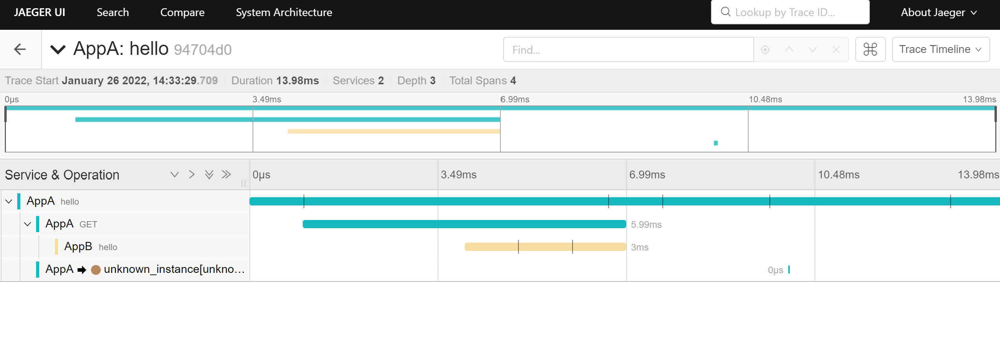
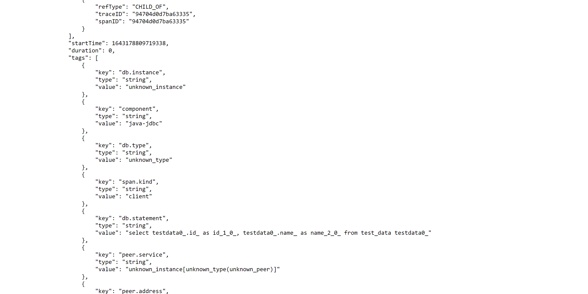
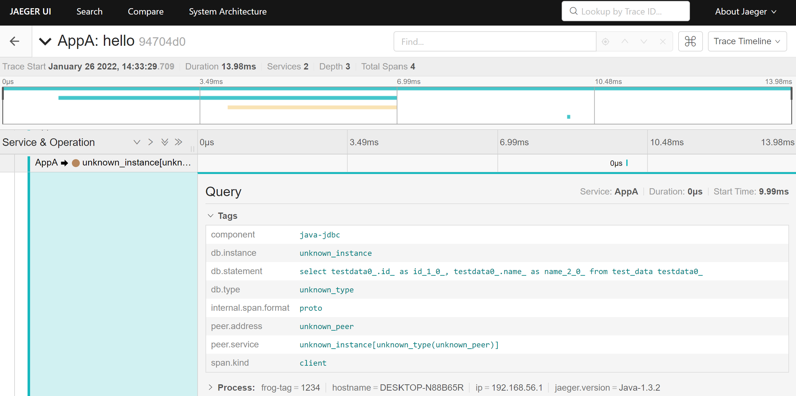

# Jaeger

## 概述

[Jaeger](https://www.jaegertracing.io/)是Uber推出的一套分布式链路追踪开源(Apache-2.0 License)解决方案. 兼容OpenTracing. 本身采用Go语言编写. 支持Go, Java, Node, Python, C++, C#.


如图, 为jaeger整体架构图. 主要关注jaeger-client, jaeger-agent, jaeger-collector, jaeger-query即可. 

* jaeger-client是需要手动嵌入到被监控应用中的一个sdk.(2022年jaeger-client被弃用, 官方推荐使用open-telemetry进行数据采集)
* jaeger-agent是用于接收jaeger-client采集到的数据的一个服务. jaeger-agent会收集到一些jaeger-client接收到的数据后, 批量发送给jaeger-collector. jaeger-agent还负责collector的发现和路由.
* jaeger-collector 接收jaeger-agent采集到的数据. jaeger-collector支持多种底层数据存储:
  * Cassandra - 开源分布式NoSQL数据库系统
  * Elasticsearch - 一个基于Lucene的搜索服务器
  * Kafka - 由Apache软件基金会开发的一个开源流处理平台, 它本身一般不能作为永久存储介质, 所以上面的架构图有调整, 如下图. 通过jaeger-ingester消费kafka中的数据, 最终写入ElasticSearch或者Cassandra
* jaeger-query - 读取存储介质中的数据, 展示在ui界面上.


## 快速部署

这里直接采用jaeger-all-in-one这个docker镜像进行部署, jaeger-all-in-one中集成了jaeger-agent, jaeger-collector, jaeger-query. 此外, jaeger-all-in-one中默认不对采集到的数据进行持久化存储, 所有数据均存储在内存中. 官网的文档中有all-in-one的下载地址.

> 以下演示环境为windows10 + wsl + Docker Desktop for Windows

1. 获取all-in-one镜像

```
docker pull jaegertracing/all-in-one
```

2. 安装运行

```
docker run -d --name jaeger -p5775:5775/udp -p6831:6831/udp -p6832:6832/udp -p16686:16686 jaegertracing/all-in-one:latest --log-level=debug
```

或者想多暴露一些端口, 使用下面的命令:

```
docker run -d --name jaeger \
  -p 5775:5775/udp \
  -p 6831:6831/udp \
  -p 6832:6832/udp \
  -p 5778:5778 \
  -p 16686:16686 \
  -p 14250:14250 \
  -p 14268:14268 \
  -p 14269:14269 \
  -p 9411:9411 \
  jaegertracing/all-in-one:latest
```

上面的端口含义:

* 16686是ui界面访问端口, 通过http://localhost:16686就可以访问jaeger-query界面
* 6831是jaeger-agent监听端口, jaeger-client上传数据时, 需要指定这个端口
* 6832与6831相同, 只是协议稍有区别, 一般用6831就行了, 具体区别见官方文档[端口介绍](https://www.jaegertracing.io/docs/1.30/deployment/#agent)
* 14250是jaeger-collector监听端口, 如果单独部署了jaeger-agent, 需要指定这个端口
* 其余端口介绍详见官方文档[文档](https://www.jaegertracing.io/docs/1.30/deployment/)

以上, 整个jaeger接收展示服务就搭建好了. 访问http://127.0.0.1:16686/可以看到jaeger-query的ui界面.


## client集成

接下来, 将jaeger-client集成到被监测应用中去. 然后采集数据, 看一下展示的效果. 这里被监测的应用为java应用.

> 虽然jaeger-client已经被弃用, 官方推荐使用open-telemetry, 但是这里依旧介绍一下.

演示项目代码已经上传至github, 具体地址为: [JaegerDemo](https://github.com/FrogIf/JaegerDemo), 这时两个springboot项目, 没有采用最原始的jaeger-client进行集成, 而是使用了opentracing-spring-jaeger-cloud-starter, 虽然是springboot项目, 但是依旧可以使用cloud-starter, 实际上还有另外两个stater: opentracing-spring-jaeger-starter和opentracing-spring-jaeger-web-starter, 但是这两个支持的都不全面, opentracing-spring-jaeger-starter需要手动进行配置, opentracing-spring-jaeger-web-starter只能进行最基本的跨应用链路追踪, 不能对database等组件进行监控(详见[java-spring-jaeger](https://github.com/opentracing-contrib/java-spring-jaeger)). 下面简要介绍一下关键配置:

* pom.xml:

```xml
		<dependency>
			<groupId>io.opentracing.contrib</groupId>
			<artifactId>opentracing-spring-jaeger-cloud-starter</artifactId>
			<version>3.3.1</version>
		</dependency>
```

* application.yml

```yml
opentracing:
  jaeger:
    enabled: true
    log-spans: true
    udp-sender:
      host: 127.0.0.1
      port: 6831
    tags:
      frog-tag: 1234
    remote-reporter:
      flush-interval: 1000
      max-queue-size: 1000
```

除此之外, 不需要任何配置, 也不需要额外的代码开发. 下面看一下采集的结果:



概览信息, 能看到采集到的trace列表, 以及时间等信息. 点击进入一条trace中.



可以看到, 应用A调用了应用B, 并且调用了数据库(这里使用的是sqlite数据库, jaeger没有采集到具体的数据库名字), 右上角有一个"Trace Timeline"下拉, 切换至"Trace Json"可以看到上传的原始数据. 这里以json格式展示的, 由于篇幅限制, 这里只截取一部分:



可以看到, 实际上, jaeger已经把执行的sql语句都采集上来了, 从详情界面上, 点开也能看到:



其他的,还有拓扑图等功能.

**jaeger client配置**

下面简单介绍一下jaeger client的配置, 单纯jaeger client, 不包含spring相关内容. 这里讨论的是java语言. 下面是项目中简单继承jaeger-client时的配置示例:

```java
    @Bean
    public Tracer tracer(){
        return Configuration.fromEnv(this.appName)
        .withSampler(Configuration.SamplerConfiguration.fromEnv()
                .withType(ConstSampler.TYPE)
                .withParam(1)
        )
        .withReporter(Configuration.ReporterConfiguration.fromEnv()
                .withFlushInterval(1000)
                .withLogSpans(true)
                .withMaxQueueSize(1000)
                .withSender(Configuration.SenderConfiguration.fromEnv()
                        .withAgentHost(this.agentHost)
                        .withAgentPort(this.agentPort)
                )
        )
        .getTracer();
    }
```

此外, 还需要配置切面, 例如:

```java
@Component
@Aspect
public class TracerAop {
    
    @Autowired
    private Tracer tracer;

    @Around("within(sch.frog.jaeger.controller..*)")
    public Object around(ProceedingJoinPoint pjp) throws Throwable{
        Span parentSpan = tracer.scopeManager().activeSpan();
        Signature signature = pjp.getSignature();
        Span currentSpan = this.tracer.buildSpan(signature.getDeclaringTypeName() + "." + signature.getName())
                .asChildOf(parentSpan)
                .start();
        currentSpan.setTag("class", signature.getDeclaringTypeName());
        currentSpan.setTag("method", signature.getName());

        Scope scope = tracer.scopeManager().activate(currentSpan);
        try{
            return pjp.proceed();
        }finally{
            try{
                currentSpan.finish();
            }finally{
                scope.close();
            }
        }
    }

}
```

具体代码详见: [JaegerDemo](https://github.com/FrogIf/JaegerDemo)

## 自己做一个collector

关于jaeger上传的数据具体含义, 在open-telemetry的介绍中再详细说明. 这里简要介绍一下如何根据jaeger的协议, 自己创建一个collector. jaeger现在开始逐渐完全使用open-tracing的协议了, 所以没什么用, 主要是留作记录.

首先, jaeger协议可以在如下地址获取: [jaeger-idl](https://github.com/jaegertracing/jaeger-idl), 其中/proto/api_v2/目录下的内容是接下来要处理的内容. 

jaeger数据传输使用的是grpc调用的方式, 想要自己创建一个collector, 首先需要创建grpc调用. 一般的grpc协议, 直接使用maven的一个插件, 就能直接编译成java类, 但是jaeger的这个比较特殊, 还引用了很多第三方的其他grpc文件, 所以需要用别的手段来处理.

jaeger-idl的readme.md文件中有这样一段描述:

```
This repository does not publish the generated code, but it does run Thrift and protoc generators as part of the CI to verify all IDL files. See the Makefile for example. In particular, the classes for different languages can be compiled using the jaegertracing/protobuf Docker image (see README).
```

然后, 在jaegertracing/protobuf的readme中, 可以找到代码生成的方法.

下面描述的方法是在windows操作系统, WSL中进行操作的步骤(注意是linux子系统中进行下列命令):

1. 下载jaegertracing/protobuf镜像.```docker pull jaegertracing/protobuf:latest```
2. clone jaegertracing/jaeger-idl仓库
3. 执行命令:
```
docker run --rm -v<宿主机的目录>:<映射到容器内的目录> -w<容器内的工作目录(这里与前面挂载后的映射目录一致即可)> jaegertracing/protobuf:latest --proto_path=<proto文件所在目录> --java_out=<生成java文件输出目录> -I<依赖的其他proto所在路径> <待生成的目标proto>
```
这里举一个例子:
```
docker run --rm -v/mnt/d/work/jaeger-idl/proto/api_v2:/jaeger-proto jaegertracing/protobuf:latest --proto_path=/jaeger-proto  --java_out=/jaeger-proto/output -I/usr/include/github.com/gogo/protobuf model.proto
```
WSL中的/mnt/d/work/jaeger-idl/proto/api_v2目录下存放着model.proto, query.proto, collector.proto等, 将该目录挂载到容器中的/jaeger-proto目录上, 指定proto文件所在的目录就是挂载的目录, 指定生成java文件所在目录为挂载的目录下的output目录, 这样生成的java文件就在宿主机的/mnt/d/work/jaeger-idl/proto/api_v2/output目录下了, -I指定的依赖的第三方proto文件, 这个是jaegertracing/protobuf容器内置的, 可以通过:
```
docker run --rm -it --entrypoint=/bin/sh jaegertracing/protobuf:latest -c "find /usr/include -name *.proto"
```
命令查看.
例子的最后, 是xxx.proto, 也就是proto_path下, 需要编译为java文件的proto文件.

下面列出需要执行的命令示例:

```
docker run --rm -v/mnt/d/work/jaeger-idl/proto/api_v2:/jaeger-proto jaegertracing/protobuf:latest --proto_path=/jaeger-proto  --java_out=/jaeger-proto/output -I/usr/include/github.com/gogo/protobuf collector.proto

docker run --rm -v/mnt/d/work/jaeger-idl/proto/api_v2:/jaeger-proto jaegertracing/protobuf:latest --proto_path=/jaeger-proto  --java_out=/jaeger-proto/output -I/usr/include/github.com/gogo/protobuf model.proto

docker run --rm -v/mnt/d/work/jaeger-idl/proto/api_v2:/jaeger-proto jaegertracing/protobuf:latest --proto_path=/jaeger-proto  --java_out=/jaeger-proto/output -I/usr/include/github.com/gogo/protobuf query.proto

docker run --rm -v/mnt/d/work/jaeger-idl/proto/api_v2:/jaeger-proto jaegertracing/protobuf:latest --proto_path=/jaeger-proto  --java_out=/jaeger-proto/output -I/usr/include/github.com/gogo/protobuf sampling.proto
```

通过上述命令, 生成的结果, 并不完全, 当前版本, 还需要导出下列proto的java文件:

* /usr/include/protoc-gen-swagger/options/openapiv2.proto
* /usr/include/protoc-gen-swagger/options/annotations.proto
* /usr/include/github.com/gogo/protobuf/gogoproto/gogo.proto
  
命令与上边的类似:
```
docker run --rm -v/mnt/d/work/jaeger-idl/proto/api_v2:/jaeger-proto jaegertracing/protobuf:latest --java_out=/jaeger-proto/output /usr/include/protoc-gen-swagger/options/openapiv2.proto

docker run --rm -v/mnt/d/work/jaeger-idl/proto/api_v2:/jaeger-proto jaegertracing/protobuf:latest --java_out=/jaeger-proto/output /usr/include/protoc-gen-swagger/options/annotations.proto

docker run --rm -v/mnt/d/work/jaeger-idl/proto/api_v2:/jaeger-proto jaegertracing/protobuf:latest --java_out=/jaeger-proto/output /usr/include/github.com/gogo/protobuf/gogoproto/gogo.proto
```

这时还没有结束, proto直接生成grpc service的方式已经不推荐了, 官方推荐的方式是通过插件的方式生成service, 百度搜索得到如下关键字```plugin```, ```grpc-java_out```, 那么, 这里如果需要根据collector.proto生成collector的grpc代码, 还需要执行其他命令. 什么命令呢? readme中没有说明, 执行一下:```docker run --rm jaegertracing/protobuf --help```试试, 发现没有任何结果. readme中, 得知该项目是forked from```TheThingsIndustries/docker-protobuf```, 可以去这里边找一找. 下载镜像, 执行```docker run --rm thethingsindustries/protoc --help```, 发现了一些命令:

```
 --plugin=EXECUTABLE         Specifies a plugin executable to use.
                              Normally, protoc searches the PATH for
                              plugins, but you may specify additional
                              executables not in the path using this flag.
                              Additionally, EXECUTABLE may be of the form
                              NAME=PATH, in which case the given plugin name
                              is mapped to the given executable even if
                              the executable's own name differs.
```

就是这个了.指定一个插件. 那么这个插件在哪呢? 通过查看jaegertracing/protobuf的Dockerfile, 大概知道容器中实际上是有的. 然后从Dockerfile大致能猜出插件的位置:
```
...

install -Ds protoc-gen-grpc-java /out/usr/bin/protoc-gen-grpc-java && \

...

COPY --from=packer /out/ /
RUN apk add --no-cache bash libstdc++ && \
    ln -s /usr/bin/grpc_cpp_plugin /usr/bin/protoc-gen-grpc-cpp && \
    ln -s /usr/bin/grpc_csharp_plugin /usr/bin/protoc-gen-grpc-csharp && \
    ln -s /usr/bin/grpc_node_plugin /usr/bin/protoc-gen-grpc-js && \
    ln -s /usr/bin/grpc_python_plugin /usr/bin/protoc-gen-grpc-python
```

所以, 应该在```/usr/bin/protoc-gen-grpc-java```下. 执行```docker run --rm -it --entrypoint=/bin/sh jaegertracing/protobuf:latest -c "find /usr/bin -name proto*"```发现确实在这个目录下.所以, 最终执行的命令是:

```
docker run --rm -v/mnt/d/work/jaeger-idl/proto/api_v2:/jaeger-proto jaegertracing/protobuf:latest --proto_path=/jaeger-proto --java-grpc_out=/jaeger-proto/output --plugin=protoc-gen-java-grpc=/usr/bin/protoc-gen-grpc-java -I/usr/include/github.com/gogo/protobuf collector.proto
```

综上, 所有的java文件均已生成完成.

接下来, 就可以应用这些文件, 创建一个属于自己的collector了. 接下来的开发过程就不赘述了, 具体代码在[JaegerDemo](https://github.com/FrogIf/JaegerDemo), 然后运行起来, 看下效果:

首先, 需要启动一个jaeger-agent. 这里使用windows下的[jaeger-agent](https://www.jaegertracing.io/download/). 启动命令如下:

```
jaeger-agent.exe --reporter.grpc.host-port=127.0.0.1:14250
```

这时, 该jaeger-agent监听的端口是6831, 接收到数据后, 发送到collector的14250端口.

运行上面的测试程序, 可以看到collector日志中有日志输出:

```
2022-01-26 16:16:22.004 [grpc-default-executor-0] INFO  s.frog.jaeger.CustomJaegerCollector - receive data : spans {
  trace_id: "\000\000\000\000\000\000\000\000\375\226&B\035}gF"
  span_id: "\306\3435y\017x\203\035"
  operation_name: "GET"
  references {
    trace_id: "\000\000\000\000\000\000\000\000\375\226&B\035}gF"
    span_id: "\375\226&B\035}gF"
  }
  flags: 1
  start_time {
    seconds: 1643184981
    nanos: 74118000
  }
  duration {
    nanos: 151977000
  }
  tags {
    key: "http.status_code"
    v_type: INT64
    v_int64: 200
  }
  tags {
    key: "component"
    v_str: "java-spring-rest-template"
  }
  tags {
    key: "span.kind"
    v_str: "client"
  }
  tags {
    key: "http.url"
    v_str: "http://localhost:9091/hello"
  }
  tags {
    key: "peer.port"
    v_type: INT64
    v_int64: 9091
  }
  tags {
    key: "http.method"
    v_str: "GET"
  }
}
spans {
  trace_id: "\000\000\000\000\000\000\000\000\375\226&B\035}gF"
  span_id: "\202\211\255\206\v@\324\223"
  operation_name: "Query"
```