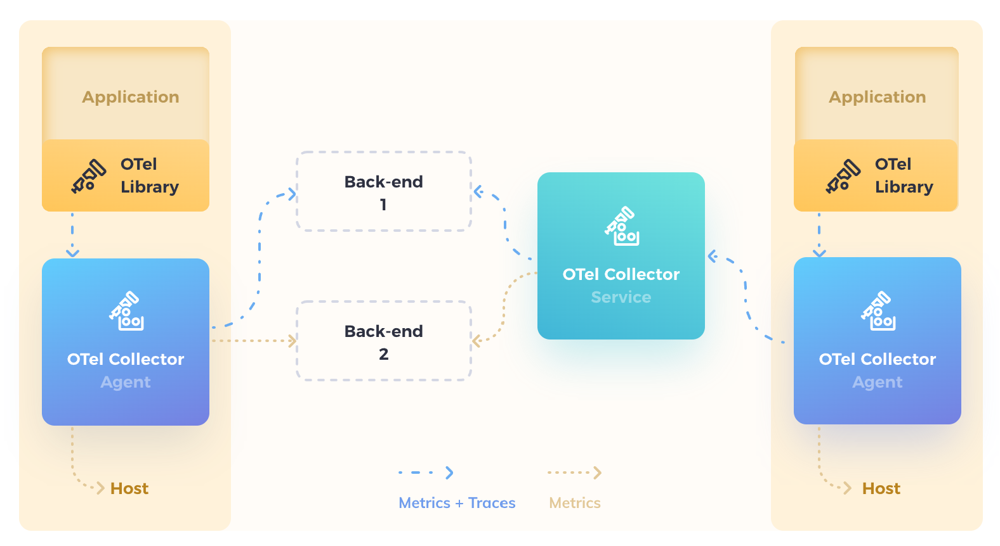
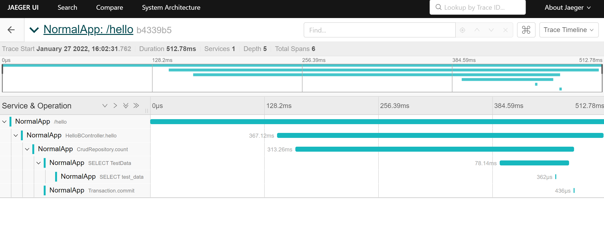

# OpenTelemetry

## 概述

官网描述:

```
OpenTelemetry is a collection of tools, APIs, and SDKs. Use it to instrument, generate, collect, and export telemetry data (metrics, logs, and traces) to help you analyze your software’s performance and behavior.
```

OpenTelemetry将OpenTracing和OpenMetrics集成在了一块. 提供了多个维度的应用程序监控. 官网上还说:

```
OpenTelemetry is not an observability back-end like Jaeger or Prometheus. Instead, it supports exporting data to a variety of open-source and commercial back-ends. It provides a pluggable architecture so additional technology protocols and formats can be easily added.
```

也就是说, OpenTelemetry不提供展示相关的功能, 只负责数据采集.

OpenTelemetry的架构图如下:



首先, 应用中集成了OpenTelemetry的Liberary或者探针, 然后, 就会将数据发送到collector, collector再将数据发送给第三方平台.

所以, 接下来, 使用OpenTelemetry作为数据采集, 使用Jaeger作为展示, 来体验一下.

截止目前, metrics还处于alpha截断, 还不稳定, 暂不介绍, 只介绍OpenTracing.

## 快速开始

这里只介绍java应用. 使用OpenTelemetry来监控应用的方式有两种:

1. 采用sdk, 这种方式控制灵活, 但是具有侵入性, 开发难度大;
2. 采用java探针的方式, 侵入小, 但是不够灵活, 有些框架或者组件可能不支持, 就会捕捉不到;

### 手动集成

手动集成文档参考[opentelemetry官方文档](https://opentelemetry.io/docs/instrumentation/java/manual/)

有以下方面:

1. 配置整体的环境:
   1. 采样率
   2. exporter, 其中, opentelemetry目前官方支持以下exporter:
      1. In-Memory Exporter: trace数据保留在本机内存中;
      2. Jaeger Exporter: trace数据发送到jaeger collector中;
      3. Zipkin Exporter: trace数据发送到Zipkin中;
      4. Logging Exporter: trace数据发送日志流中;
      5. OpenTelemetry Exporter: trace数据发送到OpenTelemetry自己的collector中.
   3. 为应用实例起一个可以识别的名字
2. 嵌码
    * 这里就具体情况具体分析了, 手动集成时, 会受很多语言/框架等的限制, 需要灵活的进行不同方式的嵌码.

> 手动嵌码时, 可能需要知道一些概念, 比如Span, Trace, Event等, 这些留在协议解析阶段进行介绍.

最终代码参见: [OpenTelemetryDemo](https://github.com/FrogIf/OpenTelemetryDemo)

这个演示例子中DemoAppA和DemoAppB采用手动嵌码的方式进行数据采集, 代码中实现了: 部分代码通过AOP方式进行跟踪; 实现了RestTemplate跨应用追踪; 异常捕捉; 额外日志输出等. 此外例子中, 使用的是Jaeger Exporter. 通过Jaeger的页面展示采集到的数据. 代码中没有配置采样率.

### 自动嵌码

java自动嵌码, 需要使用java探针技术, 通过字节码编辑的方式, 进行嵌码.

先尝试将数据发送到jaeger:

1. [下载探针](https://github.com/open-telemetry/opentelemetry-java-instrumentation/releases/)
2. 下载测试应用源码[NormalApp](https://github.com/FrogIf/OpenTelemetryDemo)
3. maven打包: ```mvn clean package```
4. 在打包好的NormalApp.jar同级目录中, 新建目录```agent```
5. 将下载的探针放入```agent```文件夹中
6. 在agent文件夹中增加配置文件, 内容如下:

```
otel.service.name=NormalApp

# jaeger
otel.traces.exporter=jaeger
otel.exporter.jaeger.endpoint=http://localhost:14250
otel.exporter.jaeger.timeout=10000
```

> 注意: 这里使用的agent版本为: 1.10.1, 不同版本, 配置可能会有差别, 详见[https://github.com/open-telemetry/opentelemetry-java/blob/main/sdk-extensions/autoconfigure/README.md](https://github.com/open-telemetry/opentelemetry-java/blob/main/sdk-extensions/autoconfigure/README.md) 和 [https://github.com/open-telemetry/opentelemetry-java-instrumentation/blob/main/docs/agent-config.md](https://github.com/open-telemetry/opentelemetry-java-instrumentation/blob/main/docs/agent-config.md)

7. 启动应用

```
java -javaagent:agent/opentelemetry-javaagent.jar -Dotel.javaagent.configuration-file=agent/conf.properties -jar NormalApp.jar
```

8. 访问页面: http://localhost:9093/hello
9. 查看jaeger界面, 可以看到已经获取到了数据.



> 最开始看到的数据可能不完整, 等一会就好了. 这时因为opentelemetry不是一次性上传一条完整的trace, 而是几个span为一组进行上传的, 最终前端显示时, 会将这些span拼装为一个完整的trace.

### 使用OpenTelemetry-Collector

接下来尝试使用opentelemetry官方的collector来接收数据. 

collector有三个主要的组件:

1. receiver: 接收探针上传上来的数据
2. processor: 对接收到的数据进行进一步处理(可以没有)
3. exporter: 将processor处理好的数据发送出去, opentelemetry没有展示及存储功能, 所以collector只是作为一个中转

所以, 配置collector时, 主要就是配置这三个组件: 1. receiver需要暴露出来的端口; 2. processor需要进行的处理; 3. exporter需要将数据发送到的目标地址;

我这里是windows环境, 使用```otelcol.exe```进行的实验. 配置如下:

```yml
receivers:
  otlp:
    protocols: 
      grpc: 
        endpoint: 0.0.0.0:19890

processors:
  memory_limiter:
    check_interval: 5s
    limit_mib: 4000
    spike_limit_mib: 500

exporters:
  jaeger:
    endpoint: "localhost:14250"
    tls:
      insecure: true
  file:
    path: ./application.log

service:
  pipelines:
    traces:
      receivers: [otlp]
      processors: [memory_limiter]
      exporters: [jaeger]
    logs:
      receivers: [otlp]
      exporters: [file]
```

> 不同版本的collector配置可能有所不同, 这里使用的collector版本是:0.43.0

解释一下:
1. receivers - 这里只定义了接收otlp(就是OpenTelemetry自己的)类型的数据, 监听的端口是19890. 这里需要配置ip地址, 个人认为是为了客户端发送数据时, 做熔断/重定向/负载均衡的时候, 能准确的将自己的地址告诉给客户端.
2. processors - 这里使用了内存限制的一个processor, 防止collector发生内存溢出.当内存超过指定的阈值时, 会丢掉一部分数据, 并强制进行垃圾回收.
3. exporters - 这里配置了两个exporter, 一个使用jaeger作为最终数据的接收端, 会将数据打到jaeger的collector去; 另一个是直接输出到本地文件
4. service - service的pipelines是必须配的, 这里配置了traces的pipeline和logs的pipeline, 还可以配置metrics的pipeline. pipeline的作用主要是指定trace/metric/log数据经过指定的receiver接收, 通过指定的processor处理, 最后由指定的exporter输出.

启动otelcol.exe, 命令```otelcol.exe --config=file:collector.yaml```, 之后, 探针连接到这个collector上, 就可以看到jaeger和application.log中的数据了.

下面是应用探针的配置:

```
otel.service.name=NormalApp

# opentelemetry
otel.traces.exporter=otlp
otel.logs.exporter=otlp
otel.exporter.otlp.endpoint=http://localhost:19890
```

## 协议解析

上面介绍了OpenTelemetry的基本使用, 接下来, 分析一下OpenTelemetry的trace协议, 从而了解分布式链路追踪的具体原理.

分布式链路追踪的基本原理, 都是基于[google dapper的论文](https://research.google/pubs/pub36356/). 我们从OpenTelemetry的协议来理解这个原理. OpenTelemetry协议在这里: [opentelemetry proto](https://github.com/open-telemetry/opentelemetry-proto), 这里只分析trace的数据协议.

首先, 应用上面的内容, 使用上面的应用, 可以获取到一条agent上传的trace数据:

```json
{
  "resourceSpans": [
    {
      "resource": {
        "attributes": [
          {
            "key": "host.arch",
            "value": {
              "stringValue": "amd64"
            }
          },
          {
            "key": "host.name",
            "value": {
              "stringValue": "DESKTOP-N88B65R"
            }
          },
          {
            "key": "os.description",
            "value": {
              "stringValue": "Windows 10 10.0"
            }
          },
          {
            "key": "os.type",
            "value": {
              "stringValue": "windows"
            }
          },
          {
            "key": "process.command_line",
            "value": {
              "stringValue": "C:\\Program Files\\Eclipse Foundation\\jdk-11.0.12.7-hotspot;bin;java.exe -javaagent:D:/work/otel/agent/opentelemetry-javaagent.jar -Dotel.javaagent.configuration-file=D:/work/otel/agent/conf.properties -javaagent:D:\\Software\\JetBrains\\IntelliJ IDEA Community Edition 2021.3.1\\lib\\idea_rt.jar=64502:D:\\Software\\JetBrains\\IntelliJ IDEA Community Edition 2021.3.1\\bin -Dfile.encoding=UTF-8"
            }
          },
          {
            "key": "process.executable.path",
            "value": {
              "stringValue": "C:\\Program Files\\Eclipse Foundation\\jdk-11.0.12.7-hotspot;bin;java.exe"
            }
          },
          {
            "key": "process.pid",
            "value": {
              "intValue": "9796"
            }
          },
          {
            "key": "process.runtime.description",
            "value": {
              "stringValue": "Eclipse Foundation OpenJDK 64-Bit Server VM 11.0.12+7"
            }
          },
          {
            "key": "process.runtime.name",
            "value": {
              "stringValue": "OpenJDK Runtime Environment"
            }
          },
          {
            "key": "process.runtime.version",
            "value": {
              "stringValue": "11.0.12+7"
            }
          },
          {
            "key": "service.name",
            "value": {
              "stringValue": "NormalApp"
            }
          },
          {
            "key": "telemetry.auto.version",
            "value": {
              "stringValue": "1.10.1"
            }
          },
          {
            "key": "telemetry.sdk.language",
            "value": {
              "stringValue": "java"
            }
          },
          {
            "key": "telemetry.sdk.name",
            "value": {
              "stringValue": "opentelemetry"
            }
          },
          {
            "key": "telemetry.sdk.version",
            "value": {
              "stringValue": "1.10.1"
            }
          }
        ]
      },
      "instrumentationLibrarySpans": [
        {
          "instrumentationLibrary": {
            "name": "io.opentelemetry.hibernate-common",
            "version": "1.10.1"
          },
          "spans": [
            {
              "traceId": "4b82c8ec82686c7ae4e854ceb6eb865d",
              "spanId": "a2900b8330f358f3",
              "parentSpanId": "c3157c6c34fdd534",
              "name": "SELECT TestData",
              "kind": "SPAN_KIND_INTERNAL",
              "startTimeUnixNano": "1643286174374579000",
              "endTimeUnixNano": "1643286174439692600",
              "attributes": [
                {
                  "key": "thread.name",
                  "value": {
                    "stringValue": "http-nio-9093-exec-1"
                  }
                },
                {
                  "key": "thread.id",
                  "value": {
                    "intValue": "46"
                  }
                }
              ],
              "status": {
                
              }
            },
            {
              "traceId": "4b82c8ec82686c7ae4e854ceb6eb865d",
              "spanId": "4ec05e129f3bb920",
              "parentSpanId": "c3157c6c34fdd534",
              "name": "Transaction.commit",
              "kind": "SPAN_KIND_INTERNAL",
              "startTimeUnixNano": "1643286174443262500",
              "endTimeUnixNano": "1643286174443629200",
              "attributes": [
                {
                  "key": "thread.name",
                  "value": {
                    "stringValue": "http-nio-9093-exec-1"
                  }
                },
                {
                  "key": "thread.id",
                  "value": {
                    "intValue": "46"
                  }
                }
              ],
              "status": {
                
              }
            }
          ]
        },
        {
          "instrumentationLibrary": {
            "name": "io.opentelemetry.spring-data-1.8",
            "version": "1.10.1"
          },
          "spans": [
            {
              "traceId": "4b82c8ec82686c7ae4e854ceb6eb865d",
              "spanId": "c3157c6c34fdd534",
              "parentSpanId": "cd34bde44865ee2b",
              "name": "CrudRepository.count",
              "kind": "SPAN_KIND_INTERNAL",
              "startTimeUnixNano": "1643286174142328600",
              "endTimeUnixNano": "1643286174443780600",
              "attributes": [
                {
                  "key": "thread.name",
                  "value": {
                    "stringValue": "http-nio-9093-exec-1"
                  }
                },
                {
                  "key": "thread.id",
                  "value": {
                    "intValue": "46"
                  }
                }
              ],
              "status": {
                
              }
            }
          ]
        },
        {
          "instrumentationLibrary": {
            "name": "io.opentelemetry.tomcat-7.0",
            "version": "1.10.1"
          },
          "spans": [
            {
              "traceId": "4b82c8ec82686c7ae4e854ceb6eb865d",
              "spanId": "24091a7805af2d16",
              "parentSpanId": "",
              "name": "/hello",
              "kind": "SPAN_KIND_SERVER",
              "startTimeUnixNano": "1643286174021367100",
              "endTimeUnixNano": "1643286174476828800",
              "attributes": [
                {
                  "key": "http.response_content_length",
                  "value": {
                    "intValue": "7"
                  }
                },
                {
                  "key": "http.status_code",
                  "value": {
                    "intValue": "200"
                  }
                },
                {
                  "key": "http.scheme",
                  "value": {
                    "stringValue": "http"
                  }
                },
                {
                  "key": "http.method",
                  "value": {
                    "stringValue": "GET"
                  }
                },
                {
                  "key": "http.server_name",
                  "value": {
                    "stringValue": "localhost"
                  }
                },
                {
                  "key": "thread.id",
                  "value": {
                    "intValue": "46"
                  }
                },
                {
                  "key": "http.user_agent",
                  "value": {
                    "stringValue": "Mozilla/5.0 (Windows NT 10.0; Win64; x64) AppleWebKit/537.36 (KHTML, like Gecko) Chrome/97.0.4692.99 Safari/537.36"
                  }
                },
                {
                  "key": "net.peer.port",
                  "value": {
                    "intValue": "64543"
                  }
                },
                {
                  "key": "http.host",
                  "value": {
                    "stringValue": "localhost:9093"
                  }
                },
                {
                  "key": "net.peer.ip",
                  "value": {
                    "stringValue": "0:0:0:0:0:0:0:1"
                  }
                },
                {
                  "key": "thread.name",
                  "value": {
                    "stringValue": "http-nio-9093-exec-1"
                  }
                },
                {
                  "key": "net.transport",
                  "value": {
                    "stringValue": "ip_tcp"
                  }
                },
                {
                  "key": "http.flavor",
                  "value": {
                    "stringValue": "1.1"
                  }
                },
                {
                  "key": "http.target",
                  "value": {
                    "stringValue": "/hello"
                  }
                }
              ],
              "status": {
                
              }
            }
          ]
        },
        {
          "instrumentationLibrary": {
            "name": "io.opentelemetry.spring-webmvc-3.1",
            "version": "1.10.1"
          },
          "spans": [
            {
              "traceId": "4b82c8ec82686c7ae4e854ceb6eb865d",
              "spanId": "cd34bde44865ee2b",
              "parentSpanId": "24091a7805af2d16",
              "name": "HelloBController.hello",
              "kind": "SPAN_KIND_INTERNAL",
              "startTimeUnixNano": "1643286174127436500",
              "endTimeUnixNano": "1643286174473945000",
              "attributes": [
                {
                  "key": "thread.name",
                  "value": {
                    "stringValue": "http-nio-9093-exec-1"
                  }
                },
                {
                  "key": "thread.id",
                  "value": {
                    "intValue": "46"
                  }
                }
              ],
              "status": {
                
              }
            }
          ]
        },
        {
          "instrumentationLibrary": {
            "name": "io.opentelemetry.jdbc",
            "version": "1.10.1"
          },
          "spans": [
            {
              "traceId": "4b82c8ec82686c7ae4e854ceb6eb865d",
              "spanId": "0ed8fb3c38dfb586",
              "parentSpanId": "a2900b8330f358f3",
              "name": "SELECT test_data",
              "kind": "SPAN_KIND_CLIENT",
              "startTimeUnixNano": "1643286174429059700",
              "endTimeUnixNano": "1643286174429397000",
              "attributes": [
                {
                  "key": "db.operation",
                  "value": {
                    "stringValue": "SELECT"
                  }
                },
                {
                  "key": "db.sql.table",
                  "value": {
                    "stringValue": "test_data"
                  }
                },
                {
                  "key": "thread.name",
                  "value": {
                    "stringValue": "http-nio-9093-exec-1"
                  }
                },
                {
                  "key": "db.connection_string",
                  "value": {
                    "stringValue": "sqlite:"
                  }
                },
                {
                  "key": "thread.id",
                  "value": {
                    "intValue": "46"
                  }
                },
                {
                  "key": "db.system",
                  "value": {
                    "stringValue": "other_sql"
                  }
                },
                {
                  "key": "db.statement",
                  "value": {
                    "stringValue": "select count(*) as col_0_0_ from test_data testdata0_"
                  }
                }
              ],
              "status": {
                
              }
            }
          ]
        }
      ],
      "schemaUrl": "https://opentelemetry.io/schemas/1.8.0"
    }
  ]
}
```

首先看最外层, 结合着协议:

```proto
message TracesData {
  repeated ResourceSpans resource_spans = 1;
}

message ResourceSpans {
  opentelemetry.proto.resource.v1.Resource resource = 1;

  repeated InstrumentationLibrarySpans instrumentation_library_spans = 2;

  string schema_url = 3;
}

message InstrumentationLibrarySpans {
  opentelemetry.proto.common.v1.InstrumentationLibrary instrumentation_library = 1;

  repeated Span spans = 2;

  string schema_url = 3;
}
```

可知道, 一个数据包(TracesData)中可以包含多条ResourceSpans, 每一个ResourceSpans内部主要包含两部分内容: 1. resource; 2. instrumentation_library_spans. 其中, resource内部是系统资源信息, 包括操作系统信息, 进程信息等等, 包括每一个应用或者实例的名称也是包含在这里面面的. instrumentation_library_spans包含的是链路追踪数据.

instrumentation_library主要包含两部分: 1. instrumentation_library; 2. spans. instrumentation_library是用来指示当前一系列span是哪一个插件采集上来的, 比如有些span是jdbc插件采集的, 有些span是spring-mvc的插件采集的. spans是我们关注的终点, 这里面存放的是链路追踪的数据.

> ResourceSpans和InstrumentationLibrarySpans中还有个属性叫schema_url, 这是一个url连接, 指向一个schema文件, 这个文件中描述了当前版本中, 哪些属性有变更. 大概就是做新老数据兼容, 使得新老探针采集到的数据都能正常展示的. 官方解释参见[schemas](https://opentelemetry.io/docs/reference/specification/schemas/overview/#how-schemas-work)


接下来, 看span的协议定义:

```proto
message Span {
  bytes trace_id = 1;

  bytes span_id = 2;

  string trace_state = 3;

  bytes parent_span_id = 4;

  string name = 5;

  enum SpanKind {
    SPAN_KIND_UNSPECIFIED = 0;

    SPAN_KIND_INTERNAL = 1;

    SPAN_KIND_SERVER = 2;

    SPAN_KIND_CLIENT = 3;

    SPAN_KIND_PRODUCER = 4;

    SPAN_KIND_CONSUMER = 5;
  }

  SpanKind kind = 6;

  fixed64 start_time_unix_nano = 7;

  fixed64 end_time_unix_nano = 8;

  repeated opentelemetry.proto.common.v1.KeyValue attributes = 9;

  uint32 dropped_attributes_count = 10;

  message Event {
    fixed64 time_unix_nano = 1;

    string name = 2;

    repeated opentelemetry.proto.common.v1.KeyValue attributes = 3;

    uint32 dropped_attributes_count = 4;
  }

  repeated Event events = 11;

  uint32 dropped_events_count = 12;

  message Link {
    bytes trace_id = 1;

    bytes span_id = 2;

    string trace_state = 3;

    repeated opentelemetry.proto.common.v1.KeyValue attributes = 4;

    uint32 dropped_attributes_count = 5;
  }

  repeated Link links = 13;

  uint32 dropped_links_count = 14;

  Status status = 15;
}

message Status {
  reserved 1;

  string message = 2;

  enum StatusCode {
    STATUS_CODE_UNSET               = 0;
    STATUS_CODE_OK                  = 1;
    STATUS_CODE_ERROR               = 2;
  };

  StatusCode code = 3;
}
```

属性比较多, 先把一些不太重要的介绍一下:

1. tracestate: 这时w3c标准中, 请求头里面的. 网上说: The tracestate HTTP header field conveys information about request position in multiple distributed tracing graphs. 大概意思是用来在分布式链路追踪图中传递信息的.
2. name: span的名字, 可以是方法名, 可以是请求地址, 就是上面手动嵌码时, 指定的```tracer.spanBuilder(spanName)```
3. kind: span的类型, 用来标识不同类型的span(server, client, producer, consumer...)上面手动嵌码时, 跨应用的情况下, 也用过(server, client).
4. start_time_unix_nano: span开始时间(纳秒级别)
5. end_time_unix_nano: span结束时间(纳秒级别), 用这两个时间就可以计算出一个span的耗时, 如果在减去子级span的时间, 就会得到该span的独占时间.
6. attributes: 用来传递一些非结构化的额外信息, 供分析trace时使用.
7. dropped_attributes_count: 丢失掉的attribute数量, 有时传递的attributes信息过多, 对于网络传输, 数据处理, 内存, 持久化都有一定的开销, 而且trace数据在不采样的情况下, 每一次请求就会产生一条trace(这里指整个链路, 其中还包含多个span), 积少成多...
8. events: 就是log, 官方文档上有说明, 与应用生成的log不要重复, 如果应用生成了log, 就没有必要记录这个了, 这个就是对应用自己打的log的一个补充.
9. dropped_events_count: 和dropped_attributes_count类似.
10. links: 没有理解是干什么的, 参考官方文档: [link_to_jaeger](https://opentelemetry.io/docs/reference/specification/trace/sdk_exporters/jaeger/#links) 以及[create-spans-with-links](https://opentelemetry.io/docs/instrumentation/java/manual/#create-spans-with-links)
11. dropped_links_count: 和dropped_attributes_count类似.
12. status: 指示一个span的状态, 如果是有异常, 状态可以设置为error, 这时jaeger的ui界面上时能看到一个红色感叹号图标. 上面手动嵌码的源码中也有相关设置.

接下来介绍一下与链路追踪息息相关的:

1. trace_id;
2. span_id;
3. parent_span_id;

通过这三个, 就能串起一整条链路, 并且显示出堆栈调用的上下级关系. 

首先是trace_id, 在多级应用调用过程中, 以及每个应用内部的span中, trace_id都是相同的, 所以通过trace_id就能贯穿一整条链路追踪.

接下来是span_id和parent_span_id, 通过这两个id能确定两个span之间的调用和被调用关系. 如果一个span的id是另一个span的parent_id, 那么, 前一个span就是后一个span的父span. 如果两个span的parent_id相同, 说明这两个是同级, 这时通过span的排列顺序或者start_time_unix_nano就可以确定这两个span在同一级别上的先后执行顺序. 此外, 请求入口的parent_span_id为空, 可以分辨出入口的位置.

那么, 在跨应用的链路追踪过程中, 怎么保证trace_id在多个应用中保持一致呢. 对于http请求, 在请求头中放入特殊的请求头参数就可以了. 这个在上面手动嵌码的时候, 就是这么做的[跨应用inject特殊请求头](https://github.com/FrogIf/OpenTelemetryDemo/blob/main/DemoAppA/src/java/sch/frog/opentelemetry/config/OpenTelemetryInstrumentation.java)

有了以上的这些了解, 实际上, 就可以通过程序制造一些假数据, 来模拟链路追踪. 例如这个源码: [OpenTelemetryTracePublisher](https://github.com/FrogIf/OpenTelemetryDemo/tree/main/OpenTelemetryTracePublisher)


**协议整体分析**

OpenTelemetry的trace协议, 主要以span为主, 这与jaeger, skywalking基本类似. 并且和jaeger一样, span并不是等一次响应结束了再发送给collector, 而是一部分一部分的发送, 这样的好处是每次的数据包较小, 对网络等的压力比较小. 如果中间环节使用kafka也不会出现因为kafka对消息大小的限制导致数据传输失败. skywalking则不同, skywalking是每个应用响应完成之后, 将整个数据一起发送过去, 这种整体发送也有一定好处, 可以想象, 通过trace数据, 是能分析出每一次响应的时间, 异常个数等的, 进而可以计算得到应用一些性能数据, 如果一个应用的一次响应数据作为一个整体发送到collector, collector就可以直接根据入口进行响应时间统计分析, 非常方便; 如果是分开发送, 这些指标的分析, 就会变得很困难(也可以, 比如在内存中先存储这条trace的部分数据, 待整条trace拼接完整后, 再进行其他操作).