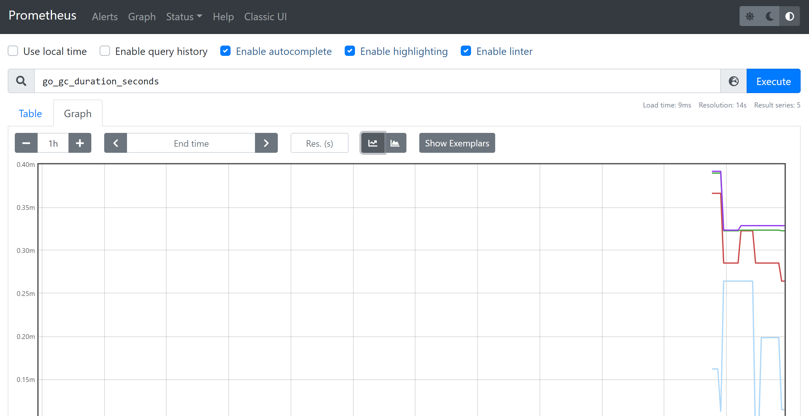
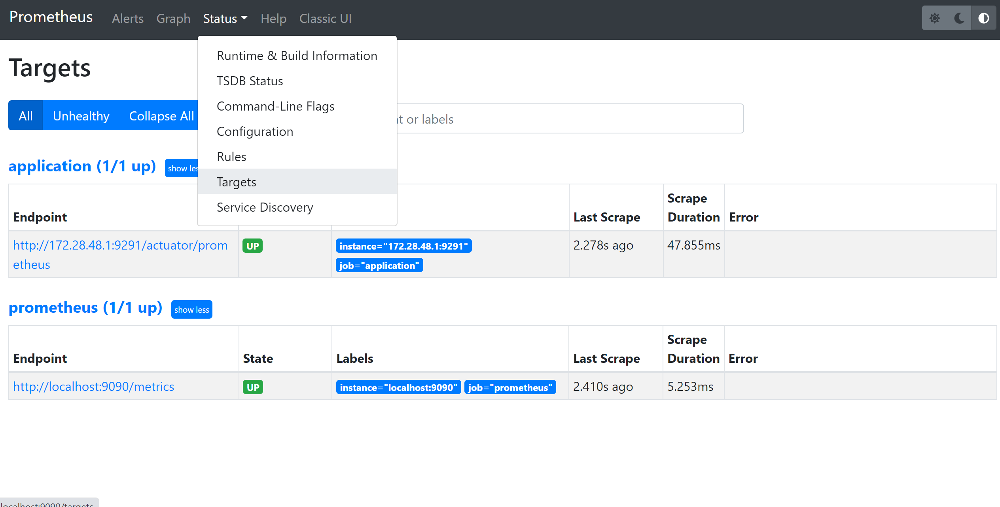
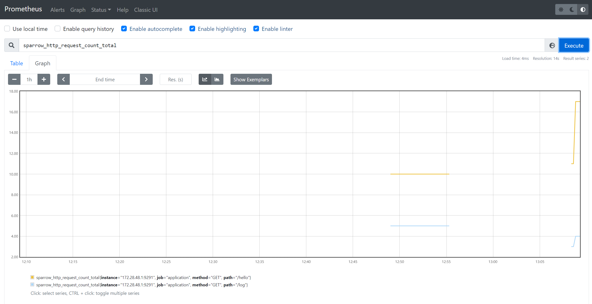
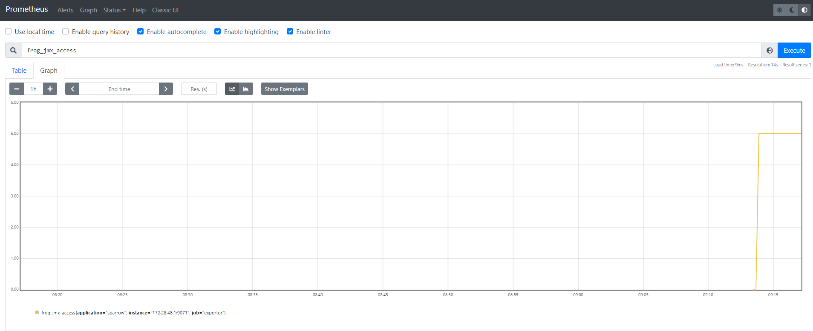

# Prometheus

## Overview

Prometheus是一个开源的系统监控和报警系统. 

接下来, 先快速搭建一个Prometheus应用; 然后, 对java应用进行监控使得对其有一个直观的了解; 然后, 再介绍一下其相关的概念以及其他东西.

## 快速开始

1. 下载安装包[Prometheus](https://prometheus.io/download/)
2. 简单配置一下:
```yml
global:
  scrape_interval:     15s # 从被监控目标上抓取数据的时间间隔
  # 外部标签
  external_labels:
    monitor: 'codelab-monitor'

# 抓取配置
scrape_configs:
  - job_name: 'prometheus'

    # 为这个抓取任务单独配置抓取数据时间间隔
    scrape_interval: 5s
    # 该任务监控的目标对象
    static_configs:
      - targets: ['localhost:9090']
```
3. 启动```nohup ./prometheus --config.file=prometheus.yml &```
4. 访问[http://localhost:9090/metrics](http://localhost:9090/metrics), 可以看到所有监控的指标.
5. 访问[http://localhost:9090/graph](http://localhost:9090/graph), 进入图形化界面.



## 嵌码集成

Prometheus可以监控的组件有很多, 例如各种语言开发的应用, mysql, kafka, ElasticSearch等. 这里先以监控java应用为例.

首先, 监控java应用的方式与OpenTelemetry类似, 也是分为手动嵌码和agent嵌码的方式. 但是, 对于链路追踪, 一般采用agent的方式比较好, 因为链路追踪的数据可定制性不高. 当时对于指标监控, 手动嵌码应该会更好些, 更容易做一些业务监控等. 下面首先演示手动嵌码:

### 手动嵌码

1. springboot集成, 增加pom依赖:

```xml
<dependency>
    <groupId>org.springframework.boot</groupId>
    <artifactId>spring-boot-starter-actuator</artifactId>
</dependency>
<dependency>
    <groupId>io.micrometer</groupId>
    <artifactId>micrometer-registry-prometheus</artifactId>
</dependency>
```

2. 增加配置类, 这里增加了一个自定义的指标监控-请求数监控:

```java
@Configuration
public class PrometheusConfiguration {

    @Resource
    private PrometheusMeterRegistry meterRegistry;

    /* 
     * 这里面由于使用的不是io.micrometer.core.instrument.Counter之类的, 
     * 而是直接使用的Prometheus原生类, 所以要手动指定application, 公共tags配置在这里不生效
     */
    @Value("${spring.application.name}") private String applicationName;

    /**
     * 统计访问量
     */
    @Bean
    public Counter requestTotalCountCollector(){
        return Counter.build().name("sparrow_http_request_count")
                .labelNames("path", "method", "application").help("http请求数").register(meterRegistry.getPrometheusRegistry());
    }

    @Bean
    public WebMvcConfigurer openTelemetryMvcConfigurer(@Qualifier("requestTotalCountCollector") final Counter counter){
        return new WebMvcConfigurer(){
            @Override
            public void addInterceptors(InterceptorRegistry registry){
                // 注册 访问量统计的counter拦截器
                registry.addInterceptor(new HandlerInterceptor(){
                    @Override
                    public boolean preHandle(HttpServletRequest request, HttpServletResponse response, Object handler) throws Exception {
                        String uri = request.getRequestURI();
                        String method = request.getMethod();
                        counter.labels(uri, method, applicationName).inc();
                        return true;
                    }
                });
            }
        };
    }

}
```

> 第2步的代码不一定要放到启动类中, 第二步中注册的bean在```private PrometheusMeterRegistry meterRegistry;```注入之前执行就可以.

4. 修改应用配置```application.yml```

```yml
management:
  server:
    port: 9291  # 暴露出去的监控端口
  metrics:
    tags:
      application : ${spring.application.name}
    export:
      prometheus:
        enabled: true
  endpoint:
    metrics:
      enabled: true
    prometheus:
      enabled: true
  endpoints:
    web:
      exposure:
        include: ["prometheus","health"]
```

5. 启动应用, 访问[http://localhost:9291/actuator/prometheus](http://localhost:9291/actuator/prometheus)就可以看到所有该应用下被监控的指标了.

6. 配置Prometheus的target, 在```prometheus.yml```的```scrape_configs```中增加配置:

```yml
  - job_name: "application"
    metrics_path: "/actuator/prometheus"
    static_configs:
      - targets: ["172.28.48.1:9291"]
```

7. 重启prometheus, 可以看到效果:





### 自动嵌码

自动嵌码时, 需要使用外部插件, 在Prometheus中称为exporter. 这里演示两个监控的exporter, 分别是: jmx_exporter用来监控java应用的基本指标; mysqld_exporter用来监控mysql的基本指标.

**jmx_exporter**

对java程序进行监控, 实际上使用了jvm的jmx技术, 参见: [jmx](../../pages/java/jmx.html). jmx_exporter可以收集所有jmx采集到的常规信息(内存, cpu, 线程等), 还可以对应用程序中暴露出来的MBean进行操作.

1. 配置jmx_exporter:

```yaml
---
startDelaySeconds: 0
ssl: false
lowercaseOutputName: false
lowercaseOutputLabelNames: false
rules:
  - pattern: 'frog<name=(\w+)><>(\w+):'
    name: frog_jmx_$2
    labels:
      "application": "sparrow"
    type: COUNTER
    attrNameSnakeCase: true
```

对参数进行解释:

* startDelaySeconds - 处理请求前的延迟时间
* hostPort - 如果是远程连接jmx, 则需要这个参数, 指定远程jmx的主机端口
* username - 同上, 远程jmx的用户名
* password - 同上, 远程jmx的密码
* jmxUrl - 同上, 远程jmx的访问地址
* ssl - jmx通讯是否使用ssl, 如果启用, 还需要设置ssl的公钥私有之类的
* lowercaseOutputName - 是否把指标名称转为小写, 默认false
* lowercaseOutputLabelNames - 是否把标签名称转为小写, 默认false
* whitelistObjectNames - MBeans对象白名单, 默认是所有MBeans, 支持正则
* blacklistObjectNames - MBeans对象黑名单, 默认空, 支持正则
* rules - MBeans匹配规则, 默认以默认格式收集所有指标
  * pattern - MBeans匹配的正则, 需要注意的是这里只匹配MBeans的Attribute, 不会匹配Operation, 详细规则见下面
  * attrNameSnakeCase - 属性是否转换为蛇形格式, 默认false
  * name - 指标名称
  * value - 指标值, 如果没有指定, 抓取attribute对应的value值
  * valueFactor - 指标值乘数. 多用于单位转化.
  * labels - 标签: 键值对形式
  * help - 指标的帮助信息
  * type - 指标类型: GAUGE, COUNTER, UNTYPED. 默认是UNTYPED.

关于pattern, 还没太搞明白, 官方解释翻译过来是这样的, 基本格式:

```
domain<beanpropertyName1=beanPropertyValue1, beanpropertyName2=beanPropertyValue2, ...><key1, key2, ...>attrName: value
```

* domain - ObjectName的冒号前面部分
* beanPropertyName/Value - bean的属性, 指的是ObjectName冒号后面部分
* keyN - 如果是复合数据或者表格数据, 属性名放入这部分列表中
* attrName - 属性名, 对于复合数据, 将是其中的字段名
* value - 属性值


1. java程序

```java
import org.springframework.jmx.export.annotation.ManagedAttribute;
import org.springframework.jmx.export.annotation.ManagedResource;
import org.springframework.stereotype.Component;

import java.util.concurrent.atomic.AtomicInteger;

@Component
@ManagedResource(objectName = "frog:name=FrogTest", description = "frog test")
public class FrogMonitor {

    private final AtomicInteger access = new AtomicInteger(0);

    @ManagedAttribute
    public String getName(){
        return "Frog";
    }

    @ManagedAttribute
    public int getAccess(){
        return access.get();
    }

    public void accessIncrement(){
        access.incrementAndGet();
    }

}
```

3. 启动应用```-javaagent:D:\work\Prometheus\jmx_prometheus_javaagent-0.16.1.jar=9071:config.yaml```
4. 访问[http://localhost:9071/metric](http://localhost:9071/metric), 可以观察到相关指标.
5. 查看Prometheus Graph, 可以找到相关数据:



**mysqld_exporter**

1. 在mysql中新建一个专门为mysqld_exporter提供的用户;

创建用户, 并指定密码:

```sql
CREATE USER 'exporter'@'%' IDENTIFIED BY '123456' WITH MAX_USER_CONNECTIONS 3;
```

用户授权:

```sql
GRANT PROCESS, REPLICATION CLIENT, SELECT ON *.* TO 'exporter'@'%';
```

2. 配置mysqld_exporter, 创建配置文件```my.cnf```

```
[client]
host=127.0.0.1
port=13306
user=exporter
password=123456
```

3. 启动mysqld_exporter, ```mysqld_exporter.exe --config.my-cnf=my.cnf```

mysqld_exporter默认暴露端口是9104, 如果想修改, 需要启动是指定```--web.listen-address```, 例如:```mysqld_exporter.exe --config.my-cnf=my.cnf --web.listen-address=":9105"```

4. 浏览器访问[http://localhost:9104/metrics](http://localhost:9104/metrics), 搜索mysql_up, 可以看到值为1, 说明监控成功了:

```
# HELP mysql_up Whether the MySQL server is up.
# TYPE mysql_up gauge
mysql_up 1
```

5. 配置Prometheus监控

```
  - job_name: "mysql"
    static_configs:
      - targets: ["172.28.48.1:9104"]
```

> 这里我配置的时候, 出了点问题, 导致Prometheus服务直接访问不到mysqld_exporter, 后来通过nginx转发解决了.

## 基本概念

通过上面的基本演示, 对Prometheus有了一定的整体概念, 接下来, 详细解释一下这些概念.

Prometheus中存储的数据都是时序数据. 每一个时序的数据都由```metric```和多个```label```键值对确定. label是可选的, 可以没有.

* metric - 指标名称;
* label - 指标的标签, 一个metric可以有多个标签, 也可以没有;
* sample - 采样, 实际的时序数据. 每一个采样点包含两部分数据:
  * 一个float64的值
  * 一个精确到毫秒的时间戳
* notation - 标记, 就是通过监控接口获取到的数据结构, 其结构是这样的: ```<metric name>{<label name>=<label value>, ...}```, 如图所示:


**metric type**

Prometheus中metric有4中类型, 分别是:

1. Counter - 计数器类型, 记录累加值, 一直增加, 不会减少, 进程重启后, 会被重置;
2. Gauge - 常规数值, 可大可小;
3. Histogram - 柱状图, 用来统计聚合, 强调分布情况等; 如下例子:


实际代码是这样的:

```java
    @Bean
    public Histogram responseTimeCollector(){
        return Histogram.build().name("sparrow_response_duration")
                .labelNames("method", "application").help("响应时间").exponentialBuckets(1, 5, 6).register(meterRegistry.getPrometheusRegistry());
    }

    private static class PrometheusMonitorInterceptor implements HandlerInterceptor {

        private final ThreadLocal<Long> requestStart = new ThreadLocal<>();

        private final Histogram responseHistogram;

        public PrometheusMonitorInterceptor(Histogram responseHistogram) {
            this.responseHistogram = responseHistogram;
        }

        @Override
        public boolean preHandle(HttpServletRequest request, HttpServletResponse response, Object handler) throws Exception {
            requestStart.set(System.currentTimeMillis());
            return true;
        }

        @Override
        public void postHandle(HttpServletRequest request, HttpServletResponse response, Object handler, ModelAndView modelAndView) throws Exception {
            try{
                String uri = request.getRequestURI();
                Long start = requestStart.get();
                if(start != null){
                    long duration = System.currentTimeMillis() - start;
                    this.responseHistogram.labels(uri, applicationName).observe(duration);
                }
            }finally {
                requestStart.remove();
            }
        }
    }
```

实际上只采集了一个值, Prometheus客户端会直接进行聚合计算. 首先Histogram定义的时候指定了buckets桶(最小值1, 步长5, 指数增长, 共6个桶); 然后, 采集的duration会被统计到指定的bucket里边, 举个例子, 如果duration = 50, 那么le = 125.0, 625.0, 3125.0, +Inf都会自增1. 此外, 还会统计出```*_count```(总的样本数)和```*_sum```(所有duration值求和); 这样, 就可以计算出平均响应时间了```rate(sparrow_response_duration_sum[5m])/rate(sparrow_response_duration_count[5m])```, 此外还可以用来计算apdex, apdex的计算公式为: ```(满意次数 + 可容忍次数 / 2) / 总请求数```.


4. Summary - 与Histogram类似, 只是它统计的不是数量, 而是分位值.

如下示例:

```java
    @Bean
    public Summary responseTimeSummaryCollector(){
        return Summary.build().name("sparrow_response_duration_quantiles")
                .labelNames("method", "application").help("响应时间分位")
                .quantile(0.5, 0.05)
                .quantile(0.9, 0.01)
                .quantile(0.99, 0.001)
                .register(meterRegistry.getPrometheusRegistry());
    }

    private static class PrometheusMonitorInterceptor implements HandlerInterceptor {

        private final ThreadLocal<Long> requestStart = new ThreadLocal<>();

        private final Summary responseTimeSummaryCollector;

        public PrometheusMonitorInterceptor(Summary responseTimeSummaryCollector) {
            this.responseTimeSummaryCollector = responseTimeSummaryCollector;
        }

        @Override
        public boolean preHandle(HttpServletRequest request, HttpServletResponse response, Object handler) throws Exception {
            requestStart.set(System.currentTimeMillis());
            return true;
        }

        @Override
        public void postHandle(HttpServletRequest request, HttpServletResponse response, Object handler, ModelAndView modelAndView) throws Exception {
            try{
                String uri = request.getRequestURI();
                Long start = requestStart.get();
                if(start != null){
                    long duration = System.currentTimeMillis() - start;
                    this.responseTimeSummaryCollector.labels(uri, applicationName).observe(duration);
                }
            }finally {
                requestStart.remove();
            }
        }
    }
```

一段时间的采样结果如下:

```
# HELP sparrow_response_duration_quantiles 响应时间分位
# TYPE sparrow_response_duration_quantiles summary
sparrow_response_duration_quantiles{method="/randomResponse",application="Sparrow",quantile="0.5",} 4690.0
sparrow_response_duration_quantiles{method="/randomResponse",application="Sparrow",quantile="0.9",} 7531.0
sparrow_response_duration_quantiles{method="/randomResponse",application="Sparrow",quantile="0.99",} 7531.0
sparrow_response_duration_quantiles_count{method="/randomResponse",application="Sparrow",} 13.0
sparrow_response_duration_quantiles_sum{method="/randomResponse",application="Sparrow",} 68280.0
```

从结果上分析数, 有50%的请求平均响应时间是4690ms, 有70%的请求平均响应时间是7531ms, 有99%的请求平均响应时间是7531ms, 总的请求次数是13次, 总响应时间是68280ms. 

需要留意一下, 在这个Summary定义的时候, quantile方法有两个参数, 第一个是分位值, 第二个是误差[errors-of-quantile-estimation](https://prometheus.io/docs/practices/histograms/#errors-of-quantile-estimation). 误差存在的原因是这样的, 假设使用histogram来计算分位值, 如果响应时间有50%都接近350ms, 所以这50%会落在[125,625]的区间中, histogram在计算是最终会给出一个响应时间的数值, 而不是一个数, 这时不是计算区间的平均值(375), 而是将这个区间平均分为100段, 取第95段的值, 即600, 最终给出的结果是: 有50%的请求响应时间在600ms, 这显然距离真实结果差的很多(当然, 这里也也有采用指数分布bucket的缘故), 总之由于Histogram采样的结果是一个分布区间, 而且它的分位值计算需要再服务端进行, 所以会有很大的出入; 然后, 回到Summary上, Summary计算分位值是在客户端进行计算的, 它可以在内部存储每一采样原始的值, 所以可以很精确的计算出分位值, 但是, 这时有代价的, 需要保存每一个采样的原始值! 对内存和cpu都有一定的要求, 尤其是这个计算是在客户端, 所以, 这里会要求配置一个误差值, 使得在误差范围内丢掉一些采样数据; 例如, 配置的是0.95±0.01, 那么最终结果会保证位于0.94--0.96的区间.

> Histogram和Summary的应用场景之一是: 如果大多数 API 请求都维持在 100ms 的响应时间范围内，而个别请求的响应时间需要 5s，那么就会导致某些 WEB 页面的响应时间落到中位数的情况，而这种现象被称为长尾问题.

**PromQL**

关于PromQL, 详见[QUERYING PROMETHEUS](https://prometheus.io/docs/prometheus/latest/querying/basics/)

**基本原理**

Prometheus会每个一段时间, 向配置好的target中的地址发送请求, 获取指标数据.

* Retrieval - 负责在活跃的target主机上抓取监控指标数据
* TSDB - 数据持久化存储
* http server - 通过PromQL语言, 提供数据查询


## 其他

配置模板jmx_exporter时, 最简单的配置是:

```
hostPort: localhost:1234
username:
password:

rules:
 - pattern: ".*"
```

prometheus如果想针对某个target配置一些东西, 可以这样配置:

```
...

  -job_name: 'xxx'
   static_configs:
    - targets: ['127.0.0.1:9080']
      labels:
         application: 'hahaha'

...
```

## 参考资料

* [Prometheus介绍](https://www.cnblogs.com/hujinzhong/p/14998683.html)
* [prometheus-book](https://yunlzheng.gitbook.io/prometheus-book/)
