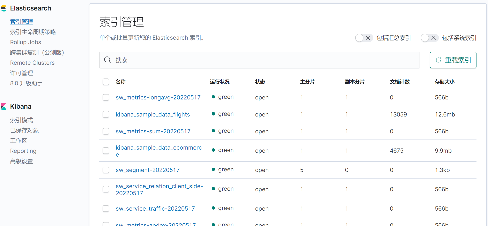
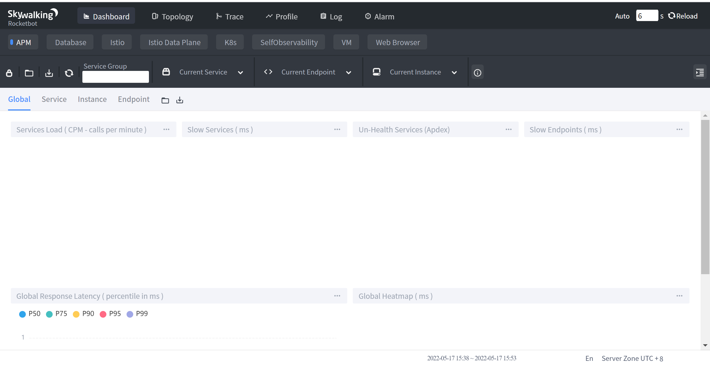
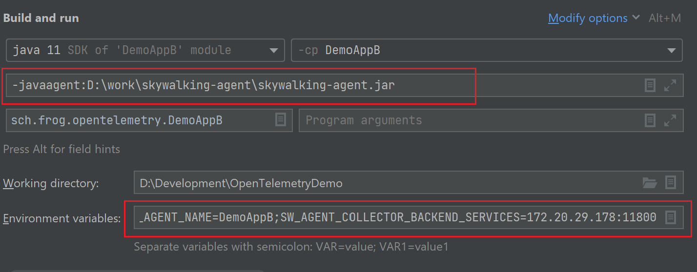
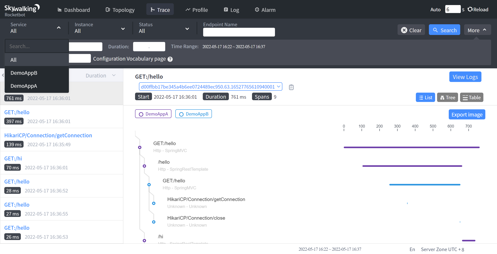
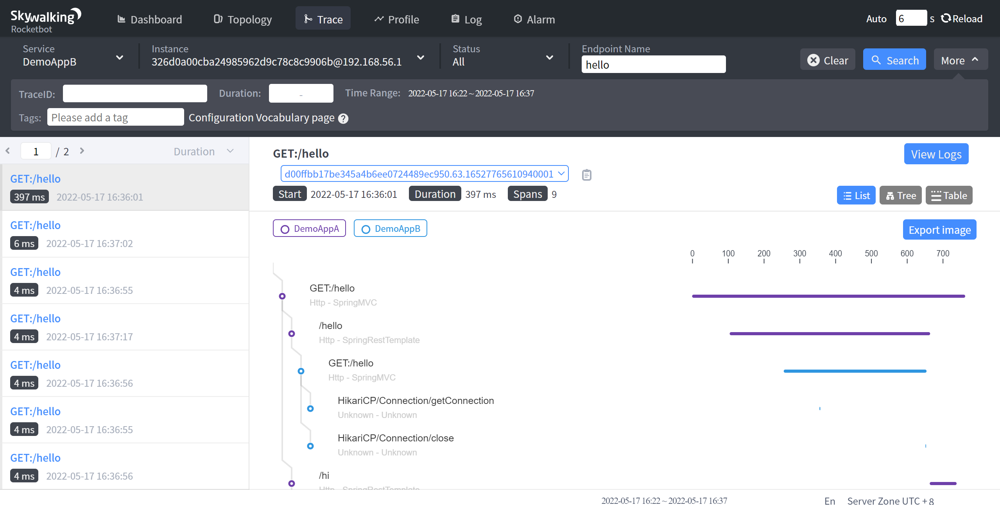
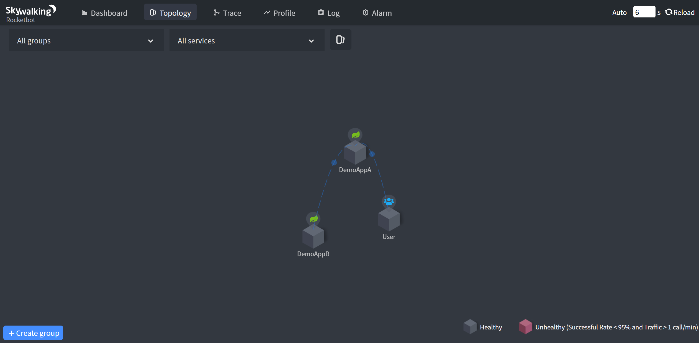
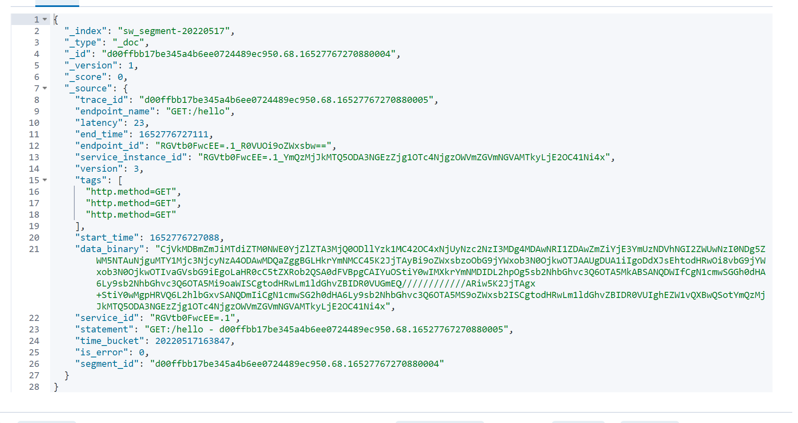
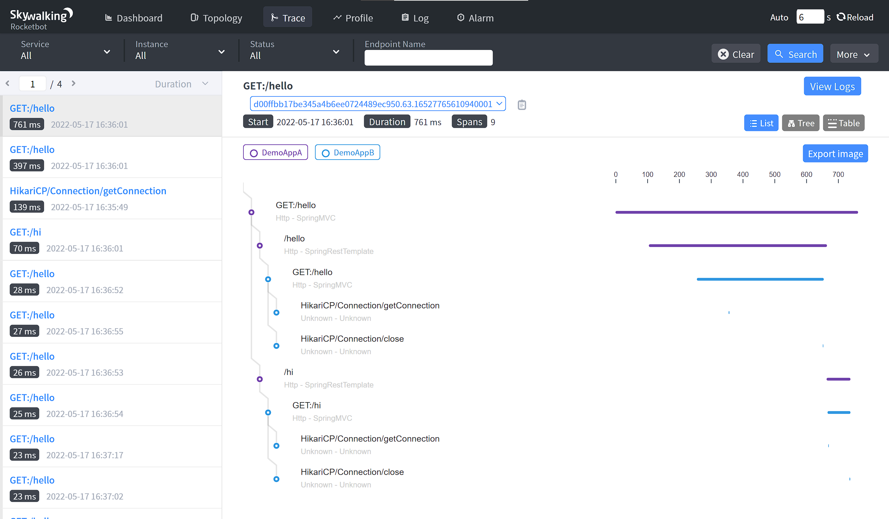
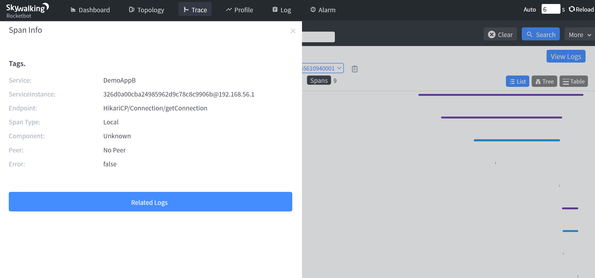

# SkyWalking

## 概述

分布式系统的应用程序性能监视工具，专为微服务、云原生架构和基于容器（Docker、K8s、Mesos）架构而设计。

本文基于Skywalking8.5.0, 存储为ElasticSearch7.

## 快速开始

#### BackEnd安装部署

1. 安装部署ElasticSearch, 可以简单参考这里: [Docker使用](https://frogif.github.io/FrogNotebook/operation_system/docker_manual.html)
2. 下载安装包[here](https://skywalking.apache.org/downloads/)
3. 修改配置文件, 文件位置是```config/application.yml```, 主要修改存储类型即可, 默认是H2. 由于我是本地启动, es端口没有变化, 所以其余都不需要改变.

```yml
storage:
  selector: elasticsearch7
  elasticsearch7:
    nameSpace: ${SW_NAMESPACE:""}
    clusterNodes: ${SW_STORAGE_ES_CLUSTER_NODES:localhost:9200}
    protocol: ${SW_STORAGE_ES_HTTP_PROTOCOL:"http"}
    trustStorePath: ${SW_STORAGE_ES_SSL_JKS_PATH:""}
    trustStorePass: ${SW_STORAGE_ES_SSL_JKS_PASS:""}
    dayStep: ${SW_STORAGE_DAY_STEP:1} # Represent the number of days in the one minute/hour/day index.
    indexShardsNumber: ${SW_STORAGE_ES_INDEX_SHARDS_NUMBER:1} # Shard number of new indexes
    indexReplicasNumber: ${SW_STORAGE_ES_INDEX_REPLICAS_NUMBER:1} # Replicas number of new indexes
    # Super data set has been defined in the codes, such as trace segments.The following 3 config would be improve es performance when storage super size data in es.
    superDatasetDayStep: ${SW_SUPERDATASET_STORAGE_DAY_STEP:-1} # Represent the number of days in the super size dataset record index, the default value is the same as dayStep when the value is less than 0
    superDatasetIndexShardsFactor: ${SW_STORAGE_ES_SUPER_DATASET_INDEX_SHARDS_FACTOR:5} #  This factor provides more shards for the super data set, shards number = indexShardsNumber * superDatasetIndexShardsFactor. Also, this factor effects Zipkin and Jaeger traces.
    superDatasetIndexReplicasNumber: ${SW_STORAGE_ES_SUPER_DATASET_INDEX_REPLICAS_NUMBER:0} # Represent the replicas number in the super size dataset record index, the default value is 0.
    user: ${SW_ES_USER:""}
    password: ${SW_ES_PASSWORD:""}
    secretsManagementFile: ${SW_ES_SECRETS_MANAGEMENT_FILE:""} # Secrets management file in the properties format includes the username, password, which are managed by 3rd party tool.
    bulkActions: ${SW_STORAGE_ES_BULK_ACTIONS:1000} # Execute the async bulk record data every ${SW_STORAGE_ES_BULK_ACTIONS} requests
    flushInterval: ${SW_STORAGE_ES_FLUSH_INTERVAL:10} # flush the bulk every 10 seconds whatever the number of requests
    concurrentRequests: ${SW_STORAGE_ES_CONCURRENT_REQUESTS:2} # the number of concurrent requests
    resultWindowMaxSize: ${SW_STORAGE_ES_QUERY_MAX_WINDOW_SIZE:10000}
    metadataQueryMaxSize: ${SW_STORAGE_ES_QUERY_MAX_SIZE:5000}
    segmentQueryMaxSize: ${SW_STORAGE_ES_QUERY_SEGMENT_SIZE:200}
    profileTaskQueryMaxSize: ${SW_STORAGE_ES_QUERY_PROFILE_TASK_SIZE:200}
    oapAnalyzer: ${SW_STORAGE_ES_OAP_ANALYZER:"{\"analyzer\":{\"oap_analyzer\":{\"type\":\"stop\"}}}"} # the oap analyzer.
    oapLogAnalyzer: ${SW_STORAGE_ES_OAP_LOG_ANALYZER:"{\"analyzer\":{\"oap_log_analyzer\":{\"type\":\"standard\"}}}"}
```

4. 执行启动命令, 在skywalking根目录执行:```./bin/oapService.sh```
5. 启动之后, 可以看到es中已经有相关的索引了



#### UI界面安装部署

1. 不需要现在安装包了, 都在上面的那个安装包里边.
2. 修改配置文件, 文件位置是```webapp/webapp.yml```, 这里我把端口号修改了一下:

```yml
server:
  port: 8094

collector:
  path: /graphql
  ribbon:
    ReadTimeout: 10000
    # Point to all backend's restHost:restPort, split by ,
    listOfServers: 127.0.0.1:12800
```

此外, 上面配置中的```collector.ribbon.listOfServers```配置的是BackEnd的地址和端口.

3. 在安装根目录执行```./bin/webappService.sh```, 完成skywalking启动.
4. 浏览器访问[http://localhost:8094/](http://localhost:8094/), 可以看到skywalking的UI界面了.



#### 部署探针上传数据

1. 首先, 需要一个测试应用, 我用的这个[OpenTelemetryDemo](https://github.com/FrogIf/OpenTelemetryDemo)
2. 下载Agent探针[Agent](https://skywalking.apache.org/downloads/#Agents)
3. 修改配置文件```skywalking-agent\config\agent.config```, 修改配置的方式有很多种, 因为接下来, 我要两个应用共用同一个探针, 这里就不修改配置了, 直接在启动命令中, 增加一些配置.
4. 应用启动参数配置, 截图如下:



5. 启动应用. 浏览器访问[http://localhost:9091/hello](http://localhost:9091/hello).
6. 稍微等一会, 可以看到, 数据都上传上来了.



## 基本概念

如图, 是trace数据的界面.



我们可以看到几个关键要素:

* Service: 表示对请求提供相同行为的一组工作负载. 例如开发了一个应用, 采用集群部署, 那么这个应用集群就是一个Service.
* Instance: 上述的一组工作负载中的每一个工作负载称为一个实例. 就是集群中的单个节点.
* EndPoint: 对于特定服务所接收的请求路径. 例如, 我们请求多次hello接口, 就对应同一个EndPoint.

如图, 是拓扑图界面:



## 协议

接下来, 简单分析一下SkyWalking上传数据的协议. 看一下它是如何完成链路追踪的.

skywalking协议文件在这里: [skywalking-data-collect-protocol](https://github.com/apache/skywalking-data-collect-protocol)

我们只关注其中的trace协议, 即这个路径: ```/language-agent/Tracing.proto```

首先, 从ElasticSearch中, 可以找到原始数据, ```sw_segment*```中, 有这样的数据:



这里面```data_binary```字段里面就是原始数据, 只不过是protobuf格式, 并且又转了一次base64. 我们可以通过写程序, 给转成json.

我写了个程序, 在这里: [skywalking-demo](https://github.com/FrogIf/skywalking-demo/tree/main/raw-data-viewer)

接下来, 分析一下一条完整的trace.

首先, 上面的安装探针的共有两个应用, 分别是: DemoAppA, DemoAppB, 请求A的hello接口后, A也会调用B应用, 而且是调用两次, 这个从上面的拓扑图中可以看出确实有调用关系. 从下面的图中, 也可以看到, 确实调用了两次.(线路颜色的变化)



于是, 从es中获取到了三条数据(```data_binary```转json之后):

* 客户端请求DemoAppA:

```json
{
  "traceId": "d00ffbb17be345a4b6ee0724489ec950.63.16527765610940001",
  "traceSegmentId": "d00ffbb17be345a4b6ee0724489ec950.63.16527765610940000",
  "spans": [{
    "spanId": 1,
    "startTime": "1652776561200",
    "endTime": "1652776561758",
    "operationName": "/hello",
    "peer": "localhost:9092",
    "spanType": "Exit",
    "spanLayer": "Http",
    "componentId": 13,
    "tags": [{
      "key": "url",
      "value": "http://localhost:9092/hello"
    }, {
      "key": "http.method",
      "value": "GET"
    }]
  }, {
    "spanId": 2,
    "startTime": "1652776561759",
    "endTime": "1652776561832",
    "operationName": "/hi",
    "peer": "localhost:9092",
    "spanType": "Exit",
    "spanLayer": "Http",
    "componentId": 13,
    "tags": [{
      "key": "url",
      "value": "http://localhost:9092/hi"
    }, {
      "key": "http.method",
      "value": "GET"
    }]
  }, {
    "parentSpanId": -1,
    "startTime": "1652776561095",
    "endTime": "1652776561856",
    "operationName": "GET:/hello",
    "spanLayer": "Http",
    "componentId": 14,
    "tags": [{
      "key": "url",
      "value": "http://localhost:9091/hello"
    }, {
      "key": "http.method",
      "value": "GET"
    }]
  }],
  "service": "DemoAppA",
  "serviceInstance": "bd322d1498074a3f859786839efdef4e@192.168.56.1"
}
```

* 第一次调用DemoAppB:

```json
{
  "traceId": "d00ffbb17be345a4b6ee0724489ec950.63.16527765610940001",
  "traceSegmentId": "2ce2eff1dff1413f84b9c296f7e401aa.65.16527765613500000",
  "spans": [{
    "spanId": 1,
    "startTime": "1652776561451",
    "endTime": "1652776561451",
    "operationName": "HikariCP/Connection/getConnection",
    "spanType": "Local",
    "componentId": 116
  }, {
    "spanId": 2,
    "startTime": "1652776561747",
    "endTime": "1652776561747",
    "operationName": "HikariCP/Connection/close",
    "spanType": "Local",
    "componentId": 116
  }, {
    "parentSpanId": -1,
    "startTime": "1652776561351",
    "endTime": "1652776561748",
    "refs": [{
      "traceId": "d00ffbb17be345a4b6ee0724489ec950.63.16527765610940001",
      "parentTraceSegmentId": "d00ffbb17be345a4b6ee0724489ec950.63.16527765610940000",
      "parentSpanId": 1,
      "parentService": "DemoAppA",
      "parentServiceInstance": "bd322d1498074a3f859786839efdef4e@192.168.56.1",
      "parentEndpoint": "GET:/hello",
      "networkAddressUsedAtPeer": "localhost:9092"
    }],
    "operationName": "GET:/hello",
    "spanLayer": "Http",
    "componentId": 14,
    "tags": [{
      "key": "url",
      "value": "http://localhost:9092/hello"
    }, {
      "key": "http.method",
      "value": "GET"
    }]
  }],
  "service": "DemoAppB",
  "serviceInstance": "326d0a00cba24985962d9c78c8c9906b@192.168.56.1"
}
```

* 第二次调用DemoAppB:

```json
{
  "traceId": "d00ffbb17be345a4b6ee0724489ec950.63.16527765610940001",
  "traceSegmentId": "2ce2eff1dff1413f84b9c296f7e401aa.66.16527765617620000",
  "spans": [{
    "spanId": 1,
    "startTime": "1652776561764",
    "endTime": "1652776561764",
    "operationName": "HikariCP/Connection/getConnection",
    "spanType": "Local",
    "componentId": 116
  }, {
    "spanId": 2,
    "startTime": "1652776561831",
    "endTime": "1652776561831",
    "operationName": "HikariCP/Connection/close",
    "spanType": "Local",
    "componentId": 116
  }, {
    "parentSpanId": -1,
    "startTime": "1652776561762",
    "endTime": "1652776561832",
    "refs": [{
      "traceId": "d00ffbb17be345a4b6ee0724489ec950.63.16527765610940001",
      "parentTraceSegmentId": "d00ffbb17be345a4b6ee0724489ec950.63.16527765610940000",
      "parentSpanId": 2,
      "parentService": "DemoAppA",
      "parentServiceInstance": "bd322d1498074a3f859786839efdef4e@192.168.56.1",
      "parentEndpoint": "GET:/hello",
      "networkAddressUsedAtPeer": "localhost:9092"
    }],
    "operationName": "GET:/hi",
    "spanLayer": "Http",
    "componentId": 14,
    "tags": [{
      "key": "url",
      "value": "http://localhost:9092/hi"
    }, {
      "key": "http.method",
      "value": "GET"
    }]
  }],
  "service": "DemoAppB",
  "serviceInstance": "326d0a00cba24985962d9c78c8c9906b@192.168.56.1"
}
```

关于链路追踪的具体原理, 就不过多解释了, skywalking和OpenTelemetry等原理都是一样的, 可以看 [这里](https://frogif.github.io/FrogNotebook/apm/OpenTelemetry.html), 下面对主要字段做一个简要的介绍:

1. traceId -- 链路追踪相关字段
2. spanId -- 这个和OpenTelemetry有些不通过, OpenTelemetry中, spanId是全局的. 而这里, 是一个应用内部的. 跨应用调用之间, 不会通过spanId来进行关联.
3. parentSpanId -- 如果是应用的入口, 这个值为-1, 如果parentSpanId为0, 这没有这个字段.
4. traceSegmentId -- 这个才是用来维持多个应用(trace)之间调用关系的字段
5. parentTraceSegmentId -- 同上
6. operationName -- 就是EndPoint, 对于程序的入口, 可以直接在es里边印证这一点, 对于程序内部调用, 通过skywalking界面, 可以看到:



7. startTime, endTime -- 该级span的调用开始时间和结束时间
8. refs -- 记录了调用该应用的上级应用的信息, 包括上级调用发起span的id, 上级服务名, parentSegmentId等.

其余字段就不介绍了.

## Reference

* [SkyWalking极简入门](https://skywalking.apache.org/zh/2020-04-19-skywalking-quick-start/)
* [SkyWalking中文文档](https://github.com/SkyAPM/document-cn-translation-of-skywalking)