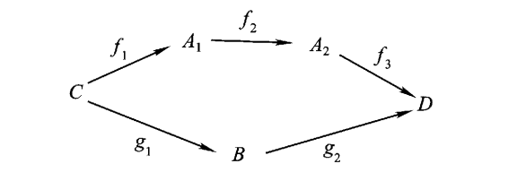

# 运算及关系

-----------------------

## 集合与运算

**嵌入映射**

设$A_0$是集合A的非空子集, 定义$A_0$到$A$的映射$i$如下:

$$
i(x) = x, \forall x \in A_0
$$

则称$i$为$A_0$到$A$的嵌入映射.

**开拓/限制映射**

设$A_0$是集合A的非空子集, $f$是$A_0$到集合B的映射, 若有$A$到$B$的映射$g$, 使$g(x) = f(x), \forall x \in A_0$, 则称$g$为$f$的开拓映射, $f$为$g$在$A_0$上的限制映射, 记作: $f = {g|}_{A_0}$

* 单射: $\forall a \neq b \in A, f(a) \neq f(b)$
* 满射: $\forall y \in B, \exist x \in A, y = f(x)$
* 双射: 一一映射, 既单射, 又满射的映射

**交换图**

从集合C到集合D的映射, 既可以表示成$f_3 f_2 f_1$有可以表示成$g_2 g_1$, 则有交换图:



**直积**

$$
A \times B = \{ (a, b) | a \in A, b \in B \}
$$

**代数运算**

$$
A \times B \stackrel{f}{\longrightarrow} D
$$

则$f$为代数运算, 若$A = B = D$, 则成为二元运算或者运算.

**运算律**

* 结合律: $(a \circ b) \circ c = a \circ (b \circ c)$
* 交换律: $a \circ b = b \circ a$
* 分配律: $a \circ (b + c) = a \circ b + a \circ c$, 还细分为左分配律, 右分配律


## 关系

**关系**

$R$是$A \times A$的子集, $a, b \in A$, 若$(a, b) \in R$, 则$a$, $b$有关系$R$, 记为$a R b$, 称$R$为$A$的一个关系(二元关系)

**等价关系**

同时满足以下三个条件的关系称为等价关系:

1. 反身性: $a R a, \forall a \in A$
2. 对称性: $a R b \Longrightarrow b R a, \forall a, b \in A$
3. 传递性: $a R b, b R c \Longrightarrow a R c, \forall a, b, c \in A$

**分类/分划**

集合A分为多个非空子集, 每个子集称为A的一个类, 使得A的每一个元素属于且仅属于一个类. 称这些类的全体为集合A的分类(分划)

集合A的等价关系决定A的一个分类, 集合A的一个分类决定A的一个等价关系:

```
等价关系 --> 分类
分类 --> 等价关系
```

设A中存在等价关系R, 若$a \in A$, 则集合$\{b \in A | b R a\}$称为a的等价类, 记为$\overline{a}$, a称为代表元.

**商集合**

集合A中有等价关系R, 则根据R确定的所有等价类(重复的只取一个)组成的集合$\{\overline{a}\}$, 称作商集合, 记作:$A/R$

**自然映射**

集合A中有等价关系R, 则映射$\pi : A \rightarrow A/R$描述为:

$$
\pi (a) = \overline{a}
$$

称为$A$到$A/R$的自然映射.

> 自然映射一定是满射, 但不一定是单射

**同余关系**

关系R满足下述等式:

$$
a R b, c R d \Longrightarrow (a \circ c) R (b \circ d)
$$

则称R为A关于运算$\circ$的同余关系. a所在的等价类称为同余类.

对于同余关系, 有下面的特点:

$$
\overline{a}\,\overline{\circ} \overline{b} = \overline{(a \circ b)}
$$

这个等式可以描述为两个同余类通过一种运算$\overline{\circ}$得到的类是以$a, b$经过$\circ$运算后的代表元所在的同余类