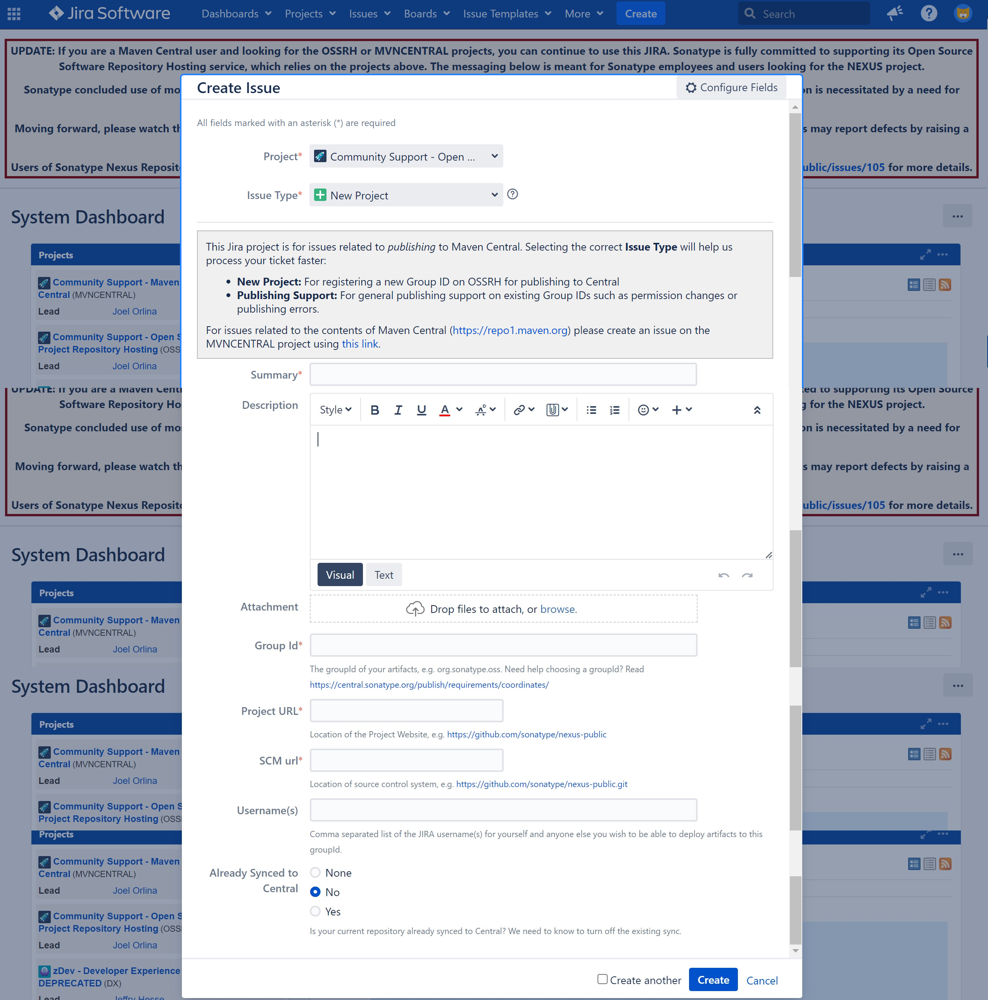
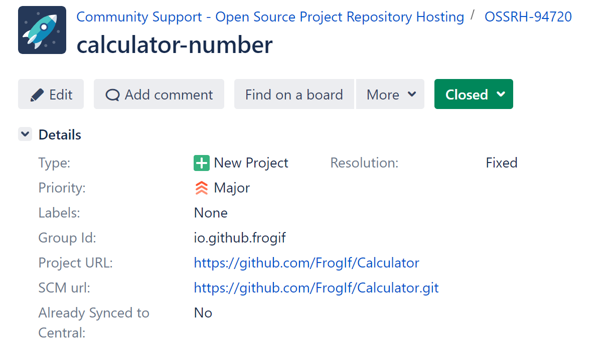
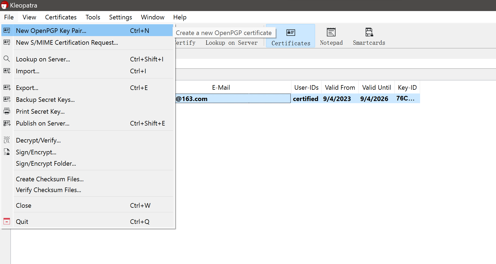
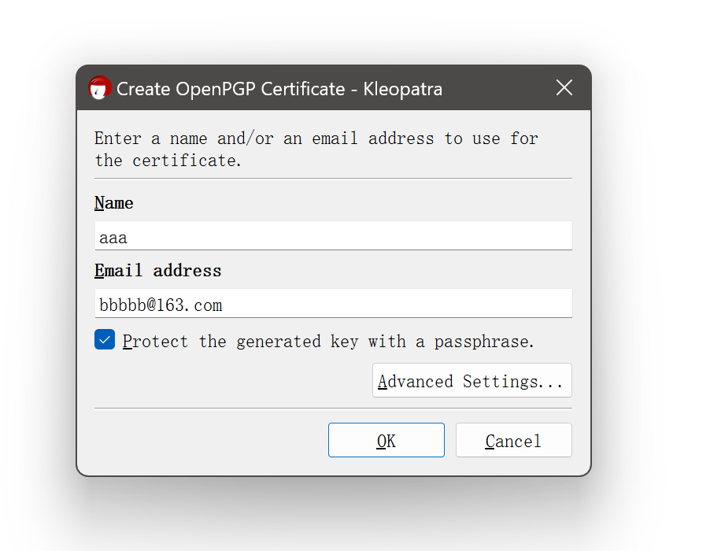
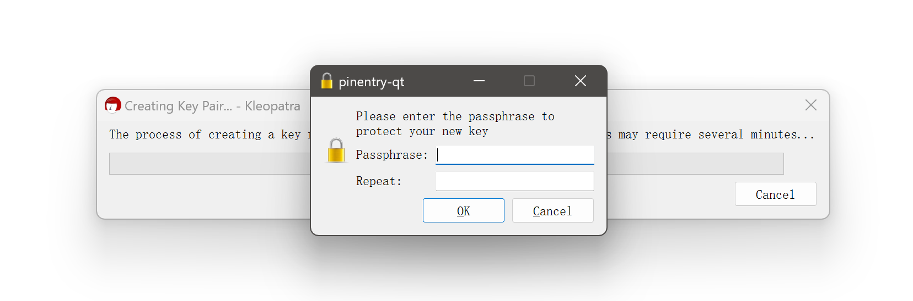
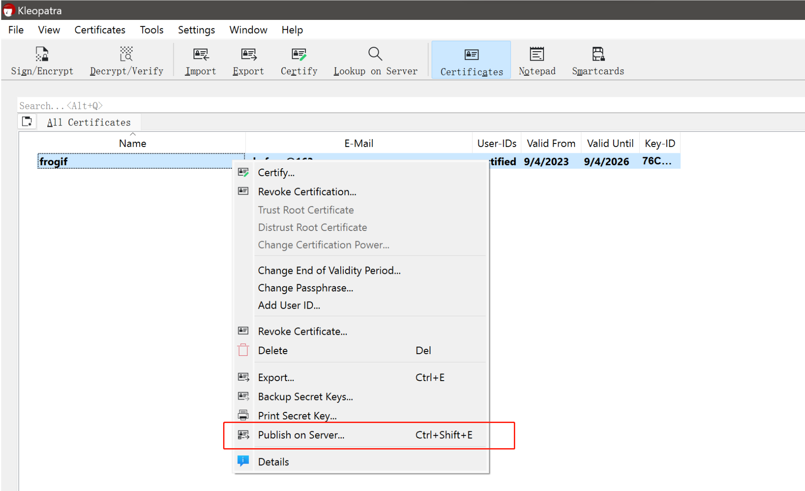
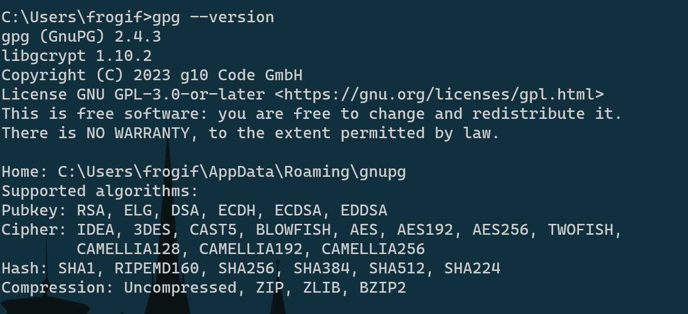

# 发布jar包到maven中央仓库

1. 注册账号: https://issues.sonatype.org/
2. 登录, 新建项目



> * Group Id: 这个很重要, 可能导致审批不通过的. 如果有域名, 就填域名, 否则可以填源码仓库地址等. 例如: io.github.frogif, 如果由于这里导致审核不通过, 要仔细读他的评论, 按照说的步骤做就可以了.

3. 创建后的项目大概是这样:



4. 审批通过之后, 就可以登录仓库了: https://s01.oss.sonatype.org/ (不需要注册, 用上面的用户名密码就可以)
5. 下载安装Gpg4Win: https://www.gpg4win.org/
   * 这个软件时用来进行数据加密传输的
6. 使用Gpg4Win生成密钥







7. 发布到服务器上



8. 配置maven的settings.xml

```xml
<!-- 省略 -->
  <servers>
    <server>
          <id>ossrh</id>
          <username>issues.sonatype.org账号</username>
          <password>issues.sonatype.org密码</password>
    </server>
  </servers>

<!-- 省略 -->

  <profiles>
    <profile>
      <id>ossrh</id>
      <activation>
        <activeByDefault>true</activeByDefault>
      </activation>
      <properties>
        <gpg.executable>gpg</gpg.executable>
        <gpg.passphrase>生成密钥时输入的密码</gpg.passphrase>
        <gpg.homedir>C:\Users\xxxx\AppData\Roaming\gnupg</gpg.homedir>
	  </properties>
    </profile>
  </profiles>

<!-- 省略 -->
```

> gpg.homedir参数可以从命令行获取: 

9. 配置项目的pom文件, 样例如下

```xml
<?xml version="1.0" encoding="UTF-8"?>
<project xmlns="http://maven.apache.org/POM/4.0.0"
         xmlns:xsi="http://www.w3.org/2001/XMLSchema-instance"
         xsi:schemaLocation="http://maven.apache.org/POM/4.0.0 http://maven.apache.org/xsd/maven-4.0.0.xsd">
    <modelVersion>4.0.0</modelVersion>

    <groupId>io.github.frogif</groupId>
    <name>calculator-number</name>
    <artifactId>calculator-number</artifactId>
    <version>1.0</version>
    <packaging>jar</packaging>
    <description>support general calculate for rational number and integer number, and precision lossless.</description>

    <properties>
        <maven.compiler.source>8</maven.compiler.source>
        <maven.compiler.target>8</maven.compiler.target>
        <project.build.sourceEncoding>UTF-8</project.build.sourceEncoding>
    </properties>

    <licenses>
        <license>
            <name>MIT License</name>
            <url>https://www.opensource.org/licenses/mit-license.php</url>
            <distribution>repo</distribution>
        </license>
    </licenses>

    <url>https://github.com/FrogIf/Calculator</url>

    <developers>
        <developer>
            <id>frogif</id>
            <name>frogif</name>
            <email>skyfrog@163.com</email>
            <roles>
                <role>Maintainer</role>
            </roles>
            <timezone>+8</timezone>
        </developer>
    </developers>

    <scm>
        <connection>https://github.com/FrogIf/Calculator.git</connection>
        <developerConnection>scm:git:ssh://git@github.com:FrogIf/Calculator.git</developerConnection>
        <url>https://github.com/FrogIf/Calculator/tree/master</url>
    </scm>

    <build>
        <plugins>
            <!-- 生成源码jar -->
            <plugin>
                <groupId>org.apache.maven.plugins</groupId>
                <artifactId>maven-source-plugin</artifactId>
                <version>2.2.1</version>
                <executions>
                    <execution>
                        <id>attach-sources</id>
                        <goals>
                            <goal>jar-no-fork</goal>
                        </goals>
                    </execution>
                </executions>
            </plugin>
            <!-- 生成文档jar -->
            <plugin>
                <groupId>org.apache.maven.plugins</groupId>
                <artifactId>maven-javadoc-plugin</artifactId>
                <version>2.10.4</version>
                <configuration>
                    <additionalJOptions>
                        <additionalJOption>-Xdoclint:none</additionalJOption>
                    </additionalJOptions>
                </configuration>
                <executions>
                    <execution>
                        <id>attach-javadocs</id>
                        <goals>
                            <goal>jar</goal>
                        </goals>
                    </execution>
                </executions>
            </plugin>
            <!-- gpg加密上传 -->
            <plugin>
                <groupId>org.apache.maven.plugins</groupId>
                <artifactId>maven-gpg-plugin</artifactId>
                <version>1.6</version>
                <executions>
                    <execution>
                        <id>sign-artifacts</id>
                        <phase>verify</phase>
                        <goals>
                            <goal>sign</goal>
                        </goals>
                    </execution>
                </executions>
            </plugin>
        </plugins>
    </build>

    <distributionManagement>
        <snapshotRepository>
            <!-- id需要与maven的settings.xml中保持一致 -->
            <id>ossrh</id>
            <url>https://s01.oss.sonatype.org/content/repositories/snapshots</url>
        </snapshotRepository>
        <repository>
            <!-- id需要与maven的settings.xml中保持一致 -->
            <id>ossrh</id>
            <url>https://s01.oss.sonatype.org/service/local/staging/deploy/maven2/</url>
        </repository>
    </distributionManagement>

</project>
```

10. 打包上传

```bash
mvn clean compile package deploy
```

11. maven命令执行完成会弹窗, 提示输入上面第6步生成密钥时输入的密码, 输入密码
12. 构建成功, 也就上传完成了
13. 访问https://s01.oss.sonatype.org, 进行后续操作