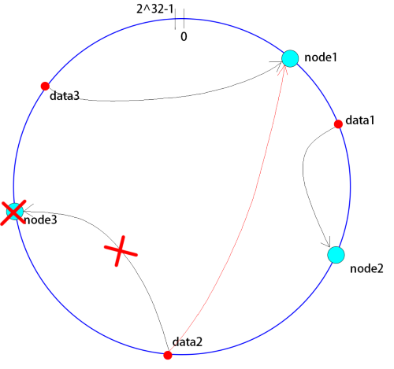

# 一致性hash

## 背景

假如有一个存储介质集群, 每一个节点存储的数据与其他节点都不一致. 通过hash函数, 我们可以计算出一个索引值, 来确定数据应该存入哪一个节点, 或者从哪一个节点查询出来. 最简单的实现是直接取余.

```java
public int NODE_COUNT = 3;
public int getNodeIndex(int data){
    return data % NODE_COUNT;
}
```

但是, 这样存在一个问题, 如果这个集群扩容或者其中一个节点宕机, 会导致```NODE_COUNT```发生变化, 所有历史存储数据的存储位置都可能会受到影响. 一致性hash就是用来解决这个问题的.

## 一致性hash原理

一致性hash算法同样是取余, 但是不是对节点数量进行取余, 而是对2^32进行取余. 显然取余的结果会有2^32中可能, 为了形象的理解, 将这2^32个位置想象为均匀分布在一个圆环上. 整个圆环以顺时针方向进行组织, 圆环正上方的点代表0, 由此的第一个点代表1, 以此类推. 然后, 将各个服务器使用服务器的IP或主机名等唯一标识符进行hash, 确定每台服务器在hash环上的位置.

假设有三台服务器, 使用ip地址进行hash后, 在环上的位置如图:


接下来, 使用以下算法, 将数据定位到指定的节点上:

```
根据数据的key通过hash函数, 计算出hash值, 通过对2^32取余, 求得在环上的位置, 从此位置, 沿顺时针方向查找, 遇到的服务器就是该数据应该存放的服务器.
```


这就是一致性hash.

## 一致性hash算法的容错性和可扩展性

接上面的例子, 假设节点3宕机了. 这时, 原来存储在节点1,2上的数据不受影响, 存储在节点3上的数据丢失, 新的数据会入到节点1上.



另一种情况, 假设新增加了一个节点4. 位置在3和1之间, 这时, 3到4直接的数据会受到影响, 其余数据都不会受到影响.


## 数据倾斜问题

在一致性hash算法中, 服务节点太少的情况下, 可能会因为节点分布不均匀导致数据倾斜(大部分数据存储到了某一个节点上), 如图所示:


这时, 需要引入虚拟节点机制. 即, 对每一个服务器节点, 计算出多个不同的hash值, 每个计算结果都防止一个此服务节点, 称为虚拟节点. 如图所示:


数据定位算法不变, 只需增加一步, 虚拟节点到实际节点的映射. 这样就实现了节点很少时, 数据也能均匀分布.

## 算法实现(java)

```java
/**
 * 一直性hash算法简单实现
 */
public class ConsistencyHash {

    private static final Logger logger = LoggerFactory.getLogger(ConsistencyHash.class);

    public static void main(String[] args){
        // 初始化数据
        Random r = new Random();
        RepositoryFrontend repository = new RepositoryFrontend();
        String testKey = null;
        for(int i = 0; i < 1000; i++){
            String val = UUID.randomUUID().toString().replaceAll("-", "");
            repository.put(val, String.valueOf(r.nextInt(10000)));
            testKey = val;
        }

        // 查看数据存储分布情况
        Collection<Node> nodes = repository.nodes.values();
        HashSet<String> nodeSet = new HashSet<>();
        for(Node node : nodes){
            if(nodeSet.add(node.address)){
                logger.info("node : {} has key count : {}", node.address, node.kv.size());
            }
        }

        // 查询
        String val = repository.get(testKey);
        logger.info("test query get k : {}, v : {}", testKey, val);
    }

    private static class RepositoryFrontend {

        // 每个真实节点对应的虚拟节点数量
        private static final int visual_node_count = 5;

        TreeMap<Integer, Node> nodes = new TreeMap<>();

        public RepositoryFrontend(){
            addNode(new Node("192.168.1.235"));
            addNode(new Node("192.168.1.120"));
        }

        /**
         * 增加存储节点
         */
        private void addNode(Node node){
            /*
             * 增加虚拟节点, 防止数据倾斜
             * 如果Objects.hash得到的值出现hash冲突怎么办? 为了突出主要逻辑, 这里暂时不考虑
             */
            for(int i = 0; i < visual_node_count; i++){
                nodes.put(Objects.hash(node.address + UUID.randomUUID().toString()), node);
            }
        }

        // 存储
        public void put(String key, String value){
            int keyHash = Objects.hash(key);
            Node node = this.searchNode(keyHash);
            node.kv.put(key, value);
        }

        // 查询
        public String get(String key){
            int keyHash = Objects.hash(key);
            Node node = this.searchNode(keyHash);
            return node.kv.get(key);
        }

        /**
         * 定位到存储的节点
         */
        private Node searchNode(int keyHash){
            if(!nodes.containsKey(keyHash)){ // key的hash值不是正好落在节点上
                // 获取一个子集, 其所有key大于等于keyHash的值
                SortedMap<Integer, Node> tailMap = nodes.tailMap(keyHash);
                if(tailMap.isEmpty()){
                    keyHash = nodes.firstKey();
                }else{
                    keyHash = tailMap.firstKey();
                }
            }
            return nodes.get(keyHash);
        }

    }
    
    private static class Node{
        HashMap<String, String> kv = new HashMap<>();
        final String address;
        public Node(String address){
            this.address = address;
        }
    }
}
```