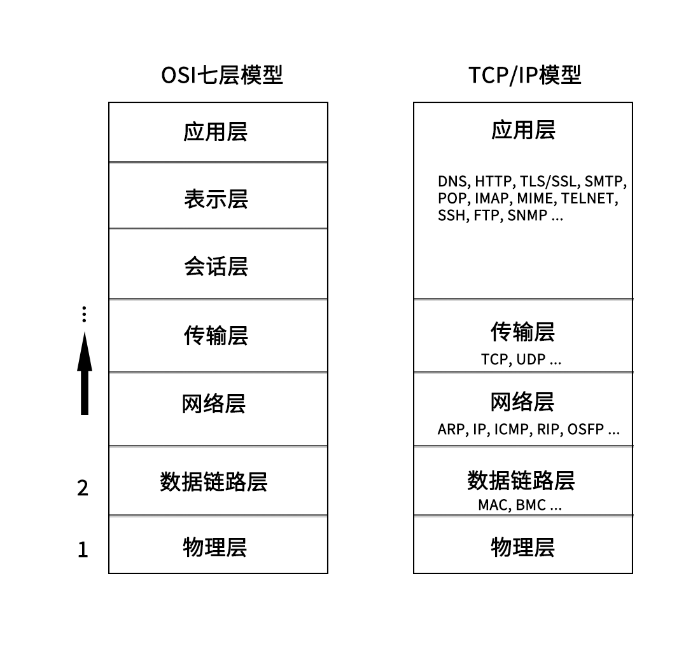
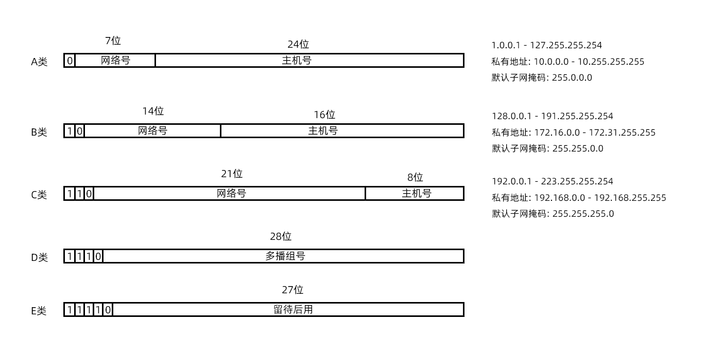

# 计算机网络

## 1. 网络分层

* OSI七层模型, OSI即Open System Interconnection, 开放系统互连. 
* OSI七层模型在落地实现时, 会话层和表示层实现不了, 它即复杂有不实用, 所以OSI七层模型从来没有真正实现过. 实际中使用的都是TCP/IP模型

如图所示:



这里以一次http请求为例, 简单介绍一下. 首先, 浏览器遵照HTTP协议生成http消息, 交给L4(传输层). http消息在传输层采用的是TCP协议, 会对数据进行一些处理, 加上TCP头, 并且会控制进行三次握手/四次挥手等. TCP消息交给L3(网络层). 网络层会加上IP头, 即源ip和目的ip等, 然后交给L2(数据链路层), 这里有ARP和MAC等的参与, 会对消息加上MAC头. 然后交给L1(物理层), 变成电磁波发送出去.

## 2. 应用层

### 2.1 HTTP

### 2.2 DNS

### 2.3 TELNET

### 2.4 浏览器

* URL: Uniform Resource Locator(统一资源定位符)
* URI: Uniform Resource Identifier(统一资源标识符)

> URL与URI的区别: URL是URI的子集. 只要可以唯一确定一个资源, 就是URI. 按照一定规则, 可以分析出一个资源的位置, 就是URL, 显然URL也可以唯一确定一个资源, 所以URL属于URI.

### 2.5 Socket

## 3. 传输层

### 3.1 TCP

### 3.2 UDP

## 4. 网络层

### 4.1 IP

* 网络号: ip地址前面的部分, 用于定位一个子网
* 主机号: ip地址后面的部分, 用于定位子网内的一个具体的主机地址
* 子网掩码: 用于区分网络号和主机号, 是一串与ip地址长度相同的数字, 其左边都是1, 右边都是0. 子网掩码为1的部分表示网络号, 为0的部分表示主机号.

ip地址分类:



* A类, 最大网络数: 126(2^7-2), 单个网段最大主机数: 16777214
* B类, 最大网络数: 16384(2^14), 单个网段最大主机数: 65534
* C类: 最大网络数: 2097152(2^21), 单个网段最大主机数: 254
* 特殊的ip
  * ip地址的主机号全是0, 表示整个子网; 例如: 192.168.12.0/255.255.255.0
  * ip地址的主机号全是1, 表示广播地址. 例如: 192.168.12.255/255.255.255.0
  * 0.0.0.0表示当前主机
  * 255.255.255.255是当前子网的广播地址
  * ip地址不能以127开头, 127.0.0.1 - 127.255.255.255用于回路测试
* 私有IP
  * 允许组织内部自行进行分配的ip, 不同的局域网IP可以重复, 局域网内唯一
  * 10.0.0.0 - 10.255.255.255
  * 172.16.0.0 - 172.31.255.255
  * 192.168.0.0 - 192.168.255.255
* 公网IP
  * 由组织统一分配, 需要购买
  * 每一个公网IP都是全球范围内唯一的
* 无类型域间路由(CIDR)
  * A,B,C,D,E类IP地址的子网掩码都是固定的, 这导致无法灵活控制主机数和网络数的规模, 从而导致存在一个网段内的IP冗余或者不足, 于是有了CIDR
  * CIDR消除了传统A类, B类, C类地址以及子网划分的概念, 从而更加有效的分配IPv4地址空间
  * CIDR形式是这样的: 192.168.1.0/26, 将IP地址一分为二, 前面26位是网络号, 后面6位是主机号


> 上述内容都是针对ipv4

> IP是具有定位能力的, 通过网络号和主机号, 可以标记一个主机的位置, MAC不具有定位能力, 类似身份证号, 具有唯一性

**IP查看与分配**

* windows下, 查看IP地址, 使用: ```ipconfig```
* linux下
  * 查看IP地址, 使用: ```ifconfig```或者```ip addr```/```ip a```
  * 设置IP地址:
    * net-tools:
      * ```ifconfig eth1 10.0.0.1/24```
      * ```ifconfig eth1 up```
    * iproute2:
      * ```ip addr add 10.0.0.1/24 dev eth1```
      * ```ip link set up eth1```
    * IP不是随意配置的, 如果配置了不属于当前网段的IP, 会导致网络不通
      * 如果同一网段之间的两个IP通信, 可以直接发送数据, 不经过网关
      * 如果不通网段之间的IP通信, 需要经过网关, 网关地址需要和当前主机的至少一个网卡属于同一网段
  * DHCP(动态主机配置协议, Dynamic Host Configuration Protocol)
    * 主机通过DHCP自动获取IP地址
    * 工作原理
      1. DHCP Discover: 使用0.0.0.0作为源IP, 255.255.255.255作为目的IP, 传输层使用UDP协议, 发送广播包, (目的MAC: ff:ff:ff:ff:ff:ff);
      2. DHCP Offer: 这时DHCP Server接收到消息, 从剩余IP资源中分配一个, 依旧采用广播的形式, 将这个IP广播出去, 这时, 源IP是DHCP Server的IP, 目的MAC是发起DHCP的主机的IP, 这个消息中包含的信息有: IP地址, 子网掩码, 网关, IP地址租用期等;
      3. 客户端主机接收到DHCP Offer消息, 这时, 如果网络中存在多个DHCP Server, 就会收到多个消息, 会选取其中一个, 然后发送确认消息, 发送确认消息时, 依旧使用0.0.0.0作为源IP, 255.255.255.255作为目的IP进行广播;
      4. DHCP Server收到确认消息后, 广播一个ACK应答, 至此完成DHCP.
    * DHCP续租和回收: 当租期过去50%后, 提供IP地址的DHCP Server会发送消息, 客户端接收到消息后, 会更新租期.
    * DHCP Server还可以用来安装操作系统, 一般用于数据中心批量进行系统安装, 涉及PXE(预启动执行环境), 具体略


### 4.2 ICMP

ping, traceroute...

### 4.3 网关

路由表, RIP, OSFP

### 4.4. ARP

## 5. 数据链路层

### 5.1 MAC


## 6. 物理层

