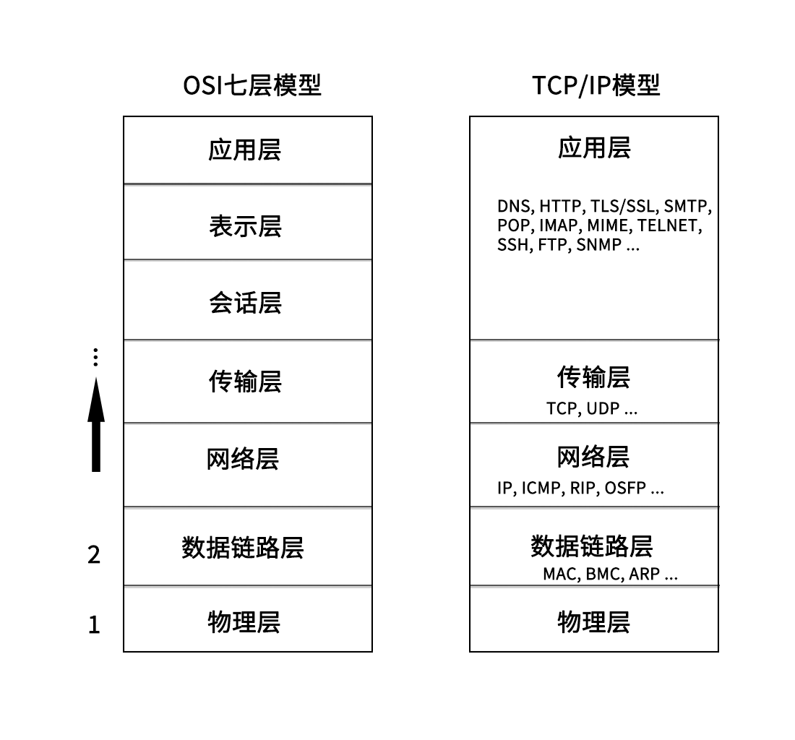
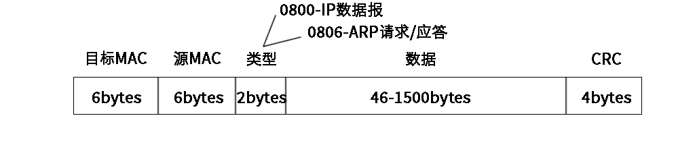
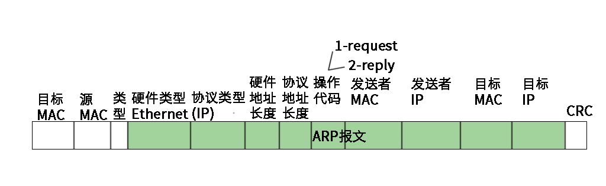
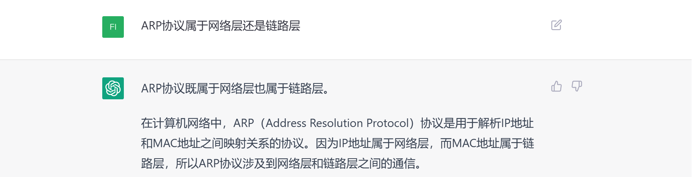
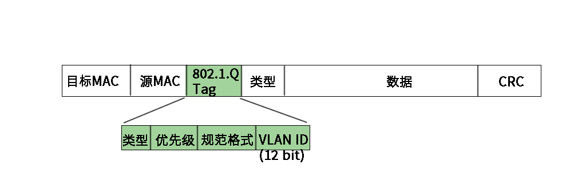
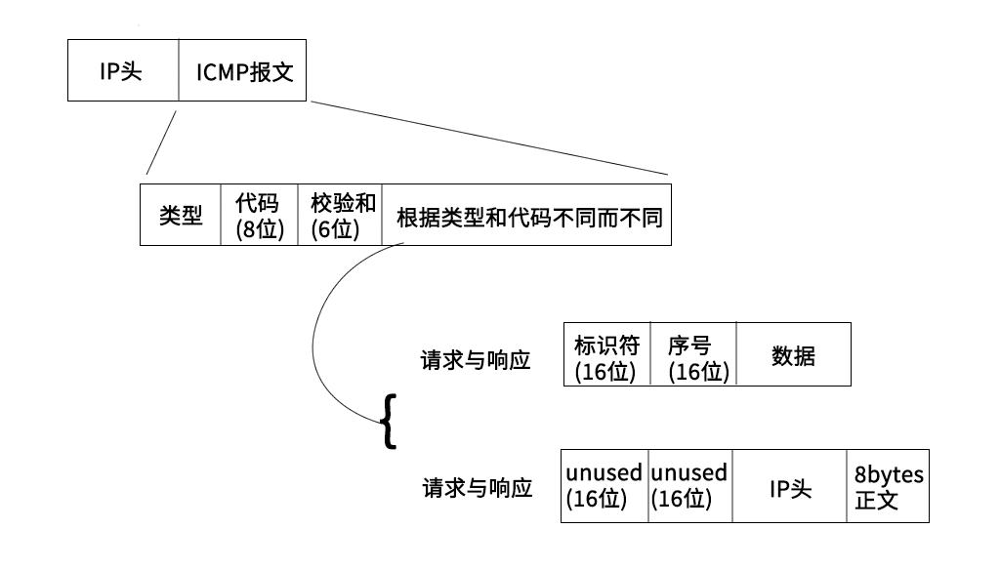

# 计算机网络

## 1. 网络分层

* OSI七层模型, OSI即Open System Interconnection, 开放系统互连. 
* OSI七层模型在落地实现时, 会话层和表示层实现不了, 它即复杂有不实用, 所以OSI七层模型从来没有真正实现过. 实际中使用的都是TCP/IP模型

如图所示:



这里以一次http请求为例, 简单介绍一下:

1. 首先, 浏览器遵照HTTP协议生成http消息, 交给L4(传输层)
2. http消息在传输层采用的是TCP协议, 会对数据进行一些处理, 加上TCP头, 并且会控制进行三次握手/四次挥手等;
3. TCP消息交给L3(网络层). 网络层会加上IP头, 即源ip和目的ip等;
4. 然后交给L2(数据链路层), 这里有ARP和MAC等的参与, 会对消息加上MAC头;
5. 然后交给L1(物理层), 变成电磁波发送出去.

> 网络上的包都是完整的, 可以有下层没上层, 绝对不可能有上层没下层.

## 2. 物理层

物理层不就是网线啥的硬件设备嘛, 有啥好说的呢? 有:

1. 1-3,2-6交叉接法: 水晶头的第 1、2 和第 3、6 脚，它们分别起着收、发信号的作用。将一端的 1 号和 3 号线、2 号和 6 号线互换一下位置，就能够在物理层实现一端发送的信号，另一端能收到;
2. 集线器(Hub): 可以将多台电脑连接起来, 集线器没有程序, 就是一个简单的将线连接起来, 它接收到的每一个字节都会广播到其他端口上去.

## 3. 数据链路层

### 3.1 MAC

MAC全称Medium Access Control, 即媒体访问控制.

MAC有以下需要注意的点:

1. 标记发送方和接收方: mac头上记录了目标MAC和源MAC
2. 多路访问(谁先发谁后发): 信道划分, 轮流协议, 随机接入协议;
3. 数据错误校验: 通过mac包最后的CRC(循环冗余检测)校验整个包在发送过程中是否出现错误.



> CRC, 循环冗余检测, 使用XOR异或算法, 检查在网络上传输数据是否出错.

### 3.2 ARP

ARP协议是: 根据IP地址获取该设备的MAC地址. 当明确接收方的IP地址后, 通过广播的方式, 询问局域网中的其他设备, "IP:xxx的MAC地址是多少?", 广播出去之后, 谁的IP是报文中的IP, 谁就回答. 此外并不是每次发送数据, 都需要先进行ARP请求, 机器会将ARP缓存在本地.

ARP协议包示意图如下:



> 发送请求时, 广播的目标mac是: ff:ff:ff:ff:ff:ff

> ARP到底属于网络层协议还是数据链路层是有争议的
> 

### 3.3 交换机

一个局域网中, 如果有多台主机设备, 如果通过集线器进行数据转发会有问题. 每一个数据包都广播到其他线路上去, 让主机判断目的mac地址是不是自己的, 导致而不是自己的就丢弃, 这样资源浪费. 这时就需要一种设备, 这个设备可以通过mac地址确定应该转发到哪个线路的端口上去, 这个设备就是**交换机**.

1. **交换机是一个二层设备**.
2. 交换机最初并不知道目标mac在哪一个端口上, 依旧会将包转发到所有其他端口, 但是它知道数据包是从哪来的, 也就是知道源mac在哪个端口, 一点点它就记录了所有mac所在的端口, 这样就可以通过mac转发到指定的端口上去了, 而不需要转发到所有端口.
3. 交换机上的学习结果称为**转发表**, 转发表是有过期时间的.

> 显然, 交换机是在一个局域网中使用的.

> 传统交换机是二层交换机, 实际上也是有三层交换机的. 三层交换机是在二层交换机的基础上，增加了路由选择功能的网络设备, 可以跨vlan进行数据通信等. 在路由转发上, 速度要比路由器快.

当一个局域网中存在多台交换机时, 就会出现环路问题, 从而导致环路风暴. 解决环路问题的方法叫STP(Spanning Tree Protocol), 利用最小生成树算法, 破坏环路, 化"图"为"树".

> 现在STP使用的很少了, 而是通过别的方式来解决环路风暴了.

### 3.4 VLAN

VLAN(Virtual Local Area Network), 虚拟局域网. 本来二层交换机只能构建单一的广播域, 但是使用了VLAN功能后, 可以将单一的物理网络进行逻辑分段, 分割成多个广播域. 不同的广播域之间是不存在直接的通信的.

> 跨VLAN通信需要使用路由器

支持VLAN需要对二层的MAC包进行调整, 添加tag:



拆分成多个广播域的好处:

1. 避免了广播包在整个网络中传播, 提升网络的性能;
2. 信息隔离, 保证信息安全, 防止信息泄露;
3. 等等...

交换机的端口:

1. Access:
   * 收: 交换机接收到数据后, 先判断是否带VLAN tag; 
     * 有且与配置的PVID一致则接收;
     * 有, 但是与端口的PVID不同则丢弃; 
     * 没有, 则打上该端口已配置的PVID(发送时不会剥离);
   * 发: 
     * 收到的数据包的VLAN ID与端口的PVID相同, 则剥离VLAN ID, 变成普通数据包发送出去;
     * 收到的数据包的VLAN ID与端口的PVID不同, 丢弃;
     * 收到的数据包没有VLAN ID, 打上PVID, 发送出去;
2. Trunk: 允许不同VLAN tag的数据包通过, 一般用于交换机之间;
   * 收:
     * VLAN TAG在trunk允许列表内的接收;
     * 没有VLAN TAG的, 接收, 打上PVID(发送时不会剥离);
     * 不在允许列表内的丢弃;
   * 发:
     * VLAN TAG与PVID相同, 则剥离VLAN ID后发送;
     * VLAN TAG与PVID不同, 但是在允许列表内, 则发送;
     * 否则丢弃;
3. Hybrid: Access和Trunk的混合.

> PVID是默认VLAN ID, 又叫native VLAN

### 3.5 小结

数据链路层数据传输大致流程:

1. 主机A创建数据包, 源MAC地址填自己sss, 目标MAC地址填接收端;
   1. 如果不知道接收端的MAC地址, 通过ARP协议获取目的MAC地址;
   2. 具体流程是, 通过广播的方式, 发问: "IP为xxx的主机, MAC地址是多少呀?"
   3. 这时, IP为xxx的主机收到消息, 就会回答"MAC地址是yyy"
2. 主机A将填有源MAC和目标MAC的数据包从网口发送出去, 顺着网线, 就到达了交换机;
3. 假设数据包从交换机的a口进入, 这时交换机就记住了a口连着的主机mac地址是sss;
4. 交换机查看目标mac地址yyy, 然后查表, 发现yyy是b口连着的主机;
5. 于是交换机将数据包从b口发送出去;
6. b口另一端的B主机接收到数据包, 拆包发现MAC地址yyy正是自己的MAC地址, 所以就接收了.

> 上面的流程是一个局域网内的, 要是跨网络传输, 需要借助路由器, 这就属于网络层的内容了

-----------------------------------------------------
## 4. 网络层

### 4.1 IP

* 网络号: ip地址前面的部分, 用于定位一个子网
* 主机号: ip地址后面的部分, 用于定位子网内的一个具体的主机地址
* 子网掩码: 用于区分网络号和主机号, 是一串与ip地址长度相同的数字, 其左边都是1, 右边都是0. 子网掩码为1的部分表示网络号, 为0的部分表示主机号.

**传统ip地址分类**


* A类, 最大网络数: 126(2^7-2), 单个网段最大主机数: 16777214
* B类, 最大网络数: 16384(2^14), 单个网段最大主机数: 65534
* C类: 最大网络数: 2097152(2^21), 单个网段最大主机数: 254
* 特殊的ip
  * ip地址的主机号全是0, 表示整个子网; 例如: 192.168.12.0/255.255.255.0
  * ip地址的主机号全是1, 表示广播地址. 例如: 192.168.12.255/255.255.255.0
  * 0.0.0.0表示当前主机
  * 255.255.255.255是当前子网的广播地址
  * ip地址不能以127开头, 127.0.0.1 - 127.255.255.255用于回路测试
* 私有IP
  * 允许组织内部自行进行分配的ip, 不同的局域网IP可以重复, 局域网内唯一
  * 10.0.0.0 - 10.255.255.255
  * 172.16.0.0 - 172.31.255.255
  * 192.168.0.0 - 192.168.255.255
* 公网IP
  * 由组织统一分配, 需要购买
  * 每一个公网IP都是全球范围内唯一的

**无类型域间路由(CIDR)**

* A,B,C,D,E类IP地址的子网掩码都是固定的, 这导致无法灵活控制主机数和网络数的规模, 从而导致存在一个网段内的IP冗余或者不足, 于是有了CIDR
* CIDR消除了传统A类, B类, C类地址以及子网划分的概念, 从而更加有效的分配IPv4地址空间
* CIDR形式是这样的: 192.168.1.0/26, 将IP地址一分为二, 前面26位是网络号, 后面6位是主机号
* CIDR已经成为现代网络中的标准，而传统的网络类别已经不再使用.


> IP是具有定位能力的, 通过网络号和主机号, 可以标记一个主机的位置, MAC不具有定位能力, 类似身份证号, 具有唯一性

IP头:


### 4.2 IP查看与分配

* windows下, 查看IP地址, 使用: ```ipconfig```
* linux下
  * 查看IP地址, 使用: ```ifconfig```或者```ip addr```/```ip a```
  * 设置IP地址:
    * net-tools:
      * ```ifconfig eth1 10.0.0.1/24```
      * ```ifconfig eth1 up```
    * iproute2:
      * ```ip addr add 10.0.0.1/24 dev eth1```
      * ```ip link set up eth1```
    * IP不是随意配置的, 如果配置了不属于当前网段的IP, 会导致网络不通
      * 如果同一网段之间的两个IP通信, 可以直接发送数据, 不经过网关
      * 如果不通网段之间的IP通信, 需要经过网关, 网关地址需要和当前主机的至少一个网卡属于同一网段
  * DHCP(动态主机配置协议, Dynamic Host Configuration Protocol)
    * 主机通过DHCP自动获取IP地址
    * 工作原理
      1. DHCP Discover: 使用0.0.0.0作为源IP, 255.255.255.255作为目的IP, 传输层使用UDP协议, 发送广播包, (目的MAC: ff:ff:ff:ff:ff:ff);
      2. DHCP Offer: 这时DHCP Server接收到消息, 从剩余IP资源中分配一个, 依旧采用广播的形式, 将这个IP广播出去, 这时, 源IP是DHCP Server的IP, 目的MAC是发起DHCP的主机的IP, 这个消息中包含的信息有: IP地址, 子网掩码, 网关, IP地址租用期等;
      3. 客户端主机接收到DHCP Offer消息, 这时, 如果网络中存在多个DHCP Server, 就会收到多个消息, 会选取其中一个, 然后发送确认消息, 发送确认消息时, 依旧使用0.0.0.0作为源IP, 255.255.255.255作为目的IP进行广播;
      4. DHCP Server收到确认消息后, 广播一个ACK应答, 至此完成DHCP.
    * DHCP续租和回收: 当租期过去50%后, 提供IP地址的DHCP Server会发送消息, 客户端接收到消息后, 会更新租期.
    * DHCP Server还可以用来安装操作系统, 一般用于数据中心批量进行系统安装, 涉及PXE(预启动执行环境), 具体略


### 4.2 ICMP

ICMP 全称 Internet Control Message Protocol, 就是互联网控制报文协议. 用于在IP网络中传递控制消息.

ICMP消息被用于许多不同的目的, 包括:

* 错误报告: 当数据包在传输过程中丢失或损坏时, ICMP会向源主机发送错误报告, 以便源主机能够采取适当的措施
* 联通性测试: ping命令就是利用ICMP协议向目标主机发送Echo请求消息，并等待目标主机返回Echo响应消息
* 路由发现: 帮助主机找到到目标主机的最佳路由

ICMP消息通常由网络设备（如路由器或防火墙）生成并发送，但也可以由主机或网络应用程序生成和发送。



**ping**


**traceroute**


### 4.3 网关

路由表, RIP, OSFP


## 2. 应用层

### 2.1 HTTP

### 2.2 DNS

### 2.3 TELNET

### 2.4 浏览器

* URL: Uniform Resource Locator(统一资源定位符)
* URI: Uniform Resource Identifier(统一资源标识符)

> URL与URI的区别: URL是URI的子集. 只要可以唯一确定一个资源, 就是URI. 按照一定规则, 可以分析出一个资源的位置, 就是URL, 显然URL也可以唯一确定一个资源, 所以URL属于URI.

### 2.5 Socket

## 3. 传输层

### 3.1 TCP

### 3.2 UDP

## 4. 网络层


## 5. 数据链路层

### 5.1 MAC


## 6. 物理层

