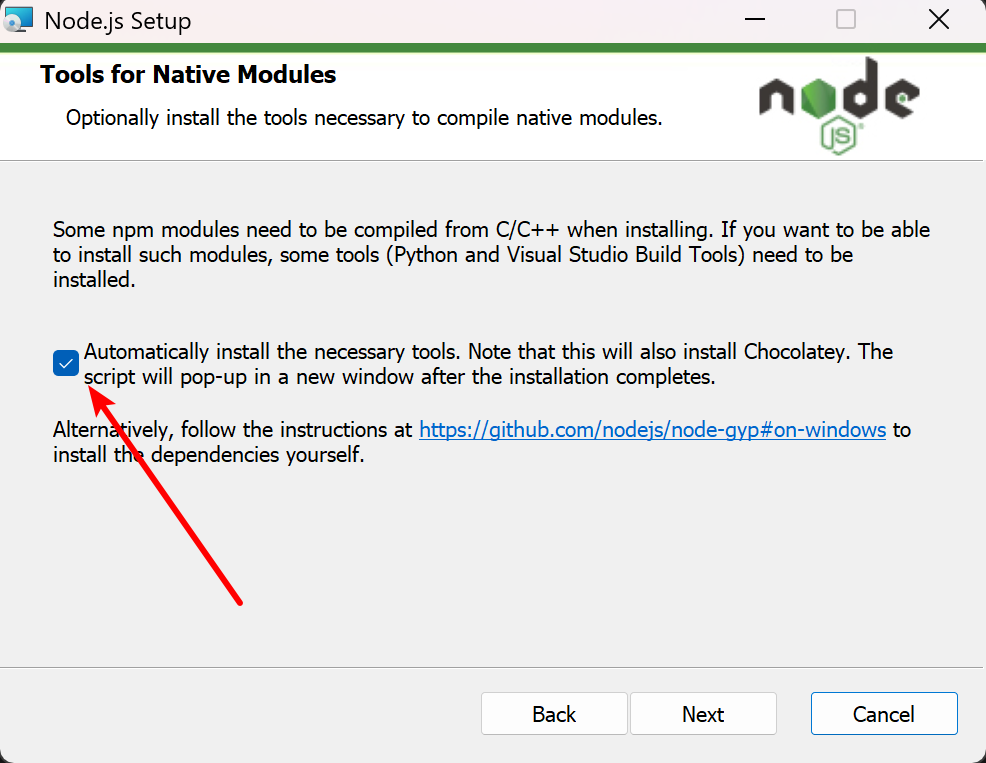

# Vibe Coding

## nodejs

1. 访问: https://nodejs.org/, 下载最新长期支持版v24.14.0;
2. 安装时推荐勾选安装其他依赖, 因为有可能缺少python等其他依赖项;



3. 安装后, 可以通过`node --version`检查当前版本;

* npm镜像源配置:

1. 临时指定镜像源: `npm xxxx --registry=https://registry.npmmirror.com`
2. 永久配置镜像源: `npm config set registry https://registry.npmmirror.com`

## opencode

### 安装

安装: `npm i -g opencode-ai --registry=https://mirrors.aliyun.com/npm/`

### 使用

官方文档: https://opencode.ai/docs/zh-cn/tui/

常用命令:

* `/init`: 创建/更新Agents.md文件, 该文件用于这有助于 opencode 更好地导航您的项目;
* `/models`: 列出以及切换使用的大模型;
* `/connect`: 将提供商添加到 OpenCode。允许您从可用的提供商中选择并添加其 API 密钥;
* `/compact`: 压缩上下文, 在上下文比较大时, 后续大模型分析推理会变慢, 压缩上下文可以提速;
* `/new`: 开始新的会话;
* `/sessions`: 列出会话并在会话之间切换;
* `/undo`: 撤销对话中的最后一条消息。移除最近的用户消息、所有后续响应以及所有文件更改。
    * 在内部，这使用 Git 来管理文件更改。因此您的项目需要是一个 Git 仓库。
* `/redo`: 重做之前撤销的消息。仅在使用 /undo 后可用。
    * 在内部，这使用 Git 来管理文件更改。因此您的项目需要是一个 Git 仓库。
* `/exit`: 退出

## openspec

### 安装

安装: `npm install -g @fission-ai/openspec`

### 使用

openspec目录结构:

```
openspec/
├── specs/        # 系统当前行为的"源真相"("系统现在是什么样的")
│   ├── auth/
│   ├── payments/
│   └── ...
├── changes/      # 每个变更的独立工作目录("我们打算改什么")
│   ├── add-dark-mode/
│   |    ├── specs   #  
│   |    ├── proposal.md
│   |    ├── design.md
│   |    └── tasks.md
│   └── fix-login-bug/
└── config.yaml   # 项目配置
```

对于没有运行过openspec的新项目, 需要先执行`openspec init`, 对当前所在目录的项目进行初始化:

* 初始化会生成`openspec`文件夹用来存储后续的规格文件;
* 初始化时需选择使用的coding工具, 比如`opencode`, 就会在`.opencode`目录中注册openspec相关skills

常用命令:

1. `/opsx:propose xxx`: 告诉AI你的需求, 触发它去写各种规格文件(工件);
2. `/opsx:apply`: 工件准备好了，可以人工检查一下, 没问题, 就让 AI 按 tasks.md 里的清单逐条干活;
3. `/opsx:archive`: 功能实现完了，归档这个变更
    * 把增量的specs合并进 openspec/specs/ 主规格——系统的"行为手册"因此更新
    * 把变更目录整体移到带时间戳的归档目录，留作审计记录
    * 这个变更的生命周期正式结束
4. `/opsx:explore xxx`: 对于有些需求模糊不确定的, 让AI主动探索, 明确需求, 然后再执行上面3步
5. `/opsx:verify`: 扩展指令, 在需求开发完, 未归档之前, 让AI检查一下是否有工作遗漏

> 常用工作流: /opsx:propose → 人工审查 → /opsx:apply → /opsx:verify → /opsx:archive

扩展指令的启用:

1. 执行`openspec config profile`;
2. 选择`Delivery and workflows`;
3. 选择`Both`;
4. `空格`勾选需要开启的命令;