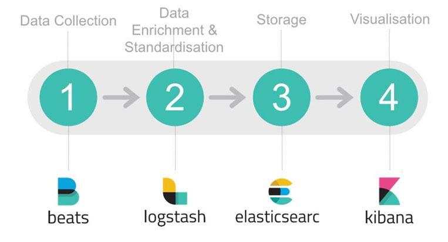

# ElasticSearch调优

> 来源: https://cloud.tencent.com/developer/article/1156231

## 概述

> Elasticsearch（ES）作为NOSQL+搜索引擎的有机结合体，不仅有近实时的查询能力，还具有强大的聚合分析能力。因此在全文检索、日志分析、监控系统、数据分析等领域ES均有广泛应用。而完整的Elastic Stack体系（Elasticsearch、Logstash、Kibana、Beats），更是提供了数据采集、清洗、存储、可视化的整套解决方案。

本文基于ES 5.6.4，从性能和稳定性两方面，从linux参数调优、ES节点配置和ES使用方式三个角度入手，介绍ES调优的基本方案。当然，ES的调优绝不能一概而论，需要根据实际业务场景做适当的取舍和调整，文中的疏漏之处也随时欢迎批评指正。



## 性能调优

**Linux参数调优**

1. 关闭交换分区，防止内存置换降低性能。 将/etc/fstab 文件中包含swap的行注释掉
```
sed -i '/swap/s/^/#/' /etc/fstab
swapoff -a
```

2. 磁盘挂载选项
    * noatime：禁止记录访问时间戳，提高文件系统读写性能
    * data=writeback：不记录data journal(数据日志)，提高文件系统写入性能
    * barrier=0：barrier保证journal先于data刷到磁盘，上面关闭了journal，这里的barrier也就没必要开启了
    * nobh：关闭buffer_head，防止内核打断大块数据的IO操作

```
mount -o noatime,data=writeback,barrier=0,nobh /dev/sda /es_data
```

3. 对于SSD磁盘，采用电梯调度算法，因为SSD提供了更智能的请求调度算法，不需要内核去做多余的调整 (仅供参考)
```
echo noop > /sys/block/sda/queue/scheduler
```

**ES节点配置（conf/elasticsearch.yml）**

1. 适当增大写入buffer和bulk队列长度，提高写入性能和稳定性
```
indices.memory.index_buffer_size: 15%
thread_pool.bulk.queue_size: 1024
```

2. 计算disk使用量时，不考虑正在搬迁的shard
在规模比较大的集群中，可以防止新建shard时扫描所有shard的元数据，提升shard分配速度。
```
cluster.routing.allocation.disk.include_relocations: false
```

**ES使用方式**

1. 控制字段的存储选项

ES底层使用Lucene存储数据，主要包括行存（StoreFiled）、列存（DocValues）和倒排索引（InvertIndex）三部分。大多数使用场景中，没有必要同时存储这三个部分，可以通过下面的参数来做适当调整：
* 控制行存(StoreFiled)，其中占比最大的是\_source字段，它控制doc原始数据的存储。在写入数据时，ES把doc原始数据的整个json结构体当做一个string，存储为\_source字段。查询时，可以通过\_source字段拿到当初写入时的整个json结构体。所以，如果没有取出整个原始json结构体的需求，可以通过下面的命令, 在mapping中关闭\_source字段或者只在\_source中存储部分字段，数据查询时仍可通过ES的docvalue\_fields获取所有字段的值。注意：关闭\_source后， update, update\_by\_query, reindex等接口将无法正常使用，所以有update等需求的index不能关闭\_source
```
# 关闭 _source
PUT my_index 
{
  "mappings": {
    "my_type": {
      "_source": {
        "enabled": false
      }
    }
  }
}

# _source只存储部分字段，通过includes指定要存储的字段或者通过excludes滤除不需要的字段
PUT my_index
{
  "mappings": {
    "_doc": {
      "_source": {
        "includes": [
          "*.count",
          "meta.*"
        ],
        "excludes": [
          "meta.description",
          "meta.other.*"
        ]
      }
    }
  }
}
```
* doc\_values: 控制列存. ES主要使用列存来支持sorting, aggregations和scripts功能, 对于没有上述需求的字段, 可以通过下面的命令关闭doc_values, 降低存储成本

```
PUT my_index
{
  "mappings": {
    "my_type": {
      "properties": {
        "session_id": { 
          "type": "keyword",
          "doc_values": false
        }
      }
    }
  }
}
```

* index: 控制倒排索引。ES默认对于所有字段都开启了倒排索引，用于查询。对于没有查询需求的字段，可以通过下面的命令关闭倒排索引
```
PUT my_index
{
  "mappings": {
    "my_type": {
      "properties": {
        "session_id": { 
          "type": "keyword",
          "index": false
        }
      }
    }
  }
}
```

* \_all：ES的一个特殊的字段，ES把用户写入json的所有字段值拼接成一个字符串后，做分词，然后保存倒排索引，用于支持整个json的全文检索。这种需求适用的场景较少，可以通过下面的命令将\_all字段关闭，节约存储成本和cpu开销。（ES 6.0+以上的版本不再支持\_all字段，不需要设置）
```
PUT /my_index
{
  "mapping": {
    "my_type": {
      "_all": {
        "enabled": false   
      }
    }
  }
}
```
* \_field\_names：该字段用于exists查询，来确认某个doc里面有无一个字段存在。若没有这种需求，可以将其关闭

```
PUT /my_index
{
  "mapping": {
    "my_type": {
      "_field_names": {
        "enabled": false   
      }
    }
  }
}
```

2. 开启最佳压缩
对于打开了上述_source字段的index，可以通过下面的命令来把lucene适用的压缩算法替换成 DEFLATE，提高数据压缩率
```
PUT /my_index/_settings
{
    "index.codec": "best_compression"
}
```

3. bulk批量写入
写入数据时尽量使用下面的bulk接口批量写入，提高写入效率。每个bulk请求的doc数量设定区间推荐为1k~1w，具体可根据业务场景选取一个适当的数量
```
POST _bulk
{ "index" : { "_index" : "test", "_type" : "type1" } }
{ "field1" : "value1" }
{ "index" : { "_index" : "test", "_type" : "type1" } }
{ "field1" : "value2" }
```

4. 调整translog同步策略
默认情况下，translog的持久化策略是，对于每个写入请求都做一次flush，刷新translog数据到磁盘上。这种频繁的磁盘IO操作是严重影响写入性能的，如果可以接受一定概率的数据丢失（这种硬件故障的概率很小），可以通过下面的命令调整 translog 持久化策略为异步周期性执行，并适当调整translog的刷盘周期。
```
PUT my_index
{
  "settings": {
    "index": {
      "translog": {
        "sync_interval": "5s",
        "durability": "async"
      }
    }
  }
}
```

5. 调整refresh_interval
写入Lucene的数据，并不是实时可搜索的ES必, 须通过refresh的过程把内存中的数据转换成Lucene的完整segment后, 才可以被搜索. 默认情况下, ES每一秒会refresh一次, 产生一个新的segment, 这样会导致产生的segment较多, 从而segment merge较为频繁, 系统开销较大. 如果对数据的实时可见性要求较低, 可以通过下面的命令提高refresh的时间间隔, 降低系统开销.

```
PUT my_index
{
  "settings": {
    "index": {
        "refresh_interval" : "30s"
    }
  }
}
```

6. merge并发控制
ES的一个index由多个shard组成, 而一个shard其实就是一个Lucene的index, 它又由多个segment组成, 且Lucene会不断地把一些小的segment合并成一个大的segment, 这个过程被称为merge. 默认值是Math.max(1, Math.min(4, Runtime.getRuntime().availableProcessors() / 2)), 当节点配置的cpu核数较高时, merge占用的资源可能会偏高, 影响集群的性能, 可以通过下面的命令调整某个index的merge过程的并发度:
```
PUT /my_index/_settings
{
    "index.merge.scheduler.max_thread_count": 2
}
```

7. 写入数据不指定_id，让ES自动产生
当用户显示指定\_id写入数据时, ES会先发起查询来确定index中是否已经有相同\_id的doc存在, 若有则先删除原有doc再写入新doc. 这样每次写入时, ES都会耗费一定的资源做查询. 如果用户写入数据时不指定doc, ES则通过内部算法产生一个随机的\_id, 并且保证\_id的唯一性, 这样就可以跳过前面查询\_id的步骤, 提高写入效率.
所以，在不需要通过\_id字段去重、update的使用场景中，写入不指定\_id可以提升写入速率。腾讯云CES技术团队的测试结果显示，无\_id的数据写入性能可能比有\_id的高出近一倍，实际损耗和具体测试场景相关.
```
# 写入时指定_id
POST _bulk
{ "index" : { "_index" : "test", "_type" : "type1", "_id" : "1" } }
{ "field1" : "value1" }

# 写入时不指定_id
POST _bulk
{ "index" : { "_index" : "test", "_type" : "type1" } }
{ "field1" : "value1" }
```

8. 使用routing
对于数据量较大的index, 一般会配置多个shard来分摊压力. 这种场景下, 一个查询会同时搜索所有的shard, 然后再将各个shard的结果合并后, 返回给用户. 对于高并发的小查询场景, 每个分片通常仅抓取极少量数据, 此时查询过程中的调度开销远大于实际读取数据的开销, 且查询速度取决于最慢的一个分片. 开启routing功能后, ES会将routing相同的数据写入到同一个分片中(也可以是多个, 由index.routing\_partition\_size参数控制). 如果查询时指定routing, 那么ES只会查询routing指向的那个分片, 可显著降低调度开销, 提升查询效率.

routing的使用方式如下：
```
# 写入
PUT my_index/my_type/1?routing=user1
{
  "title": "This is a document"
}

# 查询
GET my_index/_search?routing=user1,user2 
{
  "query": {
    "match": {
      "title": "document"
    }
  }
}
```

9. 为string类型的字段选取合适的存储方式

存为text类型的字段（string字段默认类型为text）： 做分词后存储倒排索引，支持全文检索，可以通过下面几个参数优化其存储方式：
* norms：用于在搜索时计算该doc的\_score（代表这条数据与搜索条件的相关度），如果不需要评分，可以将其关闭
* index\_options：控制倒排索引中包括哪些信息(docs、freqs、positions、offsets). 对于不太注重\_score/highlighting的使用场景，可以设为 docs来降低内存/磁盘资源消耗
* fields: 用于添加子字段. 对于有sort和聚合查询需求的场景, 可以添加一个keyword子字段以支持这两种功能

```
PUT my_index
{
  "mappings": {
    "my_type": {
      "properties": {
        "title": { 
          "type": "text",
          "norms": false,
          "index_options": "docs",
          "fields": {
            "raw": { 
              "type":  "keyword"
            }
          }
        }
      }
    }
  }
}
```
* 存为keyword类型的字段: 不做分词, 不支持全文检索. text分词消耗CPU资源, 冗余存储keyword子字段占用存储空间. 如果没有全文索引需求, 只是要通过整个字段做搜索, 可以设置该字段的类型为keyword, 提升写入速率, 降低存储成本. 设置字段类型的方法有两种: 一是创建一个具体的index时, 指定字段的类型; 二是通过创建template, 控制某一类index的字段类型.
```
# 1. 通过mapping指定 tags 字段为keyword类型
PUT my_index
{
  "mappings": {
    "my_type": {
      "properties": {
        "tags": {
          "type":  "keyword"
        }
      }
    }
  }
}

# 2. 通过template，指定my_index*类的index，其所有string字段默认为keyword类型
PUT _template/my_template
{
    "order": 0,
    "template": "my_index*",
    "mappings": {
      "_default_": {
        "dynamic_templates": [
          {
            "strings": {
              "match_mapping_type": "string",
              "mapping": {
                "type": "keyword",
                "ignore_above": 256
              }
            }
          }
        ]
      }
    },
    "aliases": {}
  }
```

10. 查询时，使用query-bool-filter组合取代普通query

默认情况下, ES通过一定的算法计算返回的每条数据与查询语句的相关度, 并通过\_score字段来表征. 但对于非全文索引的使用场景, 用户并不care查询结果与查询条件的相关度, 只是想精确的查找目标数据. 此时, 可以通过query-bool-filter组合来让ES不计算\_score, 并且尽可能的缓存filter的结果集, 供后续包含相同filter的查询使用, 提高查询效率

```
# 普通查询
POST my_index/_search
{
  "query": {
    "term" : { "user" : "Kimchy" } 
  }
}

# query-bool-filter 加速查询
POST my_index/_search
{
  "query": {
    "bool": {
      "filter": {
        "term": { "user": "Kimchy" }
      }
    }
  }
}
```

11. index按日期滚动，便于管理

写入ES的数据最好通过某种方式做分割, 存入不同的index. 常见的做法是将数据按模块/功能分类, 写入不同的index, 然后按照时间去滚动生成index. 这样做的好处是各种数据分开管理不会混淆, 也易于提高查询效率. 同时index按时间滚动, 数据过期时删除整个index, 要比一条条删除数据或delete\_by\_query效率高很多, 因为删除整个index是直接删除底层文件, 而delete\_by\_query是查询-标记-删除

举例说明, 假如有module\_a,module\_b两个模块产生的数据, 那么index规划可以是这样的: 一类index名称是module\_a + {日期}，另一类index名称是module\_b+ {日期}。对于名字中的日期，可以在写入数据时自己指定精确的日期, 也可以通过ES的ingest pipeline中的index-name-processor实现(会有写入性能损耗)

```
# module_a 类index
- 创建index：
PUT module_a@2018_01_01
{
    "settings" : {
        "index" : {
            "number_of_shards" : 3, 
            "number_of_replicas" : 2 
        }
    }
}
PUT module_a@2018_01_02
{
    "settings" : {
        "index" : {
            "number_of_shards" : 3, 
            "number_of_replicas" : 2 
        }
    }
}
...

- 查询数据：
GET module_a@*/_search


#  module_b 类index

- 创建index：
PUT module_b@2018_01_01
{
    "settings" : {
        "index" : {
            "number_of_shards" : 3, 
            "number_of_replicas" : 2 
        }
    }
}
PUT module_b@2018_01_02
{
    "settings" : {
        "index" : {
            "number_of_shards" : 3, 
            "number_of_replicas" : 2 
        }
    }
}
...

- 查询数据：
GET module_b@*/_search
```

12. 按需控制index的分片数和副本数

分片(shard): 一个ES的index由多个shard组成, 每个shard承载index的一部分数据
副本(replica): index也可以设定副本数(number\_of\_replicas), 也就是同一个shard有多少个备份. 对于查询压力较大的index, 可以考虑提高副本数(number\_of\_replicas), 通过多个副本均摊查询压力
shard数量(number\_of\_shards)设置过多或过低都会引发一些问题: shard数量过多, 则批量写入/查询请求被分割为过多的子写入/查询, 导致该index的写入、查询拒绝率上升; 对于数据量较大的index, 当其shard数量过小时, 无法充分利用节点资源, 造成机器资源利用率不高 或 不均衡, 影响写入/查询的效率
对于每个index的shard数量, 可以根据数据总量、写入压力、节点数量等综合考量后设定, 然后根据数据增长状态定期检测下shard数量是否合理. 腾讯云CES技术团队的推荐方案是:
* 对于数据量较小(100GB以下)的index, 往往写入压力查询压力相对较低, 一般设置3~5个shard, number\_of\_replicas设置为1即可(也就是一主一从, 共两副本)
* 对于数据量较大(100GB以上)的index:
    * 一般把单个shard的数据量控制在(20GB~50GB)
    * 让index压力分摊至多个节点: 可通过index.routing.allocation.total\_shards\_per\_node参数, 强制限定一个节点上该index的shard数量, 让shard尽量分配到不同节点上
    * 综合考虑整个index的shard数量, 如果shard数量(不包括副本)超过50个, 就很可能引发拒绝率上升的问题, 此时可考虑把该index拆分为多个独立的index, 分摊数据量, 同时配合routing使用, 降低每个查询需要访问的shard数量

## 稳定性调优

**Linux参数调优**

```
# 修改系统资源限制
# 单用户可以打开的最大文件数量，可以设置为官方推荐的65536或更大些
echo "* - nofile 655360" >>/etc/security/limits.conf
# 单用户内存地址空间
echo "* - as unlimited" >>/etc/security/limits.conf
# 单用户线程数
echo "* - nproc 2056474" >>/etc/security/limits.conf
# 单用户文件大小
echo "* - fsize unlimited" >>/etc/security/limits.conf
# 单用户锁定内存
echo "* - memlock unlimited" >>/etc/security/limits.conf

# 单进程可以使用的最大map内存区域数量
echo "vm.max_map_count = 655300" >>/etc/sysctl.conf

# TCP全连接队列参数设置， 这样设置的目的是防止节点数较多（比如超过100）的ES集群中，节点异常重启时全连接队列在启动瞬间打满，造成节点hang住，整个集群响应迟滞的情况
echo "net.ipv4.tcp_abort_on_overflow = 1" >>/etc/sysctl.conf
echo "net.core.somaxconn = 2048" >>/etc/sysctl.conf

# 降低tcp alive time，防止无效链接占用链接数
echo 300 >/proc/sys/net/ipv4/tcp_keepalive_time
```

**ES节点配置**

1. jvm.options

-Xms和-Xmx设置为相同的值，推荐设置为机器内存的一半左右，剩余一半留给系统cache使用。
* jvm内存建议不要低于2G，否则有可能因为内存不足导致ES无法正常启动或OOM
* jvm建议不要超过32G，否则jvm会禁用内存对象指针压缩技术，造成内存浪费

2. elasticsearch.yml

* 设置内存熔断参数，防止写入或查询压力过高导致OOM，具体数值可根据使用场景调整
```
indices.breaker.total.limit: 30%
indices.breaker.request.limit: 6%
indices.breaker.fielddata.limit: 3%
```
* 调小查询使用的cache，避免cache占用过多的jvm内存，具体数值可根据使用场景调整
```
indices.queries.cache.count: 500
indices.queries.cache.size: 5%
```
* 单机多节点时, 主从shard分配以ip为依据, 分配到不同的机器上, 避免单机挂掉导致数据丢失
```
cluster.routing.allocation.awareness.attributes: ip
node.attr.ip: 1.1.1.1
```

**ES使用方式**

1. 节点数较多的集群，增加专有master，提升集群稳定性

ES集群的元信息管理、index的增删操作、节点的加入剔除等集群管理的任务都是由master节点来负责的，master节点定期将最新的集群状态广播至各个节点。所以，master的稳定性对于集群整体的稳定性是至关重要的。当集群的节点数量较大时（比如超过30个节点），集群的管理工作会变得复杂很多。此时应该创建专有master节点，这些节点只负责集群管理，不存储数据，不承担数据读写压力；其他节点则仅负责数据读写，不负责集群管理的工作。这样把集群管理和数据的写入/查询分离，互不影响，防止因读写压力过大造成集群整体不稳定

将专有master节点和数据节点的分离，需要修改ES的配置文件，然后滚动重启各个节点

```
# 专有master节点的配置文件（conf/elasticsearch.yml）增加如下属性：
node.master: true 
node.data: false 
node.ingest: false 

# 数据节点的配置文件增加如下属性（与上面的属性相反）：
node.master: false 
node.data: true 
node.ingest: true 
```

2. 控制index、shard总数量

上面提到, ES的元信息由master节点管理, 定期同步给各个节点, 也就是每个节点都会存储一份. 这个元信息主要存储在cluster_state中, 如所有node元信息(indices、节点各种统计参数)、所有index/shard的元信息(mapping, location, size)、元数据ingest等.

ES在创建新分片时, 要根据现有的分片分布情况指定分片分配策略, 从而使各个节点上的分片数基本一致, 此过程中就需要深入遍历cluster\_state. 当集群中的index/shard过多时, cluster\_state结构会变得过于复杂, 导致遍历cluster\_state效率低下, 集群响应迟滞. 腾讯云CES技术团队曾经在一个20个节点的集群里, 创建了4w+个shard, 导致新建一个index需要60s+才能完成.

当index/shard数量过多时, 可以考虑从以下几方面改进:
* 降低数据量较小的index的shard数量
* 把一些有关联的index合并成一个index
* 数据按某个维度做拆分, 写入多个集群

3. Segment Memory优化

前面提到，ES底层采用Lucene做存储，而Lucene的一个index又由若干segment组成，每个segment都会建立自己的倒排索引用于数据查询。Lucene为了加速查询，为每个segment的倒排做了一层前缀索引，这个索引在Lucene4.0以后采用的数据结构是FST (Finite State Transducer)。Lucene加载segment的时候将其全量装载到内存中，加快查询速度。这部分内存被称为SegmentMemory，**常驻内存, 占用Heap, 无法被GC**

前面提到，为利用JVM的对象指针压缩技术来节约内存，通常建议JVM内存分配不要超过32G。当集群的数据量过大时，SegmentMemory会吃掉大量的堆内存，而JVM内存空间又有限，此时就需要想办法降低SegmentMemory的使用量了，常用方法有下面几个：
* 定期删除不使用的index
* 对于不常访问的index，可以通过close接口将其关闭，用到时再打开
* 通过force\_merge接口强制合并segment, 降低segment数量

腾讯云CES技术团队在此基础上, 对FST部分进行了优化, 释放高达40%的Segment Memory内存空间