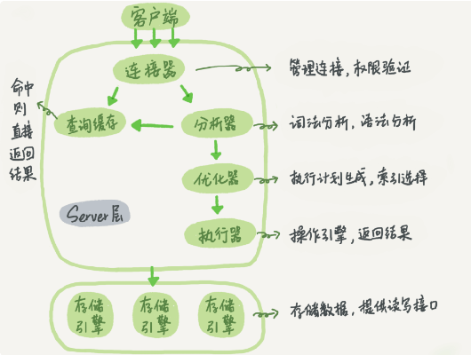

# Mysql学习笔记

## 基础架构



> 图片来源: 极客时间-Mysql实战45讲

一下是Server层的几大模块:

* 连接器: 连接器负责跟客户端建立连接、获取权限、维持和管理连接.
  * 可以通过```show processlist```查看连接.
  * 空闲连接时间如果超过8小时(默认), 会自动断开. 可以通过```wait_timeout```进行设置.
  * 尽量使用长连接
  * 长连接可能导致内存占用过大, 因为mysql执行过程中, 使用的临时内存是存储在连接对象中的. 解决方案有二: 1. 定期断开长连接; 2. 5.7及以上版本, 可以通过执行mysql_reset_connection重新初始化连接资源.
* 查询缓存: 之前执行过的语句及其结果可能会以 key-value 对的形式，被直接缓存在内存中.
  * 查询缓存的key是查询语句
  * 查询缓存的命中率很低
  * 一旦表中有更新操作, 相关缓存会立即失效
  * mysql8.0以上版本移除了查询缓存
* 分析器: 词法分析, 语法分析
* 优化器: 决定使用的索引, 确定整个sql的具体执行流程, 生成执行计划
* 执行器: 按照执行计划, 开始与存储引擎层进行交互, 执行.

> 个人理解: mysql中, 会将schema整体在内存中存储一份, 这样可供分析器, 优化器等全局使用

## 日志系统

* redo log: Innodb存储引擎特有的日志系统, 通过WAL保证数据不丢失
  * WAL(Write-Ahead Logging)预写日志技术. 如果不使用WAL, 每次有新的数据变更, 就需要找到指定的记录, 然后执行更新操作, 这样是随机写的过程, 性能较差. 如果采用WAL, 则会先采用追加写的方式, 将数据变更保存至日志. 然后在合适的时机将数据批量同步到数据库中, 性能较好.
  * redo log默认大小为4G, 可以视作是一个环形, 采用循环写的方式, 如果已经写满, 则将其中一部分数据清除(具体看后面)
  * redo log存储的是物理日志, 记录了每个数据页修改了什么
  * redo log的主要用途是为了加快写入性能, 保证crash-safe. 具体来讲, Innodb在数据写入时, 不会直接落盘, 而是写入内存中的Buffer Pool中, 再定期同步到磁盘中. redo log就是为了保证在内存中的数据尚未同步到磁盘期间, 出现异常也可以恢复.
* binlog: 由执行器负责管理的日志系统, 各种不同的存储引擎共用, 用于归档
  * 逻辑日志, 有两种记录格式: 1. statement - 记录sql; 2. row - 记录行内容(两条: 更新前/更新后)
  * binlog是用来做数据备份和数据恢复的

由于存在两份日志, 分别属于不同的层面, 为了使得两份日志保持一致性, 需要采用两阶段提交:

1. Innodb - 写入redolog, 标记状态为prepare
2. 执行器 - 写入binlog
3. Innodb - 标记状态为commit

数据恢复:

* 数据恢复使用的是binlog, 而不是redolog. 首先, 数据库会有定期的全库备份, 先根据全库备份, 将数据恢复一部分. 然后, 在使用binlog, 将全库备份后又产生的数据恢复. 这个过程是手动进行的, 可以用于应对误删恢复等场景.
* crash-safe: redolog具备crash-safe能力. 假设突然断电, 当mysql重新启动后, innodb会根据redolog把Buffer Pool中没有落盘的数据恢复. 这个过程是系统自动完成的, 使得系统具备了自愈能力. 这种场景下就不能使用binlog了, 因为如果使用binlog, 还需要手动的完成应用全量备份, 应用binlog的过程.

> 对于redolog: ElasticSearch中也有类似的角色, Segment不会立即落盘, 而是驻留在内存中, 于是为了保证数据不丢失, 有transactionLog做担保.

## 事务

事务的隔离级别有:

事务隔离级别|存在的问题
-|-
读未提交|脏读, 不可重复读, 幻读
读已提交|不可重复读, 幻读
可重复读|幻读
串行化|-

* 脏读: 读到其它事务未提交的变更
* 不可重复度: 读到其它事务已经提交的更改
* 幻读: 读到其它事务提交的新记录

mysql默认的隔离级别是可重复读, 可以通过transaction-isolation进行修改.

mysql中通过多版本并发控制(MVCC, Multi-Version Concurrency Control)来实现事务隔离.

这里涉及到一个新的日志: undo log

MySQL中, 实际上每执行一条更新操作, 都会生成一条undo log. 记录上的最新值, 可以通过undo log找到前一个状态的值. 也就是说undo log中记录了数据的多个版本. undo log中如果一条回滚日志之前的所有日志都不再被视图持有的时候, 这些日志就可以删除了. 所以不要有长事务, 长事务会导致一些视图始终存在. 从而导致undo log无法删除.

* 可重复读 - 事务启动时创建一致性视图, 整个事务过程中, 都用这个视图
* 读已提交 - 在每个sql开始执行时创建, 每一条sql执行前都会重新计算出一个视图.

> 读未提交不需要视图, 串行直接加锁

事务MVCC一致性视图创建概述:

1. 每个事务会有一个transaction id, 这个值是严格递增;
2. 每条数据更新时, 都会有一个版本id -- tx_id, 这个tx_id等于生成它的事务的transaction id;
3. 数据的版本不会记录, 而是undo log中会记录从一个版本回退到前一个版本的具体细节; 在undo log中, 相当于存在一条数据的多个不同的版本;
4. 一个事务启动时, 会创建一个属于它的数组, 记录当前活跃的所有事务的transaction id, 这个数组是有序的, 其最小值记为低水位, 最大值记为高水位;
5. 从undo log获取到一条数据的多个tx_id.
   * 如果tx_id小于低水位, 则该版本数据属于已提交的事务, 可见;
   * 如果tx_id大于高水位, 则该版本数据属于视图创建后的事务生成的, 不可见;
   * 如果tx_id在低水位和高水位之间, 则又分为两种情况: 1. tx_id在数组中, 该版本数据由未提交事务生成, 不可见; 2. tx_id不在数组中, 该版本数据由已提交事务生成, 可见;

## 索引

这里只介绍Innodb引擎的索引. Innodb引擎使用B+树来存储数据.

* 主键索引: 主键索引的叶子节点保存了整行的数据记录. 也被称为聚簇索引.
* 非主键索引: 非主键索引的叶子节点保存了主键索引的id, 被称为二级索引.

> 这种将数据直接存储在主键索引下的叶子节点中的方式称为"索引组织表"

添加索引的sql:

```sql
alter table table_name add index index_name(col1(len));
```

B+树存储的优点:

1. B+树是多叉树, 可以有效降低树的高度.
2. 每个数据页存储多个树节点, 可以有效减少访问磁盘的次数.
3. 每个数据页的默认大小为16k.

其他:

* 主键索引优先使用自增主键, 这样, 插入数据的时候, 是在b+数最后进行追加, 性能好. 如果使用uuid等方式, 就会随机插入数据页中, 性能较差. 同时也可能导致插入时页分裂.
* 当一个数据页存储不下数据时, 会触发页分裂. 当存在两个数据页的利用率较低时, 会触发页合并.
* 通过二级索引查询时, 如果想获取到整条记录, 会先根据二级索引找到主键, 然后再根据主键索引查询到整条数据, 这个过程称为回表.

回表会导致查询两棵索引树, 性能会有消耗, 如何避免回表:

* 覆盖索引: 如果一个二级索引上记录的信息, 就是查询想要的全部信息, 那就不需要回表, 这称为覆盖索引.
  * 最左匹配原则: 覆盖索引必须满足最左匹配原则, 否则就不会走索引
* 索引下推: 在5.6开始, 推出的一项优化措施. 如果查询条件是多个时, 通过二级索引查询到主键, 当需要回表时, 会向校验这个索引中的其他数据是否与查询条件匹配, 如果不匹配, 则该条记录不会回表. 这样就减少了回表的数据记录条数.

#### 索引优化

* 选错索引
  * 通过```analyze table 表名```命令, 更新索引统计信息, 避免一些统计信息不准确导致选错索引的问题
  * 通过```force index(索引名)```指示强行使用某个索引
  * 删掉某些不必要的索引, 从而避免选错索引
* 使用前缀索引
  * 通过使用前缀索引可以减少空间使用, 增加每个数据页存储的索引个数
  * 前缀索引会导致无法使用覆盖索引

## 锁

#### 全局锁

命令: ```flush tables with read lock```, 执行该命令后, 其他线程的数据更新语句, 数据定义语句, 更新类的事务提交语句都会被阻塞.

应用场景:

* 全库逻辑备份: 全库逻辑备份过程中, 数据处于只读状态. 保证数据的逻辑时间点一致.

全局锁是在Mysql的Server层执行的, 这样不管底层数据库执行引擎是什么, 都能使用这个工具. 但是, 全局锁导致整个数据库都处于只读状态, 大部分时候, 这显然是不可接受的. 对于Innodb引擎来说, 可以通过MVCC在事务中取得一个一致性视图, 保证数据的逻辑时间点一致.

全局锁还有一个特点: 加锁的这个会话中, 如果客户端意外断开, 数据库会自动释放全局锁.

#### 表级锁

表级别的锁分为两种:

1. 表锁
2. 元数据锁

对于表锁:

语法: ```lock tables ... read/write```

* 表锁在会话意外中断时, 也可以主动释放锁.
* 表锁不仅限制其他线程的读写, 也会限制自身线程. 如果一个线程获取到一张表的读锁, 那么只能对该表进行读操作, 不能对该表进行写操作.

对于元数据锁(MDL, meta data lock):

元数据锁不需要显示调用:

* 当对一个表进行增删改查时, 自动加MDL读锁
* 当对一个表结构进行变更时, 自动加MDL写锁

> 读锁之间不互斥, 因此可以有多个线程对同一张表进行增删改查; 写锁是排它锁, 只允许一个线程执行

MDL会遇到一种情况, 是: 获取写锁后, 由于有读锁存在, 导致自身阻塞, 而这时实际上已经获取到了写锁, 进而导致新的获取读锁的线程阻塞, 最终可能引发大量线程阻塞.

#### 行锁

两阶段锁协议: Innodb中行锁在需要的时候加上, 在事务结束时释放.

当两个事务互相等待对方资源释放时, 就会出现死锁. mysql内置死锁处理措施有二:

1. 超时 - ```innodb_lock_wait_timeout```, 默认50s
2. 死锁检测 - ```innodb_deadlock_detect```, 默认on; 死锁检测在并发线程数较多时, 性能会较低.

为避免死锁, 应该在一个事务中, 把最可能造成锁冲突, 最可能影响并发度的锁尽量往后放.

#### 事务与锁--当前读

当前读: 更新数据都是先读后写, 而这个读, 只能读当前的值.

当前读的时候, 完全依赖锁, 而无视事务的隔离性了.

只要加锁, 就会触发当前读, 下面这三条都会使用当前读.

```sql
update t set k = k + 1 where id = 1;
select k from t where id=1 lock in share mode;
select k from t where id=1 for update;
```

#### 间隙锁与next-key lock

innodb在可重复读级别下, 为了防止当前读时出现幻读, 会使用间隙锁(gap lock). 间隙锁是指在已存在的数据行之间添加的锁. 间隙锁的作用是: 阻塞向这个间隙中插入一个记录这个操作.

next-key lock是间隙锁和行锁的组合. 

间隙锁是开区间范围上的锁, next-key lock是前开后闭区间上的锁.

间隙锁可能会导致锁住的范围过大, 降低了系统的并发度. 在经过评估可行的情况下, 可以选择调整为读已提交.

为什么间隙锁只出现在可重复度级别? 因为可重复度需要保证从事务开始到事务结束都是一致性视图, 如果出现幻读, 就会导致一致性视图存在问题. 而如果级别是读已提交, 不需要事务开始到结束都是一致性视图, 是允许幻读出现的.

> 可重复读级别下, select语句并不是一定会加间隙锁的. 而是select ... for update等需要当前读的情况下才需要间隙锁.

加锁规则:

1. 基本单位是next-key lock
2. 查找过程中访问到的对象才会加锁
3. 索引上的等值查询, 给唯一索引加锁时, next-key lock退化为行锁
4. 索引上的等值查询, 向右遍历, 最后一个值不满足等值条件时, next-key lock退化为间隙锁
5. 唯一索引上的范围查询, 会访问到不满足条件的第一个值为止

## Innodb写入流程

以下这些概念都是Innodb的:

* Buffer Pool
  * 用于存储运行期间, 加载到内存中的数据页
  * 在更新一条记录时, 如果数据页已经加载到Buffer Pool中, 则直接更新Buffer Pool中的数据页
  * 更新后的数据页如果没有同步到磁盘中, 则称为脏页
* Change Buffer
  * Buffer Pool中的一块特殊区域, 不用来存储数据页, 而是用来存储数据变更动作(类似于redo log)
  * 在更新一条记录时, 如果数据页没有加载到Buffer Pool中, 则直接将这个变更动作存储到Change Buffer, 免去了从磁盘读取数据页的操作
  * Change Buffer也会单独被持久化到磁盘上
  * innodb_change_buffer_max_size, 用来控制change buffer在buffer pool中的占比
* Merge
  * 将Change Buffer中的变更记录应用到数据页的过程称为Merge
  * 一旦由于查询等操作, 导致数据页被加载到内存, 就会触发Merge操作
  * 系统会定期执行Merge操作
  * 数据库正常关闭时, 会执行merge操作
* Redo log
  * redo log用来对Buffer Pool中的脏页和Change Buffer做crash-safe担保, 一旦发生异常, 导致脏页和ChangeBuffer丢失, 可以通过redo log恢复
* Flush
  * 将内存中的脏页同步至磁盘的过程称为Flush
  * Flush触发时机:
    * 当redo log写满了, 清除一部分redolog时
      * 此时触发flush, 会使得系统不再接受更新操作, 所有更新都会阻塞
    * 当Buffer Pool快满的时候, ```innodb_max_dirty_pages_pct```控制脏页比例上限
    * 当mysql比较空闲时
    * mysql正常关闭时
  * 通过```innodb_io_capacity```参数, 告诉mysql当前磁盘的io读写能力, 使得其可以参照该能力去进行flush. 一般这个值可以设置成磁盘的IOPS
  * flush过程中, 不需要redo log同步变更, redo log重放的过程值, 可以识别出来哪些数据页是刷过的.
  * 当刷新脏页时, 连续的多个脏页都会被flush. 对于机械硬盘, 这是有好处的, 但是对于固态硬盘, 这样就没有必要了, 可以通过```innodb_flush_neighbors```控制, 当该值为0时, 则只刷新自己

> 在读多写少的一些场景中, 由于数据页会频繁的被加载至内存中, 所以没有必要使用ChangeBuffer, 反而增加了ChangeBuffer维护成本
> 在对唯一索引字段上的数据进行修改时, 不会使用到change buffer, 这是因为需要先将数据页加载到Buffer Pool用以验证唯一性约束是否满足.

## 排序

排序主体流程:

1. 将符合条件的记录加载至sort buffer, sort buffer是线程私有的, ```sort_buffer_size```控制这块内存区域的大小;
2. 如果加载的记录占用空间超出sort buffer, 则需要转至文件中, 使用磁盘的临时辅助文件进行排序;
3. 如果使用磁盘进行辅助排序, 排序过程是将数据拆分成多个辅助文件, 每一次将一个辅助文件加载至内存进行排序; 最后再把排序后的文件多个文件整体归并.

上面这个排序过程为: **filesort** 即使不需要转至磁盘, 也叫filesort.

此外, 排序有分为两种:

1. 全字段排序 - 加载到sort buffer的是需要返回给客户端的全部字段;
2. rowid排序 - 加载到sort buffer的数据只有主键id和参与排序的字段, 在排序完成之后, 需要回表将其他需要的字段补充完整.

> 通过配置```max_length_for_sort_data```, 可以控制使用哪种排序方式, 如果单行数据尺寸超出这个值, 就被视为单行太大, 从而使用rowid.

如果排序字段上存在索引, 则不需要上面的排序了, 因为这时的数据本身就是有序的.

## 其他

* 数据库中删除一条记录, 只是将数据页中该记录的空间标记为可复用. 这样久而久之产生很多"空洞";
* innodb引擎中, 处于MVCC考虑, ```count(*)```会进行全表扫描;
* 查询条件, 对索引字段做函数操作, 会破坏索引值的有序性, 因此优化器会放弃走索引树;
* mysql中, 如果字符串和数字进行比较, 会将字符串转为数字;

#### 查询慢的一些场景

* MDL导致, 通过```show processlist```查看线程状态;
* 行锁导致, 一个查询使用的当前读, 遇到另一个线程持有行锁. 通过```select * from sys.innodb_lock_waits where locked_table = 'test.t'```找到持有锁的线程
* 一致性读的情况下, 有可能一条数据的活跃版本太多, 导致通过undo log回溯的链条太长, 导致查询慢

#### 表空间

* 系统表空间: 用于存放系统信息, 对应磁盘文件```ibdata1```
* 数据表空间: 用于存放用户数据, 对应磁盘文件```表名.ibd```

## Reference

* 极客时间-MySQL实战45讲