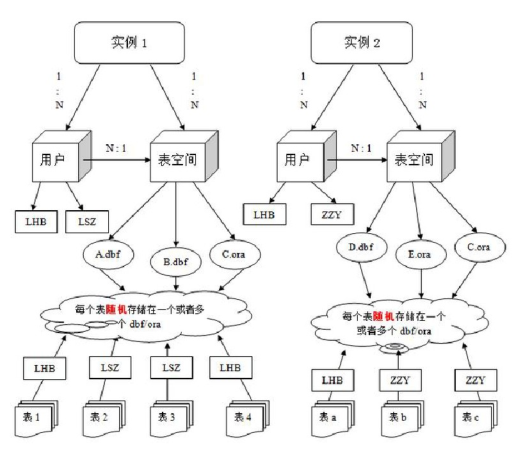

# 基础介绍
------------------------------

## Oracle数据库体系结构

* 数据库
* 实例: 一个oracle实例有一系列后台进程和内存结构组成, 一个数据库可以用n个实例.
* 数据文件: 数据文件是数据库的物理存储单位, 数据库的数据快开始存储在表空间中的, 真正是在某一个或者多个数据文件中, 而一个表空间可以有一个或者多个数据文件组成, 一个数据文件只能属于一个表空间. 一旦数据文件被加到某个表空间后, 就不能删除这个文件, 如果要删除某个数据文件, 只能删除其所属的表空间才行.
* 表空间:表空间是Oracle对象数据库上相关数据文件的逻辑映射, 一个数据库在逻辑上被划分为一道若干个表空间, 每一个表空间保存了在逻辑上相关联的一组结构.每个数据库至少有一个表空间(称之为system表空间), 每一个表空间有统一磁盘上的一个或者多个文件组成, 这些文件叫做数据文件. 一个数据文件只能属于一个表空间.
* 用户:用户是在实例下建立的. 不同实例中可以建立相同的名字的用户. 表的数据是由用户放入某个表空间的, 而这个表空间会随机吧这些表数据放入到一个或者多个数据文件中.

> oracle的数据库不是普通的概念, oracle是有用户和表空间对数据进行管理和存放的. 但是表不是由表空间区查询的, 而是由用户去查询的. 因为不同用户可以在同一个表空间用相同名字的表. 这里区分就是用户了.



## oracle内置用户

用户:scott	密码:tiger(默认)
用户:hr		密码:hr(默认)

```
-------------解锁用户 ---------------
alter user scott account unlock;
------------修改密码--------------
alter user scott identified by tiger;
```

scott用户内的表:
----dept     部门 表
---deptno  部门编号
---dname   部门名称
---loc     部门城市

## 查询

### 基本查询

基本与mysql的sql语句相同, 下面说些不同的或者添加的:

* 下面语句那条执行的更快?
```
select * from emp;
select empno, ename, job from emp;
```
答: 基本差不多, oracle查询方式是先将符合条件的记录查出来, 在从中摘取想要显示的列返回. 


* 下面那条语句执行的更快?
```
select count(*) from emp;
select count(1) from emp;
select count(9999) from emp;
select count(ename) from emp;
```
答: 前三个一样快, 最后一个稍微慢一点. oracle聚合查询过程是这样的, 首先看conut()中的参数是不是表中有的字段, 如果是, 就按这个字段进行聚合, 如果没有就按主键或者记录条数进行聚合.

* 模糊查询的转义
select * from emp e where e.ename like '%a_%'  escape 'a';
如上, 如果想要将下划线作为一个字符, 需要转义, 这就需要使用escape来进行, 'a'是一个随意的字符.

* 在oracle中, 如果使用group by ，select 后只能出现 聚合函数 或者 group by 列:
select count(*), deptno from emp group by deptno;	-- 正确
select count(*), deptno, ename from emp group by deptno;	-- 错误


* 一个常用的单行函数:
nvl(arg1, arg2)	//表示如果arg1是null, 则用arg2的值替代

> 查看一个用户下所有的表: select table_name from user_tables;

> null不能进行大小等于比较

* 字符串连接
有两种连接方法:
1. 用单行函数concat(,) -- select concat('hello', 'world') from dual; --结果helloworld
2. 使用"||"符号 -- select 'hello'||'world'||'!' from dual; --结果HelloWorld!

* 排序中空值的问题
排序时有可能遇到依据的字段有null的情况, 这时默认会对将null当作类似无穷大的值.
这时可以通过加nulls first或者nulls last
select * from emp order by comm desc nulls last;
select * from emp order by comm desc nulls first;

* 条件表达式
case 带判断的值 
when 值 then 表达式
when 值 then 表达式
when 值 then 表达式
else 表达式
end

相当于java中的:
swith(判断){
	case 值: 表达式;
	case 值: 表达式;
	default: 表达式
}

### 常用函数

#### 单行函数

* 字符函数
	* concat(str1, str2)	连接字符串
	* length(str)	计算字符串的长度
	* replace(str, str1, str2)	将str中的str1替换为str2
	* lower(str)	将str全部转换为小写
	* upper(str)	将str全部转换为大写

* 数值函数
	* round(num, len)	将num保留len位小数四舍五入, len可选,不写相当于了len=0
	* trunc(num, len)	将num按len截断, len可选, 同上
	* mod(num1, num2)	取模

* 日期函数
	* months_between(date1, date2)	计算两个日期之间的月份间隔
	* add_months(date1, mon)	计算mon个月后的日期

> 两个日期相减返回值为天数
> 获取当前日期:sysdate

* 转换函数
	* to_char()
		* 对日期进行转换:to_char(date, 'format_model');
		* 对数字进行转换:to_char(number, 'format_model')
	* to_number(str, 'format_model')	将字符串转换为数字
	* to_date(str, 'format_model')		将字符串转换为日期

* 通用函数
	* nvl(arg1, arg2)	空值处理

### 多行函数

就是聚合函数: avg() count() max() min() sum()


### 多表查询

* 内连接: 隐式, 显式
* 外连接: 左外连接, 右外连接

新概念 -- 全量表:
在进行外连接时首先要明确全量表, 然后把全量表作为左外连接的左表 或者 右外连接的右表.
全量表的特点: 全量表的中记录在生成的结果中不会丢失!(但是有可能会增加, 如果一个全量表中一条记录对应连接的另一侧的两条记录, 那么, 全量表中的一条记录会复制出一条, 这样两条记录分别对应另一个表两条记录)

> 全量表选择错误会导致奇怪的结果
> 大部分时候内连接与外连接使用哪个都可以, 但是如果全量表与另一个表连接时, 如果另一个表不存在满足条件的对应项, 那么内连接会丢失全量表中的这条记录, 而外连接不会.
> 左外连接和有外连接没有区别, 只不过有时候, 在一条复杂的SQL语句上再连接其它表的时候, 有时候会区别选择.

### 子查询

子查询的结果可以分为下面几种情况:
1. 一行一列 --> 一个单值
2. 一行多列 --> 一条记录, 可以取出其中一个单值
3. 多行一列 --> 一般将查询结果作为一个表, 再进行查询, 有时候会作为in的条件或者一个集合
4. 多行多列 --> 一般将查询结果作为一个表, 再进行查询, 有时候会作为一个集合

一行多列的一个特殊操作:
查询出和scott同部门并且同职位的员工:
select * from emp e where ( e.deptno ,e.job ) = (select deptno,job from emp  where ename='SCOTT');

### 分页

oracle不支持limit关键字, 所以需要使用伪列rownum来实现相同效果.rownum作用是自上而下生成表中数据的行号, 从1开始.
关于rownum要注意两点:

1. rownum是一个关键字
2. rownum不支持大于比较, 支持小于比较和等于比较

> rownum从1开始

下面通过rownum实现分页效果(查询员工表中的前三个):
select * from emp where rownum < 4;
查询员工表中4-6员工:
select * from (select emp.*, rownum n from emp) a where a.n > 3 and a.n < 7;
为什么查询员工表中4-6行的员工不能这么写?
select * from emp where rownum < 7 and rownum > 3;
因为rownum不支持大于比较.

> oracle分页另一种方式:select * from (select row_number)

举例:
```sql
查询员工表中工资最高的前三名:
select * from (select * from emp order by sal desc) where rownum < 4;
查询员工表中工资4-6名的员工:
select * from (select a.*, rownum n from (select * from emp order by sal desc) a) b where b.n > 3 and b.n < 7;
对于这个例子, 还有一种分页方式:
select * from (select row_number() over (order by sal desc) rm ,e.* from emp e) t where t.rm < 7 and t.rm > 3;
```

不同数据库的分页操作是不同的:
mysql:limit
oracle:rownum
sqlServer:top

> oracle中成rownum为伪列, 同样的伪列还有rowid

### 其它

* 行转列

举例:
```sql
select sum(a.z), 
sum(case a.y when '1980' then a.z end) "1980", 
sum(case a.y when '1981' then a.z end) "1981", 
sum(case a.y when '1982' then a.z end) "1982",
sum(case a.y when '1987' then a.z end) "1987"
from (select count(*) z, to_char(hiredate, 'yyyy') y from emp group by to_char(hiredate, 'yyyy')) a;
```

* exists  
用法一:判断exists后面的语句是否为真 --> sql查询语句为空返回false, 有值返回true  
	select * from emp  where exists (select * from dept where deptno=1);  
用法二:判断一张表中是否包含另一张表中外键的记录.  
	select d.* from dept d where exists (select e.* from emp e where d.deptno=e.deptno);  
	等价于: select * from dept d where d.deptno in (select distinct e.deptno from emp e);  
> ----左表大 （数据量多） 右表小 （数据量少） 的时候  in效率高
> ----左表小 （数据量少） 右表大 （数据量多） 的时候  exists效率高


## 集合运算

并集:union和union all
交集:intersect
差集:minus

以上将两次查询的结果作为集合进行运算.
union与union all的区别, union all是直接将两个查询结果合并到一起, union是去重重复记录之后合并.
