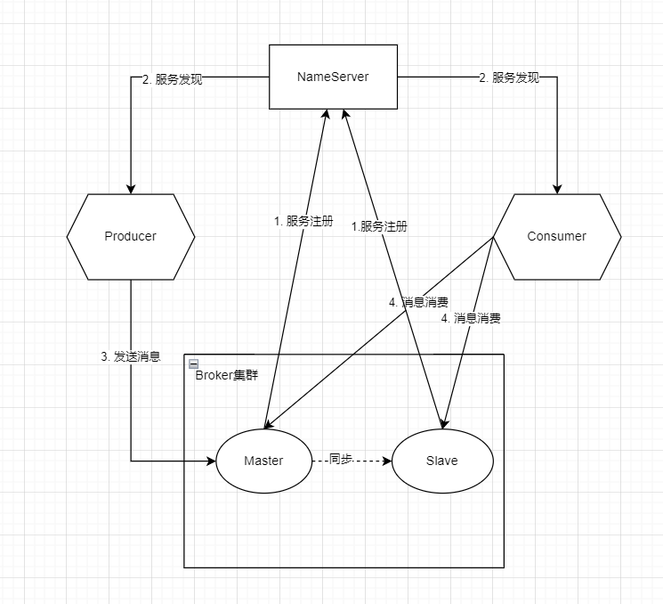

# RocketMQ

## Overview

RocketMQ是有阿里巴巴开发的, 作为一款纯java、分布式、队列模型的开源消息中间件，支持事务消息、顺序消息、批量消息、定时消息、消息回溯等。

**特点**:

1. 支持发布/订阅和点对点消息模型
2. 在一个队列中, 可靠的先进先出(FIFO)和严格的顺序传递
3. 支持拉(pull)和推(push)两种消息模式
   * pull - 消费者主动从MQ中去拉消息;
   * push - MQ的消息主动推送给消费者;(Rocket的push底层依旧是pull, 由消费者进程中的一个后台进程使用长轮询持续进行pull, 一旦发现消息, 唤醒消费者线程去处理消息)
4. 单一队列百万消息的堆积能力
5. 支持多种消息协议，如 JMS、MQTT 等
6. 分布式高可用的部署架构,满足至少一次消息传递语义
7. 提供 docker 镜像用于隔离测试和云集群部署
8. 提供配置、指标和监控等功能丰富的 Dashboard

**核心组件**:

* **NameServer**: 服务注册中心, RocketMQ 需要先启动 NameServer 再启动 Rocket 中的 Broker.
  * 用来保存 Broker 相关元信息并给 Producer 和 Consumer 查找Broker 信息
  * NameServer被设计成几乎无状态的, 可以横向扩展, 节点之间相互之间无通信, 通过部署多台机器来标记自己是一个伪集群
  * 每个 Broker 在启动的时候会到 NameServer 注册
  * Producer 在发送消息前会根据 Topic 到NameServer 获取到 Broker 的路由信息，进而和Broker取得连接
  * Consumer 也会定时获取 Topic 的路由信息

> 所以从功能上看应该是和 ZooKeeper 差不多，据说 RocketMQ 的早期版本确实是使用的ZooKeeper ，后来改为了自己实现NameServer. Name Server和ZooKeeper的作用大致是相同的，从宏观上来看，Name Server做的东西很少，就是保存一些运行数据，Name Server之间不互连，这就需要broker端连接所有的Name Server，运行数据的改动要发送到每一个Name Server来保证运行数据的一致性（这个一致性确实有点弱），这样就变成了Name Server很轻量级，但是broker端就要做更多的东西了.

* **Broker**: 消息存储中心，主要作用是接收来自 Producer 的消息并存储，Consumer 从这里取得消息。它还存储与消息相关的元数据，包括用户组、消费进度偏移量、队列信息等。Broker 有 Master 和 Slave 两种类型，Master 既可以写又可以读，Slave不可以写只可以读。
  * Broker部署相对复杂，Broker分为Master与Slave，一个Master可以对应多个Slave，但是一个Slave只能对应一个Master，Master与Slave的对应关系通过指定相同的Broker Name，不同的BrokerId来定义，BrokerId为0表Master，非0表示Slave。Master也可以部署多个。
* **Producer**: 消息发布者，负责生产并发送消息至 Topic
  * 生产者向brokers发送由业务应用程序系统生成的消息。RocketMQ提供了发送：同步、异步和单向（one-way）的多种范例。
  * 同步发送: 消息发送方发出数据后会在收到接收方发回响应之后才发下一个数据包。一般用于重要通知消息，例如重要通知邮件、营销短信。
  * 异步发送: 发送方发出数据后，不等接收方发回响应，接着发送下个数据包，一般用于可能链路耗时较长而对响应时间敏感的业务场景，例如用户视频上传后通知启动转码服务。假如过一段时间检测到某个信息发送失败，可以选择重新发送。
  * 单向发送: 只负责发送消息而不等待服务器回应且没有回调函数触发，适用于某些耗时非常短但对可靠性要求并不高的场景，例如日志收集。
* **Consumer**: 消息订阅者，负责从 Topic 接收并消费消息, 消费者从brokers那里拉取信息并将其输入应用程序

**Producer Group和Consumer Group**

* Producer Group: 一类 Producer 的集合，这类 Producer 通常发送一类消息并且发送逻辑一致，所以将这些 Producer 分组在一起。从部署结构上看生产者通过 Producer Group 的名字来标记自己是一个集群。
* Consumer Group: 一类 Consumer 的集合，这类 Consumer 通常消费同一类消息并且消费逻辑一致，所以将这些 Consumer 分组在一起。消费者组与生产者组类似，都是将相同角色的分组在一起并命名。
* Producer Group和Consumer Group之间没有任何关系
* 同一条消息，只能被某一消费组其中的一台机器消费，但是可以同时被不同的消费组消费。(和Kafka类似)

**架构图**



1. NameServer 先启动
2. Broker 启动时向 NameServer 注册
3. 生产者在发送某个主题的消息之前先从 NamerServer 获取 Broker 服务器地址列表（有可能是集群），然后根据负载均衡算法从列表中选择一台Broker 进行消息发送
4. NameServer 与每台 Broker 服务器保持长连接，并间隔 30S 检测 Broker 是否存活，如果检测到Broker 宕机（使用心跳机制, 如果检测超120S），则从路由注册表中将其移除
5. 消费者在订阅某个主题的消息之前从 NamerServer 获取 Broker 服务器地址列表（有可能是集群）, 但是消费者选择从 Broker 中 订阅消息，订阅规则由 Broker 配置决定

**名词解释**

* 消息(Message): 一条消息必须有一个主题（Topic），主题可以看做是你的信件要邮寄的地址。一条消息也可以拥有一个可选的标签（Tag）和额处的键值对，它们可以用于设置一个业务key并在Broker上查找此消息以便在开发期间查找问题。
* 主题(Topic): 主题（Topic）可以看做消息的规类，它是消息的第一级类型。比如一个电商系统可以分为：交易消息、物流消息等，一条消息必须有一个Topic。Topic 与生产者和消费者的关系非常松散，一个 Topic可以有0个、1个、多个生产者向其发送消息，一个生产者也可以同时向不同的 Topic 发送消息。一个Topic 也可以被 0个、1个、多个消费者订阅。
* 标签(Tag): 可以看作子主题，它是消息的第二级类型，用于为用户提供额外的灵活性。使用标签，同一业务模块不同目的的消息就可以用相同 Topic 而不同的 Tag 来标识。
* 消息消费模式: 集群消费（Clustering）和广播消费（Broadcasting）
* 消息顺序: 顺序消费（Orderly）和并行消费（Concurrently）

## 实践

**代码示例**

这里采用java:

maven依赖:

```xml
<dependencies>
        <dependency>
            <groupId>org.apache.rocketmq</groupId>
            <artifactId>rocketmq-client</artifactId>
            <version>4.5.2</version>
        </dependency>
</dependencies>
```

生产者:

```java
import org.apache.rocketmq.client.producer.DefaultMQProducer;
import org.apache.rocketmq.client.producer.SendResult;
import org.apache.rocketmq.common.message.Message;
import org.slf4j.Logger;
import org.slf4j.LoggerFactory;
import org.springframework.beans.factory.annotation.Value;
import org.springframework.stereotype.Component;

import javax.annotation.PostConstruct;
import javax.annotation.PreDestroy;
import java.nio.charset.StandardCharsets;
import java.util.Collections;

@Component
public class DemoProducer {

    private static final Logger logger = LoggerFactory.getLogger(DemoProducer.class);

    @Value("${datasync.mq.producer.group:group1}")
    private String group;

    @Value("${datasync.mq.namesrv:127.0.0.1:9876}")
    private String nameSrvAddr;

    @Value("${datasync.mq.producer.topic:aaa}")
    private String topic;

    @Value("${datasync.mq.producer.tag:*}")
    private String tag;

    private DefaultMQProducer producer;

    @PostConstruct
    public void init(){
        try{
            producer = new DefaultMQProducer(group);
            producer.setNamesrvAddr(nameSrvAddr);
            producer.start();
        }catch (Exception e){
            logger.error("producer init failed. msg : {}", e.getMessage(), e);
        }
    }

    public void send(String messageKey, String message){
        try{
            Message msg = new Message(topic, message.getBytes(StandardCharsets.UTF_8));
            msg.setKeys(Collections.singletonList(messageKey));
            SendResult result = producer.send(msg, 10000);
            logger.info("send result : {}", result);
        }catch (Exception e){
            logger.error("send message failed, msg : {}", e.getMessage(), e);
        }
    }

    @PreDestroy
    public void destroy(){
        producer.shutdown();
    }
}
```

消费者:

```java
import org.apache.rocketmq.client.consumer.DefaultMQPushConsumer;
import org.apache.rocketmq.client.consumer.listener.ConsumeConcurrentlyContext;
import org.apache.rocketmq.client.consumer.listener.ConsumeConcurrentlyStatus;
import org.apache.rocketmq.client.consumer.listener.MessageListenerConcurrently;
import org.apache.rocketmq.common.message.MessageExt;
import org.slf4j.Logger;
import org.slf4j.LoggerFactory;
import org.springframework.beans.factory.annotation.Value;
import org.springframework.stereotype.Component;

import javax.annotation.PostConstruct;
import javax.annotation.PreDestroy;
import java.util.List;

@Component
public class DemoConsumer {

    private static final Logger logger = LoggerFactory.getLogger(DemoConsumer.class);

    @Value("${datasync.mq.consumer.group:default_consumer_group}")
    private String group;

    @Value("${datasync.mq.namesrv:127.0.0.1:9876}")
    private String nameSrvAddr;

    @Value("${datasync.mq.consumer.topic:aaa}")
    private String topic;

    @Value("${datasync.mq.consumer.tag:*}")
    private String tag;

    private DefaultMQPushConsumer consumer;

    @PostConstruct
    public void init(){
        try{
            consumer = new DefaultMQPushConsumer(group);
            consumer.subscribe(topic, tag);
            consumer.registerMessageListener(new MessageListenerConcurrently() {
                @Override
                public ConsumeConcurrentlyStatus consumeMessage(List<MessageExt> list, ConsumeConcurrentlyContext consumeConcurrentlyContext) {
                    for (MessageExt messageExt : list) {
                        logger.info("receive msg : {}", new String(messageExt.getBody()));
                    }
                    return ConsumeConcurrentlyStatus.CONSUME_SUCCESS;
                }
            });
            consumer.start();
        }catch (Exception e){
            logger.error("consumer init failed. msg : {}", e.getMessage(), e);
        }
    }


    @PreDestroy
    public void destroy(){
        consumer.shutdown();
    }

}
```

**场景**

* 广播模式, 需要消费者端, 设置:

```java
//设置消费者的消费模式为广播模式：所有客户端接收的消息都是一样的
consumer.setMessageModel(MessageModel.BROADCASTING);
```

* 保证消息消费顺序: 消息生产者发送消息时, 同一组消息指定发送到一个消息队列; 消费端采用单个消费者, 单线程的去处理消息.

## 消息重试与死信队列

当消息消费后未正常返回消费成功的信息将启动消息重试机制.

1. 顺序消息重试: 当消费者消费消息失败后，RocketMQ会自动进行消息重试（每次间隔时间为 1 秒）
   * 注意：应用会出现消息消费被阻塞的情况，因此，要对顺序消息的消费情况进行监控，避免阻塞现象的发生
2. 无序消息重试: 
   * 无序消息包括普通消息、定时消息、延时消息、事务消息
   * 无序消息重试仅适用于负载均衡（集群）模型下的消息消费，不适用于广播模式下的消息消费
   * 为保障无序消息的消费，MQ设定了合理的消息重试间隔时长
   * 无序消息未被消费，到达了重试总次数以后，这种消息会被重新标记叫做死信

**死信队列**

当消息消费重试到达了指定次数（默认16次）后，MQ将无法被正常消费的消息称为死信消息（Dead-Letter Message）. 死信消息不会被直接抛弃，而是保存到了一个全新的队列中，该队列称为死信队列（Dead-Letter Queue）

特点:

1. 归属某一个组（Gourp Id），而不归属Topic，也不归属消费者
2. 一个死信队列中可以包含同一个组下的多个Topic中的死信消息
3. 死信队列不会进行默认初始化，当第一个死信出现后，此队列首次初始化
4. 死信队列中的消息不会被再次重复消费
5. 死信队列中的消息有效期为3天，达到时限后将被清除

在监控平台中，通过查找死信，获取死信的messageId，然后通过id对死信进行精准消费

## Reference

* [RocketMQ 介绍及基本概念](https://blog.csdn.net/qq_21040559/article/details/122703715)
* [Java之RocketMQ详解](https://blog.csdn.net/zhangzengxiu/article/details/118980778)

