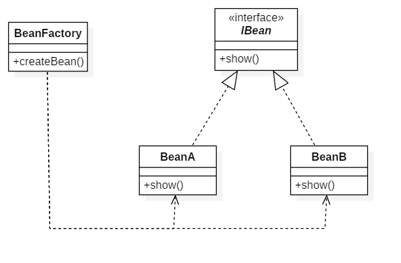

# 简单工厂, 工厂方法, 抽象工厂

## 2.1 简单工厂



具体代码如下:

```java
public interface IBean {
    void show();
}
public class BeanA implements IBean{
    @Override
    public void show() {
        System.out.println("beanA");
    }
}
public class BeanB implements IBean {
    @Override
    public void show() {
        System.out.println("beanB");
    }
}
```

工厂类的代码如下:

```java
public class BeanFactory {

    private BeanFactory() {}

    public static IBean createBean(String beanId) {
        switch (beanId) {
            case "a":
                return new BeanA();
            case "b":
                return new BeanB();
            default:
                return null;
        }
    }
}
```

原则|符合|描述
--|--|--
开闭原则|×|每添加一个新类, 就需要修改工厂内部的方法
单一职责原则|√|只有创建逻辑发生变化会引起修改
里氏代换原则|N/A|
合成复用原则|N/A|
迪米特法则|√|隐藏类内部创建逻辑, 也不需要对返回类型的具体实现有了解
依赖倒转原则|√|工厂返回的是所有实现类的父类型, 依赖抽象, 不依赖实现
接口隔离原则|N/A|

**补充说明**  
1. 如果引入新的类实例, 只需改变工厂内部的代码, 而不会影响到客户端, 提高了代码的灵活性.
2. 简单工厂不是23种设计模式中的.
3. 工厂返回值类型的不一定是接口, 也有可能是具体实现, 只不过根据不同情况, 返回的对象的成员变量等不同.

## 2.2 工厂方法模式


具体代码如下:

```java
public interface IBean {
    void show();
}
public class BeanB implements IBean {
    @Override
    public void show() {
        System.out.println("beanB");
    }
}
public class BeanA implements IBean{
    @Override
    public void show() {
        System.out.println("beanA");
    }
}
```

工厂类代码如下:
```java
public interface IBeanFactory {
    IBean createBean();
}
public class BeanAFactory implements IBeanFactory {
    @Override
    public IBean createBean() {
        return new BeanA();
    }
}
public class BeanBFactory implements IBeanFactory {
    @Override
    public IBean createBean() {
        return new BeanB();
    }
}
```

原则|符合|描述
--|--|--
开闭原则|√|增加新的实现类, 不会影响工厂内部, 将选择权交给客户端
单一职责原则|√|只有创建逻辑发生变化会引起修改
里氏代换原则|N/A|
合成复用原则|N/A|
迪米特法则|√|隐藏类内部创建逻辑, 也不需要对返回类型的具体实现有了解
依赖倒转原则|√|工厂返回的是所有实现类的父类型, 依赖抽象, 不依赖实现
接口隔离原则|N/A|

**补充说明**  
1. 客户端程序使用工厂需要对工厂有一定程度的了解.

> 使用工厂方法模式和直接new一个对象有啥却别? 反到麻烦了啊?  
> 工厂是指用来对对象的创建进行控制, 当然与直接new不同了! 后期如果存在一些新的控制逻辑, 只需要改工厂内部即可, 不会影响到客户端的使用.

## 2.3 抽象工厂模式


具体代码如下:

产品M:

```java
public interface IMBean {
    void show();
}
public class MBeanA implements IMBean {
    @Override
    public void show() {
        System.out.println("m bean A");
    }
}
public class MBeanB implements IMBean {
    @Override
    public void show() {
        System.out.println("m bean B");
    }
}
```

产品N:

```java
public interface INBean {
    String fetchName();
}
public class NBeanA implements INBean {
    @Override
    public String fetchName() {
        return "n bean A";
    }
}
public class NBeanB implements INBean {
    @Override
    public String fetchName() {
        return "n bean B";
    }
}
```

抽象工厂:
```java
public interface IFactory {
    IMBean createMBean();
    INBean createNBean();
}
public class AFactory implements IFactory {
    @Override
    public IMBean createMBean() {
        return new MBeanA();
    }

    @Override
    public INBean createNBean() {
        return new NBeanA();
    }
}
public class BFactory implements IFactory {
    @Override
    public IMBean createMBean() {
        return new MBeanB();
    }

    @Override
    public INBean createNBean() {
        return new NBeanB();
    }
}
```

**抽象工厂与工厂方法的区别**  
工厂方法是针对同一类对象进行创建, 抽象工厂是针对产品簇进行创建. 如果单单关注抽象工厂中的每一个工厂方法, 那么与工厂方法模式没有区别, 但是抽象工厂实际上在工厂方法上有多了一层意义, 就是指定了一系列**对象之间的关系**, 即产品簇.


> 抽象工厂模式对应设计原则的符合程度与工厂方法模式相同

## 2.4 小结

以上三种工厂都是隐藏对象创建细节的, 不同情况下或者不同的工厂实现下, 返回的对象类型可以不同, 也可以相同, 可以只是返回的对象"状态"不同. 总之, 工厂的作用主要是**对对象的创建加上一层控制**, 例如有时可以与单例模式相互结合, 或者与享元模式相结合等等.
