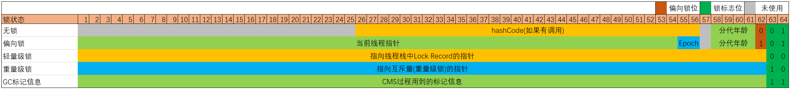

# 第一部分 理论基础

## 概述

* 多线程的优势
    * 发挥多处理器的强大功能
        * 通过提高处理器资源的利用率来提升系统吞吐率
        * 例如: 程序在等待某个同步I/O操作完成时, 可以让出CPU, 使另一个线程继续运行
    * 建模的简单性
        * 通过使用线程, 可以将复杂并且异步的工作流进一步分解为一组简单并且同步的工作流, 每个工作流在一个单独的线程中运行, 并在特定的同步位置进行交互.
    * 异步事件的简化处理
        * 对于事件监听类逻辑, 如果单线程, 只能通过阻塞的方式, 来实现, 而通过多线程处理事件, 每个事件拥有自己独立的线程, 在处理请求时发生的阻塞不会影响到其他线程
* 多线程带来的风险
    * 安全性问题
        * 数据竞争: 多个线程同时读写一个数据
        * 竞态条件: 程序的执行结果依赖线程的执行顺序
    * 活跃性问题
        * 死锁
        * 活锁
        * 饥饿
    * 性能问题
* 管程
    * 管理共享变量以及对共享变量的操作过程，让他们支持并发
    * 三种不同的管程模型:
        * Hasen
        * Hoare
        * MESA: java管程采用的模型
    * 并发编程的核心问题:
        * 互斥: 同一时刻, 只允许一个线程访问共享资源
        * 同步: 线程之间的通信, 协作
    * 管程解决互斥问题: 将共享变量以及对共享变量的操作统一封装起来. 任何对受管程管理的共享变量的操作, 都需要通过管程的调度来完成.
    * 管程解决同步问题: 
        * 入口等待队列: 同一时刻, 只有一个线程可以进入管程内部, 其余线程在**入口等待队列**中, 等待锁的获取
        * 条件等待队列: wait()方法, 会将管程内部的线程转移到**条件等待队列**中, 同时释放锁. notify, notifyAll方法, 会触发条件等待队列中的线程重新进入**入口等待队列**
        * synchronized的条件等待队列只有一个, Lock&Condition的条件等待队列可以有多个.

<image src="img/mesa.png" height="500" />

## 线程安全性

线程安全是指某个函数在并发环境中被调用时, 能够正确地处理**多个线程**之间的**共享变量**, 使程序功能**正确完成**.

引发线程安全问题的核心就是**共享变量**, 可以拆解为两个必要条件有两个:

1. 可变的量
2. 多线程共享

防止出现线程安全性, 问题的切入点, 有三个:

1. 可见性 -- CPU缓存导致的可见性问题
2. 原子性 -- 线程切换导致的原子性问题
3. 有序性 -- 编译优化导致的有序性问题

```java
package sch.frog.concurrency;

/**
 * 线程安全问题演示
 */
public class ThreadSafeProblem {

    public static void main(String[] args) throws InterruptedException{
        // 数据竞争
        DataRaceDemoObj dataRaceDemoObj = new DataRaceDemoObj();
        playThreadSafeProblem(dataRaceDemoObj);
        System.out.println("result is : " + dataRaceDemoObj.count);

        // 竞态条件
        RaceConditionDemoObj raceConditionDemoObj = new RaceConditionDemoObj();
        playThreadSafeProblem(raceConditionDemoObj);
        System.out.println("result is : " + raceConditionDemoObj.count);

        // 线程安全
        ThreadSafeObj threadSafeObj = new ThreadSafeObj();
        playThreadSafeProblem(threadSafeObj);
        System.out.println("result is : " + threadSafeObj.count);
    }

    private static void playThreadSafeProblem(AddRef ref) throws InterruptedException{
        Thread t1 = new Thread(ref::add10K);
        Thread t2 = new Thread(ref::add10K);
        t1.start();
        t2.start();
        t1.join();
        t2.join();
    }

    private interface AddRef{
        void add10K();
    }

    /**
     * Demo: 数据竞争
     * 两个线程并发的对同一个变量进行读写
     */
    private static final class DataRaceDemoObj implements AddRef{
        private long count = 0;
        public void add10K(){
            int idx = 0;
            while(idx++ < 10000){
                count += 1;
            }
        }
    }

    /**
     * Demo: 竞态条件
     * 程序的执行结果依赖两个线程交替执行的顺序
     * 注意, 这里RaceConditionDemoObj中的count并不会被两个线程并发的访问
     */
    private static final class RaceConditionDemoObj implements AddRef{
        private volatile long count = 0;
        private synchronized long get(){
            return count;
        }
        private synchronized void set(long v){
            this.count = v;
        }
        public void add10K(){
            int idx = 0;
            while(idx++ < 10000){
                this.set(get() + 1);
            }
        }
    }

    /**
     * 线程安全的对象
     */
    private static final class ThreadSafeObj implements AddRef{
        private long count = 0;
        public synchronized void add10K(){
            int idx = 0;
            while(idx++ < 10000){
                count += 1;
            }
        }
    }
}
```

## 可见性问题与有序性问题

从引发原因, 可以知道, 解决这两类问题的根本手段是:

* 禁用缓存
* 禁用编译优化

java提供的具体手段有:

* volatile -- 1. 禁用缓存; 2. 禁用重排序
* synchronized
* final
    * java1.5之前, 指令重拍导致线程可以看到final变量的值得变化; 1.5之后, 就没有这个问题了.
* 六项Happens-Before原则
    1. 程序的顺序性规则: 在单个线程中, 按照程序的顺序, 前面的操作Happens-Before于后续的任意操作
    2. volatile变量规则: 对一个volatile变量的写操作Happens-Before于后续的读操作
    3. 传递性: 如果A Happens-Before B, B Happens-Before C, 那么 A  Happens-Before C
    4. 管程中锁的规则: 一个锁的解锁Happens-Before于后续对这个锁的加锁
    5. 线程start()规则: 线程的启动操作Happens-Before于后续该线程的任何操作
    6. 线程join()规则: 子线程的任何操作Happens-Before于后续join后的操作

## 原子性问题

原子性: 对于其他线程来说, 一组操作, 要么全都执行完成, 要么全都未执行, 原子性问题的根源是线程切换导致的. 解决原子性问题, 就是要保证一组操作不可分割, 操作的中间状态对外不可见.

java提供的解决手段: 锁, CAS

## 线程的生命周期

java线程中共有六个状态

1. NEW - 初始化状态
2. RUNNABLE - 可运行/运行状态
3. BLOCKED - 阻塞状态
4. WAITING - 无时限等待
5. TIMED_WAITING - 有时限等待
6. TERMINATED - 终止状态

> BLOCKED、WAITING、TIMED_WAITING在操作系统层面属于同一种状态: 休眠状态(释放CPU使用权, 注意, 不一定释放锁)

**线程状态的转换**

1. RUNNABLE --> BLOCKED: 只有一种情况: 线程等待synchronized的隐式锁
2. RUNNABLE --> WAITING
    1. synchronized内, 调用obj.wait()
    2. Thread.join()
    3. LockSupport.park(), java并发包中的锁都是基于这个实现的
3. RUNNABLE --> TIMED_WAITING
    1. Thread.sleep(xxx)
    2. obj.wait(xxx)
    3. Thread.join(xxx)
    4. LockSupport.parkNanos(xxx, xxx)
    5. LockSupport.parkUntil(xxx)
4. NEW --> RUNNABLE: 调用start()
5. RUNNABLE --> TERMINATED:
    * 调用interrupt, 具体下面再说

> 调用阻塞式API时(I/O操作等), 是否会由RUNNABLE转换为BLOCKED? 不会, 对于操作系统来说, 确实是进入了阻塞状态, 但是JVM 层面并不关心操作系统调度相关的状态, 在JVM看来, 等待CPU使用权和等待IO没有区别, 都是RUNNABLE状态.

<image src="img/thread_state.png" height="400" />

## 死锁

死锁是指两个或者两个以上的进程(或线程)在执行过程中, 由于竞争资源或者由于彼此通信而造成的一种阻塞现象, 若无外界干预, 它们都将无法推进下去.

产生死锁的四个必要条件:

1. 互斥条件: 一个资源每次只能被一个进程使用
2. 占有且等待: 一个进程因请求资源而阻塞时, 对已获得的资源不释放;
3. 不可强行占有: 进程已获得的资源, 在未使用完之前, 不能强行剥夺;
4. 循环等待条件: 若干进程之间形成一种头尾相接的循环等待资源关系;

避免这四个条件同时发生, 就可以避免死锁.

## 线程数的确定

使用多线程的目的, 可以归结为: 降低延迟，提高吞吐量. 多线程就是要解决CPU和I/O设备的综合利用率问题.

* CPU密集型程序
    * 理论上: 线程数 = CPU核数
    * 工程实践中: 线程数 = CPU核数 + 1
* I/O密集型程序
    * 线程数: 2N + 1
* 最佳实践: 没有固定的数值, 根据实际情况, 调整线程数, 使得硬件性能发挥到极致

## 守护线程

正常情况下创建的线程是普通线程, 通过`new Thread().setDaemon(true)`创建的线程是守护线程. 两者唯一区别是: java进程会在所有普通用户线程结束后退出, 而不会等守护线程执行完成.

## 线程上下文

线程上下文是指CPU从一个线程转到另一个线程时, 需要保存当前线程的上下文状态, 恢复另一个线程的上下文状态, 以便下一次恢复执行该线程时能够正确地运行. 例如程序计数器, 寄存器, 栈指针等信息都是上下文信息.

## 并发与并行

<image src="img/concurrent_and_parallel.png" height="300">

# 第二部分 并发实践

## synchronized

synchronized是java提供的内置锁, 可重入

* synchronized代码块中的锁对象是synchronized后指定的
* synchronized修饰实例方法, 锁对象就是this
* synchronized修饰静态方法, 锁对象就是Class对象
* synchronized采用的是管程的原理来实现的锁
* synchronized通过monitorenter和monitorexit这两个字节码指令实现的
* synchronized是非公平锁, 这种通常会有更高的吞吐量

**锁与等待-通知 的 最佳实践**

* wait, notify, notifyAll都只能在synchronized内部调用
* 这三个方法的调用者必须是synchronized的锁对象
* 调用wait, 会释放锁, 本身线程进入WAITING状态; 而调用notify和notifyAll的线程不会释放锁, 而是继续正常执行
* wait的调用, 标准做法是, 将其放入一个循环中
* 一般使用notifyAll, 因为notify可能会导致某些线程永远不会被通知到

```java
    public static void main(String[] args) throws InterruptedException{
        for(int i = 0; i < statusArr.length; i++){
            final int m = i;
            new Thread(() -> {
                try {
                    demoA(m);
                } catch (InterruptedException e) {
                    e.printStackTrace();
                } 
            }).start();
        }

        Thread.sleep(1000);

        while(!mark){
            demoB();
        }
    }

    private static final Object obj = new Object();
    private static final int[] statusArr = new int[10];
    private static volatile boolean mark = false;
    private static void demoA(int i) throws InterruptedException{
        synchronized(obj){
            while(!mark){
                // System.out.println(i + " waiting.");
                obj.wait();
            }
            mark = false;
            statusArr[i] = 1;
            displayProcess();
        }
    }
    private static void demoB() throws InterruptedException{
        synchronized(obj){
            mark = true;
            // System.out.println("change mark...");
            obj.notifyAll();
        }
        Thread.sleep(100);
    }

    private static void displayProcess(){
        String str = "";
        for(int i = 0; i < statusArr.length; i++){
            str += statusArr[i] == 1 ? "o" : "-";
        }
        System.out.println(str);
    }
```

> 顺便提及一下, Thread.sleep不会释放锁, 仅仅是让渡CPU执行时间
> 存在`Thread.sleep(0)`这种写法, 作用有: 1. 让渡出CPU, 防止某个线程长时间占用CPU资源; 2. 这个方法是native方法, 相当于程序可以进入safepoint, 可以执行GC. 防止有长循环没有safepoint导致长时间不能gc.(native函数不在JVM管理中, 不会对JVM内部的状态进行修改, 所以JVM不需要关心它, 因此它是一个safepoint)

### 锁状态

* <= jdk1.6: 只有重量级锁
* > jdk1.6 & < jdk15: 偏向锁 + 轻量级锁 + 重量级锁
* >= jdk15: 轻量级锁 + 重量级锁

一个对象被用作锁时, 会通过对象头来标记锁状态:



* 偏向锁: 当线程第一次访问一个对象的同步块时, 对象锁标志位会变为"偏向锁", JVM会在对象头中设置thread ID.
  * 这种情况下, 其他线程访问有该对象锁的同步代码块时, 会先检查对象的偏向锁标识, 如果和自己线程ID相同则直接获取锁, 如果不同, 则会升级为轻量级锁;
* 轻量级锁: 当有其他线程访问该对象锁时, 偏向锁会升级为轻量级锁.
  * 升级轻量级锁的过程中, JVM会先将对象头中的Mark Word复制到线程栈中的锁记录(Lock Record); 然后通过CAS操作将对象头Mark Word更新为指向锁记录的指针. 如果这个CAS更新操作成功, 这个线程就成功获取到了轻量级锁.
* 重量级锁: 当轻量级锁CAS操作失败, 即出现了实际的竞争, 锁会进一步升级为重量级锁.
  * 当升级为重量级锁后, 对象头的Mark Word会更新为指向重量级锁结构(Monitor)的指针, 这个重量级锁结构就是一系列的"管程"相关信息, 包括入口等待队列(Entry Set)等等.
  * 在锁升级为重量级锁之前, 会有自旋的过程, 避免线程立即进入阻塞状态. 这个自旋的时间是不固定的, 称为JVM的自适应自旋, JVM会根据实际情况动态调整.

<image src="img/lock_status.png" height="300">

> * Mark Word: 每个对象头部都有一个Mark Word, 它用于存储对象自身的运行时数据, 如hashCode, 锁状态信息, 分代年龄等.
> * 在升级为轻量级锁过程中, 为什么需要将对象头的原始Mark Word复制到线程栈中的锁记录(Lock Record)? 这是为了在锁释放时, 可以将原始的对象头Mark Word恢复过来.
> * HotSpot只支持锁升级, 不支持锁降级.
> * 上述的锁状态中, 只有重量级锁会导致线程阻塞. 线程阻塞和唤醒是很重的操作, 需要在用户态和内核态之间切换, 涉及操作系统调度, 所以才会有这些锁状态来避免.
> * 为什么jdk15之后取消了偏向锁? 偏向锁最初设计主要是为了HashTable, Vector等比较老的线程安全集合考虑的, 假定一个锁一直由同一个线程持有, 避免其他级别锁的一些操作消耗. 但是偏向锁在有其他线程竞争锁的情况下, 出现升级等会损耗性能. 新的java有了更现代的并发编程技术, 同时废弃偏向锁可以减少JVM相关逻辑代码的复杂度, 因此被废弃掉了.

### 锁优化

1. 自适应自旋: 即上面提到的在升级成重量级锁之前的自旋
2. 锁消除: 运行时阶段, JIT编译器通过逃逸分析, 如果认为一段同步块只可能同时被一个线程访问到, 那么在进行JIT编译时, 就会取消掉对这部分代码的加锁;
3. 锁粗化: 频繁的加锁解锁是很耗费资源的, 运行时阶段, JIT编译器发现一系列连续操作都是对同一个对象反复加锁解锁, 甚至是在一个循环体内部, 会将加锁的范围扩散(粗化)到整个操作序列外部.

## ThreadLocal

使用ThreadLocal实现一个线程安全的SimpleDateFormat:

```java
    public static void main(String[] args){
        ExecutorService executorService = Executors.newFixedThreadPool(4);

        for(int i = 0; i < 10; i++){
            executorService.submit(() -> {
                System.out.println(SafeDateFormat.get().format(new Date()));
            });
        }

        executorService.shutdown();
    }

    static class SafeDateFormat{
        private static final ThreadLocal<DateFormat> tl = ThreadLocal.withInitial(() -> new SimpleDateFormat("yyyy-MM-dd HH:mm:ss"));
        public static DateFormat get(){
            return tl.get();
        }
    }
```

ThreadLocal工作原理:

每一个线程Thread对象, 内部有一个ThreadLocalMap对象, ThreadLocalMap的key是ThreadLocal. 当调用ThreadLocal的get方法时, 大致是这样的:

```java
Object get(){
    ThreadLocalMap map = Thread.currentThread().threadLocals;
    Entry e = map.getEntry(this);
    return e.value;
}
```

这样设计有几方面考虑:

1. 从数据亲缘性上, ThreadLocalMap属于Thread比较合理;
2. 不容易内存泄露, ThreadLocalMap中, 对ThreadLocal的引用都是弱引用, 只要Thread可以被回收, 那么ThreadLocalMap就可以被回收, 不受ThreadLocal的生命周期的影响.

ThreadLocal的内存泄露:

ThreadLocalMap对key(ThreadLocal)是弱引用, 只要ThreadLocal本身的生命周期结束了, 就可以回收了. 但是ThreadLocalMap对value是强引用, 如果一个线程一直存在(例如线程池中的线程对象), value就不会回收, 导致内存泄露. 解决方案是, 手动回收value, ThreadLocal提供了```remove()```方法, 会主动将自己从ThreadLocalMap中移除.

**InheritableThreadLocal**

1. 如果想在一个线程创建的子线程中, 访问父线程的ThreadLocal中的变量, 需要使用InheritableThreadLocal. 但是, 不建议使用, 会导致继承关系混乱.
2. InheritableThreadLocal只能用在手动创建的子线程中传递变量, 如果是线程池中的线程, 不可以用, 这时可以使用TransmittableThreadLocal类.

## Lock和Condition

Lock与synchronized功能几乎一致, 只不过, Lock在synchronized基础上又增加了一些支持:

* 能够响应中断: 阻塞的线程能够响应中断信号 - lock.lockInterruptibly()
* 支持超时: 一段时间内没有获取到锁, 抛出超时错误 - boolean tryLock(long time, TimeUnit unit) throws InterruptedException;
* 非阻塞的获取锁: 获取锁失败, 不进入阻塞状态, 而是直接返回 - boolean tryLock();

此外:

* 上面的Happens-Before原则保证了synchronized的可见性和有序性, Lock内部通过利用volatile的Happens-Before原则达到了相同的效果.
* ReentrantLock支持可重入
* ReentrantLock支持两种构造函数, 带参构造, 可以用来指定是公平锁还是非公平锁. 无参构造, 是默认的非公平锁.
    * 公平锁 - 先进入等待队列的先获取到锁, 后进入的后获取到锁
    * 非公平锁 - 新来的线程不会去排队, 直接获取到锁

Lock&Condition简单示例:

```java
    /**
     * 阻塞队列演示, 拥有两个条件Condition, 配合达到阻塞队列的效果
     */
    private static class BlockedQueueDemo{
        private final Lock lock = new ReentrantLock();
        private final Condition notFull = lock.newCondition();
        private final Condition notEmpty = lock.newCondition();
        private static final int MAX_CAPACITY = 10;
        private int capacity = 0;
        
        private void enQueue() throws InterruptedException{
            lock.lock();
            try{
                while(capacity == MAX_CAPACITY){
                    notFull.await();
                }
                capacity++;
                System.out.println("en queue");
                notEmpty.signalAll();
            }finally{
                lock.unlock();
            }
        }

        private void deQueue() throws InterruptedException{
            lock.lock();
            try{
                while(capacity == 0){
                    notEmpty.await();
                }
                capacity--;
                System.out.println("de queue");
                notFull.signalAll();
            }finally{
                lock.unlock();
            }
        }
    }
```

## AbstractQueuedSynchronizer

AQS(AbstractQueuedSynchronizer)是一个用于构建锁和同步器的框架, 许多同步器都可以通过AQS很容易并且高效地构造出来. 不仅ReentrantLock和Semaphore是基于AQS构建的, 还包括CountDownLatch, ReentrantReadWriteLock, SynchronousQueue和FutureTask. java中的AQS就是管程模型(MESA)的具体实现, 对于管程模型, 看最上面的图就可以了解了. 也可以结合下图:

<image src="img/AQS.png" height="300" />

* 锁类型有独占锁和共享锁. 独占锁保证同一时刻只有一个线程可以获取到锁(ReentrantLock). 共享锁同一时刻可以有多个线程获取到锁(ReadWriteLock/Semaphore等).
* AQS中有两个FIFO队列: 1. 入口等待队列; 2. 条件等待队列
* 入口等待队列是双向链表, 这出于几方面考虑: 1. 高效的中断支持(方便从任意节点去检查它前序和后继节点); 2. 高效的挂起支持(方便从任意节点去检查它前序和后继节点); 3. 高效的线程判断(从尾部向前遍历, 减少头部状态的竞争);
* AQS图中的await, signal等方法内部的线程阻塞与唤醒使用的是`LockSupport.park`和`LockSupport.unpark`方法, park是阻塞, unpark是唤醒

## Semaphore信号量

标准的信号量语义:

* init - 设置计数器初始值
* down - 计数器值减1
* up - 计数器值加1

> 上述这三个操作都是原子性的

对应java中的实现:
* init -- 构造方法
* down - release
* up - acquire

使用Semaphore实现一个限流器:

```java
    /**
     * 一个限流器, 保证最多只有size个exec操作执行
     */
    private static class Pool{
        final Semaphore sem;
        public Pool(int size){
            sem = new Semaphore(size);
        }

        private void exec() throws InterruptedException{
            sem.acquire();
            try{
                // do something
                System.out.println("execute.");
                Thread.sleep(2000);
            }finally{
                sem.release();
            }
        }
    }
```

## ReadWriteLock-读写锁

ReadWriteLock适用于读多写少的场景, 即读写锁, 遵循一下三条基本原则:

* 允许多个线程同时读共享变量
* 只允许一个线程写共享变量
* 如果一个线程正在执行写操作, 此时禁止读线程读共享变量

Java读写锁注意事项:

* 不支持锁升级: 即持有读锁的线程, 尝试获取写锁, 是不被允许的. 如果存在这种操作, 会导致永久的锁等待.
* 支持锁降级: 即持有写锁的线程, 可以获取到读锁.

读写锁演示:
```java
    private static class Cache<K, V>{
        private final Map<K, V> map = new HashMap<>();
        private final ReadWriteLock rwl = new ReentrantReadWriteLock();
        private final Lock r = rwl.readLock();
        private final Lock w = rwl.writeLock();
        private final IDataLoader<K, V> loader;
        public Cache(IDataLoader<K, V> loader){
            this.loader = loader;
        }
        public V get(K key){
            V v = null;
            r.lock();
            try{
                v = map.get(key);
            }finally{
                r.unlock();
            }
            if(v != null){
                return v;
            }else{
                // 如果缓存没有命中, 则从数据源中获取, 并写入缓存
                w.lock();
                try{
                    v = loader.load(key);
                    map.put(key, v);
                }finally{
                    w.unlock();
                }
            }
            return v;
        }
    }

    private interface IDataLoader<K, V>{
        V load(K key);
    }
```

## StampedLock-悲观锁&乐观锁

* 写锁
* 悲观读锁
* 乐观读-注意, 这里乐观读是无锁操作

数据库中的乐观锁:

```
数据库中, 乐观锁的使用是很常见的, 大致流程如下:
1. 首先数据库中每一条记录, 存在一个version字段, 用来标记数据的版本: select id, ..., version from table_xxx where id = xxx;
2. 获取到数据之后, 对数据进行修改;
3. 保存数据时, 不是直接报错, 而是需要带上查询出来的version这个校验: update table_xxx set version = version + 1, ... where id = xxx and version = ??;
4. 这时, 如果这条记录被并发的修改过, 则上面的语句执行不会影响任何记录(应为version对不上, 导致匹配不到任何记录), 如果数据没有被修改过, 就能保存成功.
```

java中StampedLock使用示例:

```java
    private static class Point{
        private int x, y;
        final StampedLock sl = new StampedLock();

        int distanceFromOrigin(){
            long stamp = sl.tryOptimisticRead();    // 乐观读
            int curX = x, curY = y;
            // 如果执行过程中, 存在写操作, 导致stamp变更, 则返回false, 升级为悲观读锁
            if(!sl.validate(stamp)){
                stamp = sl.readLock();
                try{
                    curX = x;
                    curY = y;
                }finally{
                    sl.unlockRead(stamp);   // 释放悲观读锁
                }
            }
            return (int) Math.sqrt(curX * curX + curY * curY);
        }

        void modifyCoordinate(int x, int y){
            long stamp = sl.writeLock();    // 写锁
            try{
                this.x = x;
                this.y = y;
            }finally{
                sl.unlockWrite(stamp);
            }
        }
    }
```

注意事项:

* StampedLock不可重入
* StampedLock的readLock和writeLock中如果遇到interrupt, 会导致CPU飙升, 这时需要使用readLockInterruptibly和writeLockInterruptibly
* StampedLock支持锁升级(tryConvertToWriteLock)和锁降级(tryConvertToReadLock), 但是, 在升级和降级过程中, 需要注意修改返回的stamp值

## CountDownLatch-多线程协作

CountDownLatch用于解决一个线程等待多个线程的场景

```java
        ExecutorService executorService = Executors.newFixedThreadPool(9);
        final int task = 100;
        CountDownLatch cdl = new CountDownLatch(task);
        for(int i = 0; i < task; i++){
            executorService.execute(() -> {
                try {
                    Thread.sleep(1000);
                    cdl.countDown();
                } catch (InterruptedException e) {
                    e.printStackTrace();
                }
            });
        }
        try {
            cdl.await();
        } catch (InterruptedException e) {
            e.printStackTrace();
        }
        System.out.println("finish");
        executorService.shutdown();
```

## CyclicBarrier-多线程协作

CyclicBarrier用于解决一组线程之间互相等待, CyclicBarrier可以循环利用, 计数清零之后, 会自动重置

```java
        ExecutorService executorService = Executors.newFixedThreadPool(2);

        CyclicBarrier cb = new CyclicBarrier(2, () -> {
            System.out.println("all has finish.");
        });

        Random r = new Random();
        executorService.execute(() -> {
            try {
                for(int i = 0; i < 10; i++){
                    System.out.println("a start");
                    Thread.sleep(r.nextInt(1000));
                    cb.await();
                    System.out.println("a pass");
                }
            } catch (InterruptedException | BrokenBarrierException e) {
                e.printStackTrace();
            }
        });

        executorService.execute(() -> {
            try {
                for(int i = 0; i < 10; i++){
                    System.out.println("b start");
                    Thread.sleep(r.nextInt(1000));
                    cb.await();
                    System.out.println("b pass");
                }
            } catch (InterruptedException | BrokenBarrierException e) {
                e.printStackTrace();
            }
        });

        executorService.shutdown();
```

## 并发容器

* 同步容器
    * Collections.synchronizedList(xxx)
    * Collections.synchronizedSet(xxx)
    * Collections.synchronizedMap(xxx)
    * Vector
    * Stack
    * Hashtable
* 并发容器
    * List
        * CopyOnWriteArrayList: 写入的时候, 会将变量复制一份; 读操作完全无锁.
            * 适用于读多写少, 可以容忍读写的短暂不一致
            * 该容器的迭代器是只读的, 不支持增删改
    * Map
        * ConcurrentHashMap: key是无序的, key和value都不能为null
        * ConcurrentSkipListMap: key是有序的, key和value都不能为null
            * 基于跳表实现, 插入, 删除, 查询的时间复杂度均为O(lgn)
    * Set
        * CopyOnWriteArraySet: 基于ConcurrentHashMap
        * ConcurrentSkipListSet: 基于ConcurrentSkipListMap
    * Queue - 从两个维度来分类: 1. 阻塞与非阻塞(阻塞-队列已满, 入队阻塞, 队列已空, 出队阻塞); 2. 单端与双端(单端-只能队尾入队队首出队, 双端-队尾队首都可以入队出队)
        * 单端阻塞队列:
            * ArrayBlockingQueue: 用数组实现队列
            * LinkedBlockingQueue: 用链表实现队列
            * SynchronousQueue: 不持有队列, 生产者的入队操作必须等待消费者的出队操作
            * LinkedTransferQueue: 融合LinkedBlockingQueue和SynchronousQueue, 性能比LinkedBlockingQueue好
            * PriorityBlockingQueue: 支持按照优先级出队
            * DelayQueue: 支持延迟出队
        * 双端阻塞队列
            * LinkedBlockingDeque
        * 单端非阻塞队列
            * ConcurrentLinkedQueue
        * 双端非阻塞队列
            * ConcurrentLinkedDeque

> 注意, 阻塞队列使用Blocking标识, 单端队列为Queue, 双端队列为Deque.
> 使用队列时, 需要注意队列是否有界(内部队列是否有容量限制), 不建议使用无界队列, 数据量较大时会导致OOM. 上面的Queue中ArrayBlockingQueue和LinkedBlockingQueue支持有界.

集合类|key|value|是否线程安全
-|-|-|-
HashMap|允许为null|允许为null|否
TreeMap|不允许为null|允许为null|否
HashTable|不允许为null|不允许为null|是
ConcurrentHashMap|不允许为null|不允许为null|是
ConcurrentSkipListMap|不允许为null|不允许为null|是

需要注意的问题, 即使是同步问题, 在使用迭代器时, 也需要手动加锁:

```java

List list = Collections.synchronizedList(new ArrayList());
synchronized (list) {  
  Iterator i = list.iterator(); 
  while (i.hasNext())
    foo(i.next());
}    
```

## 原子类

例程如下:

```java
        AtomicInteger integer = new AtomicInteger();
        int i = 0;
        while(i < 100){
            integer.getAndIncrement();
            i++;
        }
        System.out.println(integer.get());
```

**CAS**: 原子类实现原理, 依赖与硬件的支持, CPU为解决并发问题, 提供了CAS(Compare And Swap)指令. CAS指令包含3个参数: 共享变量内存地址A, 用于比较的值B, 共享变量的新值C; 并且当内存中A处的值等于B时, 产能将内存中地址A出的值更新为新值C. 作为一条CPU指令, CAS指令本身是能保证原子性的.

**自旋**: 即循环尝试. 例如, ((AtomicLong)count).getAndIncrement()操作, 就是使用"CAS+自旋"的实现方案. 首先, newValue = count + 1; 然后, cas(count, newValue); 如果返回值不等于count, 说明执行cas执行没有成功; 这时, 重新获取当前count值, 重新计算newValue, 重新执行cas, 这样循环自旋, 直至成功. 

**ABA问题**: CAS中常见的一个问题是ABA问题, 就是说一个值, 原来是A, 修改为B后, 又被修改为A, 这时, CAS是无法感知到这个修改过程的. 大多数时候, 不必关心ABA问题, 但有些时候, 也需要注意.

**忙等待**: 自旋操作如果一致持续下去, 导致线程一直在无意义的运行, 称为忙等待.

原子类

* 原子化基本类型: AtomicBoolean, AtomicInteger, AtomicLong
* 原子化对象引用: AtomicReference, AtomicStampedReference, AtomicMarkableReference
    * 其中后两者通过版本号, 解决了ABA问题
* 原子化数组: AtomicIntegerArray, AtomicLongArray, AtomicReferenceArray
    * 可以原子化的更新数组中的每一个元素
* 原子化对象属性更新器: AtomicIntegerFieldUpdater, AtomicLongFieldUpdater, AtomicReferenceFieldUpdater
    * 可以原子化的更新对象的属性
    * 利用的是反射机制
    * 被更新的对象属性必须是volatile类型, 只有这样才能保证可见性, 如果不是volatile, 则会抛出IllegalArgumentException异常.
* 原子化累加器: DoubleAccumulator, DoubleAdder, LongAccumulator, LongAdder
    * 与原子化基本数据类型类似, 但是性能更优, 但是只支持累加操作

原子化基本类型的常用方法:
```java
getAndIncrement() //原子化i++
getAndDecrement() //原子化的i--
incrementAndGet() //原子化的++i
decrementAndGet() //原子化的--i
//当前值+=delta，返回+=前的值
getAndAdd(delta) 
//当前值+=delta，返回+=后的值
addAndGet(delta)
//CAS操作，返回是否成功
compareAndSet(expect, update)
//以下四个方法
//新值可以通过传入func函数来计算
getAndUpdate(func)
updateAndGet(func)
getAndAccumulate(x,func)
accumulateAndGet(x,func)
```

## 线程池

线程池不同于其它的池化资源(申请-使用-释放), **线程池实际上是一种生产者-消费者模式**, 每次, 调用execute, submit等方法, 实际上就是向队列中放入一个任务, 然后由线程池中的工作线程来消费.

java线程池的核心对象是ThreadPoolExecutor, 其最完备的构造函数如下:

```java
ThreadPoolExecutor(
  int corePoolSize,
  int maximumPoolSize,
  long keepAliveTime,
  TimeUnit unit,
  BlockingQueue<Runnable> workQueue,
  ThreadFactory threadFactory,
  RejectedExecutionHandler handler
)
```
* corePoolSize: 线程池保有的最小线程数. 
* maximumPoolSize: 线程池创建的最大线程数.
* keepAliveTime & unit: 如果线程空闲时间超过这两个参数指定的时间, 空闲线程就会被释放, 当然, 会保证释放后线程池中最少有corePoolSize个线程.
* workQueue: 工作队列
* threadFactory: 自定义线程的创建, 可以用来给线程指定名称.
* handler: 拒绝策略, 当线程的工作队列已满(前提是该队列时有界队列), 那么, 此时提交的任务, 线程池就会拒绝接收.
    * 拒绝策略
        * CallerRunsPolicy: 提交任务的线程自己去执行该任务
        * AbortPolicy: 默认的拒绝策略, 抛出RejectedExecutionException
        * DiscartPolicy: 直接丢弃, 没有任何异常
        * DiscardOldestPolicy: 丢弃最老的任务

> java1.6 增加了allowCoreThreadTimeOut(boolean value), 允许包括corePoolSize在内的所有线程都支持超时

线程池使用注意事项:

* workQueue建议使用有界队列, 防止OOM
* 谨慎的选择拒绝策略

例程:

```java
        ExecutorService executorService = new ThreadPoolExecutor(
            4, 
            4, 
            0, 
            TimeUnit.SECONDS, 
            new LinkedBlockingQueue<>(10),
            new ThreadFactory(){
                @Override
                public Thread newThread(Runnable r) {
                    Thread t = new Thread(r);
                    t.setName("AAA");
                    return t;
                }
                
            },
            new CallerRunsPolicy());
```

## Future-获取子线程执行结果

ThreadPoolExecutor提供了三个submit方法, 支持获取子线程执行结果:

```java
Future<?> submit(Runnable task);    // 提交Runnable任务
<T> Future<T> submit(Callable<T> task); // 提交Callable任务
<T> Future<T> submit(Runnable task, T result);  // 提交Runnable任务及结果引用
```

其返回值Future接口, 有5个方法:

```java
boolean cancel(boolean mayInterruptIfRunning);    // 取消任务
boolean isCancelled();   // 判断任务是否已取消
boolean isDone();    // 判断任务是否已完成
get()   // 获取执行结果
get(timeout, unit)  //获取执行结果, 支持超时
```

对于三个submit方法:

1. 提交Runnable任务, 由于Runnable的run()方法是没有返回值的, 所以这个方法返回的Future仅用于断言, 类似于Thread.join
2. 提交Callable任务, Callable的call()方法是有返回值的, 所以可以通过Future的get方法, 获取任务的执行结果
3. 提交Runnable任务及结果引用, 这里Future的get方法, 返回的是传入的result对象, 就是说Runnable内部, 会对result对象的属性做变更

```java
    public static void main(String[] args) throws InterruptedException, ExecutionException{
        ExecutorService service = Executors.newFixedThreadPool(1);

        MyTask mt = new MyTask();
        Future<MyTask> future = service.submit(() -> { mt.a = 12; }, mt);
        MyTask mtResult = future.get();
        
        System.out.println(mtResult.a);
        System.out.println(mtResult == mt);
        service.shutdown();
    }

    public static class MyTask{
        private int a;
    }
```

**FutureTask工具类**

FutureTask类实现了Runnable接口和Future接口, 并且FutureTask的构造函数中, 可以接收Callable参数, 所以:

1. 可以直接被当做Runnable使用;
2. 可以直接被当做Future使用;
3. 可以实现submit(callable)的效果;

```java
        FutureTask<Integer> ft = new FutureTask<>(() -> 1 + 2);
        
        Thread t = new Thread(ft);
        t.start();

        Integer r = ft.get();
        System.out.println(r);
```

## CompletableFuture-多线程协作

CompletableFuture为异步编程提供了一套标准化的执行模板及底层支持

使用CompletableFuture实现烧水泡茶:

```java
    public static void main(String[] args){
        CompletableFuture<Void> f1 = CompletableFuture.runAsync(() -> {
            System.out.println("T1 : 洗水壶");
            sleep(1, TimeUnit.SECONDS);

            System.out.println("T1 : 烧开水");
            sleep(15, TimeUnit.SECONDS);
        });

        CompletableFuture<String> f2 = CompletableFuture.supplyAsync(() -> {
            System.out.println("T2 : 洗茶壶");
            sleep(1, TimeUnit.SECONDS);

            System.out.println("T2 : 洗茶杯");
            sleep(2, TimeUnit.SECONDS);

            System.out.println("T2 : 取茶叶");
            sleep(1, TimeUnit.SECONDS);

            return "龙井";
        });

        CompletableFuture<String> f3 = f1.thenCombine(f2, (__, tf) -> { // 这里__就是一个普通变量, 只不过f1没有返回值, 所以随便取了一个名字
            System.out.println("T1 : 拿到茶叶 : " + tf);
            System.out.println("T1 : 泡茶");
            return "上茶:" + tf;
        });

        System.out.println(f3.join());
    }

    public static void sleep(int time, TimeUnit timeUnit){
        try {
            timeUnit.sleep(time);
        } catch (InterruptedException e) {
            e.printStackTrace();
        }
    }
```

创建CompletableFuture有四个静态方法:

```java
//使用默认线程池
static CompletableFuture<Void> runAsync(Runnable runnable);
static <U> CompletableFuture<U> supplyAsync(Supplier<U> supplier);
//可以指定线程池  
static CompletableFuture<Void> runAsync(Runnable runnable, Executor executor);
static <U> CompletableFuture<U> supplyAsync(Supplier<U> supplier, Executor executor);
```

建议使用后两者, 带有executor参数的, 根据不同业务类型创建不同的线程池, 以避免互相干扰. 此外, runAsync参数是Runnable, 没有返回值, supplyAsync参数是Supplier, 有返回值.

## CompletionStage-多线程协作

CompletableFuture实现了CompletionStage接口, 这个接口故名思议, "完成状态", 用于协调多个异步操作. 按照线程之间的协调关系可以分为:1. 串行关系; 2. 并行关系; 3. 汇聚关系.

**串行关系**

```java
CompletionStage<R> thenApply(fn);
CompletionStage<R> thenApplyAsync(fn);
CompletionStage<Void> thenAccept(consumer);
CompletionStage<Void> thenAcceptAsync(consumer);
CompletionStage<Void> thenRun(action);
CompletionStage<Void> thenRunAsync(action);
CompletionStage<R> thenCompose(fn); // 会创建子流程, 即新的CompletableFuture
CompletionStage<R> thenComposeAsync(fn);
```

**AND汇聚关系**

```java
CompletionStage<R> thenCombine(other, fn);
CompletionStage<R> thenCombineAsync(other, fn);
CompletionStage<Void> thenAcceptBoth(other, consumer);
CompletionStage<Void> thenAcceptBothAsync(other, consumer);
CompletionStage<Void> runAfterBoth(other, action);
CompletionStage<Void> runAfterBothAsync(other, action);
```

**Or汇聚关系**

```java
CompletionStage applyToEither(other, fn);
CompletionStage applyToEitherAsync(other, fn);
CompletionStage acceptEither(other, consumer);
CompletionStage acceptEitherAsync(other, consumer);
CompletionStage runAfterEither(other, action);
CompletionStage runAfterEitherAsync(other, action);
```

**异常处理**

fn, consumer, action都不允许抛出可检查异常, 但是无法限制抛出运行时异常, CompletionStage异常处理提供的方法如下:

```java
CompletionStage exceptionally(fn);  // 可以理解为catch
CompletionStage<R> whenComplete(consumer);  // 可以理解为finally
CompletionStage<R> whenCompleteAsync(consumer); // 同上, 异步
CompletionStage<R> handle(fn);  // 可以理解为finally, 支持返回结果
CompletionStage<R> handleAsync(fn); // 同上, 异步
```

**三个核心接口**

上面的代码中, 用fn, consumer, action指代了三个核心接口, 分别是:

```java
public interface Function<T, R>{ R apply(T t); }    // 有入参, 有返回值
public interface Consumer<T> { void accept(T t); }  // 有入参, 无返回值
public interface Runnable{ void run(); }    // 无入参, 无返回值
```

例程如下:

```java
        // 串行关系
        CompletableFuture<String> f0 = CompletableFuture.supplyAsync(() -> "Hello world")
                .thenApply(s -> s + " QQ").thenApply(String::toUpperCase);
        System.out.println(f0.join());

        // Or汇聚关系
        CompletableFuture<String> f1 = CompletableFuture.supplyAsync(() -> {
            int t = new Random().nextInt(5) * 2;
            try {
                Thread.sleep(t);
            } catch (InterruptedException e) {
                e.printStackTrace();
            }
            return Integer.toString(t);
        });
        CompletableFuture<String> f2 = CompletableFuture.supplyAsync(() -> {
            int t = new Random().nextInt(5) * 2;
            try {
                Thread.sleep(t);
            } catch (InterruptedException e) {
                e.printStackTrace();
            }
            return Integer.toString(t);
        });

        CompletableFuture<String> f3 = f1.applyToEither(f2, s -> s);
        System.out.println(f3.join());
```

## CompletionService-批量任务处理

当需要批量提交异步任务的时候建议你使用 CompletionService。CompletionService 将线程池 Executor 和阻塞队列 BlockingQueue 的功能融合在了一起，能够让批量异步任务的管理更简单. 例程如下:

```java
    private static ExecutorService executorService = new ThreadPoolExecutor(3, 3, 0, TimeUnit.SECONDS, new ArrayBlockingQueue<>(3));

    public static void main(String[] args){
        lowAsyncTask();
        optimizeAsyncTask();
        completionServiceAsyncTask();
        executorService.shutdown();
    }

    /**
     * 使用CompletionService实现的异步任务, 其内部原理就是阻塞队列
     */
    public static void completionServiceAsyncTask(){
        CompletionService<Integer> cs = new ExecutorCompletionService<>(executorService);
        cs.submit(() -> {
            randomSleep();
            return 1;
        });
        cs.submit(() -> {
            randomSleep();
            return 2;
        });
        cs.submit(() -> {
            randomSleep();
            return 3;
        });
        for(int i = 0; i < 3; i++){
            try {
                System.out.println(cs.take().get());
            } catch (InterruptedException | ExecutionException e) {
                e.printStackTrace();
            }
        }
    }

    /**
     * 使用阻塞队列, 对lowAsyncTask()进行优化, 使其中一个阻塞, 不会影响到其它线程
     */
    public static void optimizeAsyncTask(){
        LinkedBlockingQueue<Integer> bq = new LinkedBlockingQueue<>();

        executorService.execute(() -> {
            randomSleep();
            enqueue(bq, 1);
        });

        executorService.execute(() -> {
            randomSleep();
            enqueue(bq, 2);
        });

        executorService.execute(() -> {
            randomSleep();
            enqueue(bq, 3);
        });

        for(int i = 0; i < 3; i++){
            System.out.println(dequeue(bq));
        }
    }

    private static void enqueue(LinkedBlockingQueue<Integer> queue, Integer val){
        try {
            queue.put(val);
        } catch (InterruptedException e) {
            e.printStackTrace();
        }
    }

    private static Integer dequeue(LinkedBlockingQueue<Integer> queue){
        try {
            return queue.take();
        } catch (InterruptedException e) {
            e.printStackTrace();
            return null;
        }
    }

    /**
     * 一种不太好的异步执行方案, 首先f1, f2, f3与主线程之间是单纯的并行关系, 而不是汇聚关系
     * 很有可能f2, f3先执行完成, 但是由于f1没有执行完成, 导致大家都阻塞在那里
     */
    public static void lowAsyncTask(){

        Future<Integer> f1 = executorService.submit(() -> {
            randomSleep();
            return 1;
        });

        Future<Integer> f2 = executorService.submit(() -> {
            randomSleep();
            return 2;
        });

        Future<Integer> f3 = executorService.submit(() -> {
            randomSleep();
            return 3;
        });

        try {
            System.out.println(f1.get());
            System.out.println(f2.get());
            System.out.println(f3.get());
        } catch (InterruptedException | ExecutionException  e) {
            e.printStackTrace();
        }
    }

    public static void randomSleep(){
        int sleepTime = new Random().nextInt(100) * 10;
        try {
            Thread.sleep(sleepTime);
        } catch (InterruptedException e) {
            e.printStackTrace();
        }
    }
```

常用方法:

```java
Future<V> submit(Callable<V> task); // 提交任务
Future<V> submit(Runnable task, V result);  // 提交任务
Future<V> take() throws InterruptedException;   // 阻塞的从队列中获取
Future<V> poll();   // 从队列中获取, 如果队列是空, 返回null
Future<V> poll(long timeout, TimeUnit unit) throws InterruptedException;    // 阻塞的从队列中获取, 等待超时
```

## Fork/Join-分治

分治分为两个阶段:

1. 任务分解(Fork)
2. 结果合并(Join)

Fork/Join计算框架主要包含两部分:

1. 分治任务的线程池ForkJoinPool --> ThreadPoolExecutor
2. 分支任务ForkJoinTask --> Runnable
    * 子类
        * RecursiveAction -- 通过递归的方式处理分治任务, compute方法没有返回值
        * RecursiveTask -- 通过递归的方式处理分治任务, compute方法存在返回值

例程: 
```java
    public static void main(String[] args){
        /**
         * java官方示例, 通过Fork/Join并行计算框架计算斐波那契数列
         * 斐波那契数列: f(n) = f(n - 1) + f(n - 2)
         */
        ForkJoinPool fjp = new ForkJoinPool(4);

        Fibonacci fib = new Fibonacci(30);
        Integer result = fjp.invoke(fib);

        System.out.println(result);
    }

    static class Fibonacci extends RecursiveTask<Integer>{
        final int n;
        Fibonacci(int n){ this.n = n; }

        @Override
        protected Integer compute() {
            if(n <= 1){
                return n;
            }
            Fibonacci f1 = new Fibonacci(n - 1);
            Fibonacci f2 = new Fibonacci(n - 2);
            f1.fork();

            return f2.compute() + f1.join();
        }
    }
```

> 为什么f1.fork(), 而f2.compute()?  这是因为f1.fork()会将任务f1交给另一个线程执行, 然后f2由当前线程自己执行, 这样充分利用了线程线程池.
> 此外, 需要注意return是, 是先执行的f2.compute(), 而后执行的f1.join(), 如果先执行f1.join(), 会导致当前线程阻塞, f1完成之后, 才会去执行f2.compute

**工作原理**

ForkJoinPool本质上也是一个生产者-消费者实现, 内部有多个任务队列, 当执行invoke或者submit方法提交任务时, ForkJoinPool根据一定的路由规则把任务提交到一个任务队列中, 如果任务在执行过程中, 会创建出子任务, 那么子任务会提交到工作线程对应的任务队列中. 当工作线程的任务队列空了, ForkJoinPool支持"任务窃取", 会从其他工作任务队列里"窃取"任务. 

ForkJoinPool任务队列采用的是双端队列, 工作线程正常获取任务和窃取任务分别从任务队列不同的端消费, 避免很多不必要的数据竞争.

> Fork/Join从数学上理解, 相当于针对数据进行反复的同一种二元运算, 这个二元运算满足结核律, 就可以使用Fork/Join了. 这时Fork相当于'给运算加括号'. 如果一个任务虽然能拆分成多个子任务, 但是join操作不满足结合律, 那么就不能使用Fork/Join, 因为执行结果会和顺序执行不一样.

## 线程的终止

java中有三种方式终止一个线程:

1. 使用退出标志，使线程正常退出，也就是当 run() 方法完成后线程中止。这种方法需要在循环中检查标志位是否为 true，如果为 false，则跳出循环，结束线程。
2. 使用 stop() 方法强行终止线程，但是不推荐使用这个方法，该方法已被弃用。这个方法会导致一些清理性的工作得不到完成，如文件，数据库等的关闭，以及数据不一致的问题。
3. 使用 interrupt() 方法中断线程。这个方法会在当前线程中打一个停止的标记，并不是真的停止线程。因此需要在线程中判断是否被中断，并增加相应的中断处理代码。如果线程在 sleep() 或 wait() 等操作时被中断，会抛出 InterruptedException 异常。

下面是一个interrupt使用的示例:

```java
Thread t = new Thread(() -> {
    while(true){
        if(Thread.interrupted()){ break; }
        // do something
        try {
            Thread.sleep(1000);
        } catch (InterruptedException e) {
            Thread.currentThread().interrupt();
        }
    }
});
t.start();

// do something...
t.interrupt();
```

在外部调用```t.interrupt()```, 如果线程内正好执行到```if(Thread.interrupted()){ break; }```, 则会识别到中断标记, 然后跳出死循环. 如果线程内刚好执行到sleep, 会触发InterruptedException, 然后被捕获, 这时中断标记已经重置为false了, 所以需要手动再次调用interrupt, 是的触发if语句, 执行break, 最终跳出死循环.

**ExecutorService的shutdown, shutdownNow**

* shutdown(): 停止接收新任务, 原来的任务继续执行
* shutdownNow(): 停止接收新任务, 原来的任务停止执行(调用每个正在执行的任务的interrupt)

executorService停止的最佳实践是:

```
executorService.shutdown();
try {
    if (!executorService.awaitTermination(800, TimeUnit.MILLISECONDS)) {
        executorService.shutdownNow();
    } 
} catch (InterruptedException e) {
    executorService.shutdownNow();
}
```

> ```awaitTermination```方法是当前线程阻塞, 等待线程池中的线程执行结束. 返回值true-所有线程执行结束, false - 没有全部结束(等待超时了).

## 虚拟线程

虚拟线程是jdk21推出的轻量级线程; 它的实现原理是不再每一个线程都一对一的对应一个操作系统线程了, 而是会将多个虚拟线程映射到少量操作系统线程中, 通过有效的调度来避免那些上下文切换.

* 虚拟线程总是守护线程, 不可更改
* 虚拟线程始终具有normal的优先级, 不可更改
* 虚拟线程不支持stop, suspend, resume, 调用这些方法会抛出UnsupportedOperationException

```java
public static void main(String[] args) throws InterruptedException {
    // 方式1
    Thread.startVirtualThread(new Runnable() {
        @Override
        public void run() {
            System.out.println("aaa");
        }
    });
    // 方式2
    Thread.ofVirtual().name("aaaa").start(new Runnable() {
        @Override
        public void run() {
            System.out.println("vvv");
        }
    });
    // 方式3, 不建议使用, 因为虚拟线程没有必要搞个线程池
    try (ExecutorService executor = Executors.newVirtualThreadPerTaskExecutor()) {
        executor.submit(new Runnable() {
            @Override
            public void run() {
                System.out.println("ccc");
            }
        });
    }
    Thread.sleep(10000L); // 虚拟线程都是守护线程, 如果没有这句, 有可能没等虚拟线程执行, 就进程结束了
}
```

注意事项:

1. 虚拟线程不要和线程池一起用: 像所有资源池一样, 线程池旨在共享昂贵的资源, 但虚拟线程并不昂贵, 因此永远不需要将它们池化.
2. 虚拟线程中不要使用synchronized: 如果使用synchronized, 会导致PINNED, 即: 虚拟线程会绑定到一个特定的底层操作系统线程上, 期间它不能被调度器移动到其他载体线程上执行. 固定虚拟线程到底层线程意味着减少了虚拟机能够灵活调度和优化任务执行的能力, 因此降低了资源利用效率. 这种情况建议使用ReentrantLock
3. 虚拟线程避免使用ThreadLocal: 虚拟线程本身是支持ThreadLocal的, 但是由于可能创建的虚拟线程数量巨大, 不当使用ThreadLocal可能导致内存泄漏等问题.
   * 如果需要使用, 可以考虑使用作用域局部变量(Scope-local variable)作为替代方案; 作用域局部变量不是绑定到线程上, 而是绑定到特定的执行范围或上下文上.

> 在执行synchronize或者本地方法或外部函数时, 都会发生PINNED, 因为这些机制可能会涉及与操作系统或者外部资源的直接交互, 必须在特定的操作系统线程上执行.

# 第三部分 其他知识

## 活跃性问题的演示

```java
package sch.frog.concurrency;

/**
 * 活跃性问题演示
 */
public class LivenessProblem {

    public static void main(String[] args){
        // 死锁
        // deadLockProblemDemo();
        // 活锁
        // liveLockProblemDemo();
        // 饥饿
        hungryProblemDemo();
    }

    /**
     * 饥饿演示
     * 两个线程的优先级不相同
     */
    public static void hungryProblemDemo(){
        HungerProblemDemoObj obj = new HungerProblemDemoObj();
        Thread t1 = new Thread(obj::playA);
        Thread t2 = new Thread(obj::playB);
        t1.setPriority(Thread.MAX_PRIORITY);
        t2.setPriority(Thread.MIN_PRIORITY);
        t1.start();
        t2.start();
    }

    private final static class HungerProblemDemoObj{
        private Object obj = new Object();
        private volatile int a = 0;
        public void playA(){
            while(a != 3){
                synchronized(obj){
                    a = a | 1;
                    System.out.println("play A.");
                }
            }
        }
        public void playB(){
            while(a != 3){
                synchronized(obj){
                    System.out.println("play B.");
                    a = a | 2;
                }
            }
        }
    } 

    /**
     * 活锁演示
     */
    private static void liveLockProblemDemo(){
        LiveLockDemoObj obj = new LiveLockDemoObj();
        Thread t1 = new Thread(() -> {
            try {
                obj.playA();
            } catch (InterruptedException e) {
                e.printStackTrace();
            }
        });
        Thread t2 = new Thread(() -> {
            try {
                obj.playB();
            } catch (InterruptedException e) {
                e.printStackTrace();
            }
        });
        t1.start();
        t2.start();
    }

    /**
     * 活锁演示对象
     * 活锁的解决方案: 每个线程的重试时间都是不同的随机值
     */
    private static final class LiveLockDemoObj {
        private final static long RETRY_WAIT_MILLIS = 500;
        private volatile boolean aSelectLeft = true;
        private volatile boolean bSelectLeft = true;
        public void playA() throws InterruptedException{
            while(aSelectLeft == bSelectLeft){
                System.out.println("a: ok, i select " + (!aSelectLeft ? "right" : "left"));
                Thread.sleep(500);  // 为了更容易的复现活锁的情况
                aSelectLeft = !aSelectLeft;
                Thread.sleep(RETRY_WAIT_MILLIS);  // 500ms后重试
            }
            System.out.println("a is processing...");
        }
        public void playB() throws InterruptedException{
            while(aSelectLeft == bSelectLeft){
                System.out.println("b: ok, i select " + (!bSelectLeft ? "right" : "left"));
                Thread.sleep(500);  // 为了更容易的复现活锁的情况
                bSelectLeft = !bSelectLeft;
                Thread.sleep(RETRY_WAIT_MILLIS);  // 500ms后重试
            }
            System.out.println("b is processing...");
        }
    }

    /**
     * 死锁演示
     */
    private static void deadLockProblemDemo() {
        DeadLockProblemDemoObj obj = new DeadLockProblemDemoObj();
        Thread t1 = new Thread(() -> {
            try {
                obj.playA();
            } catch (InterruptedException e1) {
                e1.printStackTrace();
            }
        });
        Thread t2 = new Thread(() -> {
            try {
                obj.playB();
            } catch (InterruptedException e) {
                e.printStackTrace();
            }
        });
        t1.start();
        t2.start();
    }
    
    /**
     * 死锁演示对象
     * 解决方案: 锁的获取保持顺序一致
     */
    public static final class DeadLockProblemDemoObj {
        private final Object a = new Object();
        private final Object b = new Object();
        public void playA() throws InterruptedException {
            synchronized(a){
                Thread.sleep(1000);// 加一个等待, 要不然, 有一定概率复现不出来, sleep不会释放锁
                System.out.println("wait b...");
                synchronized(b){
                    System.out.println("play a.");
                }
            }
        }
        public void playB() throws InterruptedException {
            synchronized(b){
                Thread.sleep(1000);// 同上
                System.out.println("wait a...");
                synchronized(a){
                    System.out.println("play b.");
                }
            }
        }
    }
}
```

## 指令重排存在的证明

```java
package sch.frog.concurrency;

import java.util.concurrent.CountDownLatch;
import java.util.concurrent.Executor;
import java.util.concurrent.Executors;

/**
 * 证明指令重排序的存在
 */
public class Disorder {
    
    private static int a = 0;
    private static int b = 0;
    private static int x = 0;
    private static int y = 0;

    /**
     * 证明指令重排序
     * @param args
     */
    public static void main(String[] args) throws InterruptedException {
        int count = 0;
        Executor executor = Executors.newFixedThreadPool(2);

        while (true) {
            a = 0;
            b = 0;
            x = 0;
            y = 0;

            count ++;

            CountDownLatch latch = new CountDownLatch(2);

            executor.execute(new Runnable() {
                @Override
                public void run() {
                    a = 1;
                    y = b;
                    latch.countDown();
                }
            });

            executor.execute(new Runnable() {
                @Override
                public void run() {
                    b = 1;
                    x = a;
                    latch.countDown();
                }
            });

            latch.await();

            if (x == 0 && y == 0) {
                String message = "第" + count + "次出现指令重排，x=" + x + "，y=" + y;
                System.err.println(message);
                break;
            }
        }
    }   
}
```

### CAS底层支持

CAS是一种基本的原子操作, 用于解决并发问题. 在x86架构的CPU中, CAS操作通常使用cmpxchg指令实现. 关于cmpxchg指令, 主要有以下几点:

1. cmpxchg是原子指令, CPU执行该指令时, 处理器会自动锁定总线, 防止其他CPU访问共享变量.
2. cmpxchg执行期间, CPU会自动禁止中断事件;
3. cmpxchg是硬件实现的, 可以保证原子性和正确性;
4. cmpxchg是基于CPU缓存一致性协议实现的. 在多核CPU中, 可以保证变量的可见性.

### 使多个线程顺序执行

1. 使用thread.join();
2. new CountDownLaunch(1);
3. new Semaphore(1);
4. Executors.newSingleThreadExecutor();
5. ((CompletableFuture<Void>)future).join();

### 总线嗅探和总线风暴

* 总线嗅探: 在多核处理器中, 为了保证缓存一致性, CPU使用总线嗅探机制来检查是否有其他处理器核修改了该某个共享变量. 如果有, 则将缓存中的旧值更新为新值.
* 总线风暴: 如果多个线程频繁的读写共享变量, 会导致大量的总线通信, 引发总线风暴, 降低系统性能.