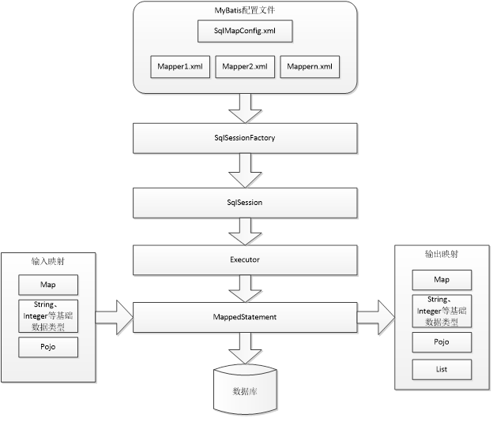

# MyBatis
------------------------------------------

## 概述

MyBatis 本是apache的一个开源项目iBatis, 2010年这个项目由apache software foundation 迁移到了google code，并且改名为MyBatis 。2013年11月迁移到Github。
MyBatis是一个优秀的持久层框架，它对jdbc的操作数据库的过程进行封装，使开发者只需要关注 SQL 本身，而不需要花费精力去处理例如注册驱动、创建connection、创建statement、手动设置参数、结果集检索等jdbc繁杂的过程代码。
Mybatis通过xml或注解的方式将要执行的各种statement（statement、preparedStatemnt、CallableStatement）配置起来，并通过java对象和statement中的sql进行映射生成最终执行的sql语句，最后由mybatis框架执行sql并将结果映射成java对象并返回。


### 传统jdbc编程存在的问题

传统jdbc编程步骤:
1. 加载数据库驱动
2. 创建并获取数据库链接
3. 创建jdbc statement对象
4. 设置sql语句
5. 设置sql语句中的参数(使用preparedStatement)
6. 通过statement执行sql并获取结果
7. 对sql执行结果进行解析处理
8. 释放资源(resultSet、preparedstatement、connection)


存在的问题:
1. 数据库连接创建、释放频繁造成系统资源浪费，从而影响系统性能。如果使用数据库连接池可解决此问题。
2. Sql语句在代码中硬编码，造成代码不易维护，实际应用中sql变化的可能较大，sql变动需要改变java代码。
3. 使用preparedStatement向占有位符号传参数存在硬编码，因为sql语句的where条件不一定，可能多也可能少，修改sql还要修改代码，系统不易维护。
4. 对结果集解析存在硬编码（查询列名），sql变化导致解析代码变化，系统不易维护，如果能将数据库记录封装成pojo对象解析比较方便。

Mybatis与Hibernate的比较:
1. MyBatis需要自己写Sql语句, Hibernate不需要
2. mybatis无法做到数据库无关性, Hibernate数据库无关性好
3. MyBatis灵活, Hibernate不灵活

### mybatis架构



1. mybatis配置
	SqlMapConfig.xml，此文件作为mybatis的全局配置文件，配置了mybatis的运行环境等信息。
	mapper.xml文件即sql映射文件，文件中配置了操作数据库的sql语句。此文件需要在SqlMapConfig.xml中加载。
2. 通过mybatis环境等配置信息构造SqlSessionFactory即会话工厂
3. 由会话工厂创建sqlSession即会话，操作数据库需要通过sqlSession进行。
4. mybatis底层自定义了Executor执行器接口操作数据库，Executor接口有两个实现，一个是基本执行器、一个是缓存执行器。
5. Mapped Statement也是mybatis一个底层封装对象，它包装了mybatis配置信息及sql映射信息等。mapper.xml文件中一个sql对应一个Mapped Statement对象，sql的id即是Mapped statement的id。
6. Mapped Statement对sql执行输入参数进行定义，包括HashMap、基本类型、pojo，Executor通过Mapped Statement在执行sql前将输入的java对象映射至sql中，输入参数映射就是jdbc编程中对preparedStatement设置参数。
7. Mapped Statement对sql执行输出结果进行定义，包括HashMap、基本类型、pojo，Executor通过Mapped Statement在执行sql后将输出结果映射至java对象中，输出结果映射过程相当于jdbc编程中对结果的解析处理过程。

## MyBatis入门程序

### 依赖jar包

Mybatis核心包:mybatis-3.2.7.jar

依赖包: lib文件夹下的所有jar包

驱动包: Mysql或者oracle驱动包

### 核心配置文件

SqlMapConfig.xml是mybatis核心配置文件，配置文件内容为数据源、事务管理。

```xml
<?xml version="1.0" encoding="UTF-8"?>
<!DOCTYPE configuration
PUBLIC "-//mybatis.org//DTD Config 3.0//EN"
"http://mybatis.org/dtd/mybatis-3-config.dtd">
<configuration>
	<environments default="development">
		<environment id="development">
			<transactionManager type="JDBC"></transactionManager>
			<dataSource type="POOLED">
				<property name="driver" value="com.mysql.jdbc.Driver" />
				<property name="url" value="jdbc:mysql://localhost:3306/mybatis01?characterEncoding=utf-8" />
				<property name="username" value="root" />
				<property name="password" value="root" />
			</dataSource>
		</environment>
	</environments>
	<mappers>
		<mapper resource="User.xml"/>
		<mapper resource="mapper/UserMapper.xml"/>
	</mappers>
</configuration>
```
### Sql映射文件

Sql映射文件是用来建立方法与Sql语句之间的映射关系的.

```xml
<?xml version="1.0" encoding="UTF-8"?>
<!DOCTYPE mapper
PUBLIC "-//mybatis.org//DTD Mapper 3.0//EN"
"http://mybatis.org/dtd/mybatis-3-mapper.dtd">
<mapper namespace="usersql">
	<select id="findUserById" parameterType="Integer" resultType="sch.frog.pojo.User">
		select * from user where id = #{id}
	</select>
	
	<select id="findUserLikeOne" parameterType="String" resultType="sch.frog.pojo.User">
		select * from user where username like "%${value}%"
	</select>
	
	<select id="findUserLikeOnePre" parameterType="String" resultType="sch.frog.pojo.User">
		select * from user where username like "%"#{username}"%"
	</select>
	
	
	<insert id="insertUser" parameterType="sch.frog.pojo.User">
		insert into user(username, sex, address, birthday) values(#{username}, #{sex}, #{address}, #{birthday})
	</insert>
	
	<insert id="insertUserReturnId" parameterType="sch.frog.pojo.User">
		<selectKey keyColumn="id" keyProperty="id" order="AFTER" resultType="int">
			select last_insert_id() 
		</selectKey>
		insert into user(username, sex, address, birthday) values(#{username}, #{sex}, #{address}, #{birthday})
	</insert>
	
	<update id="updateUser" parameterType="sch.frog.pojo.User">
		update user set username = #{username}, sex = #{sex}, address = #{address}, birthday = #{birthday} where id = #{id}
	</update>
	
	<delete id="deleteUser" parameterType="Integer">
		delete from user where id = #{id}
	</delete>
</mapper>
```

#### 占位符

*``` #{}```表示一个占位符号, 通过```#{}```可以实现preparedStatement向占位符中设置值, 自动进行java类型和jdbc类型转换。```#{}```可以有效防止sql注入, ```#{}```可以接收简单类型值或pojo属性值。 如果parameterType传输单个简单类型值，```#{}```括号中可以是value或其它名称。
* ```${}```表示拼接sql串，通过```${}```可以将parameterType 传入的内容拼接在sql中且不进行jdbc类型转换， ```${}```可以接收简单类型值或pojo属性值，如果parameterType传输单个简单类型值，```${}```括号中只能是value。

#### parameterType和resultType

* parameterType：指定输入参数类型，mybatis通过ognl从输入对象中获取参数值拼接在sql中。
* resultType：指定输出结果类型，mybatis将sql查询结果的一行记录数据映射为resultType指定类型的对象。如果有多条数据，则分别进行映射，并把对象放到容器List中


#### 增删改标签

insert, delete, update

insert标签下, 主键返回:
有时候, 需要在添加一条记录之后立即返回该记录的主键, 这时候需要用到主键返回方式:
```xml
	<insert id="insertUserReturnId" parameterType="sch.frog.pojo.User">
		<selectKey keyColumn="id" keyProperty="id" order="AFTER" resultType="int">
			select last_insert_id() 
		</selectKey>
		insert into user(username, sex, address, birthday) values(#{username}, #{sex}, #{address}, #{birthday})
	</insert>
```
这里需要注意的是order的属性有两个, 分别是BEFORE, AFTER, 可以分以下几种情况讨论:
1. mysql主键策略为自增时, 使用AFTER(因为是在插入记录后才能得知主键)
2. mysql主键策略为uuid时, 使用BEFORE(因为是先有的uuid值之后插入的记录)
3. oracle数据库使用BEFORE(因为oracle没有主键自增的策略, 需要使用序列来实现主键自增, 所以都是在插入记录之前就已经有了主键)

> 注意, 返回的主键会自动封装到输入参数相关字段中

### 简单的数据库查询

上面配置好了核心配置文件, 同时配置好了sql映射, 就可以根据sql映射的id找到指定的sql语句并执行.
```java
String config = "SqlMapConfig.xml";
InputStream inputStream = Resources.getResourceAsStream(config);	//找到指定的核心配置文件

SqlSessionFactory sessionFactory = new SqlSessionFactoryBuilder().build(inputStream);	//加载核心配置文件, 得到session工厂对象

SqlSession session = sessionFactory.openSession();	//创建一个用于和数据库交互的session

List<User> users = session.selectList("usersql.findUserLikeOne", "小");	//执行指定的sql语句

session.close();	//关闭session
```

* SqlSessionFactory --> SqlSessionFactory是一个接口，接口中定义了openSession的不同重载方法，SqlSessionFactory的最佳使用范围是整个应用运行期间，一旦创建后可以重复使用，通常以单例模式管理SqlSessionFactory。
* SqlSessionFactoryBuilder --> SqlSessionFactoryBuilder用于创建SqlSessionFacoty，SqlSessionFacoty一旦创建完成就不需要SqlSessionFactoryBuilder了，因为SqlSession是通过SqlSessionFactory创建的。所以可以将SqlSessionFactoryBuilder当成一个工具类使用，最佳使用范围是方法范围即方法体内局部变量。
* SqlSession --> SqlSession是一个面向用户的接口，sqlSession中定义了数据库操作方法。每个线程都应该有它自己的SqlSession实例。SqlSession的实例不能共享使用，它也是线程不安全的。因此最佳的范围是请求或方法范围。绝对不能将SqlSession实例的引用放在一个类的静态字段或实例字段中。


selectOne和selectList的区别:
* selectOne查询一条记录，如果使用selectOne查询多条记录则抛出异常
* selectList可以查询一条或多条记录。

## DAO开发方法

上面的演示用, 通过session的方法, 区寻找指定的sql语句, 可以直接执行对应的sql语句. 但是这样不符合面向对象的编程思想, 可维护性差. 正确的方式应该是使用Dao层作为sql语句执行的层, 来进行开发.

Mybatis的DAO开发方式有两种:
1. 原始的Dao开发方式
2. Mapper动态代理的开发方式

### 原始dao层开发

原始的dao层开发实际上很简单, 就是将上面直接执行sql映射中的sql语句封装到每一个dao层对应实现类指定方法中.
```java
private SqlSessionFactory sessionFactory;
public UserDaoImpl(SqlSessionFactory sessionFactory){
	this.sessionFactory = sessionFactory;
}
@Override
public User selectOneUser(Integer id) {
	SqlSession session = sessionFactory.openSession();
	User user = session.selectOne("usersql.findUserById", id);
	session.close();
	return user;
}
...
```

原始dao层开发的存在的问题:
1. Dao方法体存在重复代码：通过SqlSessionFactory创建SqlSession，调用SqlSession的数据库操作方法
2. 调用sqlSession的数据库操作方法需要指定statement的id，这里存在硬编码，不便于开发维护

### Mapper动态代理的方式

采用Mapper动态代理的方式做dao层开发, dao层不需要实现类, 只需要有mapper接口(相当于dao接口)即可. 但是需要满足以下规范:
1. XXXMapper.xml文件中的namespace与mapper接口类的全路径相同
2. Mapper接口的方法名与sql映射文件中的每一个statement的id相同
3. Mapper接口的方法的输入参数与sql映射文件中的每一个statement的parameterType类型相同
4. Mapper接口的方法的输出参数与sql映射文件中的每一个statement的resultType类型相同

只要满足上面四条规范, 就可以使用下面的代码:
```java
//加载核心配置文件以及sql映射文件
SqlSessionFactory sessionFactory = new SqlSessionFactoryBuilder().build(Resources.getResourceAsStream("sqlMapConfig.xml"));
//创建session
SqlSession session = sessionFactory.openSession();
//获取Mapper动态代理对象(有mybatis进行动态代理)
UserMapper mapper = session.getMapper(UserMapper.class);
//执行动态代理对象的某一方法, mybatis, 根据指定的方法名, 到sql映射文件中找到指定的statement语句, 执行指定的sql语句
List<User> users = mapper.findAll();
//关闭session
session.close();
```

> mybatis官方推荐使用mapper代理方法开发mapper接口，程序员不用编写mapper接口实现类，使用mapper代理方法时，输入参数可以使用pojo包装对象或map对象，保证dao的通用性。

## 再谈SqlMapConfig.xml核心配置文件

### 配置内容

SqlMapConfig.xml中配置的内容和顺序如下：
```
properties（属性）
settings（全局配置参数）
typeAliases（类型别名）
typeHandlers（类型处理器）
objectFactory（对象工厂）
plugins（插件）
environments（环境集合属性对象）
	environment（环境子属性对象）
		transactionManager（事务管理）
		dataSource（数据源）
mappers（映射器）
```

> 注意： MyBatis 将按照下面的顺序来加载属性

* properties属性: 可以引用java属性文件中的配置信息
	例如, 有db.properties配置文件:
	```properties
		jdbc.driver=com.mysql.jdbc.Driver
		jdbc.url=jdbc:mysql://localhost:3306/mybatis?characterEncoding=utf-8
		jdbc.username=root
		jdbc.password=root
	```
	则properties中可以这样配置:
	```xml
		<properties resource="db.properties">
			<!-- 在properties内部用property定义属性 -->
			<!-- 如果外部配置文件有该属性，则内部定义属性被外部属性覆盖 -->
			<property name="jdbc.username" value="root123" />
			<property name="jdbc.password" value="root123" />
		</properties>
		<!-- 和spring整合后 environments配置将废除 -->
		<environments default="development">
			<environment id="development">
				<!-- 使用jdbc事务管理 -->
				<transactionManager type="JDBC" />
				<!-- 数据库连接池 -->
				<dataSource type="POOLED">
					<property name="driver" value="${jdbc.driver}" />
					<property name="url" value="${jdbc.url}" />
					<property name="username" value="${jdbc.username}" />
					<property name="password" value="${jdbc.password}" />
				</dataSource>
			</environment>
		</environments>
	```
> 在 properties 元素体内定义的属性首先被读取。 
> 然后会读取properties 元素中resource或 url 加载的属性，它会覆盖已读取的同名属性。 

* typeAliases(类型别名) Mybatis内部已经定的别名有Integer, int等等, 所以使用这些类型时不用使用全限定名. 我们可以为自己创建的类起别名.
	```xml
		<typeAliases>
			<!-- 单个别名定义 -->
			<typeAlias alias="user" type="cn.itcast.mybatis.pojo.User" />
			<!-- 批量别名定义，扫描整个包下的类，别名为类名（大小写不敏感） -->
			<package name="cn.itcast.mybatis.pojo" />
			<package name="其它包" />
		</typeAliases>
	```
> 这样在mapper.xml配置文件中，就可以使用设置的别名了. 别名大小写不敏感, 例如iNT是对的.

* mappers(映射器): 用于配置sql映射位置, 以便于读取映射文件, 配置方式有多种:
	1. 使用相对类路径的资源: <mapper resource="sqlmap/User.xml" />
	2. 使用mapper接口类: <mapper class="sch.frog.mybatis.mapper.UserMapper" />
		此种方法要求mapper接口名称和mapper映射文件名称相同，且放在同一个目录中。
	3. 注册指定包下的所有mapper接口:<package name="sch.frog.mybatis.mapper"/> (开发常用的方式)
		此种方法要求mapper接口名称和mapper映射文件名称相同，且放在同一个目录中.

以下采用包扫描的方式来配置sql映射.

## 输入映射和输出映射

Mapper.xml映射文件中定义了操作数据库的sql，每个sql是一个statement，映射文件是mybatis的核心。

### parameterType输入类型

1. 传递简单类型
	使用#{}占位符，或者${}进行sql拼接
2. 传递pojo对象
	Mybatis使用ognl表达式解析对象字段的值，#{}或者${}括号中的值为pojo属性名称。
3. 传递pojo包装对象
	查询条件可能是综合的查询条件，不仅包括用户查询条件还包括其它的查询条件（比如查询用户信息的时候，将用户购买商品信息也作为查询条件），这时可以使用包装对象传递输入参数. 包装对象：Pojo类中的一个属性是另外一个pojo

### resultType输出类型

1. 输出简单类型
2. 输出pojo对象 -- 单个对象
3. 输出pojo列表 -- list

### resultMap输出类型

resultType可以指定将查询结果映射为pojo，但需要pojo的属性名和sql查询的列名一致方可映射成功。
如果sql查询字段名和pojo的属性名不一致，可以通过resultMap将字段名和属性名作一个对应关系 ，resultMap实质上还需要将查询结果映射到pojo对象中。resultMap可以实现将查询结果映射为复杂类型的pojo，比如在查询结果映射对象中包括pojo和list实现一对一查询和一对多查询。

举例:
```xml
	<resultMap type="sch.frog.pojo.Order" id="OrderMap">
		<id property="id" column="id"/>
		<!--建议加上主键id的映射, 尽管一样-->
		<result property="userId" column="user_id"/>
		<!--没有指定对应映射的字段还会使用默认字段名-->
	</resultMap>
	
	<select id="findAllOrders" resultMap="OrderMap">
		select * from orders
	</select>
```

## 动态sql

通过mybatis提供的各种标签方法实现动态拼接sql。

```xml
	<select id="findUserByWhere" parameterType="sch.frog.pojo.User" resultType="sch.frog.pojo.User">
		select * from user
		<where>
			<if test="sex != null">
				and sex = #{sex}
			</if>
			<if test="username != null and username != ''">
				and username like "%"#{username}"%"
			</if>
		</where>
	</select>
```

上面这个statement可以生成以下sql语句:
1. select * from user
2. select * from user where sex = ?
3. select * from user where username like "%"?"%"
4. select * from user where sex = ? and username like "%"?"%"

```xml
	<select id="findUserByForeach" parameterType="Integer" resultType="sch.frog.pojo.User">
		select * from user
		<where>
			<!-- 
				id in (1,10,26,28)
				foreach : 遍历输入参数
				collection ： 要遍历的集合名称
					当输入参数类型是数组类型时，那么collection = array
					当输入参数类型是集合类型时，那么collection = list
					当输入参数类型是POJO对象类型时，那么collection = 对象属性名
				item: 遍历的每一个元素的名称:注意：这个名称必须和后面的占位符中的参数一致
				separator: 遍历的分隔符;当遍历到最后一位时，不会帮我们添加分隔符了！
				open： 遍历的前缀
				close:遍历的后缀
			 -->
			<foreach collection="list" item="item" open="id in(" close=")" separator=",">
				#{item}
			</foreach>
		</where>
	</select>
```
这个statement可以生成sql语句:
1. select * from user
2. select * from user where id in (?, ?, ?, ?, ? ............)

sql片段:
```xml
	<sql id="selectAll">
		select * from user
	</sql>
	<select id="findOne" parameterType="Integer" resultType="sch.frog.pojo.User">
		<include refid="selectAll"/> where id = #{value}
	</select>
```
上面可以拼接成select * from user where id = ?
> sql片段的作用是用来提取sql语句中的重复代码

## 关联映射

MyBatis只能有一对多和一对一

### 一对一

一对一查询时, 主要还是对返回值封装的问题. 由于需要查询出来的值可能是两个对象中的字段, 所以需要返回对象中拥有两个对象. 有以下解决方法:
1. 使用resultType结合pojo包装类
2. 使用resultMap结合pojo类, 一个pojo类中包含另一个pojo对象

#### 使用resultType结合pojo包装类

pojo包装类:
```java
public class OrderAndUser extends Order{
	private String username;
	private String address;
	get/set...
}
```

mapper:
```java
public List<OrderAndUser> findOrderUser();
```

mapper.xml:
```xml
<select id="findOrderAndUser" resultType="sch.frog.vo.OrderAndUser" >
	select orders.id, orders.user_id as userId, orders.number, orders.createtime, 
		`user`.username, `user`.address from orders left join `user` on orders.user_id = `user`.id
</select>
```

#### 使用resultMap结合pojo类实现关联查询

pojo类:
```java
public class Order {
	// 订单id
	private int id;
	// 用户id
	private Integer userId;
	// 订单号
	private String number;
	// 订单创建时间
	private Date createtime;
	// 备注
	private String note;
	
	private User user;
}
```

mapper.xml:
```xml
	<resultMap type="sch.frog.pojo.Order" id="OrderMap">
		<id property="id" column="id"/>
		<result property="userId" column="user_id"/>
		<association property="user" javaType="sch.frog.pojo.User">
			<id property="id" column="user_id"/>
			<result property="address" column="address"/>
			<result column="username" property="username"/>
		</association>
	</resultMap>
	<select id="findOne" parameterType="Integer" resultMap="OrderMap">
		SELECT
			orders.id,
			orders.user_id,
			orders.number,
			orders.createtime,
			`user`.username,
			`user`.address
		FROM
			orders
		LEFT JOIN `user` ON orders.user_id = `user`.id
		WHERE
			orders.id = #{id}
	</select>
```

mapper类:
```java
public Order findOne(Integer id);
```

### 一对多

一对多时, 可以采用上面的第二种方式进行映射(resultMap).
```xml
	<resultMap type="sch.frog.pojo.User" id="UserWithOrders">
		<id property="id" column="id"/>
		<result property="username" column="username"/>
		<result property="birthday" column="birthday"/>
		<result property="sex" column="address"/>
		<result property="address" column="address" />
		<collection property="orders" javaType="list" ofType="sch.frog.pojo.Order">
			<id property="id" column="oid"/>
			<result property="number" column="number"/>
			<result property="note" column="note"/>
			<result property="createtime" column="createtime"/>
		</collection>
	</resultMap>
	
	<select id="findUserWithOrdersById" parameterType="Integer" resultMap="UserWithOrders">
		SELECT
			`user`.id,
			`user`.username,
			`user`.birthday,
			`user`.sex,
			`user`.address,
			orders.id AS oid,
			orders.number,
			orders.createtime,
			orders.note
		FROM
			`user`
		LEFT JOIN orders ON `user`.id = orders.user_id
		WHERE
			`user`.id = #{id}
	</select>	
```
配置如上.其余略.

> 注意, 关联映射时, 想要封装到对象里的字段必须全部在resultMap中映射出来, 否则, 不会自动封装. 也就是说上面不能写成:
```xml
	<resultMap type="sch.frog.pojo.User" id="UserWithOrders">
		<id property="id" column="id"/>
		<collection property="orders" javaType="list" ofType="sch.frog.pojo.Order">
			<id property="id" column="oid"/>
		</collection>
	</resultMap>
```

## Spring与MyBatis整合

### 整合思路

1. SqlSessionFactory对象应该放到spring容器中作为单例存在
2. 传统dao开发方式中, 应该从spring容器中获得sqlsession对象
3. mapper代理形式中, 应该从spring容器中直接获得mapper代理对象
4. 数据库的连接以及数据库连接池事务管理都交给spring容器来完成

所需jar包:
spring的jar包
Mybatis的jar包
Spring+mybatis的整合包。
Mysql的数据库驱动jar包。
数据库连接池的jar包。

### 配置流程

1. 配置数据源, 数据连接池
2. 创建sqlsessionfactory
```xml
<bean id="sqlSessionFactory" class="org.mybatis.spring.SqlSessionFactoryBean">
	<!-- 配置mybatis核心配置文件 -->
	<property name="configLocation" value="classpath:SqlMapConfig.xml" />
	<!-- 配置数据源 -->
	<property name="dataSource" ref="dataSource" />
</bean>
```

### 传统dao开发方式

首先dao层的类继承SqlSessionDaoSupport类, 该类内部有setSqlSessionFactory方法, 并且有getSqlSession方法. 可以方便进行SqlSession的访问.

所以dao层这样配置:
```xml
<bean id="UserDao" class="sch.frog.dao.UserDaoImpl">
	<property name="sqlSessionFactory" ref="sqlSessionFactory"></property>
</bean>
```

其余mapper映射的配置略.
dao层代码如下:
```java
public List<User> findAll() {
	SqlSession session = getSqlSession();
	List<User> list = session.selectList("userMapper.findAll");
	return list;
}
```

所以, 如下测试即可:
```java
@Test
public void demo01(){
	ApplicationContext ac = new ClassPathXmlApplicationContext("applicationContext.xml");
	
	UserDao userDao = (UserDao) ac.getBean("UserDao");
	List<User> list = userDao.findAll();
	for (User user : list) {
		System.out.println(user);
	}
}
```

### mapper代理方式开发

1. 配置mapper映射文件
2. 编写mapper接口
3. 配置applicationContext.xml
```xml
<bean id="UserMapper" class="org.mybatis.spring.mapper.MapperFactoryBean">
	<!-- 配置Mapper接口 -->
	<property name="mapperInterface" value="sch.frog.mapper.UserMapper" />
	<!-- 配置sqlSessionFactory -->
	<property name="sqlSessionFactory" ref="sqlSessionFactory" />
</bean>
```

单元测试:
```java
@Test
public void demo02(){
	ApplicationContext ac = new ClassPathXmlApplicationContext("applicationContext.xml");
	
	UserMapper mapper = (UserMapper) ac.getBean("UserMapper");
	List<User> list = mapper.findAll();
	for (User user : list) {
		System.out.println(user);
	}
}
```

上面这种配置方式, 需要读取sqlMapConfig.xml, 到里面找到映射文件. 更方便的方式是开启包扫描. 并将包扫描交给Spring来管理.
```xml
<bean class="org.mybatis.spring.mapper.MapperScannerConfigurer">
	<!-- 配置Mapper接口 -->
	<property name="basePackage" value="sch.frog.mapper" />
</bean>
```
这样sqlMapConfig.xml中就不需要配置任何东西了. Spring实例化MapperScannerConfigurer对象后, 扫描指定包中所有mapper.class和mapper.xml, 并代理所有mapper对象, 使用是直接通过getBean获取即可(注: 每个mapper代理对象的id就是类名首字母小写)

这里最终的applicationContext.xml内容如下:
```xml
<?xml version="1.0" encoding="UTF-8"?>
<beans xmlns="http://www.springframework.org/schema/beans"
	xmlns:context="http://www.springframework.org/schema/context" 
	xmlns:p="http://www.springframework.org/schema/p"
	xmlns:aop="http://www.springframework.org/schema/aop" 
	xmlns:tx="http://www.springframework.org/schema/tx"
	xmlns:xsi="http://www.w3.org/2001/XMLSchema-instance"
	xsi:schemaLocation="http://www.springframework.org/schema/beans 
		http://www.springframework.org/schema/beans/spring-beans-4.0.xsd
		http://www.springframework.org/schema/context 
		http://www.springframework.org/schema/context/spring-context-4.0.xsd
		http://www.springframework.org/schema/aop 
		http://www.springframework.org/schema/aop/spring-aop-4.0.xsd 
		http://www.springframework.org/schema/tx 
		http://www.springframework.org/schema/tx/spring-tx-4.0.xsd
		http://www.springframework.org/schema/util 
		http://www.springframework.org/schema/util/spring-util-4.0.xsd">

	<context:property-placeholder location="classpath:db.properties" />
	
	<bean id="dataSource" class="org.apache.commons.dbcp.BasicDataSource"
		destroy-method="close">
		<property name="driverClassName" value="${jdbc.driver}" />
		<property name="url" value="${jdbc.url}" />
		<property name="username" value="${jdbc.username}" />
		<property name="password" value="${jdbc.password}" />
		<property name="maxActive" value="10" />
		<property name="maxIdle" value="5" />
	</bean>

	<bean id="sqlSessionFactory" class="org.mybatis.spring.SqlSessionFactoryBean">
		<property name="configLocation" value="classpath:SqlMapConfig.xml" />
		<property name="dataSource" ref="dataSource" />
	</bean>
	
	<bean class="org.mybatis.spring.mapper.MapperScannerConfigurer">
		<property name="basePackage" value="sch.frog.mapper" />
	</bean>
<beans>
```

## MyBatis逆向工程

使用官方网站的Mapper自动生成工具mybatis-generator-core-1.3.2来生成po类和Mapper映射文件

仅仅是一个工具, 用于快速生成常用mapper的.

项目已经搭建好. 只需要更改:
1. 数据源
2. mapper.xml生成位置
3. mapper.java生成位置
4. pojo生成位置
5. 需要生成文件的数据库表

即可, 最终生成4个文件:
1. mapper.java
2. mapper.xml
3. pojo.java
4. pojoExample.java

在mapper.java中会生成常用的增删改查方法:
例如:
```java
List<User> selectByExample(UserExample example);
User selectByPrimaryKey(Integer id);
```

其中selectByPrimaryKey是根据主键id查询记录, selectByExample是条件查询, 如果example为null就是查询所有.


## MyBatis一个方法传递多个形参

直接上例程, 不用再添加任何配置, 配置mapper扫描即可. 关键是@Param注解
```java
List<Customer> findForPageWithQueryVO(@Param("pageVo") Page<Customer> pageVo, @Param("queryVo")QueryVo queryVo);
```
对应mapper文件:
```xml
<select id="findForPageWithQueryVO" resultMap="customer">
	SELECT
		customer.cust_id,
		customer.cust_name,
		customer.cust_phone,
		customer.cust_mobile,
		b1.dict_item_name as cust_source,
		b2.dict_item_name as cust_industry,
		b3.dict_item_name as cust_level
	FROM
		customer
	LEFT JOIN base_dict b1 ON customer.cust_source = b1.dict_id
	LEFT JOIN base_dict b2 ON customer.cust_industry = b2.dict_id
	LEFT JOIN base_dict b3 ON customer.cust_level = b3.dict_id
	<where>
		<if test="queryVo.custName != null and queryVo.custName != ''">
			AND cust_name like "%"#{queryVo.custName}"%"
		</if>
		<if test="queryVo.custSource != null and queryVo.custSource != ''">
			AND b1.dict_id = #{queryVo.custSource}
		</if>
		<if test="queryVo.custIndustry != null and queryVo.custIndustry != ''">
			AND b2.dict_id = #{queryVo.custIndustry}
		</if>
		<if test="queryVo.custLevel != null and queryVo.custLevel != ''">
			AND b3.dict_id = #{queryVo.custLevel}
		</if>
	</where>
	LIMIT #{pageVo.start}, #{pageVo.pageSize}
</select>
```