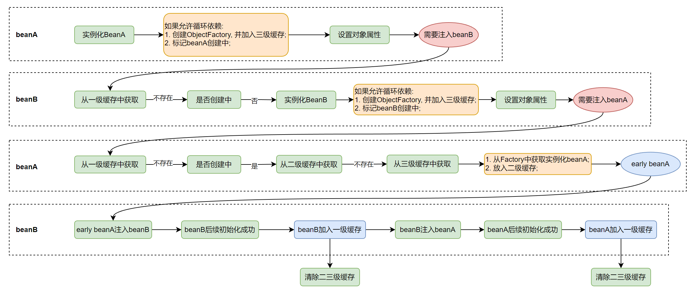

# Spring基础知识

## 概述

* IOC -- Inversion Of Control, 控制反转. 传统程序中, 应用程序控制着对象的创建和管理, IOC中, 发生反转, 对象的生命周期由Spring容器来控制;
* AOP -- Aspect Oriented Programming, 面向切面编程. 

## IOC

### Bean注入的方式

* `@Autowired`
* JDK提供的`@Resource`和`@Inject`
* 使用xml文件
* Spring4.3开始, 如果只有一个有参构造, 当这个Bean实例化时, 会自动对构造器形参进行注入

> Autowired是先byType再byName, 如果不存在会报错; Resource是先byName再byType, 如果匹配不到会抛异常

> Autowired不仅可以注入单个对象, 还能注入List, Set, array, Map; 并且注入Map时, key就是beanName

### Spring Bean生命周期

Spring Bean生命周期按顺序如下:

1. **实例化Bean**: 对于BeanFactory容器, 当客户向容器请求一个尚未初始化的bean时, 或者初始化bean的时候, 需要注入另一个尚未初始化的依赖是, 容器会调用createBean进行实例化. 对于ApplicationContext容器, 当容器启动结束后, 通过BeanDefinition对象中的信息, 实例化所有的Bean.
2. **设置对象属性(依赖注入)**: 实例化后的对象被封装在BeanWrapper对象中, 紧接着, Spring根据BeanDefinition中的信息, 以及通过BeanWrapper提供的设置属性的接口完成依赖注入.
3. **处理Aware接口**: 接着, Spring会检测该对象是否实现了xxxAware接口, 并将相关的xxxAware实例注入给Bean:
    * 如果这个Bean已经实现了BeanNameAware接口, 会调用它实现的setBeanName(beanId)方法, 此处beanId就是配置文件中的Bean的id值
    * 如果这个Bean实现了BeanFactoryAware接口, 会调用它实现的setBeanFactory()方法, 传递的是BeanFactory
    * 如果这个Bean已经实现了ApplicationContextAware接口, 会调用setApplicationContext()方法, 传入ApplicationContext
4. **BeanPostProcessor**: 如果想对Bean进行一些自定义的处理, 那么可以让Bean实现了BeanPostProcessor接口, 那么将会调用postProcessBeforeInitialization(obj, s)方法
5. **InitializingBean**: 如果实现了InitializingBean, 则调用afterPropertiesSet方法
6. **init-method**: 如果Bean在Spring配置文件中配置了init-method属性, 则会自动调用其配置的初始化方法
7. **BeanPostProcessor**: 和上面一样, 如果实现了BeanPostProcessor接口, 将会调用postProcessorAfterInitialization(obj, s)方法; 由于这个方法是在Bean初始化结束时调用的, 所以可以被应用于内存或者缓存技术.
8. **注册Destruction回调**: `AbstractAutowireCapableBeanFactory.registerDisposableBeanIfNecessary`中对实现了DisposableBean的类或者自定义销毁方法的的bean进行回调注册.
9. **DisposableBean**: 当Bean不在需要时, 会经过清理阶段, 如果Bean实现了DisposableBean这个接口, 会调用其实现的destory()方法;
10. **destory-method**: 最后, 如果这个Bean的Spring配置中配置了destory-method属性, 会自动调用其配置的销毁方法.

> 前1--8步在`AbstractAutowireCapableBeanFactory`类中, 9--10步在`DisposableBeanAdapter`类中

<image src="img/spring_bean_lifecycle.png" height="450px">

示例代码如下(方法调用顺序与方法定义顺序一致):

```java
package sch.frog.learn.spring.app;

import org.springframework.beans.BeansException;
import org.springframework.beans.factory.config.BeanPostProcessor;
import org.springframework.stereotype.Component;

@Component
public class GlobalLifeCycleDemoBean implements BeanPostProcessor {
    @Override
    public Object postProcessBeforeInitialization(Object bean, String beanName) throws BeansException {
        System.out.println("postProcessBeforeInitialization : " + bean + ", beanName : " + beanName);
        return bean;
    }

    @Override
    public Object postProcessAfterInitialization(Object bean, String beanName) throws BeansException {
        System.out.println("postProcessAfterInitialization : " + bean + ", beanName : " + beanName);
        return bean;
    }
}

//---------------分割线------------------

package sch.frog.learn.spring.app;

import org.springframework.beans.BeansException;
import org.springframework.beans.factory.*;
import org.springframework.context.ApplicationContext;
import org.springframework.context.ApplicationContextAware;
import org.springframework.stereotype.Component;

import javax.annotation.PostConstruct;
import javax.annotation.PreDestroy;

@Component
public class LifeCycleDemoBean implements BeanNameAware, BeanClassLoaderAware,
        BeanFactoryAware, ApplicationContextAware,
        InitializingBean, DisposableBean {

    public LifeCycleDemoBean() {
        System.out.println("contructor");
    }

    @Override
    public void setBeanName(String s) {
        System.out.println("set bean name : " + s);
    }

    @Override
    public void setBeanClassLoader(ClassLoader classLoader) {
        System.out.println("set bean class loader : " + classLoader.toString());
    }

    @Override
    public void setBeanFactory(BeanFactory beanFactory) throws BeansException {
        System.out.println("set bean factory : " + beanFactory);
    }

    @Override
    public void setApplicationContext(ApplicationContext applicationContext) throws BeansException {
        System.out.println("set applicatoin context : " + applicationContext.getApplicationName());
    }

    // 执行全局的 BeanPostProcessor.postProcessBeforeInitialization

    @PostConstruct
    public void postConstructor(){
        System.out.println("PostConstruct");
    }

    @Override
    public void afterPropertiesSet() throws Exception {
        System.out.println("afterPropertiesSet");
    }

    // 执行全局的 BeanPostProcessor.postProcessAfterInitialization

    @PreDestroy
    public void preDestory(){
        System.out.println("PreDestroy");
    }

    @Override
    public void destroy() throws Exception {
        System.out.println("destroy");
    }
}
```

### 循环依赖

两个或者多个bean之间互相依赖, 形成循环引用的情况. 如果不加以处理, 会导致应用程序启动失败. Spring引入三级缓存用以解决循环依赖.

限制: 1. 互相依赖的Bean必须是单例的; 2. 依赖注入的方式不能是构造函数注入(构造器循环依赖用@Lazy可以解决);

* singletonObjects: 一级缓存, 存储完整创建好的单例bean对象
* earlySingletonObjects: 二级缓存, 存储尚未完全创建好的单例bean对象
* singletonFactories: 三级缓存, 存储单例bean的创建工厂

> bean的创建起始于`org.springframework.beans.factory.support.AbstractAutowireCapableBeanFactory#createBean(java.lang.Class<T>)`方法, 可以从这个方法一点点看到它的逻辑

bean创建的流程, 上面bean生命周期中已经有了. 结合循环依赖下的三级缓存的流程如下:



总结就是: beanA创建阶段将自己的ObjectFactory放入三级缓存, 然后发现需要注入beanB, 触发创建beanB, 这时有需要注入beanA, 从三级缓存中取到beanA的factory, 创建beanA, 使得beanB创建成功, 继而beanA也创建成功;

> 解决循环依赖一定需要三级缓存吗?
> 答: 从上图也能看出, 只需要二级缓存也可以, 之所以使用三级缓存, 是为了考虑AOP代理对象. 正常情况下, AOP代理对象是在BeanPostProcessor.postProcessAfterInitialization阶段转换的, 如果只使用二级缓存, 就是上图中"加入三级缓存"改成"加入二级缓存", 那么就需要保证二级缓存中必须是AOP代理对象, 也就需要把所有的代理对象都提前创建出来, 这就打破了上面的BeanPostProcessor设计. 如果采用三级缓存, 只需从factory中获取对象时才需要稍微破坏一下, 其余依旧保持原样.

> @Lazy是如何解决循环依赖的?
> 答: 有Lazy注解注入的地方, 会先注入一个临时的代理对象, 在真正使用的时候, 会返回实际的对象.

> SpringBoot2.6及以后的版本呢默认不支持循环依赖, 需要手动加上配置`spring.main.allow-circular-references=true`.

### BeanFactory和FactoryBean

* BeanFactory就是Bean工厂, 是整个SpringIOC容器的一部分, 负责管理Bean的创建和生命周期; ApplicationContext就是BeanFactory的一个实现类. 常用方法例如: `applicationContext.getBean(name)`;
* FactoryBean用于定义一个工厂Bean, 它可以产生某种类型的对象. 当Spring配置文件中定义一个Bean时, 如果这个Bean实现了FactoryBean接口, 那么FactoryBean.getObject()返回值会放入到IOC容器中.

### bean的作用域

Spring容器中的bean可以分为5个范围:
* singleton: 默认, 每个容器中只有一个bean的实例, 单例的模式由BeanFactory自身来维护
* prototype: 为每一个bean请求提供一个实例
* request: 为每一个网络请求创建一个实例, 在请求完成以后, bean会失效并被垃圾回收器回收
* session: 与request范围类似, 确保每一个session中有一个bean实例, 在session过期之后, bean会随之失效
* global-session: 全局作用域, global-session和Portlet应用相关. 当你的应用部署在Portlet容器中工作时, 它包含很多portlet, 如果你想要声明让所有的portlet共用全局的存储变量的话, 那么这全局变量需要存储在global-session中, 全局作用域与Servlet中的session作用域效果相同

### 让某个Bean在其他另一个bean之前初始化

* 使用@Autowired, 会先初始化注入的bean
* 使用@DependsOn, 指定需要先初始化某个bean
* 利用BeanFactoryPostProcessor, 在实现方法中使用beanFactory.getBean(xxx.class)触发指定bean的优先初始化

> 注意, @Order只能控制同一类型bean在集合中的顺序, 不能控制不同类型bean的初始化顺序

## AOP

* 基本概念: Aspect -- 切面; PointCut -- 切入点; Advice -- 通知; Target -- 目标对象; JoinPoint -- 连接点; Weaving -- 织入;
* 常用场景: 参数校验, 缓存, 日志打印, 事务管理.

```java
@Target(ElementType.METHOD)
@Retention(RetentionPolicy.RUNTIME)
public @interface OpLog{}

@Aspect
@Component
public class OpLogAspect{   // 这整个类就是一个切面
    private static final Logger logger = LoggerFactory.getLogger(OpLogAspect.class);

    @Autowired
    private HttpServletRequest request;

    @Around("@annotation(xxx.xxx.xxx.annotation.OpLog)") // 这个就是PointCut, 类似的注解还有: Pointcut, Before, After等
    public Object log(ProceedingJoinPoint pjp/*这个就是joinPoint连接点*/) throws Exception{
        /*
         * 这个方法里面的内容就是Advice
         */
        Method method = ((MethodSignature)pjp.getSignature()).getMethod();
        OpLog opLog = method.getAnnotation(OpLog.class);

        Object response = null;
        try{
            response = pjp.proceed();
        }catch(Throwable t){
            throw new Exception(t);
        }

        logger.info("log");
        return response;
    }

    // 织入工作由Spring完成, 将切面与业务逻辑连接起来
}
```

**AOP通知类型**

* 前置通知(Before advice): 在某连接点(join point)之前执行的通知, 但这个通知不能阻止连接点前的执行(除非它抛出一个异常)
* 返回后通知(After returning advice): 在某连接点(join point)正常完成后执行的通知. 例如: 一个方法没有抛出任何异常, 正常返回
* 抛出异常后通知(After throwing advice): 在方法抛出异常退出时执行的通知
* 后通知(After (finally) advice): 当某连接点退出的时候执行的通知(不论是正常返回还是异常退出)
* 环绕通知(Around Advice): 包围一个连接点(join point)通知, 如方法调用.

## 事务

**Spring事务种类**

* 编程式事务: 使用transactionTemplate
* 声明式事务: 建立在AOP之上, 本质就是通过AOP对方法进行around

> 声明式事务的优点: 使用@Transactional注解, 侵入低, 不污染代码
> 声明式事务的缺点: 粒度只能到方法级别, 无法做到代码块级别

声明式事务演示:

```java
@Transactional(propagation = Propagation.REQUIRED, isolation = Isolation.DEFAULT, timeout = 30 /*秒*/, readOnly = false, rollbackFor = Exception.class)
```

> rollbackFor指定哪些异常会触发事务回滚, 如果不指定, 默认是RuntimeException和Error会触发事务回滚
> propagation用于控制多个事务方法相互调用时的事务行为, 默认是Propagation.REQUIRED

**传播行为**

* REQUIRED: 如果当前没有事务, 就创建一个新事务, 如果当前存在事务, 就加入该事务
* SUPPORTS: 支持当前事务, 如果当前存在事务, 就加入该事务, 如果当前不存在事务, 就以非事务执行
* MANDATORY: 支持当前事务, 如果当前存在事务, 就加入该事务, 如果当前不存在事务, 就抛出异常
* REQUIRES\_NEW: 创建新事务, 无论当前存不存在事务, 都创建新事务(独立于原来的事务, 两个事务互不影响)
* NOT\_SUPPORTED: 以非事务方式执行操作, 如果当前存在事务, 就把当前事务挂起
* NEVER: 以非事务方式执行, 如果当前存在事务, 则抛出异常
* NESTED: 如果当前存在事务, 则在嵌套事务内执行. 如果当前没有事务, 则按REQUIRED属性执行(里面事务回滚不会影响到外面, 外面事务回滚, 里面一同回滚)

**隔离级别**

* DEFAULT: 这是个 PlatfromTransactionManager 默认的隔离级别, 使用数据库默认的事务隔离级别
* READ\_UNCOMMITTED: 读未提交, 允许另外一个事务可以看到这个事务未提交的数据
* READ\_COMMITTED: 读已提交, 保证一个事务修改的数据提交后才能被另一事务读取, 而且能看到该事务对已有记录的更新
* REPEATABLE\_READ: 可重复读, 保证一个事务修改的数据提交后才能被另一事务读取, 但是不能看到该事务对已有记录的更新
* SERIALIZABLE: 一个事务在执行的过程中完全看不到其他事务对数据库所做的更新

**@Transactional事务失效**

* 代理失效
  * @Transactional应用在非public方法上, 没法应用动态代理
  * 同一个类中方法调用, 走的是this调用, 没法应用动态代理
  * final, static方法: final方法无法子类化和覆盖, 所以无法代理; static方法不属于对象, 无法AOP;
  * 没有被Spring容器管理
* Transactional用的不对
  * propagation设置错误
  * rollbackFor设置错误
    * 默认情况下, spring事务只会对RuntimeException和Error这些非受检异常进行回滚;
* 异常被捕捉
* 事务中使用了多线程
  * @Transactional使用的是ThreadLocal机制来存储事务上下文(connection包含在其中), ThreadLocal是线程隔离的, 新线程中的操作不会被包含在原有事务中.
* 数据库不支持事务

> 如果@Transactional和@Async注解加在同一个方法上, 那么事务不会失效, 但是如果@Transactional注解的方法调用了@Async的方法, @Async的方法不会触发@Transactional方法事务的回滚

## 设计模式

* 工厂模式: BeanFactory就是一个简单的工厂模式的体现, 用来创建对象的实例.
* 单例模式: Bean默认为单例模式.
* 代理模式: Spring的AOP功能用到了JDK的动态代理和CGLIB字节码生成技术.
* 模板方法模式: 用来解决代码重复的问题. restTemplate, jdbcTemplate
* 观察者模式: 定义对象间一种一对多的依赖关系, 当一个对象的状态发生改变时, 所有依赖它的对象都会得到通知被动更新, 例如SpringListener的实现--ApplicationListener
* 适配器模式: Spring MVC的HandlerAdapter就是适配器模式
* 责任链模式: Spring MVC拦截器

## SpringMVC

Spring MVC是指Model-View-Controller, 即: 模型-视图-控制器.

### 工作原理

<image src="img/spring_mvc.png" height="450px">

1. 客户端请求, 进入DispatchServlet, 访问dispatchServlet的doService方法
   * DispatcherServlet就是HttpServlet的实现类(HttpServlet是java servlet API定义的处理web请求的interface).
2. DispatchServlet根据请求信息调用HandlerMapping, 解析请求对应的Handler
3. 开始执行匹配的拦截器
4. 根据解析到的handler, 交由HandlerAdapter处理(HandlerAdapter内部会调用具体的Handler, 即Controller)
5. 处理完成, 返回ModelAndView, Model是返回的数据对象, View是逻辑视图
6. ViewResolver会根据逻辑View查找实际的View
7. DispatcherServlet把返回的Model传给View(视图渲染)
8. 把View返回给请求者

> HandlerMapping的抽象实现AbstractHandlerMapping中有如何通过url寻找Handler的代码, 可以理解为一个map, key是url, value是handler.

### 如何动态添加RequestMapping*

假如有这样一种场景: 需要对一个jar包进行热插拔, 当jar包加载进去之后, 就需要动态的加载RequestMapping, 如果jar包移除就需要动态的移除RequestMapping. 可以这样做:

动态添加RequestMapping:

```java
RequestMappingHandlerMapping requestMappingHandlerMapping = SpringUtil.getBean(RequestMappingHandlerMapping.class);
Object object = applicationContext.getBean(beanName);  // 需要注册的controller
if(object != null && requestMappingHandlerMapping != null){
    Method method = requestMappingHandlerMapping.getClass().getSuperclass().getSuperclass().getSuperclass().getDeclaredMethod("detectHandlerMethods", Object.class);
    method.setAccessible(true);
    method.invoke(requestMappingHandlerMapping, object);
}
```

移除RequestMapping:

```java
RequestMappingHandlerMapping requestMappingHandlerMapping = SpringUtil.getBean(RequestMappingHandlerMapping.class);
Object object = applicationContext.getBean(beanName);  // 需要注册的controller
requestMappingHandlerMapping.getHandlerMethods().forEach((mappingInfo, handlerMethod) -> {
    if(handlerMethod.getBean().equals(object)){
        requestMappingHandlerMapping.unregisterMapping(mappingInfo);
    }
});
```

### 全局异常捕捉

```java
@RestControllerAdvice
public class GlobalExceptionHandler {
    private static final Logger logger = LoggerFactory.getLogger(GlobalExceptionHandler.class);

    @ExceptionHandler(ShiroException.class)
    @ResponseBody
    public Object handleNoAuthException(HttpServletRequest request, HttpServletResponse response, Exception e) {
        String requestId = RequestUtil.getRequestId();
        logger.error("no auth when processing the request[{}] form action[{}]", requestId, request.getRequestURI(), e);
        return EchoErrorBuilder.builder().code(EchoError.AUTH_FAILURE).message("no auth").requestId(requestId).build();
    }

    @ExceptionHandler(Exception.class)
    @ResponseBody
    public Object handOtherException(HttpServletRequest request, HttpServletRequest response, Exception e){
        String requestId = RequestUtil.getRequestId();
        logger.error("internal exception when processing the request[{}] form action[{}]", requestId, request.getRequestURI(), e);
        return EchoErrorBuilder.builder().code(EchoError.INTERNAL_ERROR).message("internal exception").requestId(requestId).build();
    }
}
```

主要是两个注解:

* RestControllerAdvice
* ExceptionHandler

### 父子容器

在传统的SSM架构中, 是存在父子容器的, 即controller层通常是子容器, service和dao是父容器, 子容器可以访问父容器, 但是父容器不能访问子容器. 现在的项目一般都是SpringBoot, 这时不论controller, service, dao都是在同一个容器中, 不存在父子容器了.

## SpringBoot

SpringBoot的主要用途是实现了自动装配和自动配置. 简化了应用程序的配置和Bean的管理.

### 自动配置

通过`Configuration`, `Compont`等注解可以进行自动配置, bean注入等, 但是这个前提是, spring只会扫描启动类下面的包里的这些注解, 对于依赖的第三方jar中的Spring配置需要如何让Spring扫描到呢. 这时需要在`META-INF/spring/org.springframework.boot.autoconfigure.AutoConfiguration.imports`文件中添加类似配置:`sch.frog.custom.config.FrogCustomConfiguration`. Spring在启动时自动扫描classpath目录下的所有这个文件, 然后就可以加载第三方的配置了.

> 旧版Spring中, 这个配置放在`META-INF/spring.factories`中, 配置形式类似: `org.springframework.boot.autoconfigure.EnableAutoConfiguration=sch.frog.custom.config.FrogCustomConfiguration`

**条件化配置**

条件化配置注解有: `Conditional`, `ConditionalOnClass`, `ConditionalOnMissingBean`, `ConditionalOnProperty`等;

### 启动流程

如下是Spring Boot启动的入口:

```java
@SpringBootApplication
public class SparrowApplication {
    public static void main(String[] args){
        SpringApplication.run(SparrowApplication.class, args);
    }
}
```

调用流程如下:

1. 创建SpringApplication实例
   1. 确定是Servlet容器还是reactive容器;
   2. 获取上下文初始化器`BootstrapRegistryInitializer`;
   3. 获取应用程序初始化器`ApplicationContextlnitializer`;
   4. 获取监听器`ApplicationListener`;
   5. 确定启动主类(这个主类并没有什么关键用途, 只是用来输出日志);
2. 执行run方法
   1. 启动计时器;
   2. 获取监听器, 触发`ApplicationStartingEvent`事件;
   3. 配置环境变量;
   4. 打印Banner;
   5. 创建`ApplicationContext`;
   6. 准备`ApplicationContext`, 包括加载Bean定义等;
   7. 刷新`ApplicationContext`, 完成Bean的创建和初始化, 以及web容器启动(详见下面)等;
   8. 刷新后置处理器;
   9.  停止计时器;
   10. 触发`ApplicationStartedEvent`事件;
   11. 调用实现了`CommandLineRunner`或`ApplicationRunner`接口的Bean.

**web容器的启动**

main方法中调用`SpringApplication.run` --> `refreshContext` --> `refresh` --> `onRefresh`, 最终`ServletWebServerApplicationContext.onRefresh`中会调用`createWebServer`方法. 从而调用了内置的web容器(默认是tomcat).

如果不用tomcat, 改成别的, 直接将他的starter依赖引入即可, 不需要任何配置.

### 优雅停机

**生成进程id**

如下代码会在spring boot启动后, 生成一个app.pid文件.

```java
@SpringBootApplication
public class SparrowApplication {
    public static void main(String[] args){
        SpringApplication application = new SpringApplication(SparrowApplication.class);
        application.addListeners(new ApplicationPidFileWriter("app.pid"));
        application.run(args);
    }
}
```

之后, 在停机时, 执行: ```cat app.pid | xargs kill```;

**延迟停机**

在`application.properties`配置文件中配置`server.shutdown=graceful`(默认值: `immediate`), 当服务停止时, 不再接受新的请求. 并且服务器也不会立即关闭, 而是等待正在进行的请求处理完成, 其中, 这里的等待时间可以通过`spring.lifecycle.timeout-per-shutdown-phase=2m`设置为2分钟(默认是30s)

**Actuator**

pom文件增加依赖:
```xml
<dependency>
    <groupId>org.springframework.boot</groupId>
    <artifactId>spring-boot-starter-actuator</artifactId>
</dependency>
```

增加配置项:
```
management.endpoint.web.exposure.include=*
management.endpoint.shutdown.enabled=true
```

然后就可以通过`curl -X POST http://localhost:8090/actuator/shutdown`, 实现关机.

**Shutdown Hook**

* `DisposableBean`实现类的`destroy`方法;
* 有`PreDestroy`注解的方法
* 通过`Runtime.getRuntime().addShutdownHook(new Thread(...))`注册的shutdown hook
* 通过Spring事件机制注册hook:

```java
@Component
public class TestListener implements ApplicationListener<ContextClosedEvent> {
    @Override
    public void onApplicationEvent(ContextClosedEvent event) {
        // do something
    }
}
```

### 自定义starter

starter可以作为特定功能或者组件的配置单元, 简化配置过程, 让项目轻松的重用这些功能.

1. 增加依赖:

```xml
        <dependency>
            <groupId>org.springframework.boot</groupId>
            <artifactId>spring-boot-starter</artifactId>
        </dependency>
```
2. 编写配置逻辑;
3. 创建配置类入口文件`META-INF/spring/org.springframework.boot.autoconfigure.AutoConfiguration.imports`, 并配置(详见上面的自动配置)

### 多环境配置

环境变量中添加: `SPRING_PROFILES_ACTIVE=prod`或者JVM参数增加`-Dspring.profiles.active=prod`;


### 配置文件加载顺序

1. 默认配置(通过SpringApplication.setDefaultProperties方法设置);
2. @PropertySource注解加载的配置
3. classpath下的:
   1. bootstrap.yml或bootstrap.properties;
   2. application.yml或application.properties;
   3. application-{profile}.yml或application-{profile}.properties;
4. classpath/config下的:
   1. bootstrap.yml或bootstrap.properties;
   2. application.yml或application.properties;
   3. application-{profile}.yml或application-{profile}.properties;
5. 项目根目录下:
   1. bootstrap.yml或bootstrap.properties;
   2. application.yml或application.properties;
   3. application-{profile}.yml或application-{profile}.properties;
6. 项目根目录/config下:
   1. bootstrap.yml或bootstrap.properties;
   2. application.yml或application.properties;
   3. application-{profile}.yml或application-{profile}.properties;
7. 操作系统环境变量等特殊配置源;
8. Servlet容器相关初始化参数;
9. SPRING_APPLICATION_JSON格式的环境变量或系统属性;
10. 命令行参数;
11. 测试相关的属性注入方式（如@SpringBootTest、@DynamicPropertySource和@TestPropertySource）

> 后加载的文件中的配置覆盖先加载的, 所以后加载的配置优先级高;

> 同类文件加载顺序: .yaml>.yml>.properties

> 如果是自定义文件名, 可以在项目启动时通过: `spring.config.name`配置文件名, 通过`spring.config.location`配置文件路径;


## 常用注解

* `@Component`, `@Service`, `@Repository`, `@Controller`这几个注解都是用来声明bean的, 功能上几乎没有差异, 但是语义上存在区别;
* `@Bean`: 也是用来声明bean的, 用在方法上, 将方法的返回值放入Spring的bean容器;
* `@Configuration`: 标记一个类为配置类, 配合`@Bean`注解来管理bean的创建等;(Configuration修饰的类也会放入spring容器中)
* `@Configurable`: 这个注解不常用, 用来向普通的非Spring对象中注入Bean, 具体用法有点复杂也不常用, 这里不做介绍.
* `@RestController`
* `@RequestMapping`, `@PostMapping`, `@GetMapping`, `@PutMapping`, `@DeleteMapping`
* `@Value`: 设置配置值的, 示例:`@Value("${spring.application.name}")`或者`@Value("${spring.application.name:xxx}")`
* `@Import`: 类注解, 用来指定将某一个或多个类的实例对象注入到spring容器中
* `@PropertySource`: 用来加载配置, 示例如下:

```
fff.properties文件:
aaa=123

代码:

@Configuration
@PropertySource(value = "classpath:fff.properties")
public class FFFConfiguration {

    @Value("${aaa}")
    private String aaa;
}
```