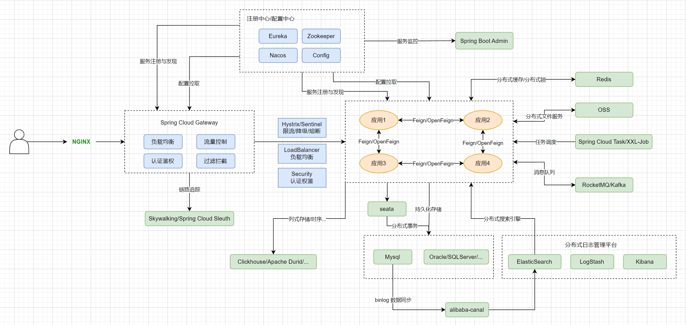

# Spring Cloud

## 常用组件

Spring Cloud是基于SpringBoot的分布式系统开发工具, 主要目标是解决: 服务注册发现, 负载均衡, 配置管理, 断路器, 消息总线等;

* 服务注册发现
  * Eureka
  * Nacos
  * Consul
  * Zookeeper
* 配置中心
  * Config
  * Nacos
  * Consul
* 负载均衡
  * Ribbon: 客户端负载均衡组件;(已不维护, 推荐使用LoadBalancer)
  * LoadBalancer
  * Nginx
* 限流
  * Sentinel
  * Rate Limiter
  * Lstio
* 熔断/降级
  * Hystrix: 熔断
  * Sentinel: 熔断/降级
* 服务间调用
  * Feign: 已过时;
  * OpenFeign: http调用;
  * Dubbo
  * gRPC
  * Thrift RPC
* 网关
  * SpringCloudGateway: 取代Zuul的第二代网关, 提供路由转发, 权限校验, 限流控制等;
  * Zuul: 
* 认证
  * Security: 简化Auth2认证和资源保护
* 监控
  * Sleuth
  * skywalking
  * zipkin
  * Prometheus
* 消息总线
  * RocketMQ
  * Kafka
* 缓存
  * Redis
* 文件存储
  * OSS(Object Storage Service)
* 分布式事务
  * Seata
* 任务调度
  * XXL-Job
  * SpringCloudTask
