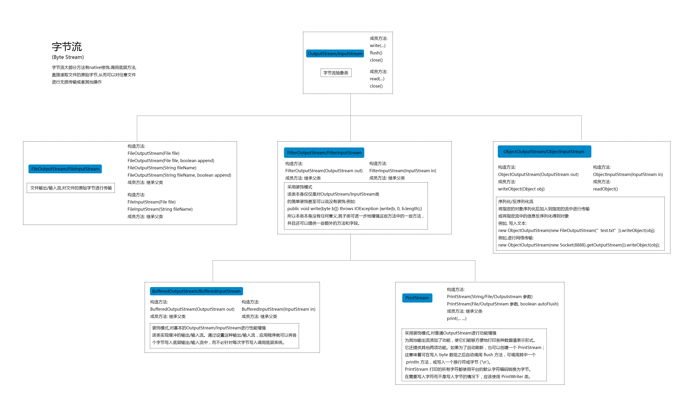

# Java基础

## 基本数据类型

类型|字节|范围
-|-|-
byte|1|-2^7 ~ 2^7-1
char|2|0 ~ 65535(2^16-1)
short|2|-2^15 ~ 2^15-1
int|4|-2^31 ~ 2^31-1
long|8|-2^63 ~ 2^63-1
float|4|32为IEEE754单精度范围
double|8|64位IEEE754双精度范围
boolean|java规范没有规定|

> 字节(byte)单位为B; 位(bit)的单位为b; 1B = 8b

> java中char在内容中采用unicode编码字符集进行存储, 所以是两个字节

## BigDecimal

BigDecimal使用equals比较时, 即使值相同, 但是标度不同, 返回的也是false; 而compareTo方法进行比较时, 会忽略精度.

BigDecimal优先使用string作为形参的构造方法, 因为这个方法不会损失精度.

## double

由于浮点型数据存储特点, 所以浮点型数据判断是否相等时, 不能直接使用等于进行比较, 而是应该限定在一定的误差范围内, 都视为相等.

```java
double b = 2.6 + 2.7;
double a = 5.3;
System.out.println(a == b);
System.out.println(Math.abs(b - a) < 1e-7);
```

输出结果:

```
false
true
```

## 自动拆箱注意事项

```java
Integer a = null;
if(a == 2){
    System.out.println("ok");
}
```

上面这段代码执行会抛出空指针异常.

原因在于自动拆箱语法糖, 可以将上面代码生成的class文件反编译看到:

```java
Integer a = null;
if(a.intValue() == 2){
    System.out.println("ok");
}
```

显然, 如果a为null, 则会抛出NullPointerException.

特别的, 对于有些场景下的比较, 有一些最佳实践:

```java
static final Integer MARK = 2;
if(MARK.equals(a))
...
```

```java
if(Boolean.TRUE.equals(arg))
...
```

## String

1. `String str = new String("aaa");`创建了几个对象? 答: 创建对象数是1个或者2个. 首先, 通过new肯定会创建一个对象. 此外字符串常量`"aaa"`首次加载时, 会创建一个常量池, 在堆上创建一个对象, 引用常量池变量. 但是什么时候是首次加载是不一定的, 所以是1个或者2个对象.
2. `intern`, 当一个String调用`intern()`方法时, java查找常量池中是否有相同Unicode的字符串常量, 如果有, 则直接返回其引用, 如果没有, 则在常量池中增加一个Unicode等于str的字符串并返回它的引用.
3. 字符串在编译期的长度限制为65535. 在运行时长度大小为int类型最大值,即`2^31-1`

### 字符串常量池

在jdk1.6及之前版本, 字符串常量池通常被实现为方法区的一部分, 即永久代(用于存储类信息, 常量池, 静态变量, 即时编译器编译后的代码等数据). jdk1.7开始, 字符串常量池的实现方式发生了重大改变. 字符串常量池不再位于永久代, 而是直接存放在堆(Heap)中, 与其他对象共享堆内存. 之所以放到堆中主要是因为永久代回收效率太低, 只有在FullGC的时候才会被执行回收.

字符串常量来源一般有两个: 1. 代码中的字符串字面量, 会在编译后进入class文件的常量池; 2. intern()方法

### split

```java
String str = ",,,1,2,,,,,";
String[] strArr = str.split(",");
for(String s : strArr){
    System.out.println(">" + s);
}
```

上面代码运行结果是:

```
>
>
>
>1
>2
```

结尾的空字符串被丢弃了!

查看源码, 代码是这样的:

```java
public String[] split(String regex){
    return split(regex, 0);
}
```

在查看一下两个参数的split方法:

```java
public String[] split(String regex, int limit);
```

通过查看注释, 可以了解limit参数的意义:

1. limit > 0: regex对应的模式至多被应用 limit ~ 1次. 返回数组的长度不会超过limit的长度. 数组最后一个元素的将包含所有超出最后一个匹配的分割符.
2. limit = 0: regex对应的模式将会被应用尽可能多的次数. 返回的数组长度不固定. 所有尾部空字符将会被丢弃.
3. limit < 0: regex对应的模式将会被应用尽可能多的次数. 返回的数组长度不固定.

> limit > 0时, 代码中才会认真对待limit的具体值, 如果limit<=0, limit具体值是多少都无所谓.


以"boo:and:foo"为例:

* 分割符':'

limit|result
-|-
2|{ "boo", "and:foo" }
5|{ "boo", "and", "foo" }
-2|{ "boo", "and", "foo" }

* 分割符'o'

limit|result
-|-
5|{ "b", "", ":and:f", "", "" }
-2|{ "b", "", ":and:f", "", "" }
0|{ "b", "", ":and:f" }

所以, 开头那段代码, 如果想保留结尾的空字符串, 只需将limit设置为小于0即可.

## 编码规范

1. RPC调用时, 接口返回类型, 建议不要使用基础类型而是包装类型. 因为可以返回null, 在异常情况下返回null要比返回0等更合适.
2. POJO对象中如果有布尔值, 不要以is开头, 否则部分框架解析会引起序列化错误.

## 语法糖

1. 泛型: `List<String> list = new ArrayList<>();` --> `List list = new ArrayList();`
2. 自动装箱与拆箱: `int a = 1; Integer b = a;` --> `int a = 1; Integer b = Integer.valueOf(a);`
3. 方法变长参数: `int aaa(int... args){}` --> `int aaa(int[] args){}`
4. 枚举: `public enum E{A, B;}` --> `public final class E extends Enum{/*也有些细节, 忽略了*/}`
5. 内部类: 编译完成后就变成两个文件了
6. 断言: `int a = 1; int b = 1; asset a == b;` --> `int a = 1; int b = 1; if(!$assertionsDisabled && a != b) throw new AssertionError()`;
7. 增强for: `for(int a : list)` --> `int a; for(Iterator itr = list.iterator(); itr.hasNext(); ){a = itr.next();}`
8. try-with-resource: `tryy(xxxx){}catch(Exception e){}` --> `太复杂了, 忽略`
9. Lambda表达式
10. 数值字面量: `int a = 10_000` --> `int a = 10000`
11. 条件编译: `final boolean t = true; if(t){xxxx}` --> `final boolean t = true; xxxx`
12. switch支持String和枚举: switch只支持基本类型的比较, 对于String需要先转换为用hashCode进行比较, 然后内部在用equals方法进行比较;

## 泛型上下界

上界: `<? extends XXX>`, 只是参数化类型可能是XXX或者XXX的子类, 下界: `<? super XXX>`, 指示参数化类型可能是XXX或者XXX的父类.

上界生产, 下界消费. 如果需要从一个集合中读取内容, 需要使用上界, 这个集合是用来生产的. 如果向一个集合中写入数据, 需要使用下界, 这个集合是用来消费的.

## java对象的创建方法

* new
```java
User u = new User();
```
* 反射
```java
User user = User.class.newInstance();
```
* clone
* 反序列化
* 方法句柄
```java
MethodType mt = MethodType.methodType(void.class); // 构造方法句柄返回类型为void, 空参
MethodHandles.Lookup lookup = MethodHandles.lookup();
MethodHandle constructorHandle = lookup.findConstructor(User.class, mt);
User user = (User)constructorHandle.invoke();
```
* Unsafe
```java
Field field = Unsafe.class.getDeclaredField("theUnsafe");
field.setAccessible(true);
Unsafe unsafe = field.get(null);

long nameOffset = unsafe.objectFieldOffset(User.class.getDeclaredField("name"));
long ageOffset = unsafe.objectFieldOffset(User.class.getDeclaredField("age"));

User user = (User)unsafe.allocateInstance(User.class);
unsafe.putObject(user, nameOffset, "Hollis");
unsafe.putInt(user, ageOffset, 12);
```

## 文件IO

这里说的IO不仅仅含有普通的文件IO流, 也会介绍socket输入输出等.

### Java基本IO流

java IO流可以分为两类:
1. 字节流: 以字节为单位(8bit), 包含两个抽象类: InputStream, OutputStream
2. 字符流: 以字符为单位(8bit), 根据码表映射字符, 包含两个抽象类: Reader, Writer

常用字节流:



常用字符流:


从图上可以看出, 字节流的基本实现类是: FileOutputStream和FileInputStream, 其余的实现都是采用装饰者模式对其进行的增强. 这其中OutputStreamWriter/InputStreamReader是将字节流装饰为字符流.

### File

File file = new File(path);
* createNewFile()   // 创建一个新的文件
* delete()  // 删除file对象
* isFile()  // 判断是否是文件
* isDirectory()   //判断是否是文件夹
* exists()  //判断文件或文件夹是否存在
* listFiles()   //若对象代表目录, 返回该目录下所有, 文件及文件夹
* mkdir()   // 创建目录

## 错误及异常

结构:


* Error是程序运行期间出现的错误, 该错误是不可恢复的. 因此程序中不建议捕获Error, 即catch中不应捕获Error.
* Exception表示可恢复的异常, 是编译器可以捕捉到的. 它包含两种类型: 受检异常和运行时异常.

```java
public class ExceptionDemo {

    public static void triggerThrowable() throws FrogThrowable {
        throw new FrogThrowable();
    }

    public static void triggerError(){
        throw new FrogError();
    }

    public static void triggerCheckException() throws FrogCheckException {
        throw new FrogCheckException();
    }

    public static void triggerRuntimeException(){
        throw new FrogRuntimeException();
    }


    public static class FrogThrowable extends Throwable{
        public FrogThrowable() {
            super("frog throwable.");
        }
    }

    public static class FrogError extends Error{
        public FrogError(){
            super("frog error");
        }
    }

    public static class FrogCheckException extends Exception{
        public FrogCheckException() {
            super("frog check exception.");
        }
    }

    public static class FrogRuntimeException extends RuntimeException{
        public FrogRuntimeException() {
            super("frog funtime exception.");
        }
    }
}
```

通过上面代码可以Throwable和Exception是受检的, 必须catch或者抛出. Error和RuntimeException是非受检的, 不必catch或抛出. 另外非受检异常虽然也可以抛出或catch, 但是Error不建议catch.

> ClassNotFoundException和NoClassDefFoundError区别是什么?
> ClassNotFoundException是一个受检异常, 通常由`Class.forName()`或者加载器`loadClass`或者`findSystemClass`时, 在类路径中没有找到指定名称的类时, 会抛出异常. NoClassDefFoundError是一个错误, 它表示运行时尝试加载一个类的定义时, 虽然找到了类文件, 但在加载/解析/连接类过程中发生了问题.

## 动态代理

动态代理实现有两种方式:

1. JDK动态代理: 动态代理的对象必须实现一个或者多个接口.
2. Cglib动态代理: 没有限制

JDK动态代理:

```java
public static void main(String[] args){
    Demo ttt = new Demo();
    Object proxy = Proxy.newProxyInstance(Demo.class.getClassLoader(), new Class[]{DemoInf.class}, new InvocationHandler() {
        @Override
        public Object invoke(Object proxy, Method method, Object[] args) throws Throwable {
            System.out.println("---");
            Object r = method.invoke(ttt, args);
            System.out.println("---");
            return r;
        }
    });
    ((DemoInf)proxy).ttt();
}
public interface DemoInf{
    void ttt();
}
public static class Demo implements DemoInf{
    public void ttt(){
        System.out.println("ttt");
    }
}
```

Cglib动态代理:

```java
public static void main(String[] args){
    Enhancer enhancer = new Enhancer();
    enhancer.setSuperclass(Demo.class);
    enhancer.setCallback(new MethodInterceptor() {
        @Override
        public Object intercept(Object obj, Method method, Object[] args, MethodProxy methodProxy) throws Throwable {
            System.out.println("---");
            methodProxy.invokeSuper(obj, args);
            System.out.println("---");
            return null;
        }
    });
    Object proxy = enhancer.create();
    ((Demo)proxy).ttt();
}
public interface DemoInf{
    void ttt();
}
public static class Demo implements DemoInf{
    public void ttt(){
        System.out.println("ttt");
    }
}
```

## java注解

注解用于为java代码提供元数据. 注解本身并不是代码的一部分，它们不会直接影响代码的执行，但可以在编译、类加载和运行时被读取和处理。(注解是给程序用的注释)

java中有四个元注解(定义其他注解的注解):

* `Target`: 表示注解可以用在什么地方; 例如: 类(ElementType.TYPE), 方法(ElementType.METHOD)等等.
* `Retention`: 表示在什么级别保存该注解信息; 有三个可选值: 运行时(RetentionPolicy.RUNTIME), 编译时(RetentionPolicy.SOURCE), 源码中(RetentionPolicy.SOURCE)
* `Documented`: 指示将注解包含在javadoc中; 
* `Inherited`: 允许子类继承父类中的注解.

## UUID

UUID全局唯一标识符, 是指在一台机器上生成的数字, 它的目标是保证对在同一时空中所有机器都是唯一的. 有多个不同版本:

1. v1: 基于时间戳的UUID -- 时间戳+随机数+机器MAC
   * 不安全: 大量UUID样本可以反向解析出MAC地址, 进而获取到设备的物理位置或者用户信息.
2. v2: DCE(Distributed Computing Environment)安全的UUID  -- 与v1版本相同, 但是会把时间戳前4位换为POSIX的UID或GID
   * 实际中很少用到
3. v3: 基于名称空间的UUID, 对名称空间使用MD5散列
   * 保证了相同名称空间中不同名称生成的UUID唯一性; 保证了不同名称空间中UUID的唯一性. 相同名称空间相同名称的UUID重复生成的到的结果是相同的.
4. v4: 基于随机数的UUID  -- 由随机数生成器生成
   * 不适合数据量特别大场景
5. v5: 和v3类似, 只是散列计算使用的是SHA1算法

> java中生成UUID使用的是v3和v4两种
> v3: `UUID.randomUUID()`, v4: `UUID.nameUUIDFromBytes(new bytes[]{ 1, 2, 3, 4})`

## 各种java对象

* POJO: Plain Ordinary Java Object, 简单的java对象.
  * POJO持久化后就是PO;
  * 用它传递, 传递过程中它就是DTO;
  * 直接用来对应表示层就是VO;
  * POJO、PO、DTO、VO都是处理流程中的名字，不是PO对应一个POJO，DTO对应一个POJO，VO对应一个POJO在有些情况下PO、DTO、VO是指同一个POJO
* PO: Persistence Object, 持久层对象, (同DO, Data Object)
* DO: Domain Object 领域对象，就是从现实世界中抽象出来的有形或无形的业务实体
* DTO: Data Transfer Object, 数据传输对象
* VO: value object 值对象/ view object 表现层对象

<image src="img/pojo-object.png" width="600" />

## 一些术语

* SDK: Software Development Kit, 即软件开发工具包, 是一组工具,库,文档和示例代码的集合
* SPI: Service Provider Interface, 是由框架或库提供方定义的接口，供第三方开发者进行具体实现. SPI侧重于接口的定义和实现者的开发，它定义了一种服务提供者和服务使用者之间的协议，用于实现可插拔的组件。
* API: Application Programming Interface, 是由开发者主动编写并公开给其他开发者使用的.

## AIO, BIO, NIO

* BIO: (Blocking I/O), 同步阻塞IO. 线程发起请求后, 一直阻塞, 直到缓冲区数据就绪后, 再进入下一步操作;
  * 适用于: 连接数较少且稳定的场景
* NIO: (Non-Blocking I/O), 同步非阻塞IO. 线程发起IO请求后, 不需要阻塞, 立即返回. 用户线程不原地等待IO缓冲区, 可以先做一些其他操作, 只需要定时轮询检查IO缓冲区是否就绪即可.
  * 适用于: 高并发场景 (即连接数目多且连接比较短的场景)
* AIO: (Asynchronous I/O), 异步非阻塞I/O模型. 线程发起IO请求后, 不需要阻塞, 立即返回, 也不需要定时轮询检查结果, 异步IO操作之后会回调通知调用方.
  * 适用于: 高吞吐量场景 (即连接数目多且连接比较长的场景)

以读取文件的IO为例:

1. BIO

```java
/**
 * 写文件
 */
public static void writeFile(){
    try(
            FileWriter fileWriter = new FileWriter("xxxxx");
            BufferedWriter bufferedWriter = new BufferedWriter(fileWriter)
            ){
        bufferedWriter.write("xxxxxx");
        bufferedWriter.newLine();
    }catch (IOException e){
        e.printStackTrace();
    }
}

/**
 * 读文件
 */
public static void readFile(){
    try(
            FileReader fileReader = new FileReader("xxxxxx");
            BufferedReader bufferedReader = new BufferedReader(fileReader)
            ){
        String line;
        while((line = bufferedReader.readLine()) != null){
            System.out.println(line);
        }
    }catch (IOException e){
        e.printStackTrace();
    }
}
```

2. NIO

```java
/**
 * 写文件
 */
public void writeFile(){
    try(
            FileChannel fileChannel = FileChannel.open(Paths.get("xxxx"), StandardOpenOption.CREATE, StandardOpenOption.WRITE)
            ){
        ByteBuffer buffer = StandardCharsets.UTF_8.encode("xxxxxx");
        fileChannel.write(buffer);
    }catch (IOException e){
        e.printStackTrace();
    }
}

/**
 * 读文件
 */
public void readFile(){
    try(
            FileChannel fileChannel = FileChannel.open(Paths.get("xxxx"), StandardOpenOption.READ)
    ){
        ByteBuffer buffer = ByteBuffer.allocate(1024);
        int bytesRead = fileChannel.read(buffer);
        while (bytesRead != -1) {
            buffer.flip();
            System.out.println(StandardCharsets.UTF_8.decode(buffer));
            buffer.clear();
            bytesRead = fileChannel.read(buffer);
        }
    }catch (IOException e){
        e.printStackTrace();
    }
}
```

> 看似和BIO逻辑上没什么区别, 实际上底层是不一样的. NIO底层可能有多个channel共用一个线程, 通过Selector主动轮询监控多个Channel上的事件.

3. AIO

```java
/**
 * 写文件
 */
public static void writeFile(){
    try(
            AsynchronousFileChannel fileChannel = AsynchronousFileChannel.open(Path.of("aaa.txt"), StandardOpenOption.WRITE, StandardOpenOption.CREATE)
    ){
        ByteBuffer buffer = StandardCharsets.UTF_8.encode("xxxx");
        fileChannel.write(buffer, 0, null, new CompletionHandler<>() {
            @Override
            public void completed(Integer result, Object attachment) {
                System.out.println("finish");
            }

            @Override
            public void failed(Throwable exc, Object attachment) {
                exc.printStackTrace();
            }
        });
    }catch (IOException e){
        e.printStackTrace();
    }
}

/**
 * 读文件
 */
public static void readFile(){
    try{
        AsynchronousFileChannel fileChannel = AsynchronousFileChannel.open(Path.of("aaa.txt"), StandardOpenOption.READ);
        ByteBuffer buffer = ByteBuffer.allocate(1024);
        fileChannel.read(buffer, 0, buffer, new CompletionHandler<>() {
            @Override
            public void completed(Integer result, ByteBuffer attachment) {
                attachment.flip();
                System.out.println(StandardCharsets.UTF_8.decode(attachment));
                attachment.clear();
                try {
                    fileChannel.close();
                } catch (IOException e) {
                    e.printStackTrace();
                }
            }

            @Override
            public void failed(Throwable exc, ByteBuffer attachment) {
                exc.printStackTrace();
                try {
                    fileChannel.close();
                } catch (IOException e) {
                    e.printStackTrace();
                }
            }
        });
    }catch (IOException e){
        e.printStackTrace();
    }
}
```

