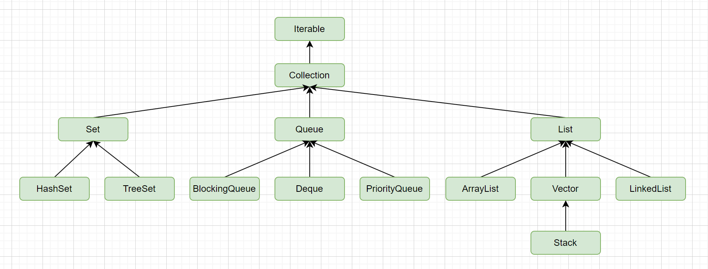

# Java集合

## Java集合

常用的集合框架分为三种:

* List: 有序; 可以有重复元素;
  * ArrayList
  * LinkedList
  * Vector: 强同步类, 线程安全
* Set: 无序; 无重复元素;
  * HashSet
  * TreeSet: 采用平衡二叉树存储, 可以有序. 不允许放入null值. (平衡二叉树嘛, 肯定是需要有compare的)
* Map: 具有映射关系的集合.
  * HashMap
* Queue
* Stack



## 遍历的同时修改list

1. 通过普通的for循环(不建议, 避免漏删)

```java
List<Object> list = getObjects();
for(int i = 0; i < list.size(); i++){
    Object obj = list.get(i);
    if(check(obj)){
        list.remove(obj);
        i--;
    }
}
```

2. 普通for循环, 倒序遍历

```java
List<Object> list = getObjects();
for(int i = list.size() - 1; i >= 0; i--){
    Object obj = list.get(i);
    if(check(obj)){
        list.remove(obj);
    }
}
```

3. 迭代器

```java
List<Object> list = getObjects();
Iterator itr = list.iterator();
while(itr.hasNext()){
    Object obj = itr.next();
    if(check(obj)){
        itr.remove();
    }
}
```

4. 将原来的copy一份副本, 遍历原来的list, 然后删除副本;

```java
List<Object> list = getObjects();
List<Object> copyList = new ArrayList<>(list);
for(Object obj : list){
    if(check(obj)){
        copyList.remove(obj);
    }
}
```

5. 使用并发安全的集合

```java
List<Object> list = new CopyOnWriteArrayList<>(getObjects());
for(Object obj : list){
    if(check(obj)){
        list.remove(obj);
    }
}
```

6. 通过stream删除

```java
List<Object> list = getObjects().stream().filter(this::check).collect(Collectors.toList());
```

7. 通过removeIf方法

```java
List<Object> list = getObjects();
list.removeIf(this::check);
```

## ArrayList的subList方法

subList方法并没有创建一个新的List, 而是原List的视图.

1. 对父/子list的非结构性修改, 会互相影响;(在集合中修改某个元素)
2. 对子List做结构性修改, 会影响到父List;(在集合中增加或者删除元素)
3. 对父List做结构性修改, 再操作子list, 会抛出异常ConcurrentModificationException;

## SynchronizedList和Vector的区别

都是线程安全list, 有什么区别吗?

1. SynchronizedList有很好的扩展和兼容功能。他可以将所有的List的子类转成线程安全的类。 
2. 使用SynchronizedList的时候，进行遍历时要手动进行同步处理。
3. SynchronizedList可以指定锁定的对象(非public方法, 用于内部生成线程安全的sublist)

## HashMap数据结构

<image src="img/hashmap.png" width="600"/>

HashMap使用数组来存储hash槽, 完美情况下, 每一个槽对应一个元素. 对于hash冲突, 采用hash拉链法来解决, 即冲突的元素在同一个槽位上, 通过链表结构来存储. 此外, 为防止极端情况下, hash冲突导致链表过长, 所以当链表长度大于等于8时, 会将链表转为红黑树, 从而优化后续操作的时间复杂度.

> 红黑树何时又转回链表? 当冲突元素个数为6时.

### HashMap初始容量

《阿里巴巴Java开发手册》中对于HashMap有推荐用法:

```
推荐集合初始化是, 指定集合大小.
说明: HashMap使用HashMap(int initialCapacity)初始化
正例: initialCapacity = (需要存储的元素个数/负载因子) + 1. 注意, 负载因子(即loader factor)默认为0.75. 如果暂时无法确定初始大小, 请设置为16(即默认值).
```

那么HashMap是如何扩容的呢? 通过查看源码可以看出

```java
static final float DEFAULT_LOAD_FACTOR = 0.75f;

public HashMap(int initicalCapacity){
    this(initicalCapacity, DEFAULT_LOAD_FACTOR);
}

public HashMap(int initialCapacity, float loadFactor) {
    if (initialCapacity < 0)
        throw new IllegalArgumentException("Illegal initial capacity: " +
                                            initialCapacity);
    if (initialCapacity > MAXIMUM_CAPACITY)
        initialCapacity = MAXIMUM_CAPACITY;
    if (loadFactor <= 0 || Float.isNaN(loadFactor))
        throw new IllegalArgumentException("Illegal load factor: " +
                                            loadFactor);
    this.loadFactor = loadFactor;
    this.threshold = tableSizeFor(initialCapacity);
}

/**
 * Returns a power of two size for the given target capacity.
 */
static final int tableSizeFor(int cap) {
    int n = cap - 1;
    n |= n >>> 1;
    n |= n >>> 2;
    n |= n >>> 4;
    n |= n >>> 8;
    n |= n >>> 16;
    return (n < 0) ? 1 : (n >= MAXIMUM_CAPACITY) ? MAXIMUM_CAPACITY : n + 1;
}
```

通过HashMap#tableSizeFor可以看出HashMap的初始容量并非initialCapacity，而是min（2^n）>initialCapacity,即大于initialCapacity的2的n次幂的最小值。而扩容条件只要HashMap的容量大于threshold*loadFactor时就需要扩容，而非初始值initialCapacity，这样可能与我们的预期不符，本意可能是在initialCapacity范围内都不需要扩容，举例如下：

initialCapacity|loadFactor|threshold|resize(threshold*loadFactor)
-|-|-|-
1|0.75|2|1
2|0.75|2|1
3|0.75|4|3
4|0.75|4|3
5|0.75|8|6
9|0.75|16|12
16|0.75|16|12
32|0.75|32|24

### HashMap的扩容

* 扩容时机：`数组大小 * 负载因子 > 元素个数`
* 扩容后容量是原来的2倍;

涉及三个步骤:

1. 如果没有形成链表, 直接rehash到新的桶中;
2. 如果形成新的列表, 则将链表重新链接;
3. 如果形成了红黑树, 但是元素个数小于6, 则取消树化;

### 树化

需要满足两个条件:

* 链表长度超过超过树化阈值: 8;
* 数组长度大于等于64

> 如果链表长度超过8, 但是数组长度未超过64, 则会进行扩容.

### HashMap方法实现

* get方法:
  1. 计算hash值, 确定在hash槽中的位置
  2. 如果该位置上元素为空, 说明没有找到, 直接返回null
  3. 如果该位置上元素不为空, 遍历该位置的元素, 找到与当前键相等的键值对, 那么返回该键值对的值, 否则返回null
* put方法
  1. 首先, put方法会计算键的哈希值(通过调用hash方法), 并通过哈希值计算出在数组中的索引位置;
  2. 如果该位置上元素为空, 直接将键值对存储在该位置上;
  3. 如果该位置上元素不为空, 那么遍历该位置上的元素, 如果找到了与当前键值对相等的键值对, 那么将该键值对的值更新为当前值, 并返回旧值;
  4. 如果该位置上元素不为空, 但没有与当前键相等的键值对, 那么将键值对插入到链表或者红黑树中(如果该位置上的元素数量超过了一个阈值, 就会将链表转化为红黑树来提高效率)
  5. 如果插入成功, 返回被替换的值; 如果插入失败, 返回null;
  6. 插入成功后, 如果需要扩容, 那么就进行一次扩容操作.
* remove
  1. 计算hash值, 确定hash值在数组中的索引位置;
  2. 如果该位置上元素为空, 说明没有找到对应的键值, 直接返回null;
  3. 如果该位置上元素不为空, 检查是否与当前键相等, 如果相等, 那么将该键值对删除, 并返回该键值对的值;
  4. 如果该位置上元素不为空, 但也与当前键不相等, 那么就需要在链表或者红黑树中寻找;
  5. 如果找到与当前键相等的键值对, 删除并返回值. 否则返回null

> 当key为null时, 是没有hash值的, 这时会放在数组的第一个元素中.

### hash冲突的解决

1. 开放寻址: 一旦发生冲突就去寻找下一个空的散列地址, 只要散列表足够大, 空的散列地址总能找到, 并将记录存入. 常见的开放寻址技术有线性探测, 二次探测和双重散列;
2. 哈希拉链法: 每个hash桶指向一个链表, 当发生冲突时, 新的元素将被添加到这个链表的末尾.
3. 再哈希: 当哈希地址发生冲突, 用其他函数计算另一个哈希函数地址, 直到冲突不再产生为止.
4. 建立公共溢出区: 将哈希表分为基本表和溢出表两部分, 发生冲突的元素都放入溢出表中.
5. 一致性哈希: 将哈希值空间组织成一个逻辑环, 以均匀分布方式将数据映射到环上的节点, 主要用于分布式缓存系统.

### HashMap线程安全问题

首先HashMap是线程不安全的. 然后在jdk1.7及以前的版本有一个问题是: 就是在并发put元素时, 如果出发的hashMap的扩容, 会采用的是链表的头插法, 对链表进行重新构建, 这会导致原来的A->B->C链表变为新的C->B->A链表, 如果有并发操作, 就会生成环(即循环引用), 后续执行get操作时, 如果get不到数据就会陷入死循环. jdk1.8之后改为了尾插法, 就不存在这个问题了. 但是hashMap还是不能用在并发场景的!!!

## 常用map对比

集合|HashMap|Hashtable|ConcurrentHashMap
-|-|-|-
线程安全|否|是,基于方法锁|是,基于分段锁
继承关系|AbstractMap|Dictionary|AbstractMap, ConcurrentMap
允许null|K-V都允许|K-V都不允许|K-V都不允许
默认初始容量|16|11|16
默认加载因子|0.75|0.75|0.75
扩容后容量|原来的2倍|原来的2倍+1|原来的2倍
是否支持fail-fast|支持|支持|fail-safe

> fail-fast: 一旦发生异常, 立即抛出
> fail-safe: 在系统出现故障或错误时，保持系统的基本功能或以最安全的方式停止运行. (类似事务一样, 可能有回滚/提交之类的机制)

> ConcurrentHashMap为什么不允许null值? 非并发map, 如果get返回null, 可以通过containsKey来判断是不存在还是值为null. 但是ConcurrentHashMap在并发场景下不能这么操作, 所以不允许.

## ConcurrentHashMap

**线程安全实现原理**

jdk1.7中采用分段锁来实现, 即将hash表分成多个段, 每个段拥有独立的锁. 这样访问时只需要锁住需要的段, 不需要锁住整个hash表.

jdk1.8采用了节点锁(我觉得叫槽锁更合适, 之所以叫节点是因为槽里边存储的是链表的头节点或者红黑树的根), 并且采用CAS+synchronize机制, 锁定的是一个hash槽, 然后针对这个链表或者红黑树进行操作. 显然jdk1.8这种锁粒度更细, 更不容易发生锁冲突.


## Stream

stream提供了一种更直观的贴近语义的集合操作的高阶抽象. 使得代码更加简洁. 有以下特点:

1. 无存储; 它不是一种数据结构, 只是数据源的一个视图;
2. 为函数式编程而生; stream的任何修改都不会影响到原始数据源, 而是会产生一个新的stream;
3. 惰性执行; stream操作不会立即执行, 只有等到用户真正需要结果的时候才会执行;
4. 可消费; stream只能被消费一次;

stream分为三类关键性操作: 1. 流的创建; 2. 中间操作; 3, 最终操作;

**流的创建**

```java
// 方式1
Stream<Object> stream = new ArrayList<>().stream();
// 方式2
Stream<Object> stream = Stream.of("a", 1, 2, "b")
```

**中间操作**

操作|效果|输入
-|-|-
filter|通过给定的过滤条件进行过滤|过滤条件
map|将每一个元素按照指定的映射f映射到新的元素上|映射f
limit|限制返回前n个元素|元素个数
skip|限制丢弃前n个元素|元素个数
sorted|对stream进行排序|排序的Comparator(可选)
distinct|通过equals方法去重|无

**最终操作**

最终操作会消费流, 产生最终结果. 最终操作之后, 流不可以再使用.

操作|效果|输入
-|-|-
forEach|遍历stream|遍历时具体要执行的内容
count|计数|无
collect|规约, 可以接受各种函数作为参数, 从而得到一个汇总结果|规约函数
reduce|从流中生成单一结果|常规情况下: 二元运算+单位元(可选)

> 规约函数的调用和内置实现都非常复杂, 常用的规约函数都在`Collectors`类下, 有`Collectors.toList()`, `Collectors.toSet()`等
> 规约函数原理一般是把规约函数抽象几个概念: 1. 结果容器提供者supplier; 2. 积聚者accumulator用于将流中的数据放入结果容器中去; 3. 多个结果容器的结合器combiner; 4. 对容器执行最终转换的finisher.
> 其中supplier, accumulator, combiner都是必须得, finisher是可选的.
> 例如对于Collectors.toList()这个规约. `supplier = () -> new ArrayList<>()`, `accumulator = (list, e) -> list.add(e)`, `combiner -> (list1, list2) -> list1.addAll(list2); return list1;`, `finisher = a -> return a;`
> 于是, 真正执行规约时, 大概是这样执行的:
> ```
> A a2 = supplier.get();  
> accumulator.accept(a2, t1);  
> A a3 = supplier.get();  
> accumulator.accept(a3, t2);
> R r2 = finisher.apply(combiner.apply(a2, a3));
> ```
> 注意: 上面这个执行说的是"大概", 因为实际执行时, 有可能只会调用supplier.get()一次, 而连续调用accumulator.accept多次, 这与是否为并行stream有关. 同时, Collector接口的注释中有要求上面这些函数必须满足结合律, 并且单位元是空集, 使得执行顺序不会影响最终结果.

**并行流**

使用parallelStream可以创建并行流. 底层采用Fork/Join框架, 将大任务分割成多个小任务, 这些小任务可以并行执行, 然后再将这些小任务的结果合并(join)成最终结果.