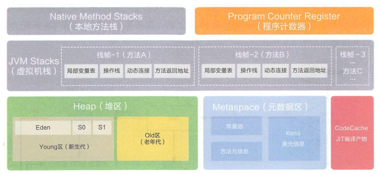

# java虚拟机学习笔记

## 概述

本文由阅读《深入理解java虚拟机-JVM高级特性与最佳实践 第3版》整理来.

什么是JDK? JDK包含: 1. java程序设计语言; 2. java虚拟机; 3. java类库.

## java内存区域

运行时数据区:

* 线程私有:
  * 程序计数器: 记录一个线程当前执行到程序的位置
  * 虚拟机栈: 存储的就是一个个的栈帧, 方法调用时, 栈帧压栈, 方法执行完成, 栈帧出栈
  * 本地方法栈: 和虚拟机栈作用相似, 只不过这里为native方法提供的.(HotSpot虚拟机中, 本地方法栈和虚拟机栈合二为一)
* 线程共享:
  * java堆: 存储且仅存储对象实例
  * 方法区: 存放已经被虚拟机加载的类型信息, 常量, 静态变量, 即时编译后的代码缓存等数据

直接内存: 除了上面运行时数据区, 还有一部分内存频繁使用, 就是直接内存, 用于NIO中对流式数据进行存取, 避免了复制到堆中导致的不必要开销. 有点类似DMA的意思.

> 关于方法区, 现在常提到元空间, 实际上元空间就是方法区的一种实现方式. 此外, 运行时常量池也是方法区的一部分, 也存放在元空间中, 但是这里不包含字符串常量池, 字符串常量池在堆中.

介绍一下上面各个区域的内存中的数据都是怎么来的.

##### 虚拟机栈中的数据--栈帧

##### 方法区中的数据--类

方法区中还有一部分数据需要额外说明一下, 那就是通过动态代理以及字节码技术生成的大量动态类.

##### java堆中的数据--对象

现在类信息已经加载到了方法区(元空间)了, 接下来, 就可以通过new,反射,反序列化等方式, 创建一个对象了.

1. 检查类是否加载. java虚拟机在遇到一条new指令时, 会先检查常量池中是否存在符号引用, 以及符号引用所代表的的类是否已经被加载/解析/初始化, 如果没有先执行上面的类加载个过程.

2. 在堆中分配一块内存. 有了类型信息, 就可以确定下来这个对象所占用的内存大小了, 假如是xKb, 那么, 我们就需要在堆内存中为这个对象分配一块xKb的空间. 分配的方案有两种:
   1. 指针碰撞 - 假如内存空间是规整的, 使用中的内存和空闲内存没有混在一起, 那么, 通过一个指针, 指示这两块内存的分界线, 分配内存时, 将这个指针移动一下即可.
   2. 空闲列表 - 假如内存空间不是规整的, 使用的内存和空闲内存交错在一起, 那么, 可以通过维护一个表格, 记录哪些内存块可用, 从而进行分配.

Serial, ParNew等垃圾收集器带有空间压缩整理的能力, 使得内存时规整的, 所以使用碰撞指针的方案. CMS基于清除算法, 不会对空间进行整理, 所以采用空闲列表的方案.

不论是哪种分配方案, 当多个线程并发的申请堆内存的时候, 都会涉及到内存资源的竞争. 这时, 虚拟机采用CAS加失败重试的方式来请求空间, 除此之外, 还有本地线程分配缓冲区(ThreadLocalAllocationBuffer), 这个是每个线程在堆中开辟的一小块线程私有区域, 分配内存时, 优先使用这块区域, 这样就不存在资源竞争了.

3. 初始化这块内存区域, 将值初始化为零;
4. 设置对象头;
5. 调用构造方法.

对象在堆中的内存布局分为三部分: 1. 对象头; 2. 实例数据; 3. 对齐填充.

对于对象头, 又分为两部分:

1. 对象自身的运行时数据(32bits/64bits): HashCode, GC分代年龄, 锁状态, 线程持有的锁, 偏向线程id, 偏向时间戳等. 上述这些信息是32bits/64bits无法容纳的, 所以这里会有空间复用.
2. 记录类型指针, 指向它的类型元数据的指针.
3. 如果对象是数组类型, 那么还有额外的一块区域记录数组长度.

对于实例数据, 就是一个对象中所有成员变量的数据了, 总共就8中类型, 每一种类型字段的大小都是固定的:

1. long/double - 64bit
2. int - 32bit
3. short/char - 16bit
4. byte/boolean - 8bit
5. 对象引用 - 32bit

对于对齐填充, 就是一段空闲的区域, 因为Hotspot虚拟机需要使得每个对象的起始地址都是8bit的整数倍.

> 上面实例数据中提到了对象引用, 通过对象引用, 就可以在堆中找到所引用的对象了. Hotspot虚拟机通过对象引用进行访问定位的方式是直接指针, 所以这里的对象引用中存储的就是内存中的一个地址.

## 垃圾收集理论

上面介绍了java的内存区域, 以及内存中的数据是怎么来的, 接下来介绍一下它们是怎么没的--垃圾收集.

对于虚拟机栈/本地方法栈/程序计数器, 生命周期是和线程绑定的. 栈帧随着方法的结束也就释放了. 所以这几个区域不需要回收. 需要回收的是: java堆和方法区. 

下面主要介绍堆的回收, 方法区在最后补充, java堆垃圾回收的过程总共分两步: 1. 找到已死对象; 2. 回收它.

**如何找到已死对象?**

一个对象如果不再被存活的对象引用着, 则就是已死对象. 判断对象已死方案有二: 

1. 引用计数法
   * 优点: 实现简单, 执行效率高
   * 缺点: 对于复杂的对象图无法处理(例如对象之间存在循环引用)
2. 可达性分析
   * 优点: 可以处理复杂的对象图
   * 确定: 实现复杂, 执行效率相对较低

java虚拟机都是采用"可达性分析"来判断对象是否可以被回收的. 可达性分析总共分两步: 1. 找到对象图的根(GC Root); 2. 由对象图的根遍历整个对象图;

GC Root有以下几个:

1. 栈帧中引用的对象;
2. 方法区静态属性引用的对象;
3. 方法区中常量引用的对象;
4. JNI中引用的对象;
5. java虚拟机内部对象(系统类加载器/基本数据类型的class等)

那么, 遍历完对象图, 找到不可达对象, 就可以回收了吗? java中还存在一个方法finalize(), 对于实现了finalize()方法的对象, 第一次判定为不可达之后, 是不回收的, 而是先执行一遍finalize()方法. 然后在下一次判定为不可达的时候回收.

上面, 我们完成了对已死对象的寻找, 接下来, 开始回收.

**如何回收?**

垃圾收集算法就三种:

1. 标记-清除: 找到可回收的垃圾之后, 直接回收掉;
   * 优点: 相对于后两种效率高
   * 缺点: 会产生大量的内存碎片, 对新的对象的内存分配造成困难
2. 标记-复制: 找到可回收的垃圾之后, 将存活的对象复制到一块新的内存上去;
   * 优点: 不会产生内存碎片
   * 缺点: 始终需要一块内存区域空着, 用来装复制过来的对象
3. 标记-整理: 找到可回收垃圾之后, 将垃圾回收掉, 然后整理整个内存空间
   * 优点: 不会产生内存碎片, 会有有空间浪费
   * 缺点: 需要执行的工作太多, 效率较前两者低

上面是三种垃圾收集算法, 没有一个是完美的方案, 都是时空权衡问题. 实际上, 每种算法都有用武之地, 它们可以分别应用到不同的场景中. 合在一起, 就可以很好地完成工作了, 这就引出了分代收集理论.

**分代收集理论**

分代收集理论依据两个假说:

1. 弱分代假说: 绝大多数对象都是朝生夕死的;
2. 强分代假说: 熬过越多次垃圾收集的对象, 就越难以消亡.

依据这两个假说, 可以把java堆划分成为两个区域: 1. 新生代; 2. 老年代. 不同的区域, 使用不同的垃圾收集算法. 每次回收只回收一个代.

**基于分代收集理论的垃圾收集方案**

* 新生代: 使用标记-复制算法

因为新生代对象大部分朝生夕死, 所以每次回收可以空出大部分内存空间, 只有一小部分对象保留. 所以新生代这样设计: 将新生代又分为1个Eden和2个Survivor区. 新创建的对象都在Eden区进行分配. 每次新生代采用"标记-复制"算法回收时, 对Eden和其中有对象的Survivor区进行回收, 得到存活的对象放入空闲的那个Survivor区.

那么, 如果空闲的Survivor装不下怎么办? 这时, 装不下的对象直接进入老年代.

* 老年代: 使用标记-清除算法/标记-整理算法

老年代中的对象都是存活了很久的, 根据"强分代假说"它们大部分还会继续存在下去. 所以每次回收空闲出来的空间不会很多. 所以"标记-清除"算法就很合适, 当然, 标记整理算法也可以.

方案是有了, 但是实现起来, 还会遇到一些问题和细节, 这里一一介绍一下.

**可达性分析中遇到的问题**

前面介绍了根节点从哪些地方可以得到, 有了这些GC Roots, 就可以进行可达性分析了. 但是, 这时面临下面两个问题:

1. 从GC Roots范围来查找根节点称之为根节点枚举, 根节点枚举的过程中, 程序运行可能导致根节点的变化;
   * 解决方案简单粗暴, 根节点枚举过程中, 停止用户程序运行! 也就是"Stop The World". 目前所有的垃圾收集器实现, 在其他地方做了大量优化, 但是对于根节点枚举, 都是STW. 这里STW采用的是主动式中断, 具体来讲, 就是有一个标志, 每个线程在执行的时候, 都会频繁的去轮询这个标志, 一旦发现这个标志提示需要中断, 线程立即会中断挂起(线程只会在安全点或者安全区中断挂起, 但是线程也只会在安全点和安全区处轮询这个标志, 所以等价为立即挂起)
2. 根节点枚举, 所有GC Roots的区域的内存都遍历一遍, 将会效率非常低;
   * 由于java虚拟机采用的是准确式垃圾收集, 也就是虚拟机时刻都是知道哪些是引用类型, 哪些是基本类型, 引用类型在内存中的位置会被集中记录在OopMap的地方, 栈帧中, 在代码执行的时候, 实际上也会触发向OopMap写入这些根节点对象的地址, 所以只需要遍历OopMap就可以了.
3. 程序运行过程中, 引用关系是会变化的;
   * 实际上也可以通过STW来避免, 但是那样就会导致用户程序暂停的时间太长了. 所以大部分垃圾回收器实现都是采用并发的可达性分析. 这个一两句话解释不清楚, 总之有几个关键字: "三色节点", "增量更新", "原始快照"
4. 跨代引用问题: 由于垃圾回收采用分代回收的方式, 在进行可达性分析时, 例如回收新生代, 这时存在一些老年代的对象引用了新生代对象. 如果再把整个老年也加入到GC Roots扫描, 范围太大, 效率太低.
   * 通过记忆集, 来记录老年代那部分内存区域有对新生代的引用. 在进行根节点枚举时, 只把这部分区域中的对象加入进去. 记忆集是一个抽象的概念, 具体实现上一般使用"卡表"来实现. 而向卡表中写入记录是通过写屏障来实现的, 实际上就是在给一个引用变量赋值之后, 再调用一下更新卡表的方法.

## 垃圾收集实现

上面理论已经有了, 基于上面的理论, 就有了下面这些垃圾收集器的实现:

垃圾收集器|收集算法|描述|适用代|可搭配使用的收集器
-|-|-|-|-
Serial|标记-复制|单线程垃圾收集器|新生代|Serial Old
ParNew|标记-复制|Serial的多线程版本, 并行的执行垃圾收集|新生代|CMS
Parallel Scavenge|标记-复制|和ParNew一样并行执行垃圾收集, 但是可以通过一些配置来限制垃圾收集的时间, 通过少收集一部分内存空间保证尽量在限制内执行完成|新生代|Serial Old/Parallel Old
Serial Old|标记-整理|单线程垃圾收集器|老年代|Serial/Parallel Scavenge
Parallel Old|标记-整理|多线程并行执行垃圾收集|老年代|Parallel Scavenge
CMS|标记-清除|以获取最短停顿时间为目标的收集器|老年代|ParNew/Serial Old

> 可搭配使用的收集器列, 这里是jdk9以后, jdk9之前, 还可以有一些其他的搭配

* Serial收集器
* ParNew收集器
* Parallel Scavenge收集器
* Serial Old收集器
* Parallel Old收集器
* CMS收集器
* Garbage First收集器
* Shenandoah收集器
* ZGC收集器
* Epsilon收集器

## jvm常用配置参数

配置|解释
-|-
-XX:+/-UseTLAB| 是否开启TLAB, 默认开启
-Xms2g| java堆最小值(这里配置的是2G)
-Xmx2g| java堆最大值(这里配置的是2G)
-Xss256K| 为每个线程分配的虚拟机栈内存大小(这里配置的是256k), 默认1M(Hotspot中并不区分虚拟机栈和本地方法栈)
-XX:+HeapDumpOnOutOfMemoryError| 使得内存溢出时, dump出当前堆转储快照
-XX:HeapDumpPath="aaa/dump.hprof"| 指定dump文件位置
-XX:MaxMetaspaceSize=512m| 设置元空间最大值, 默认是-1, 即不限制
-XX:MetaspaceSize=512m| 设置元空间的初始大小, 一旦达到该值, 就会触发垃圾收集以及类型卸载,默认值20.79M
-XX:MinMetaspaceFreeRatio=40| 元空间垃圾回收后, 控制最小的元空间剩余容量百分比, 默认40%, 可减少由于元空间不足导致的垃圾收集频率
-XX:MaxDirectMemorySize=10m| 直接内存最大值, 默认和-Xmx保持一致

## Reference

* 深入理解java虚拟机-JVM高级特性与最佳实践 第3版
* [Java方法区与元空间](https://zhuanlan.zhihu.com/p/161994662)
* [JVM 中你不可不知的参数](https://zhuanlan.zhihu.com/p/91757020)