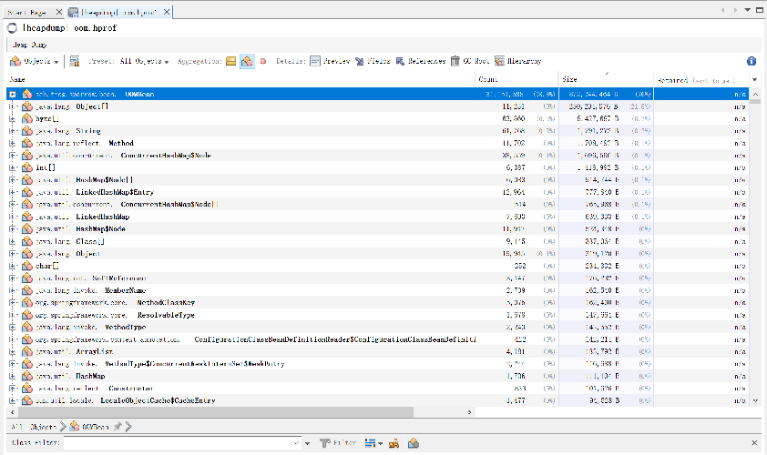
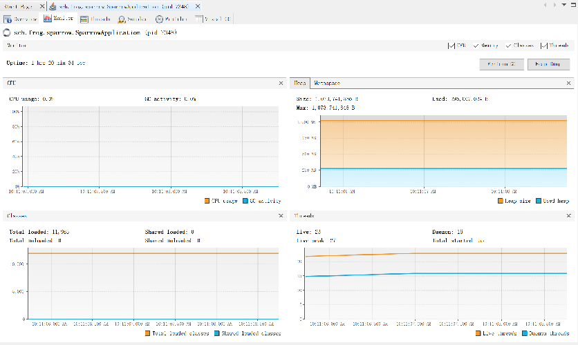
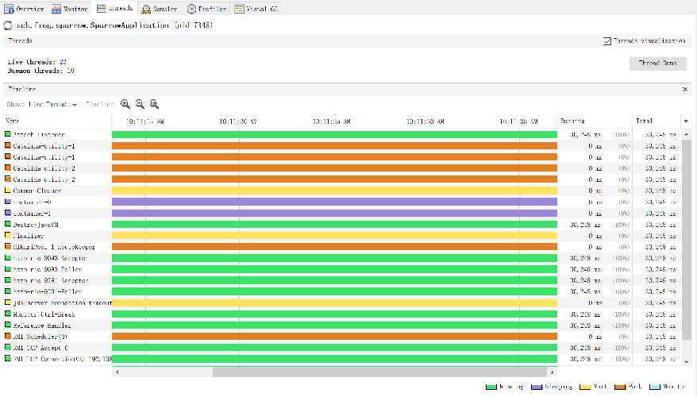

# java虚拟机学习笔记

## 概述

本文由阅读《深入理解java虚拟机-JVM高级特性与最佳实践 第3版》整理来.

什么是JDK? JDK包含: 1. java程序设计语言; 2. java虚拟机; 3. java类库.

## java内存区域

运行时数据区:

* 线程私有:
  * 程序计数器: 记录一个线程当前执行到程序的位置
  * 虚拟机栈: 存储的就是一个个的栈帧, 方法调用时, 栈帧压栈, 方法执行完成, 栈帧出栈
  * 本地方法栈: 和虚拟机栈作用相似, 只不过这里为native方法提供的.(HotSpot虚拟机中, 本地方法栈和虚拟机栈合二为一)
* 线程共享:
  * java堆: 存储且仅存储对象实例
  * 方法区: 存放已经被虚拟机加载的类型信息, 常量, 静态变量, 即时编译后的代码缓存等数据


直接内存: 除了上面运行时数据区, 还有一部分内存频繁使用, 就是直接内存, 用于NIO中对流式数据进行存取, 避免了复制到堆中导致的不必要开销. 有点类似DMA的意思.

> 关于方法区, 现在常提到元空间, 实际上元空间就是方法区的一种实现方式. 此外, 运行时常量池也是方法区的一部分, 也存放在元空间中, 但是这里不包含字符串常量池, 字符串常量池在堆中.

介绍一下上面各个区域的内存中的数据都是怎么来的.

##### 虚拟机栈中的数据--栈帧

##### 方法区中的数据--类

方法区中还有一部分数据需要额外说明一下, 那就是通过动态代理以及字节码技术生成的大量动态类.

##### java堆中的数据--对象

现在类信息已经加载到了方法区(元空间)了, 接下来, 就可以通过new,反射,反序列化等方式, 创建一个对象了.

1. 检查类是否加载. java虚拟机在遇到一条new指令时, 会先检查常量池中是否存在符号引用, 以及符号引用所代表的的类是否已经被加载/解析/初始化, 如果没有先执行上面的类加载个过程.

2. 在堆中分配一块内存. 有了类型信息, 就可以确定下来这个对象所占用的内存大小了, 假如是xKb, 那么, 我们就需要在堆内存中为这个对象分配一块xKb的空间. 分配的方案有两种:
   1. 指针碰撞 - 假如内存空间是规整的, 使用中的内存和空闲内存没有混在一起, 那么, 通过一个指针, 指示这两块内存的分界线, 分配内存时, 将这个指针移动一下即可.
   2. 空闲列表 - 假如内存空间不是规整的, 使用的内存和空闲内存交错在一起, 那么, 可以通过维护一个表格, 记录哪些内存块可用, 从而进行分配.

Serial, ParNew等垃圾收集器带有空间压缩整理的能力, 使得内存时规整的, 所以使用碰撞指针的方案. CMS基于清除算法, 不会对空间进行整理, 所以采用空闲列表的方案.

不论是哪种分配方案, 当多个线程并发的申请堆内存的时候, 都会涉及到内存资源的竞争. 这时, 虚拟机采用CAS加失败重试的方式来请求空间, 除此之外, 还有本地线程分配缓冲区(ThreadLocalAllocationBuffer), 这个是每个线程在堆中开辟的一小块线程私有区域, 分配内存时, 优先使用这块区域, 这样就不存在资源竞争了.

3. 初始化这块内存区域, 将值初始化为零;
4. 设置对象头;
5. 调用构造方法.

对象在堆中的内存布局分为三部分: 1. 对象头; 2. 实例数据; 3. 对齐填充.

对于对象头, 又分为两部分:

1. 对象自身的运行时数据(32bits/64bits): HashCode, GC分代年龄, 锁状态, 线程持有的锁, 偏向线程id, 偏向时间戳等. 上述这些信息是32bits/64bits无法容纳的, 所以这里会有空间复用.
2. 记录类型指针, 指向它的类型元数据的指针.
3. 如果对象是数组类型, 那么还有额外的一块区域记录数组长度.

对于实例数据, 就是一个对象中所有成员变量的数据了, 总共就8中类型, 每一种类型字段的大小都是固定的:

1. long/double - 64bit
2. int - 32bit
3. short/char - 16bit
4. byte/boolean - 8bit
5. 对象引用 - 32bit

对于对齐填充, 就是一段空闲的区域, 因为Hotspot虚拟机需要使得每个对象的起始地址都是8bit的整数倍.

> 上面实例数据中提到了对象引用, 通过对象引用, 就可以在堆中找到所引用的对象了. Hotspot虚拟机通过对象引用进行访问定位的方式是直接指针, 所以这里的对象引用中存储的就是内存中的一个地址.

## 垃圾收集理论

上面介绍了java的内存区域, 以及内存中的数据是怎么来的, 接下来介绍一下它们是怎么没的--垃圾收集.

对于虚拟机栈/本地方法栈/程序计数器, 生命周期是和线程绑定的. 栈帧随着方法的结束也就释放了. 所以这几个区域不需要回收. 需要回收的是: java堆和方法区. 

下面主要介绍堆的回收, 方法区在最后补充, java堆垃圾回收的过程总共分两步: 1. 找到已死对象; 2. 回收它.

**如何找到已死对象?**

一个对象如果不再被存活的对象引用着, 则就是已死对象. 判断对象已死方案有二: 

1. 引用计数法
   * 优点: 实现简单, 执行效率高
   * 缺点: 对于复杂的对象图无法处理(例如对象之间存在循环引用)
2. 可达性分析
   * 优点: 可以处理复杂的对象图
   * 确定: 实现复杂, 执行效率相对较低

java虚拟机都是采用"可达性分析"来判断对象是否可以被回收的. 可达性分析总共分两步: 1. 找到对象图的根(GC Root); 2. 由对象图的根遍历整个对象图;

GC Root有以下几个:

1. 栈帧中引用的对象;
2. 方法区静态属性引用的对象;
3. 方法区中常量引用的对象;
4. JNI中引用的对象;
5. java虚拟机内部对象(系统类加载器/基本数据类型的class等)

那么, 遍历完对象图, 找到不可达对象, 就可以回收了吗? java中还存在一个方法finalize(), 对于实现了finalize()方法的对象, 第一次判定为不可达之后, 是不回收的, 而是先执行一遍finalize()方法. 然后在下一次判定为不可达的时候回收.

上面, 我们完成了对已死对象的寻找, 接下来, 开始回收.

**如何回收?**

垃圾收集算法就三种:

1. 标记-清除: 找到可回收的垃圾之后, 直接回收掉;
   * 优点: 相对于后两种效率高
   * 缺点: 会产生大量的内存碎片, 对新的对象的内存分配造成困难
2. 标记-复制: 找到可回收的垃圾之后, 将存活的对象复制到一块新的内存上去;
   * 优点: 不会产生内存碎片
   * 缺点: 始终需要一块内存区域空着, 用来装复制过来的对象
3. 标记-整理: 找到可回收垃圾之后, 将垃圾回收掉, 然后整理整个内存空间
   * 优点: 不会产生内存碎片, 会有有空间浪费
   * 缺点: 需要执行的工作太多, 效率较前两者低

上面是三种垃圾收集算法, 没有一个是完美的方案, 都是时空权衡问题. 实际上, 每种算法都有用武之地, 它们可以分别应用到不同的场景中. 合在一起, 就可以很好地完成工作了, 这就引出了分代收集理论.

**分代收集理论**

分代收集理论依据两个假说:

1. 弱分代假说: 绝大多数对象都是朝生夕死的;
2. 强分代假说: 熬过越多次垃圾收集的对象, 就越难以消亡.

依据这两个假说, 可以把java堆划分成为两个区域: 1. 新生代; 2. 老年代. 不同的区域, 使用不同的垃圾收集算法. 每次回收只回收一个代.

**基于分代收集理论的垃圾收集方案**

* 新生代: 使用标记-复制算法

因为新生代对象大部分朝生夕死, 所以每次回收可以空出大部分内存空间, 只有一小部分对象保留. 所以新生代这样设计: 将新生代又分为1个Eden和2个Survivor区. 新创建的对象都在Eden区进行分配. 每次新生代采用"标记-复制"算法回收时, 对Eden和其中有对象的Survivor区进行回收, 得到存活的对象放入空闲的那个Survivor区.

那么, 如果空闲的Survivor装不下怎么办? 这时, 装不下的对象直接进入老年代.

* 老年代: 使用标记-清除算法/标记-整理算法

老年代中的对象都是存活了很久的, 根据"强分代假说"它们大部分还会继续存在下去. 所以每次回收空闲出来的空间不会很多. 所以"标记-清除"算法就很合适, 当然, 标记整理算法也可以.

**分代回收策略一些细节**

1. 对象优先在Eden分配
2. 大对象直接进入老年代
3. 长期存活对象进入老年代的策略: 对象的对象头中会存储每个对象的年龄, 对象每撑过一次垃圾回收, 年龄增加1, 当年龄增加到一定值(默认15), 就会晋升到老年代
4. 动态年龄判断: 并不是一定要年龄达到阈值才会晋升. survivor中如果对象年龄小于x的占survivor空间的一半以上, 则大于等于x的对象都会晋升到老年代
5. 空间分配担保: MinorGC时, 为防止复制到survivor时, survivor放不下, 会使用老年代做担保, 就是说放不下, 就直接进入老年代. 那么, 如果这时老年代也放不下, 就会导致担保失败, 这时, 会触发一次fullgc.

**可达性分析中遇到的问题**

前面介绍了根节点从哪些地方可以得到, 有了这些GC Roots, 就可以进行可达性分析了. 但是, 这时面临下面两个问题:

1. 从GC Roots范围来查找根节点称之为根节点枚举, 根节点枚举的过程中, 程序运行可能导致根节点的变化;
   * 解决方案简单粗暴, 根节点枚举过程中, 停止用户程序运行! 也就是"Stop The World". 目前所有的垃圾收集器实现, 在其他地方做了大量优化, 但是对于根节点枚举, 都是STW. 这里STW采用的是主动式中断, 具体来讲, 就是有一个标志, 每个线程在执行的时候, 都会频繁的去轮询这个标志, 一旦发现这个标志提示需要中断, 线程立即会中断挂起(线程只会在安全点或者安全区中断挂起, 但是线程也只会在安全点和安全区处轮询这个标志, 所以等价为立即挂起)
2. 根节点枚举, 所有GC Roots的区域的内存都遍历一遍, 将会效率非常低;
   * 由于java虚拟机采用的是准确式垃圾收集, 也就是虚拟机时刻都是知道哪些是引用类型, 哪些是基本类型, 引用类型在内存中的位置会被集中记录在OopMap的地方, 栈帧中, 在代码执行的时候, 实际上也会触发向OopMap写入这些根节点对象的地址, 所以只需要遍历OopMap就可以了.
3. 程序运行过程中, 引用关系是会变化的;
   * 实际上也可以通过STW来避免, 但是那样就会导致用户程序暂停的时间太长了. 所以大部分垃圾回收器实现都是采用并发的可达性分析. 这个一两句话解释不清楚, 总之有几个关键字: "三色节点", "增量更新", "原始快照"
4. 跨代引用问题: 由于垃圾回收采用分代回收的方式, 在进行可达性分析时, 例如回收新生代, 这时存在一些老年代的对象引用了新生代对象. 如果再把整个老年也加入到GC Roots扫描, 范围太大, 效率太低.
   * 通过记忆集, 来记录老年代那部分内存区域有对新生代的引用. 在进行根节点枚举时, 只把这部分区域中的对象加入进去. 记忆集是一个抽象的概念, 具体实现上一般使用"卡表"来实现. 而向卡表中写入记录是通过写屏障来实现的, 实际上就是在给一个引用变量赋值之后, 再调用一下更新卡表的方法.

## 垃圾收集实现

上面理论已经有了, 基于上面的理论, 就有了下面这些垃圾收集器的实现:

垃圾收集器|收集算法|描述|适用代|可搭配使用的收集器
-|-|-|-|-
Serial|标记-复制|单线程垃圾收集器|新生代|Serial Old
ParNew|标记-复制|Serial的多线程版本, 并行的执行垃圾收集|新生代|CMS
Parallel Scavenge|标记-复制|和ParNew一样并行执行垃圾收集, 吞吐量优先|新生代|Serial Old/Parallel Old
Serial Old|标记-整理|单线程垃圾收集器|老年代|Serial/Parallel Scavenge
Parallel Old|标记-整理|多线程并行执行垃圾收集|老年代|Parallel Scavenge
CMS|标记-清除|以获取最短停顿时间为目标的收集器|老年代|ParNew/Serial Old
Garbage First|整体上标记-整理,局部标记-复制|优先回收收益最大的region|新生代&老年代|-
Shenandoah|整体上标记-整理,局部标记-复制|和G1相似, 但是支持并发整理|暂时不分代|-
ZGC|整体上标记-整理,局部标记-复制|有region, 采用了染色指针|暂时不分代|-
Epsilon|不收集垃圾|不收集垃圾|不收集垃圾|-

> 可搭配使用的收集器列, 这里是jdk9以后, jdk9之前, 还可以有一些其他的搭配

上面的垃圾收集器, 有些已经很久远了, 逐渐被淘汰, 这里简单介绍: CMS, G1, Shenandoah, ZGC.

**CMS**

执行过程:

1. 初始标记: STW, 只是进行根节点枚举
2. 并发标记: 不需要STW, 使用上一步的根节点, 遍历整个对象图, 做可达性分析
3. 重新标记: STW, 采用"增量更新"的方式修正并发标记阶段用户线程运行导致的引用变更
4. 并发清除: 不需要STW, 采用"标记-清理"算法进行垃圾清理

需要注意的:

1. CMS无法处理浮动垃圾(在并发标记和并发清除节点新产生的垃圾对象), 进而可能导致CMS运行期间预留的内存无法满足程序分配新对象, 就会出现"并发失败", 这时, 会STW, 然后使用Serial Old进行垃圾回收, 从而触发fullgc.
2. 由于CMS基于标记-清除算法, 所以垃圾清理结束后, 会有大量的空间碎片, 当碎片太多, 某些对象申请不到足够的连续空间时, 就会触发一次fullgc. 使用标记-整理算法, 进行垃圾清理.

**Garbage First**

特点:

* region: G1仍然遵循分代理论, 但是G1把java堆划分成了一个个的region. 每个region可以扮演老年代, survivor, eden等, 收集器根据扮演的角色不同, 采用不同的策略去处理. 
* humongous区: 这时一类特殊的region, 专门用来存储大对象. 超过单个region大小一半的对象, 称为大对象. 有时一些超大对象会被放在连续的几个region中存储.
* 基于region, G1可以每次只收集一部分region中的垃圾, 而不需要整个新生代或者老年代. G1在用户允许的收集停顿时间内, 优先收集回收价值最大的region. 因此称为Garbage First.

执行过程:

1. 初始标记: STW, 根节点枚举
2. 并发标记: 不需要STW, 使用上一步的根节点, 遍历整个对象图, 做可达性分析
3. 最终标记: STW, 采用"引用快照"的方式修正并发标记节点用户线程运行导致的引用变更
4. 筛选回收: STW, 筛选出回收价值较大的region, 采用"清理-复制"算法, 将存活对象复制到其它的region中, 然后清理当前region.

需要注意的:

1. 如果垃圾回收速率赶不上内存分配速率, 会触发fullgc, 而长时间STW.
2. region之间存在跨区引用, 所以需要卡表来记录跨区引用, 由于region较多, 这个卡表较大. 
3. 大概需要java堆容量的10%-20%空间来支持垃圾收集工作, 所以使用G1垃圾收集器的应用一般需要8G以上内存.

**Shenandoah**

特点:

* 转发指针: 在每一个对象的对象头前再增加一块内存区域, 存储这个对象实际在内存中的地址. 正常情况下, 这个地址就是当前访问的地址; 当并发回收导致对象移动后, 这个地址指向新的对象地址. 就是先访问到当前对象, 结果返回一个301, 进行了永久重定向.

执行过程:

1. 初始标记: STW, 根节点枚举
2. 并发标记: 不需要STW, 使用上一步的根节点, 遍历整个对象图, 做可达性分析
3. 最终标记: STW, 采用"引用快照"的方式修正并发标记节点用户线程运行导致的引用变更
4. 并发清理: 不需要STW, 只清理整个region中没有存活对象的region
5. 并发回收: 不需要STW, 将region中的存活对象复制一份到其他未被使用的region中.
6. 初始引用更新: STW, 什么都不做, 只是等待并发回收的线程都完成移动任务.
7. 并发引用更新: 不需要STW, 修正由于并发回收阶段对象移动导致的一些对象中引用的对象地址不正确.
8. 最终引用更新: STW, 修正根节点中的引用的对象地址不正确.
9. 并发清理: 不需要STW, 对象移动以及引用更新之后, 这些region中所有对象都是无效的了, 清理整个region.


需要注意的:

1. 在并发回收阶段, region中存活的对象被复制到其他region中, 对象地址发生变化, 但是这时引用还没有更新, Shenandoah需要使用转发指针, 使得这时程序可以正常运行. 使用转发指针的重定向过程, 涉及到读屏障和写屏障, 也就是在用户程序中任何赋值取值操作, 都会受到影响, 所以Shenandoah在吞吐量上较低.

**ZGC**

特点:

* 染色指针: ZGC不会像Shenandoah, 在对象头前面再加一段空间存储转发指针, 而是通过直接在64位的内存地址中取出几位用于标记这个对象是否被移动, 这个被标记的指针称为染色指针.
* region的动态创建销毁, 以及不固定的大小
* 自愈: ZGC也有读屏障, 但是对性能影响很小, 得益于它的自愈能力. 具体是指, 访问一个对象引用时, 如果发现指针被染色, 从转发表中拿到新的引用地址之后, 会直接修正这个引用值. 由于自愈机制, ZGC的重定向只会执行一次.

执行过程:

1. 初始标记: STW, 根节点枚举
2. 并发标记: 不需要STW, 使用上一步的根节点, 遍历整个对象图, 做可达性分析. ZGC的标记是在染色指针上进行的.
3. 最终标记: STW, 采用"引用快照"的方式修正并发标记节点用户线程运行导致的引用变更
4. 并发预备重分配: 不需要STW, 确定重分配集. 即哪些region中的对象会移动到哪些新的region中.
5. 初始重分配: STW, 根节点进行转移重分配.
6. 并发重分配: 不需要STW, 根据重分配集, 将需要重分配的对象复制到新的region中, 并维护转发表(旧对象引用转发至新引用), 清理无用region
7. 并发重映射: 不需要STW, 修正所有对象中的旧引用.

需要注意的:

1. ZGC每次回收都是全堆回收, 并不会考虑收益优先
2. ZGC的STW时间极短, 但是整个回收时间很长, 在回收过程中, 产生的浮动垃圾无法清理, 只能等到下一次垃圾回收
3. 上面的并发重映射阶段一般会延迟到下一次垃圾清理的并发标记阶段
4. ZGC使用染色指针, 所以它只适用于64位的操作系统.

## 常用工具介绍

常用的工具有:

* jps: 虚拟机进程状况工具
* jstat: 虚拟机统计信息监控工具
* jmap: java内存映像工具
* jstack: java堆栈跟踪工具
* Eclipse Memory Analyzer Tool(MAT): 堆转储快照分析工具, 使用示例参考: [排故-内存溢出](https://frogif.github.io/FrogNotebook/java/troubleshooting/out_of_memory.html)
* visualvm: 多合故障处理工具, 已从jdk中独立出去, github地址: [visualvm](https://github.com/oracle/visualvm)

**jps**

示例:

```
PS C:\Users\frogif> jps -l
6868 D:\Software\FrogJson\FrogJson-0.1.exe
18332 jdk.jcmd/sun.tools.jps.Jps
```

主要选项:
* ```-l```: 输出主类全名, 如果是可执行jar, 输出jar包路径
* ```-m```: 输出虚拟机进程启动时, 传递给主类main()函数的参数
* ```-v```: 输出虚拟机进程启动时的jvm参数

**jstat**

示例:

```
PS C:\Users\frogif> jstat -gcutil 6868
  S0     S1     E      O      M     CCS    YGC     YGCT    FGC    FGCT    CGC    CGCT     GCT
  0.00 100.00  22.22   4.05  94.34  85.92      3    0.013     0    0.000     2    0.002    0.015
PS C:\Users\frogif> jstat -gc 6868
 S0C    S1C    S0U    S1U      EC       EU        OC         OU       MC     MU    CCSC   CCSU   YGC     YGCT    FGC    FGCT    CGC    CGCT     GCT
 0.0   2048.0  0.0   2048.0 73728.0  18432.0   176128.0    7132.8   29232.0 27576.8 4480.0 3849.1      3    0.013   0      0.000   2      0.002    0.015
```

> 以上是jdk11执行结果
> S0 - survivor0(占比0%), S1 - survivor1(占比100%), E - Eden(占比22.22%), O - 老年代(占比4.05%), M - 元空间(占比94.34%), CCS - 压缩使用比例(85.92%), YGC - Young GC次数, YGCT - Young GC总耗时(0.013s), FGC - Full GC次数, FGCT - Full GC总耗时(0s), CGC - 并发GC次数, CGCT - 并发GC总耗时(0.002), GCT - 总垃圾收集时间(0.015s).
> S0C - survivor0总大小, S0U - survivor0使用大小, 等等.

主要选项:

* ```-gc```: 监视java堆状况, 如上示例
* ```-gcutil```: 监视java堆状况, 如上示例
* ```-gccause```: 同```gcutil```, 只是多输出了上次gc原因
* ```-class```: 监视类加载卸载数量, 总空间, 以及类装载所耗时间

如果想定期刷新, 示例如下(每1000ms查询一次, 共查询5次):

```
PS C:\Users\frogif> jstat -gcutil 6868 1000 5
  S0     S1     E      O      M     CCS    YGC     YGCT    FGC    FGCT    CGC    CGCT     GCT
  0.00 100.00  25.00   4.05  94.34  85.92      3    0.013     0    0.000     2    0.002    0.015
  0.00 100.00  25.00   4.05  94.34  85.92      3    0.013     0    0.000     2    0.002    0.015
  0.00 100.00  25.00   4.05  94.34  85.92      3    0.013     0    0.000     2    0.002    0.015
  0.00 100.00  25.00   4.05  94.34  85.92      3    0.013     0    0.000     2    0.002    0.015
  0.00 100.00  25.00   4.05  94.34  85.92      3    0.013     0    0.000     2    0.002    0.015
```

**jmap**

示例:

```
PS C:\Users\frogif> jmap -dump:live,format=b,file=D:/work/aaa.dump 6868
Heap dump file created
```

> 这个示例指定了live, 则只dump存活对象; format=b是固定的; 如果已死对象也dump, 则: ```jmap -dump:format=b,file=D:/work/bbb.dump 6868```

主要选项:

* ```-dump```: 生成java堆转储快照
* ```-histo```: 显示堆中对象统计信息, 包括类, 实例数量, 合计容量
* ```-F```: 如果dump没有响应, 强制执行

执行```-dump```时, 如果后面带有```live```, 会触发一次fullgc. 比如上面那次执行之后, 再执行一下```jstat -gccause```可以看到```Heap Dump Initiated```:

```
PS C:\Users\frogif> jstat -gccause 6868
  S0     S1     E      O      M     CCS    YGC     YGCT    FGC    FGCT    CGC    CGCT     GCT    LGCC                 GCC
  0.00   0.00   0.00  37.60  94.64  85.16      3    0.013     1    0.018     2    0.002    0.033 Heap Dump Initiated GC No GC
```

**jstack**

示例:

```
jstack 6868 > stack.out
```

> 实际命令是```jstack 6868```, 后面的```> stack.out```是操作系统的命令, 表示将输出内容重定向到stack.out这个文件中. 如果不加, 就直接输出到控制台了.

主要选项:

* ```-F```: 当正常输出请求不被响应时, 强制输出
* ```-l```: 除堆栈外, 显示关于锁的附加信息
* ```-m```: 如果调用到本地方法的话, 可以显示C/C++的堆栈

**visualvm**

* 启动: ```.\visualvm.exe --jdkhome "C:\Program Files\Java\jdk-11.0.2"```

分析一个dump文件:



分析运行中的程序的性能(对运行中的程序会产生影响, 生产环境慎用):





可以安装一些插件(Tools - Plugins). 这里安装VisualGC试试:


对于虚拟机故障处理的一些心得:

1. 对于fullgc过于频繁, 或者majorgc过于频繁的情况, 一般可以输出gc日志, 进行分析;
2. 对于oom的情况, 就分析dump文件了
3. 对于程序吞吐率过低的问题, 在排除gc过于频繁导致的原因之后, 可能原因是线程某处执行过慢, 可以使用jstack进行排查.
4. 要是有APM工具就好了, 可以监控系统信息, trace信息等等, 如果是吞吐率低, 能快速定位.

两个十分有用的工具网站:

* [easy gc](https://gceasy.io/) - 用于分析gc日志的网站, 可以详细显示各中gc的信息, 晋升信息等等.
* [fast thread](https://fastthread.io/) - 用于分析jstack输出的栈信息, 可以显示哪些线程处于block, 通过火焰图显示最耗时栈.

## jvm常用配置参数

配置|解释
-|-
-XX:+/-UseTLAB| 是否开启TLAB, 默认开启
-Xms2g| java堆最小值(这里配置的是2G)
-Xmx2g| java堆最大值(这里配置的是2G)
-Xmn1g| 新生代大小
-XX:NewRatio=4| 新生代和老年代的大小比值, 如果设置了Xmn, 则以Xmn为准
-Xss256K| 为每个线程分配的虚拟机栈内存大小(这里配置的是256k), 默认1M(Hotspot中并不区分虚拟机栈和本地方法栈)
-XX:+HeapDumpOnOutOfMemoryError| 使得内存溢出时, dump出当前堆转储快照
-XX:HeapDumpPath="aaa/dump.hprof"| 指定dump文件位置
-XX:MaxMetaspaceSize=512m| 设置元空间最大值, 默认是-1, 即不限制
-XX:MetaspaceSize=512m| 设置元空间的初始大小, 一旦达到该值, 就会触发垃圾收集以及类型卸载,默认值20.79M
-XX:MinMetaspaceFreeRatio=40| 元空间垃圾回收后, 控制最小的元空间剩余容量百分比, 默认40%, 可减少由于元空间不足导致的垃圾收集频率
-XX:MaxDirectMemorySize=10m| 直接内存最大值, 默认和-Xmx保持一致
-Xlog:[selectors]:[output]:[decorators]:[output-options]|输出jvm日志, 例如:```-Xlog:gc*:file=gc.log```
-Xverify:none|禁用字节码验证
-server|使用server模式, 64位jvm只支持server模式

## Reference

* 深入理解java虚拟机-JVM高级特性与最佳实践 第3版
* [Java方法区与元空间](https://zhuanlan.zhihu.com/p/161994662)
* [JVM 中你不可不知的参数](https://zhuanlan.zhihu.com/p/91757020)
* [12 张图带你彻底理解 ZGC](https://mp.weixin.qq.com/s/UuelBa8vasVbDjnUzlIs4w)