# 排故-fullgc频繁

有时候, fullgc过于频繁, 会导致程序运行效率下降, stw次数过多, 累计的时长也会很长, 所以需要优化. 查阅网上资料, 一般给出的经验值是fullgc在一个月一次或者一周一次属于可以正常范围. 下面的例子, 展示了fullgc过于频繁以及如何优化. 

## 新生代老年代分配不合理

现象概述, 通过Grafana看到应用在频繁的进行fullgc. 这个是有真实线上案例的. 真实案例是这样的: 一个kafka消费者服务, 在队列中有大量message的时候, 开始快速的消费, 但是每条消息都很大, 这些消息最开始是byte数组, 然后会把消息转为string格式. 都是同一时间, 大量的string, byte数组和各类对象涌入内存, 而新生代装不下这些数据, 所以直接分配到了老年代, 老年代在积累了一定的数据后, 触发fullgc. 在这个场景下, 显然, 主要问题不是代码的问题了, 代码可能有优化空间, 但是主要还是需要调整内存配置, 来减少fullgc.

测试用代码如下:

```java
public class LinkBean {

    private LinkBean next;

    public void setNext(LinkBean next){
        this.next = next;
    }

}

@RequestMapping("/longFullGC")
public String longFullGC(){
    LinkBean linkBean = new LinkBean();
    LinkBean cursor = linkBean;
    for (int i = 0; i < 14000000; i++){
        LinkBean next = new LinkBean();
        cursor.setNext(next);
        cursor = next;
    }
    logger.info("link: {}, size: {}", linkBean, RamUsageEstimator.shallowSizeOf(linkBean));
    return "beans";
}
```

根据对象的内存布局可知, 在64位虚拟机上, 一个LinkBean类型对象, 对象头占用64位, 然后LinkBean类型, 存在一个LinkBean类型的字段, 按照直接应用的方式定位数据, 64位虚拟机上, 该字段占用64位, 实例数据64位, 而总共128位可以被8整除, 所以不需要对齐填充, 因此每一个LinkBean对象就是占用16字节内存, 所以这里我在循环中连续创建14000000个对象, 占用内存为14000000*16 = 214Mb

程序JVM启动参数如下:

```
-Xms4g
-Xmx4g
-XX:+HeapDumpOnOutOfMemoryError
-XX:HeapDumpPath="D:\work\oom\oom.hprof"
-XX:+UseConcMarkSweepGC
-XX:NewRatio=4
-XX:+PrintGCDetails
-Xloggc:D:/gc.log
```

> 这里采用jdk1.8, 因为高版本jdk中, UseConcMarkSweepGC参数已过时.

> NewRatio是新生代与老年代的比例, 默认是4, 即新生代老年代内存比例为1:4.

通过浏览器, 每各15秒访问一次这个接口, 运行一段时间之后, 看一下grafana的截图:

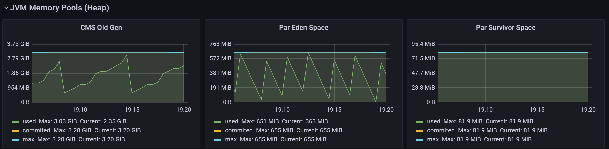

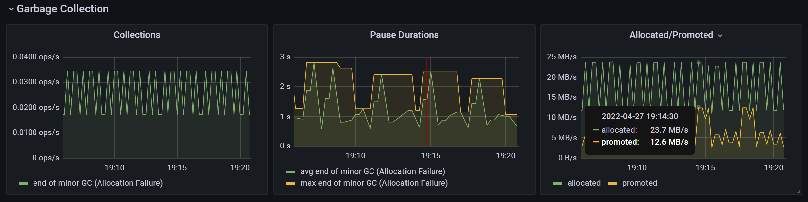

从这两张图上, 可以看出首先老年代内存一直在上下波动, 说明有majorgc, 下面gc的图表, 也能看到major和minor gc的信息. collections中展示的是gc操作次数(ops - Operation per seconds).

> grafana中垃圾收集只看到了minor gc, 没有看到major gc, 但是, 实际上是有majorgc的, 从下面的分析可以看到

接下来, 直接分析gc日志. 把采集到的gc日志上传到[easygc](https://gceasy.io/)这个网站上. 接下来, 大致看下分析结果:

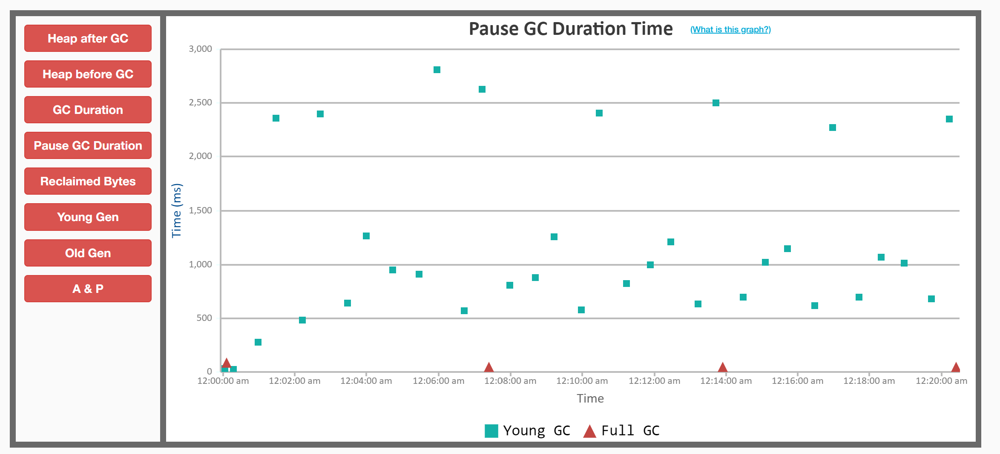

图上红色是fullgc, 绿色是young gc, 可以看到fullgc和上面堆内存趋势节奏基本一致, 20分中内出现4次fullgc, 这已经很频繁了.

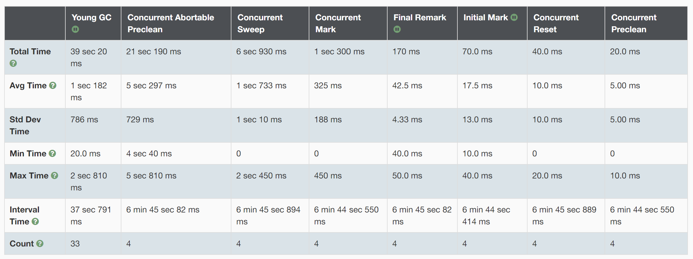

这个图统计了各阶段的耗时分布情况.

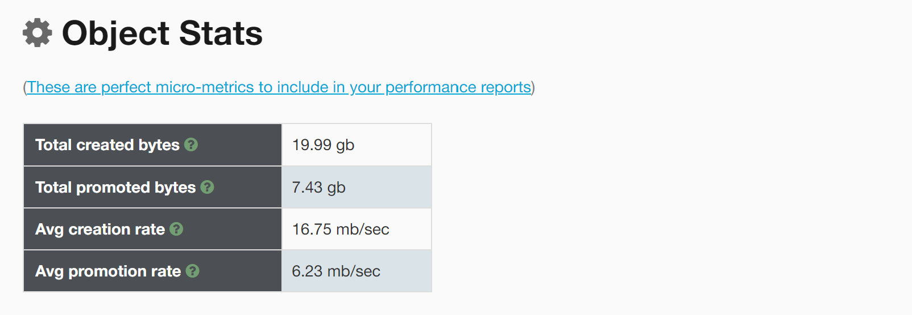

从这个表格中, 可看出内存晋升速率为6.23mb/sec, 也就是说每秒钟, 有6.23mb的数据由新生代晋升至老年代.

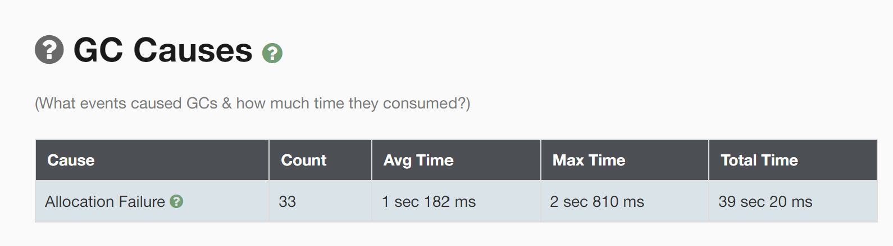

这张图分析了触发gc的主要原因, 可以看出主要在于新生代内存分配失败, 导致了一部分对象直接晋升到了老年代, 而这些对象又是朝生夕死的对象, 如果能保留在新生代, 就可以被minorgc回收了, 所以, 这里我们调整新生代的内存大小, 使得新生代内存大一些, 从而不会出现分配失败的情况, 也就不会晋升到老年代. 

> 总结一下, 其特点是, 瞬间产生大量的朝生夕死的对象, 导致新生代分配失败, 直接晋升到了老年代.

如下修改参数:

```
-Xms4g
-Xmx4g
-XX:+HeapDumpOnOutOfMemoryError
-XX:HeapDumpPath="D:\work\oom\oom.hprof"
-XX:+UseConcMarkSweepGC
-XX:NewRatio=1
-XX:+PrintGCDetails
-Xloggc:D:/gc.log
-XX:MetaspaceSize=64m
-XX:MaxMetaspaceSize=64m
```

> 注意, 这里新增了两个参数, MetaspaceSize, MaxMetaspaceSize, 用来控制元数据区的初始大小. 因为我发现, 应用每次启动的时候, 都会触发一次fullgc, 网上查到, 是因为默认元数据区初始大小是20M, 对于这个应用, 是不够用的, 而元数据区扩容会触发一次fullgc.

其余条件不变, 效果如图:

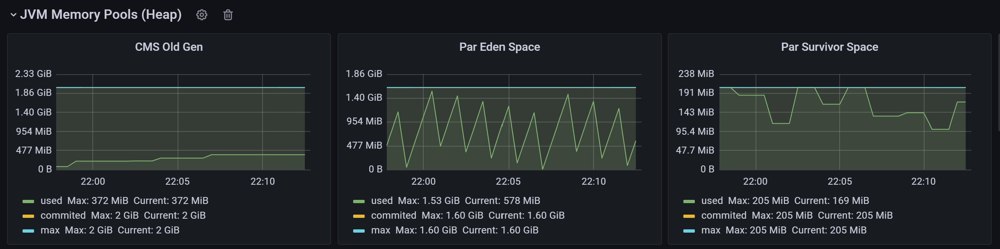

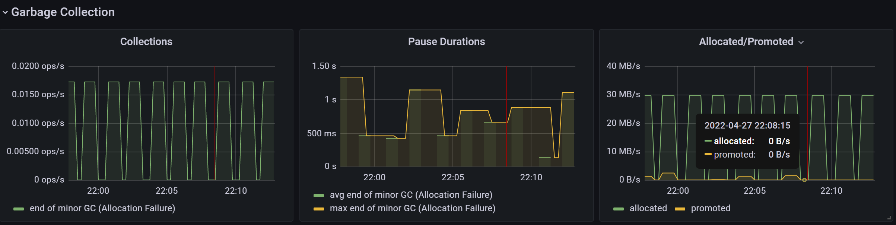

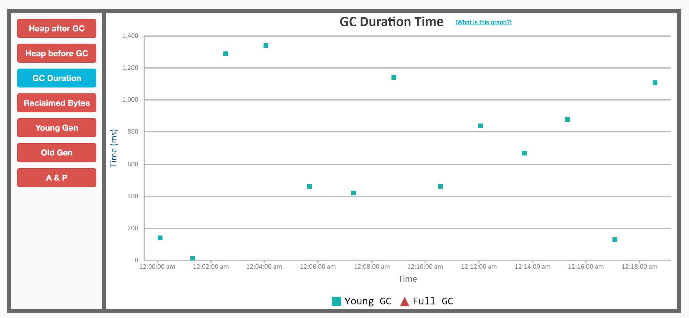

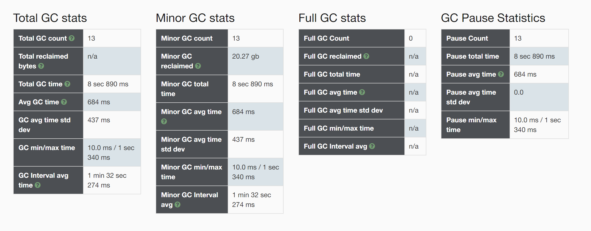

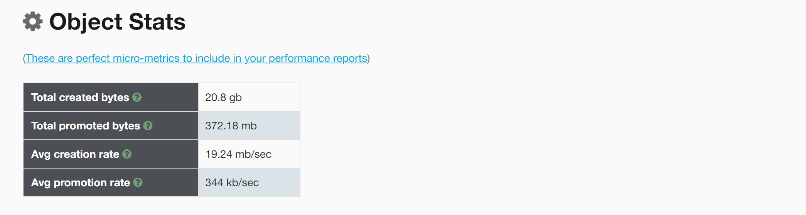

晋升依旧存在, 但是晋升速率已经由原来的6.23mb/s降低为344kb/s, 按照这个速度的话, 每1.69个小时会触发一次fullgc, 如果在将整体内存增大一些, 使得新生代和老年代都再扩大一些, 效果会更好.

> 上面的例子只是为了演示效果, 并说明新生代和老年代分配不合理, 导致晋升速度过快, 最终使得fullgc过于频繁的问题, 实际中, 也可以通过扩充整体的内存大小, 来解决.

## 大对象直接进入老年代

接下来, 在演示一种由于大对象导致的fullgc过于频繁的问题. 

测试代码如下:

```java
@RequestMapping("/longFullGCForBigObj")
public String longFullGCForBigObj(){
    byte[] buffer = new byte[1024 * 1024 * 10];
    logger.info("size : {}", buffer.length);
    return "beans";
}
```

启动参数:

```
-Xms4g
-Xmx4g
-XX:+HeapDumpOnOutOfMemoryError
-XX:HeapDumpPath="D:\work\oom\oom.hprof"
-XX:+UseConcMarkSweepGC
-XX:NewRatio=4
-XX:+PrintGCDetails
-Xloggc:D:/gc.log
-javaagent:D:\work\Prometheus\jmx_prometheus_javaagent-0.16.1.jar=9071:config.yaml
-XX:MetaspaceSize=64m
-XX:MaxMetaspaceSize=64m
-XX:PretenureSizeThreshold=3145728
```

> 注意-XX:PretenureSizeThreshold表示大对象的阈值, 超过这个阈值的对象, 将会直接进入到老年代. 这个参数只适用于Serial和ParNew两款收集器, 这里指定的垃圾收集策略UseConcMarkSweepGC包含了这个收集器.

这个, 通过grafana观察现象有些意外, 我预想的是新生代内存不会有任何波动, 所有对象都是直接进入老年代. 但是, 实际上, 新生代依旧有垃圾回收发生.

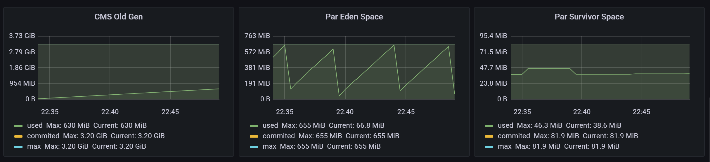

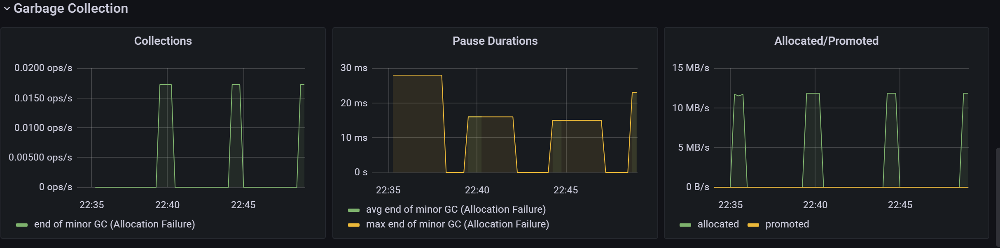

但是, 下面的动图, 确实能说明大对象直接进入了老年代, 没有经过新生代:

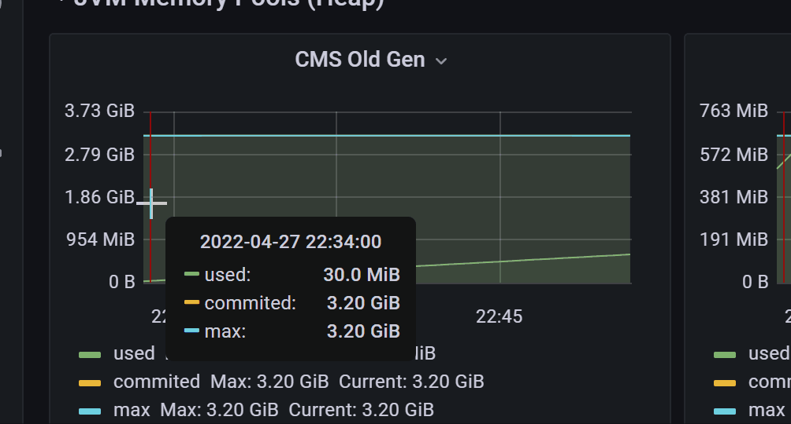

> 图上可以看出, 老年代内存一直以10的倍数递增中, 代码上看, 每次我们分配的byte数组就是10m

暂时抛开新生代已经有内存变化这个问题. 对于大对象晋升这个问题, 实际中也会遇到, 如果使用的CMS+ParNew垃圾收集器, 就可以通过修改PretenureSizeThreshold参数来控制, 但是, 实际上改成G1垃圾收集器就好了, G1垃圾收集器有专门的大对象区(但是G1建议内存在8G以上)

## 意外现象的补充说明

对于上面新生代依旧存在内存变化, 应该是spring等框架内部创建的临时对象引起的. 这个可以做一个测试, 将上面创建数组的代码注释掉:

```java
    @RequestMapping("/longFullGCForBigObj")
    public String longFullGCForBigObj(){
//        byte[] buffer = new byte[1024 * 1024 * 10];
//        logger.info("size : {}", buffer.length);
        return "beans";
    }
```

其余条件不变, 启动项目, 测试, 可以看到:

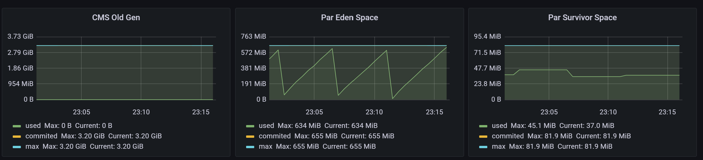

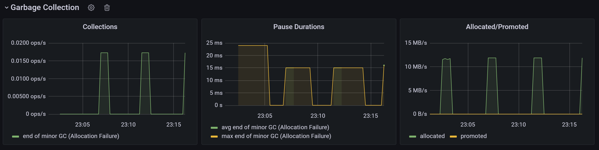

完全一致.