# 排故-内存溢出

## 概述

内存溢出分为很多种, 包括堆内存溢出, 栈溢出, 直接内存溢出. 现在很多应用都是采用容器部署, 都是由K8S管理的, 有时候, OOM并不是jvm自己触发的, 也有可能是k8s在检测到内存超出阈值后, 直接将进程杀掉了. 此外, 即使不是由k8s等管理. 而是直接部署在linux中, 也有可能被linux系统kill掉. 总之, OOM分为很多种情况. 这里只讨论JVM的OOM.

JVM的OOM又分为几种场景:

1. 堆溢出
2. 虚拟机栈溢出
3. 方法区
4. 本机直接内存溢出

## 案例1

这里只是一个简单的演示, 通过一个死循环不断创建对象, 导致堆内存溢出.

> 虽然是个演示, 也是有真实案例的. 我经历的真实情况是这样的: 数据库中存储了几百万条数据, 一个sql查询没有做分页处理, 导致一次性把这几百万条数据全都加载到内存中了, 并且这几百万条数据还会转为json返回给被调用者, 最终导致OOM.

```java
    @RequestMapping("/triggerOOM")
    public String triggerOOM(){
        ArrayList<Object> objs = new ArrayList<>();
        while(true){
            objs.add(new OOMBean());
        }
    }
```

启动参数中添加:

```
-Xms1g -Xmx1g -XX:+HeapDumpOnOutOfMemoryError -XX:HeapDumpPath="D:\work\oom\oom.hprof"
```

请求```triggerOOM```接口后, 不久就会触发OOM, 然后jvm会自动生成dump文件, 这里指定它在```D:\work\oom\oom.hprof``, 下面分析一下这个文件. 之前分析dump文件工具是IBM的HeapAnalyzer, 但是官网提示这个工具不再提供更新了, 建议使用[Eclipse Memory Analyzer Tool (MAT)](https://www.ibm.com/support/pages/eclipse-memory-analyzer-tool-dtfj-and-ibm-extensions), 所以, 这里也是用这个工具进行分析, 这个工具不需要安装eclipse, 直接就可以运行.

由于这个工具本身也是基于jvm运行的, 当分析的目标文件本身过大时, 可能会导致这个软件直接OOM了, 所以启动这个软件时需要调整分配给它的最大内存, 这个配置可以在```MemoryAnalyzer.ini```中找到, ```MemoryAnalyzer.ini```中有一个配置```-Xmx2048m```就是了. 修改完配置, 导入dump文件, 可以看到如下结果:

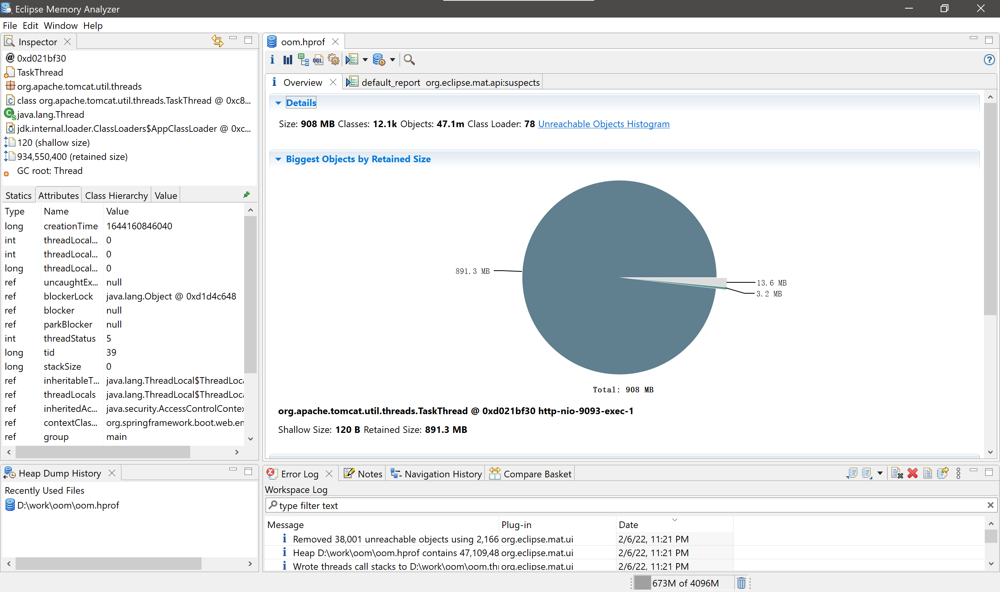

可以看到有一个对象, 占用了大部分的内存. 另外从分析出的内存泄露页面, 实际上直接就能定位问题了.

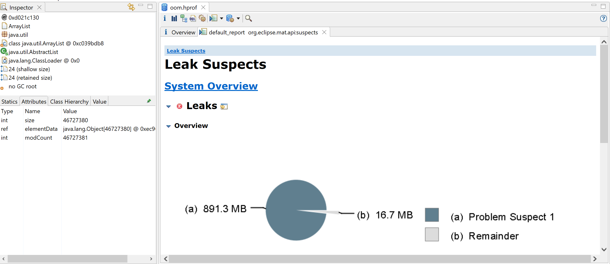

向下滚动, 点击"Detail >>", 可以看到结果:

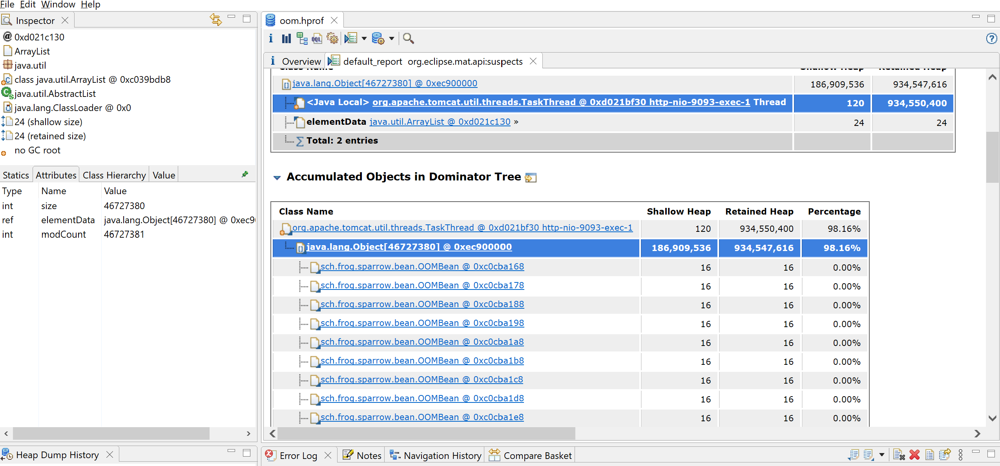

很多时候, 并不是能这么顺利的定位. 需要自己手动分析. 可以点击Histogram, 查看各个实例个数, 占用内存大小.

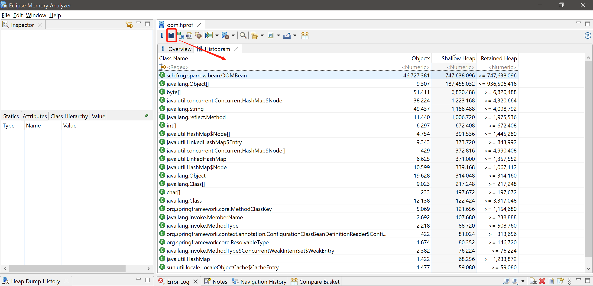

> 这里有ShallowHeap和RetainHeap两个指标, 其数值的单位都是byte, 含义, 不准确的说一个是指对象自身独占的内存大小, 一个是对象自身以及其属性树包含的所有对象所占用的内存大小.

还可以查看一下支配树:

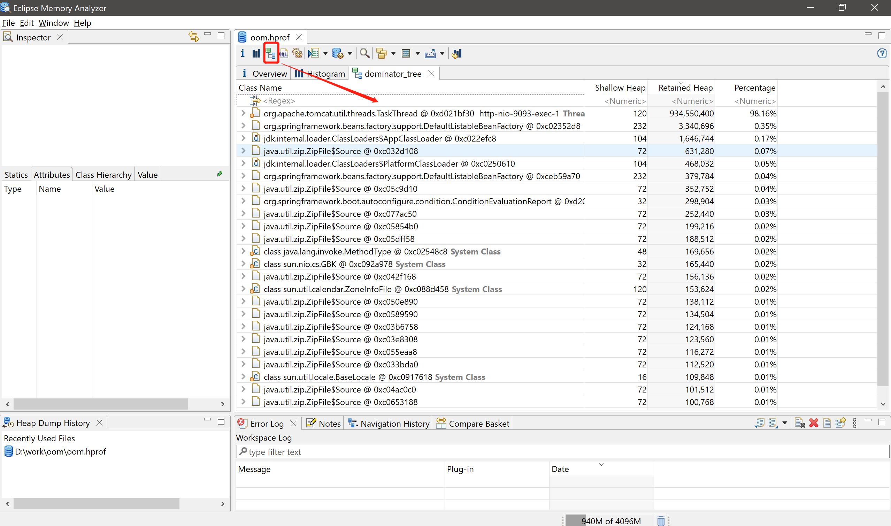

支配树可以理解成由GCroot一步一步关联子对象, 如果父节点被回收, 子节点也会被回收. 展开支配树, 也能看到出问题的地方:

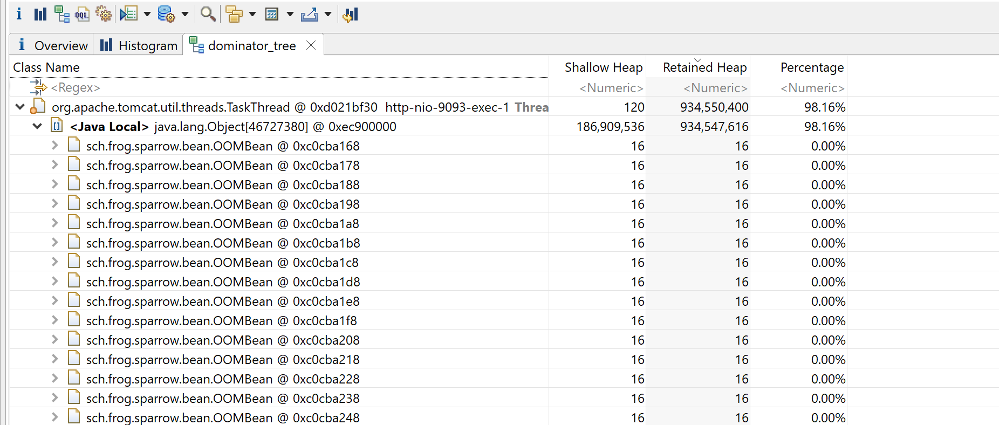

还可以调整支配树展示的形式, 例如, 通过分组显示每个类占用的大小:

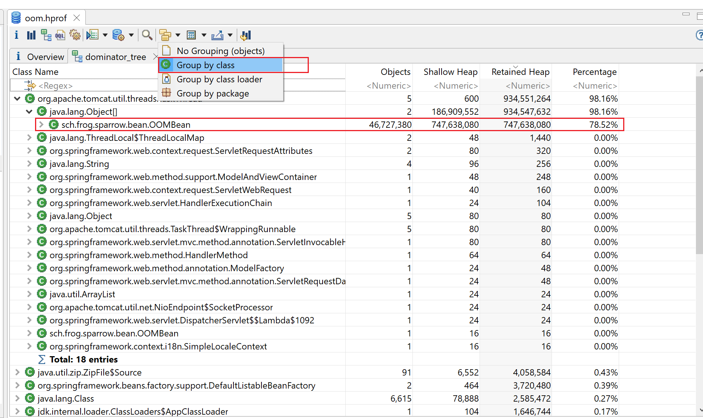

此外, 还可以分析线程信息, 有时候, 并不是一个请求直接导致OOM, 而是多个请求并发访问, 累加在一起导致的, 这时候, 可以通过线程分析来定位.

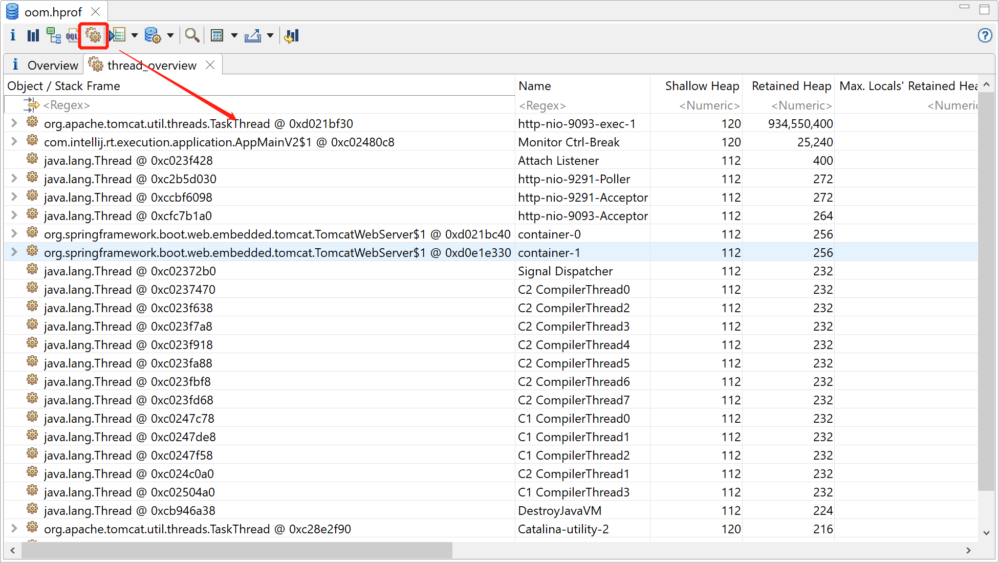

## 案例2

这里再分析一个较复杂的案例, 这个案例中, 最开始没有直接OOM, 需要再OOM之间手动生成dump文件, 来分析. 这里再结合一下Prometheus+Grafana来感受一下.

> 也是有实际案例的, 实际场景是这样的. 一段程序判断逻辑错误, 导致本地数据库rocksdb存储的数据越来越多, 而不会被删除. 而查询rocksdb数据的时候, 直接查询所有数据, 导致一次性加载的数据过多, 并且越来越多, 最终导致内存溢出.

代码如下:

```java
    private AtomicLong total = new AtomicLong(0);

    @RequestMapping("/accumulationOOM")
    public ArrayList<OOMBean> accumulationOOM(){
        long t = total.getAndAdd(10000);
        ArrayList<OOMBean> beans = new ArrayList<>();
        for(int i = 0 ; i < t; i++){
            beans.add(new OOMBean());
        }
        return beans;
    }
```

在反复请求的过程中, 并没有出现oom, 但是响应越来越慢, 应用运行的也越来越慢. 先查看grafana:

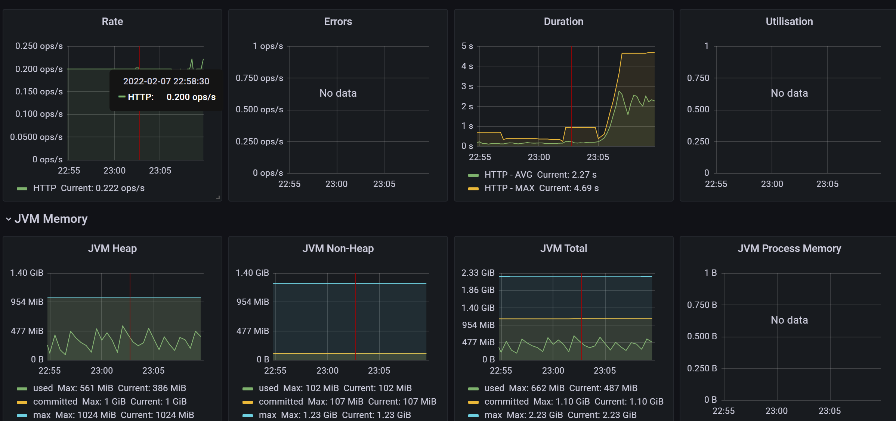

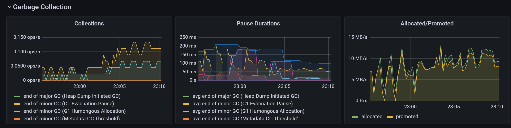

可以看出响应时间确实在变长, 堆内存呈锯齿状, 并且临近峰值之间时间间隔很短, 说明有频繁的GC. 从垃圾收集器的监控上也能看出, GC暂停时间最高在200ms左右, 并且频发GC. 内存晋升速率10M/s左右, 说明新生代内存空间不足或者存在大对象, 瞬间产生过多的对象, 新生代存储不下, 直接晋升至了老年代. 内存分配速率几乎与内存晋升速率平行, 也说明了这点, 此外内存分配速率过高, 也会影响性能.

接下来看下dump文件

1. 通过jps命令, 查看进程id.

```
D:\work\dump2>jps
2928 Launcher
19364 Jps
7044
10632 SparrowApplication
1884 sonarlint-ls.jar
```

2. 通过jmap命令主动生成dump文件

```
jmap -dump:live,format=b,file=sparrow.bin 10632
```

这里需要多输出几个dump文件, 逐个分析, 因为有可能输出dump的时候, 对象变为了垃圾对象, 就会被GC回收掉. 另外, 也可以执行:

```
jmap -dump:format=b,file=sparrow.bin 10632
```

就是把live去掉了, 这样即使是死亡的对象, 也会被dump下来.

先分析一个加上live参数的:

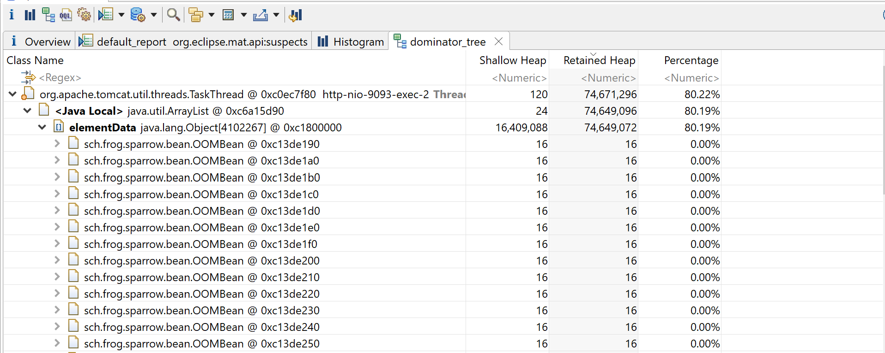

很明显, 可以看出问题了.

在看一个没有live参数的:

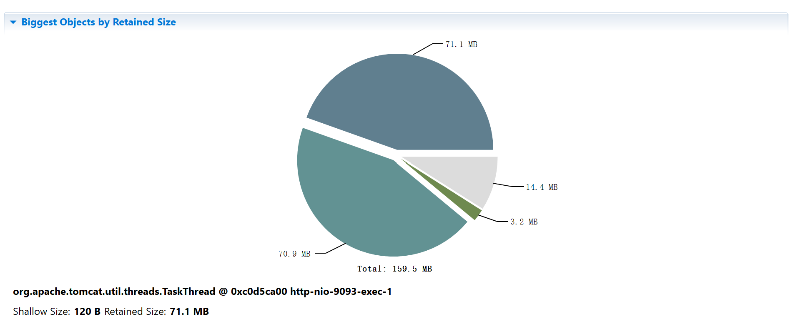

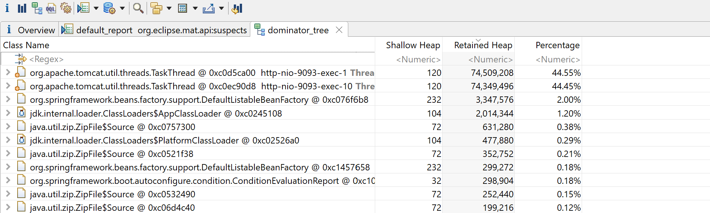

测试过程中, 我的请求是串行的, 在第一个请求结束后, 才会执行第二个请求, 所以, 同一时间存活的对象集合只有一个, 所以另一个是死亡的对象集合, 也就是通过GCRoot不可达的. 通过查看unreachable_objects可以印证这一点:

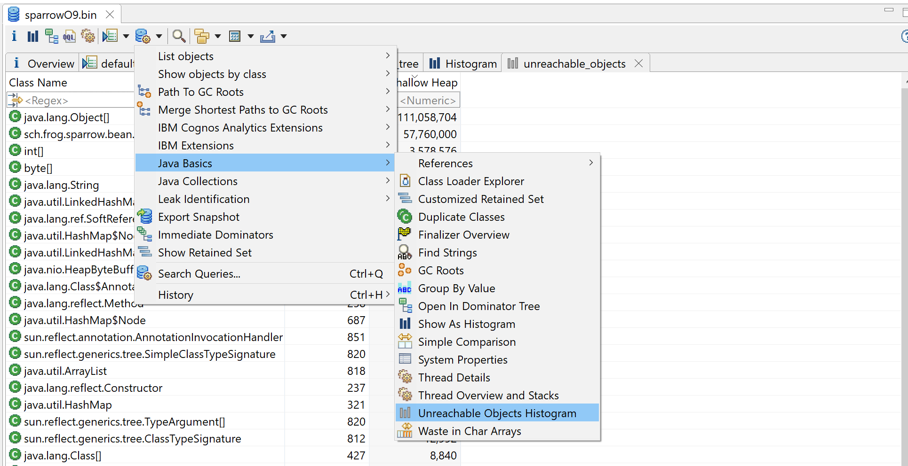

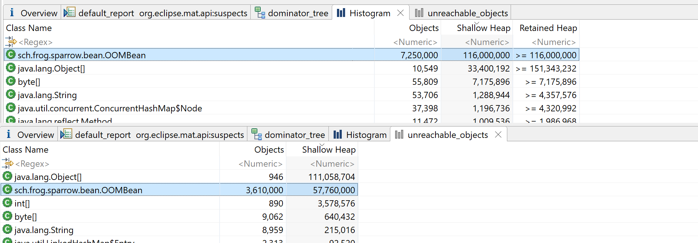

可以看出, 不可达对象大约占总对象OOMBean的一半.