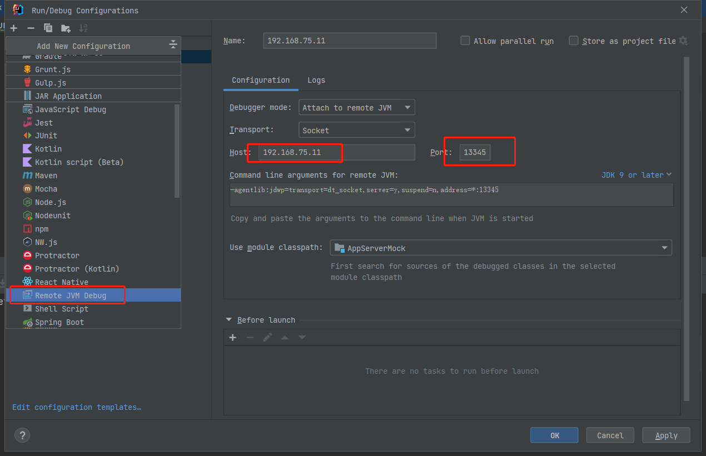

# 远程断点调试

## SpringBoot&IDEA

1. 启动参数中添加: ```-Xdebug -Xrunjdwp:transport=dt_socket,address=13345,server=y,suspend=n```, 例如:

```
nohup java -Xdebug -Xrunjdwp:transport=dt_socket,address=13345,server=y,suspend=n -jar AppServerMock.jar --server.port=13341 >/dev/null 2>&1 &
```

> jdk1.4 --> ```-Xdebug -Xrunjdwp:transport=dt_socket,address=13345,server=y,suspend=n```
> jdk5 -- 8 --> ```-Xdebug -agentlib:jdwp:transport=dt_socket,address=13345,server=y,suspend=n```
> jdk9以上 --> ```-Xdebug -agentlib:jdwp:transport=dt_socket,address=*:13345,server=y,suspend=n```

2. 确定linux系统防火墙已经打对应的端口(tcp)

```
firewall-cmd --list-all
```

3. 本地IDEA配置



4. 启动, 调试, 完成.


## Tomcat&IDEA

和spring boot几乎一样, 只是把这些配置加在startup.sh的CATALINA_OPTS中.

## 注意事项

* 日志依旧会输出在远程服务器上;
* 本地断点, 会卡住整个远程服务器;