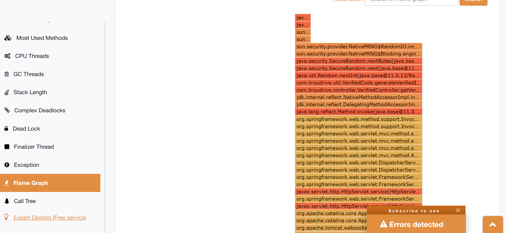

# 排故-线程阻塞或响应慢

## 概述

线程阻塞或者响应慢时, 一般通过jstack命令, 获取堆栈信息. 然后通过堆栈信息, 利用[fastthread](https://fastthread.io/), 分析是否有线程阻塞, 或者通过火焰图, 分析耗时较长的方法, 从而定位问题.

## 案例1

一个生成验证码的接口, 多次请求, 均返回```gateway timeout```, 怀疑是线程阻塞.

1. 通过jps命令, 确定当前应用的pid.

```bash
[root@VM-24-13-centos frog]# jps
6819 Jps
5416 frontend-api.jar
[root@VM-24-13-centos frog]# ps -ef | grep frontend-api
root      5416     1  3 18:10 ?        00:00:22 java -jar frontend-api.jar --server.port=8080
root      7361  6767  0 18:20 pts/0    00:00:00 grep --color=auto frontend-api
```

> 以上展示了两种定位该应用的进程id的方式.

2. 通过jstack命令, 导出堆栈信息.

```bash
[root@VM-24-13-centos frog]# jstack 5416 >> stack.out
```

```bash
[root@VM-24-13-centos frog]# ll
total 40
drwxr-xr-x 4 root root  4096 Jan 25 18:21 frontend-api
drwxr-xr-x 9 root root  4096 Jan 18 22:06 jdk-11.0.13
-rw-r--r-- 1 root root 25879 Jan 25 18:21 stack.out
drwxr-xr-x 3 root root  4096 Jan 22 14:46 web
```

3. 导出数据上传至[fastthread](https://fastthread.io/), 查看分析结果

本次案例分析结果部分截图如下:


对blocked线程, 点击查看详情. 可以看到阻塞的具体内容:


通过这个, 分析可以知道, 所有的阻塞都是由于SecureRandom这个随机数生成器导致的(这里不阐述SecureRandom具体原因).



通过火焰图, 也可以看出耗时最长的方法就是这个方法.

采集到的堆栈数据在这里: [data](data/secure_random_blocked.stack)