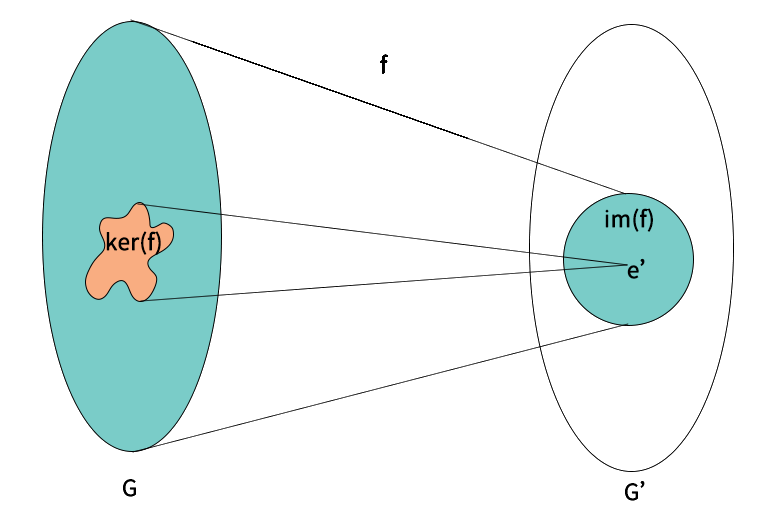
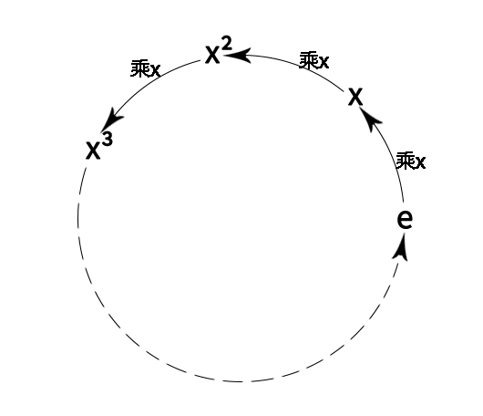
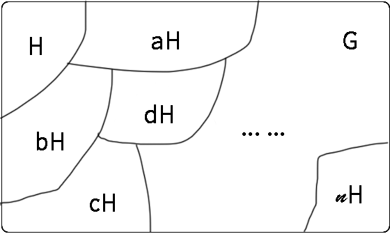
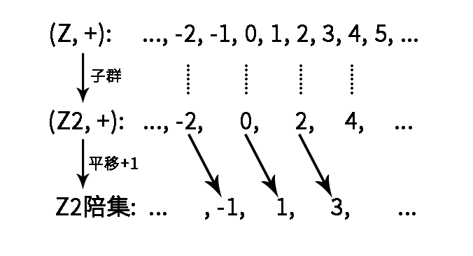

# 抽象代数

## 1. 群

### 1.1 幺半群

> S是一个集合, *是一个运算, (S, *)表示由一个集合和这个集合上的运算构成的"结构".

* 当运算*在集合S中是封闭的, 那么称这个运算为**二元运算**
* $(S, *)$ 为**幺半群** <==> 二元运算 + 结合律 + 单位元
  * $\forall x,y,z \in S, x * (y * z) = (x * y) * z$
  * $\exist e \in S, \forall x \in S, e * x = x * e = x$
* $(S, *)$ 作为幺半群, 如果满足交换律, 则称为**交换幺半群**
* 若 $(S, \cdot)$ 是幺半群, 则单位元是唯一的.
* **广义结合律**: $x_1 \cdot x_2 \cdots x_n = (x_1 \cdot x_2 \cdots x_{n-1}) \cdot x_n$
  * $x_1 \cdot x_2 \cdots x_n \cdot y_1 \cdot y_2 \cdots y_n = (x_1 \cdot x_2 \cdots x_n) \cdot (y_1 \cdot y_2 \cdots y_n)$
* 对于 $(S, \cdot)$, $x\in S, m, n \in N$, 有 $x^{m+n} = x^m \cdot x^n$
* 令 $(S, \cdot)$ 是一个幺半群, 若 $T \subset S$. 称 $(T, \cdot)$ 为 $(S, \cdot)$ 的**子幺半群**, 当且仅当满足以下条件:
    1. $e \in T$
    2. $\forall x, y \in T, x \cdot y \in T$
* 假设有两个幺半群: $(S, \cdot), (T, *)$, 且 $f: S \rightarrow T$ 是一个映射, 我们称 $f$ 是一个**幺半群同态**, 当且仅当满足:
    1. $\forall x, y \in S, f(x \cdot y) = f(x) * f(y)$
    2. $f(e) = e'$, 其中 $e$ 是 $S$ 的单位元, $e'$ 是T的单位元
* 假设 $(S, \cdot)$ 是幺半群, $A \subset S$ 是一个子集. 定义**由A生成的子幺半群**, 记作 $\langle A \rangle$, 是指S中所有包含了A的子幺半群的交集. 表示为: $\langle A \rangle = \bigcap \{ T \subset S : T \supset A, T \ is\ submonoid \}$
* $\langle A \rangle$ 是包含了A的最小子幺半群
* 假设 $(S, \cdot)$, $(T, *)$ 是两个幺半群, 且 $f: S \rightarrow T$ 是一个映射, 我们称为**幺半群同构**, 当且仅当:
    1. $f$ 是一个双射
    2. $\forall x, y \in S, f(x \cdot y) = f(x) * f(y)$
    3. $f(e) = e'$, 其中 $e$ 是 $S$ 的单位元, $e'$ 是T的单位元
* 若 $f: (S, \cdot) \rightarrow (T, *)$ 是幺半群同构, 则 $f^{-1}: T \rightarrow S$ 是有一个幺半群同态, 则 $f^{-1}$ 是幺半群同构

> 同构是一个等价关系.
> 什么是等价关系? 满足: 1. 反身性; 2. 对称性; 3. 传递性;
> 其他的等价关系还有: 相等, 全等, 相似等.

### 1.2 群

* **逆元**: 令 $(S, \cdot)$ 是一个幺半群, $x \in S$, 我们称x是可逆的, 当且仅当: $\exist y \in S, x \cdot y = y \cdot x = e$, 其中 $y$ 被称为 $x$ 的逆元, 记作 $x^{-1}$
* $(S, \cdot)$ 是幺半群, 若 $x \in S$ 存在逆元, 则其逆元唯一.
* **群**: 幺半群 $(G, \cdot)$ 如果所有元素都是可逆的, 则称为一个群.
* $(G, \cdot)$ 是一个群, 当且仅当:
    1. $\cdot$ 是二元运算
    2. $\forall x, y, z \in G, x \cdot (y \cdot z)  = (x \cdot y) \cdot z$
    3. $\exist e \in G, \forall x \in G, x \cdot e = e \cdot x = x$
    4. $\forall x \in G, \exist y \in G, x \cdot y = y \cdot x = e$
* $(G, \cdot)$ 是群, 令 $x \in G$, 则 $(x^{-1})^{-1}=x$
* $(G, \cdot)$ 是群, 令 $x, y \in G$, 则 $(x \cdot y)^{-1} = y^{-1} \cdot x^{-1}$
* 若 $(G, \cdot)$ 是一个群, 当满足交换律时, 称它为**阿贝尔群**或**交换群**
* 令 $(S, \cdot)$ 是一个幺半群, 令 $G$ 是所有可逆元素构成的子集, 则 $(G, \cdot)$ 是群
* **n阶一般线性群**: 所有 $n*n$ 可逆实矩阵构成的乘法群, 称为(实数上的)一般线性群, 记作: $(GL(n,\mathbb{R}), \cdot)$, 其中集合表示为: $GL(n, \mathbb{R}) = \{A \in M(n, \mathbb{R}) : det(A) \ne 0\}$
* **n阶特殊线性群**: 行列式为1的 $n*n$ 可逆实矩阵构成的乘法群, 称为(实数上的)特殊线性群, 记作: $(SL(n, \mathbb{R}), \cdot)$, 其中集合表示为: $SL(n, \mathbb{R}) = \{A \in M(n, \mathbb{R}) : det(A) = 1\}$
* 令 $(G, \cdot)$ 是一个群, 且 $H \subset G$. 称H是G的**子群**, 记作 $H < G$, 当且仅当:
    1. $e \in H$
    2. $\forall x, y \in H, x \cdot y \in H$
    3. $\forall x \in H, x^{-1} \in H$
* 上面子群的判定条件可以简化为:
    1. $e \in H$
    2. $\forall x, y \in H, x \cdot y^{-1} \in H$
* 令 $(G, \cdot), (G', *)$ 是群, 且 $f: G \rightarrow G'$ 是一个映射. 我们称 $f$ 是一个**群同态**, 当且仅当 $\forall x,y \in G, f(x \cdot y) = f(x) * f(y)$
  * *与幺半群同态不一样, 幺半群同态还需要满足单位元映射之后还是单位元. 而群同态自然就满足了这个要求.*
* 若 $f: (G, \cdot) \rightarrow (G', *)$ 是一个群同态, 则 $f(e) = e', f(x^{-1})=f(x)^{-1}$
* $det: GL(n, \mathbb{R}) \rightarrow (\mathbb{R}^{\times}, \cdot)$ 是一个乘法群同态
* 令 $f: (G, \cdot) \rightarrow (G', *)$ 是一个群同态, 则定义 $f$ 的**核**与**像**, 记作 $ker(f), im(f)$, 分别为:
  * $ker(f)=\{x \in G: f(x) = e'\} \subset G$
  * $im(f) = \{y \in G' : \exist x \in G, y = f(x)\}=\{f(x): x \in G\} \subset G'$

* 令 $f: (G, \cdot) \rightarrow (G', *)$ 是一个群同态, 则核是定义域的子群, 像是陪域的子群, 即: $ker(f) < G, im(f) < G'$
* 令 $f: (G, \cdot) \rightarrow (G', *)$ 是一个群同态, 我们称 $f$ 是一个**满同态**当 $f$ 是满的, 称 $f$ 是一个**单同态**当 $f$ 是单的.
* 令 $f: (G, \cdot) \rightarrow (G', *)$ 是一个群同态, 则 $f$ 是一个单同态当且仅当 $ker(f)=\{e\}$
* 令 $f: (G, \cdot) \rightarrow (G', *)$ 是一个映射, 我们称 $f$ 是一个**群同构**, 当 $f$ 即是一个双射, 又是一个群同态. 简单来说, 同构就是双射的同态.
* 若 $f: (G, \cdot) \rightarrow (G', *)$ 是一个群同构, 则 $f^{-1}$ 也是群同构.
* $A, B$ 是两个集合, 则称 $A \times B = \{(a, b) | a \in A, b \in B\}$ 为集合A与B的**直积**
* 令 $(G, \cdot_1), (G', \cdot_2)$ 是两个群, 则这两个**群的直积**记为: $(G \times G', *)$. 具体的, 对于 $(x, y), (x', y') \in G \times G'$, 其群的直积为 $(x, y) * (x', y') = (x \cdot_1 x', y \cdot_2 y')$
* 若 $(G, \cdot_1), (G', \cdot_2)$ 是两个群, 则它们的直积 $(G \times G', *)$ 也是群.

### 1.3 有限群

* 如果群 $(G, \cdot)$ 中元素个数是有限的, 称为**有限群**
* 若 $x \in G$, 则 $x$ (在G中)的**阶**, 记作 $|x|$. 定义为: 最小的正整数 $n \in N^*$, 使得 $x^n = e$. 若这样的 $n$ 不存在, 则记 $|x|= \infty$
* 若 $(G, \cdot)$ 是有限群, 且 $x \in G$, 则 $|x| < \infty$. 换言之, 有限群的每一个元素通过自乘有限多次, 都可以得到单位元.
* 令 $(G, \cdot)$ 是一个群, 且 $x \in G$. 若 $n \in N^*$, 我们定义 $x^{-n} = (x^{-1})^n$, 另外 $x^0=e$
* 令 $(G, \cdot)$ 是一个群, 任取 $a \in G$. 则 $f: (Z, +) \rightarrow (G, \cdot)$, 定义为 $f(x) = a^x$, 则 $f$ 是一个群同态.
* 令 $(G, \cdot)$ 是一个群, 且 $x \in G$. 令 $m, n \in Z$, 则 $x^{mn} = (x^m)^n$
* 令 $(G, \cdot)$ 是一个群, 且 $x \in G$, 则 $\langle x \rangle$ 被称为由 $x$ **生成的群**, 定义为: $\langle x \rangle = \{x^n: n \in Z\}$
* 令 $(G, \cdot)$ 是一个群, 且 $S \subset G$. 则由 $S$ 生成的群, 记作: $\langle S \rangle$, 定义为: $\langle S \rangle = \bigcap\{H\subset G: H \supset S, H < G\}$
* 令 $(G, \cdot)$ 是一个群, 若 $\exist x \in G$, 使得 $G = \langle x \rangle$, 则G被称为一个**循环群**, 而 $x$ 被称为 $G$ 的一个生成元.

有限循环群:

无限循环群:

* 令 $G= \langle x \rangle$ 是有限循环群, 假设 $|x|=n$ (*x的阶*), 则 $G = \{e, x, x^2, \cdots , x^{n-1}\}$, 其中枚举法中的这些元素是两两不同的. 我们称这样的有限循环群的阶是 $n$.
* 对于任意 $n \in N^*$, 所有n阶循环群都是相互同构的.
* 令 $G=\langle x \rangle$ 是无限循环群, 则 $x^n (n \in Z)$ 是两两不同的, 且 $G$ 只有两个生成元, 分别是 $x, x^{-1}$
* 所有无限循环群是彼此同构的.
* 令 $G = \langle x \rangle$ 是一个n阶循环群. 假设 $1 \leq m \leq n$, 则 $x^m$ 的阶为: $|x^m|=\frac{n}{gcd(n, m)}$
* 令 $G = \langle x \rangle$ 是一个n阶循环群, 则 $x^m(1 \leq m \leq n)$ 是个生成元, 当且仅当 $gcd(m, n)=1$. 根据欧拉 $\phi$ 函数的定义, 这些生成元的个数正是 $\phi(n)$

> 欧拉 $\phi$ 函数是小于 $n$ 的正整数中与 $n$ 互质(最大公约数为1)的数的个数

* 令 $H$ 是 $G$ 的子群, 则 $H$ 的阶, 记作 $|H|$, 定义为 $H$ 的集合大小. 若 $H$ 是无限群则记为 $|H|=\infty$
* 若 $H$ 是 $G$ 的子群, 则 $H$ 的阶整除 $G$ 的阶, 即: $|H| | |G|$
* 令 $G$ 是一个群, $H < G$ 是一个子群, $a \in G$. 则 $aH$ 是 $H$ 的一个**左陪集**(由 $a$ 引出), 定义为: $aH = \{ax: x \in H \}$
* 令 $G$ 是一个有限群, $H < G$ 是一个子群, $a \in G$. 我们通过左乘 $a$ 来定义 $f: H \rightarrow aH$, 即: $f(x) = ax$, 则 $f$ 是一个双射. 特别地, $|H| = |aH|$
* 令 $G$ 是一个有限群, $H < G$ 是一个子群, $a, b \in G$. 则左陪集 $aH$ 和 $bH$ 要么相等, 要么无交. 也就是说, 我们有 $aH = bH$, 或 $aH \cap bH = \emptyset$

所有陪集对G构成一个分拆, 每个陪集可以视作子群元素通过运算"平移"生成的:

* 令 $G$ 是一个有限群, $H < G$ 是一个子群. 则**商集** $G/H$ 定义为: $G/H = \{aH: a \in G \}$. 我们把这个商集的大小称为 $H$ 在 $G$ 中的指数, 记为 $[G:H]$, 即: $[G:H] = |G/H|$
* **拉格朗日定理**: 令 $G$ 是一个有限群, $H < G$ 是一个子群, 则 $|G| = [G: H] |H|$. 显然的 $H$ 的阶整除 $G$ 的阶.
* 令 $G$ 是一个有限群, $H < G$ 是一个子群, $x \in G$, 则我们有充要条件: $xH = H \Leftrightarrow x \in H$
* 令 $G$ 是一个有限群, $H < G$ 是一个子群, $x, y \in G$, 则我们有充要条件: $xH = yH \Leftrightarrow y^{-1}x \in H$
* 令 $K < H < G$是三个有限群, 则: $[G:K] = [G:H][H:K]$
* 令 $(G, \cdot)$ 是一个群. 若 $H, K < G$ 是两个有限子群, 则: $|HK| = \frac{|H||K|}{|H \cap K|}$
  * *注: $HK = \{hk: h \in H, k \in K\}$*

### 1.4 正规子群

上面我们知道了商集 $G/H$, 要是 $G/H$ 能是一个群就更好了, 为此有了下面的内容.

* 令 $(G, \cdot)$ 是一个群, 且 $N \subset G$. 我们称 $N$ 是个**正规子群**, 记作 $N \lhd G$, 当且仅当:
  1. $N$ 是个子群
  2. $\forall a \in G, aN = Na$

> 注: 上面描述的$\forall a \in G, aN = Na$ 可能是 $\forall a \in G, n_1, n_2 \in N, n_1 \neq n_2, an_1 = n_2a$

* 令 $(G, \cdot)$ 是一个群, 且 $N \lhd G, a, b \in G$, 则: $(aN) \cdot (bN) = (ab)N$
* 令 $(G, \cdot)$ 是一个群, 且 $N \lhd G$, 则 $(G/N, \cdot)$ 构成一个群, 称为(G在N上的)**商群**, 其中的单位元是 $eN = N$, 每个陪集 $aN$ 的逆元是 $a^{-1}N$
* 令 $(G, \cdot)$ 是一个群, 且 $N < G$, 则下列命题等价:
  1. $N$ 是 $G$ 的正规子群, 即 $\forall a \in G, aN = Na$
  2. $\forall a \in G, aNa^{-1} \subset N$
  3. $\forall a \in G, \forall n \in N, ana^{-1} \in N$
* 令 $(N_i)_{i \in I}$ 是一族 $G$ 的正规子群, 则它们的交集仍然是 $G$ 的正规子群, 即: $$\bigcap_{i \in I} N_i \lhd G$$
* 令 $(G, \cdot)$ 是一个群, 则: $\{e\} \lhd G, G \lhd G$
* 令 $(G, \cdot)$ 是一个阿贝尔群, 则: $H < G \Longleftrightarrow H \lhd G$
* **群同构第一定理**: 令 $f: G \rightarrow G'$ 是一个群同态, 则 $ker(f) \lhd G$, 且 $G/ker(f)\simeq im(f)$.
  * 若 $f$ 是一个满同态, 则 $G /ker(f) \simeq G'$
  * 若 $f$ 是一个单同态, 则 $G / {e} \simeq G \simeq im(f)$
  * 若 $G$ 是有限群, 则 $\frac{|G|}{|ker(f)|} = |im(f)|$
* **群同构第二定理**: 令 $(G, \cdot)$ 是一个群, 且 $N \lhd G, H < G$. 则 $H \cap N \lhd H, N \lhd HN$, 且 $H / (H \cap N) \simeq HN/N$
* **群同构第三定理**: 令 $(G, \cdot)$ 是一个群, 且 $N \lhd G, M \lhd G, M < N$. 则 $N/M \lhd G/M$, 且 $(G/M)/(N/M) \simeq G/N$

### 1.5 群作用

* 令 $S$ 是一个集合, 则 $S$ 上的**置换群**(或**对称群**), 记作 $(Perm(S), \circ)$, 由所有 $S$ 到自身的双射构成, 而这里的运算是映射的复合运算. $Perm(S) = \{f: S \leftrightarrow S \}$
* 令 $(G, \cdot)$ 是一个群, $S$ 是一个集合, 而 $\phi : G \rightarrow Perm(S)$. 若 $\phi$ 是一个群同态, 则我们说 $\phi$ 是 $G$ 在(集合) $S$ 上的**群作用**
* 令 $(G, \cdot)$ 是一个群, 我们对 $x \in G$, 定义 $\phi_x \in Perm(G)$, 对 $y \in G$, 定义为 $\phi_x(y) = xyx^{-1}$. 则 $\phi : G \rightarrow Perm(G)$, 对 $x \in G$, 定义 $\phi(x) = \phi_x$, 被称为 $G$ 的**共轭作用**.
* 令 $(G, \cdot)$ 是一个群, 则 $G$ 的共轭作用是 $G$ 在自身的一个群作用
* 令 $(G, \cdot)$ 是一个群, $x \in G$, 则 $\phi_x : G \rightarrow G$, 对 $y \in G$, 定义为: $\phi_x(y) = xyx^{-1}$ 是一个群 $G$ 的**自同构**(即到自身的同构)
* 令 $(G, \cdot)$ 是一个群, 则一个 $G$ 的(有 $x \in G$ 引出的)**内自同构**, 指的是 $\phi_x : G \rightarrow G$, 对 $y \in G$, 定义为: $\phi_x(y) = xyx^{-1}$, 而其他所有 $G$ 上的自同构, 则称为 $G$ 上的外自同构
* 令 $\phi : (G, \cdot) \rightarrow (Perm(S), \circ)$ 是一个 $G$ 在 $S$ 的群作用, 假如我们用 $x \cdot s$, 甚至 $xs$, 来代表 $\phi_x(s)$, 或 $\phi(x, s)$, (其中 $x \in G, s \in S$), 则我们等价地, 可以把群作用的性质, 记作:
  1. $\forall s \in S, e \cdot s = s$
  2. $\forall x, y \in G, x \cdot (y \cdot s) = (x \cdot y) \cdot s$
  * 或者进一步地, 在不会引起歧义的情况下, 记作:
    1. $\forall x \in S, es = s$
    2. $\forall x, y \in G, x(ys) = (xy)s$
* 令 $\phi : (G, \cdot) \rightarrow (Perm(S), \circ)$ 是一个 $G$ 在 $S$ 的群作用. 若 $s \in S$. 则我们定义 $s$ 的**轨道**, 记作 $Orb(s)$, 定义为: $Orb(s) = \{s' \in S: \exist x \in G, s' = xs\} = \{xs : x \in G\}$. 我们定义 $s$ 的**稳定化子**, 记作 $Stab(s)$, 定义为: $Stab(s) = \{x \in G: xs = s\}$
* 令 $\phi : (G, \cdot) \rightarrow (Perm(S), \circ)$ 是一个 $G$ 在 $S$ 的群作用, 而 $s, s' \in S$, 则 $Orb(s)$ 与 $Orb(s')$ 要么相等, 要么无交. 因此, $S$ 可以写成轨道的无交并.
* 令 $\phi : (G, \cdot) \rightarrow (Perm(S), \circ)$ 是一个 $G$ 在 $S$ 的群作用, 而 $s \in S$, 则 $s$ 的稳定化子是 $G$ 的子群, 即: $Stab(s) < G$
* 令 $\phi : (G, \cdot) \rightarrow (Perm(S), \circ)$ 是一个 $G$ 在 $S$ 的群作用, 而 $s \in S, x, y \in G$, 则 $xs = ys$ 当且仅当 $x^{-1}y \in Stab(s)$
* **轨道-稳定化子定理**: 令 $\phi : (G, \cdot) \rightarrow (Perm(S), \circ)$ 是一个 $G$ 在 $S$ 的群作用, $s \in S$, 则存在 $G / Stab(s)$ 到 $Orb(s)$ 的双射. 特别地, 若 $G$ 是有限群, 则: $|G| = |Stab(s)| \cdot |Orb(s)|$

> 有时, 我们不知道一个有限群 $G$ 的大小, 但知道它作用在集合 $S$ 上, 那我们就可以利用轨道-稳定化子定理, 找到某个点 $s \in S$ 的轨道和稳定化子, 进而算出 $G$ 的阶.

* 正 $n$ 边形到自身的对称变换所构成的群称为**正二面体群**, 记作: $D_{2n}$, 则有: $|D_{2n}| = 2n$

### 1.6 群论与数论

* 令 $n \in Z \setminus \{0\}$, 而 $m \in Z$, 我们说 $n$ 整除 $m$, 记作 $n|m$, 若: $m \in nZ = \{kn : k \in Z\}$
* 若 $n \in Z$, 则 $nZ \lhd Z$
* 令 $n \in N^*$, 而 $a, b \in Z$. 我们说 $a$ 同余 $b$ (模 $n$), 记作: $a \equiv b\ mod\ n$, 若: $a + nZ = b + nZ$ 或 $a - b \in nZ$
* 令 $n \in N^*$, 则 $Z_n$ 定义为: $Z_n = Z / nZ$, $Z_n$ 中的每个元素被称为一个模 $n$ 的同余类, 这些同余类可以枚举: $Z_n = \{k + nZ: 0 \leq k \leq n - 1\}$
* 令 $n \in N^*$, 则 $Z_n$ 是个 $n$ 阶循环群
* $(Z_n, \cdot)$是个幺半群
* 令 $n \in N^*$, 则 $Z_n^\times$, 定义为由 $(Z_n, \cdot)$ 中所有可逆元素构成的群, 即: $Z_n^\times = \{k + nZ : 0 \leq k \leq n - 1, \exist l \in Z, kl \equiv 1\ mod\ n\}$
* **裴蜀定理**: 若 $a, b, c \in N^*$, 则 $ax + by = c$ 有整数解 $x, y$ 当且仅当 $gcd(a, b)|c$. 特别地, 对于任意 $a, b \in N^*$, 我们可以找到 $x, y \in Z$, 使得 $gcd(a, b) = ax + by$
* 令 $n \in N^*$, 则 $Z_n^\times = \{k + nZ: 1 \leq k \leq n - 1, gcd(a, n) = 1\}$, 因此 $|Z_n^\times| = \phi(n)$. 特别地, 若 $p$ 是一个素数, 则 $Z_p^\times = \{1 + pZ, 2 + pZ, \cdots, (p - 1) + pZ\}$, 因此 $|Z_n^\times| = p - 1$
* 令 $(G, \cdot)$ 是个有限群, 则对任意 $a \in G, a^{|G|} = e$
* **费马小定理**: 令 $p$ 是一个素数, 而 $p \nmid a$, 则: $a^{p-1} \equiv a\ mod\ p$, 同时左乘 $a$, 也可以得到 $a^p \equiv a\ mod\ p$
* **欧拉定理**: 令 $n \in N^*$, 而 $gcd(a, n) = 1$, 则 $a^{\phi(n)} \equiv 1\ mod\ n$
* **威尔逊定理**: 若 $p$ 是一个奇素数(即除了2以外的素数), 则 $(p - 1)! \equiv -1\ mod\ p$, 其中 $!$ 表示阶乘

## 2. 环

### 2.1 环

> 环有两种不同的定义, 一种是有乘法单位元的, 一种是没有乘法单位元的, 这里使用的是有乘法单位元的定义.

* $(R, +, \cdot)$ 是一个**环**, 当 $(R, +)$ 是阿贝尔群, $(R, \cdot)$ 是幺半群, 且乘法对加法有左右分配律. 即:
  * $\forall a, b, c \in R, a(b + c) = ab + ac$
  * $\forall a, b, c \in R, (a + b)c = ac + bc$

> 一般情况下, 我们用 $+$ 表示环中的加法, 用 $\cdot$ 表示环中的乘法, 用0表示环的加法单位元, 用1表示环的乘法单位元

* $(R, +, \cdot)$ 是环, 当乘法有交换律时, $(R, +, \cdot)$ 是一个**交换环**, 即 $\forall a, b \in R, ab = ba$
* $(R, +, \cdot)$ 是环, $a, b, c \in R$, 则:
  * $a0 = 0a = 0$ (加法单位元乘任何元素结果都是加法单位元)
  * $a(-b) = (-a)b = -(ab)$
  * $(-a)(-b) = ab$
* $(R, +, \cdot)$ 是环, 则 $R = {0}$ 当且仅当 $0 = 1$
* 令 $(R, +, \cdot)$ 是一个环, 则 $(R^{\times}, \cdot)$, 是由 $R$ 中所有乘法可逆元素构成的群. $R$ 中的乘法可逆元素又被称为 $R$ 中的**单位**
* 令 $(R, +, \cdot)$ 是一个环, 我们称 $(R, +, \cdot)$ 是**除环**, 若: $R \setminus \{0\} = R^{\times}$, 也即, 所有非零元素都是单位.
* 令 $(R, +, \cdot)$ 是一个环, 我们称 $(R, +, \cdot)$ 是一个**域**, 若它是一个交换的除环
* $(R, +, \cdot)$ 是一个域, 当且仅当:
  1. $(R, +)$ 是一个阿贝尔群
  2. $(R \setminus \{0\}, +)$ 是一个阿贝尔群
  3. 乘法对加法有分配率
* 令 $(R, +, \cdot)$ 是一个环, 而 $S \subset R$, 我们说 $S$ 是 $R$ 的**子环**, 记作 $S < R$, 若:
  1. $0, 1 \in S$
  2. $\forall a, b \in S, a + b \in S$
  3. $\forall a \in S, -a \in S$
* 令 $(R, +, \cdot)$ 是一个环, 而 $S \subset R$, 则 $S < R$ 当且仅当:
  1. $1 \in S$
  2. $\forall a, b \in S, a - b, ab \in S$
* 令 $(R, +, \cdot)$ 是一个环, 而 $A \subset R$, 则 $A$ 生成的子环, 记作 $\langle A \rangle$, 定义为所有包含了A的子环的交集, 即: $\langle A \rangle = \bigcap \{ S \subset R: S \supset A, S < R \}$
* 令 $(R, +, \cdot)$ 是一个环, 而 $A \subset R$, 则 $\langle A \rangle < R$
* 令 $(R_i, +_i, \cdot_i)_{i \in I}$ 是一族环. 我们定义它们的直接, 为 $(\prod_{i\in I}R_i, +, \cdot)$. 对于 $(x_i)_{i\in I}, (y_i)_{i \in I} \in \prod_{i \in I} R_i$, 我们定义:
  * $(x_i)_{i\in I} + (y_i)_{i\in I} = (x_i +_i y_i)_{i \in I}$
  * $(x_i)_{i \in I} \cdot (y_i)_{i \in I} = (x_i \cdot_i y_i)_{i \in I}$
* 令 $(R_i, +_i, \cdot_i)_{i \in I}$ 是一族环, 则它们的直积 $(\prod_{i\in I}R_i, +, \cdot)$ 还是一个环

### 2.2 环同态

