# Blender笔记

## 基础

**视角控制**

* 旋转视角: 鼠标中键
* 平移视角: shift+中键
* 推进/推远视角: 鼠标滚轮

**视图切换**

* 切换前/后/顶/底/左/右视图:
  1. alt + 按住鼠标中键滑动
  2. ~ + 甩鼠标

**物体控制**

* 移动物体: G
* 旋转物体: R
* 缩放物体: S

> 以上按之后, 可以继续按X,Y,Z, 限制分别在某个方向上进行变换. 或者shift+X,Y,Z限制变换不影响其中一个方向. 可以重复多次, 用于在世界坐标系和物体坐标系进行切换.

* 重置移动: alt + G
* 重置旋转: alt + R
* 重置缩放: alt + S
* 应用变换: Ctrl + A
* 新建物体: shift + A
* 复制并移动物体: shift + D
* 删除物体: X
* 全选物体: A
* 加选/减选: shift + 鼠标点击
* 物体变换时, 可以仅变换原点

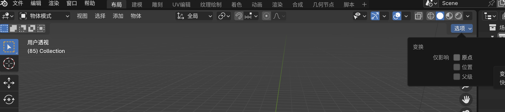

> 文中大部分操作, 在不点击空白位置时, 会在左下角有一个窗口, 可以修改一些参数, 如果点击空白, 就会消失. 如果这时没有进行其他操作, 可以点击F9重新唤起这个窗口.

> 在物体模式下对物体的缩放操作, 最后一定要应用缩放, 否则在后续的一些修改器或者动画过程中, 会有问题

物体上直接鼠标右键出现的菜单:

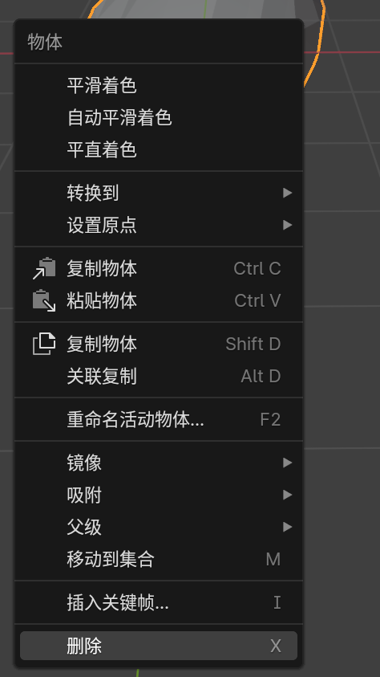

**其他**

* 游标: 默认是世界中心, 可以用来定位和当轴心点
  * 游标在哪里, 新建物体就会出现在哪里
  * 3D视图中, 上方选项中可以将旋转变换的轴改为游标
* 原点: 每个物体都有一个原点
* 调用游标Pie目录: Shift + S (游标->选中项, 选中项->游标 ... )
* 游标恢复到世界中心: Shift + C
* 移动游标: Shift + 右键
* 最大化窗口: Ctrl + 空格
* 步进移动: 移动状态下, 按住Ctrl 可以以网格为单位进行移动
* 渲染: F12
* 锁定摄像机: 按N调出视图侧边栏, 然后勾选, 如图:

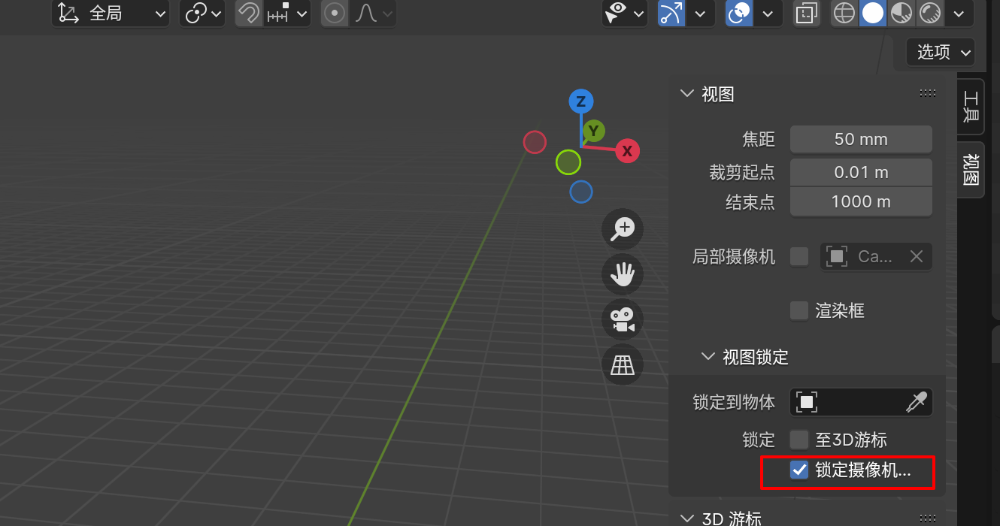

* 设置父级目标: Ctrl + P
  * 先选中的是子级, 最后选中的是父级

## 建模

* 物体模式/编辑模式切换: Tab
  * 按住Tab, 移动鼠标出现Pie目录, 会有更多选择
* 编辑对象切换: 1 - 点; 2 - 线; 3 - 面

**点线面操作**

* 框选: B
* 刷选: C
* 反选: Ctrl + I
* 多选: Shift
* 选择两个元素最短路径: 先选中第一个元素, 按住Ctrl, 选中第二个元素
* 选择相连元素: L
* 循环选择: 按住Alt + 双击, 可以选择一个循环边
* 垂直方向循环选择: Ctrl Alt + 双击
* 随机选择: 左上方选择菜单 

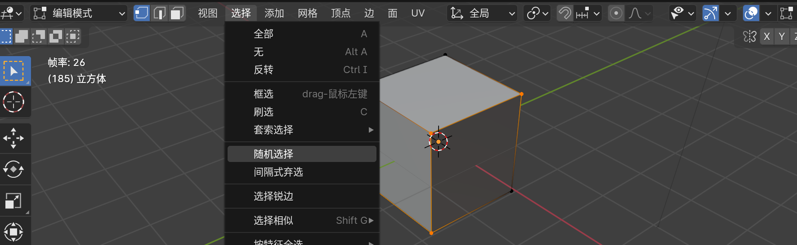

* 切换透视模式: Alt + Z
* 删除(X): 有多个选项: 例如: 删除边, 融并边等
* 法线/法向: 始终垂直某平面或者某切面的虚线, 用来定义光线如何从曲面反弹的向量
  * 在R旋转时, 再按下N, 就不是旋转平面,而是旋转法线方向

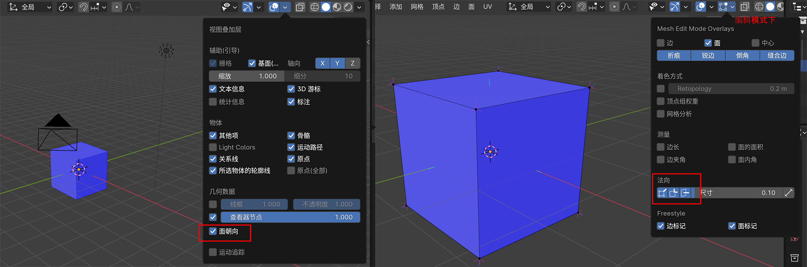

### 常用建模操作

* 挤出: E
* 向内挤出: I
* 环切: Ctrl + R
* 倒角: Ctrl + B
* 合并: M
* 断开: V
* 切刀: K
  * 鼠标右键 或者 空格键退出
* 填充: F
* 栅格填充: Ctrl + F
  * 直接填充有可能出现多边面
  * 栅格填充必须是偶数面
* 桥接: Ctrl + E
  * 桥接只能基于一个物体进行操作
  * 合并两个物体为一个物体: Ctrl + J
* 分离: P
* 底部对齐: S + Z + 0
* 父子级关系绑定: Ctrl + P 
  * 先选子级, 再选父级
  * 父级移动, 子级跟随, 子级移动, 父级不变
  * 一个物体只能有一个父级
  * Alt + P : 删除父子级关系
  * 父子级关系的几种:
    1. 物体: 常规的父子级关系, 指定新的父级时, 跟随原来父级的变换会重置
    2. 物体(保持变换): 更新父级后, 跟随原来的父级的变换依旧保留
    3. 物体(无反向): 使得父子级原点重合
    4. 物体(保持变换无反向): 保留变换
    5. 顶点: 曲线修改器应用于父级时, 子级跟随变换, 同时基于一点进行父子级定位, 只能保持父子级相对位置不变
    6. 顶点(基于三点): 曲线修改器应用于父级时, 子级跟随变换, 同时基于三点进行父子级定位, 可以使得子级跟随进行翻转等复杂操作
* 按路径滑动点: 按两次G

> 五条边及以上的边组成的面叫多边面, 建模时应避免出现多边面. 各种引擎在渲染的时候, 会将面都转换为三角面, 如果是多边面, 转换为三角面的时候会出问题.

### 修改器

* **表面细分**: 将网格的面分割成更小的面, 使其看起来更平滑. (Ctrl + 2)
* **实体化**: 获取任意网格的表面, 然后为之添加深度, 使之变厚.
* **倒角**: 
  * 宽度: 坡口形成的两条新边的距离;
  * 段数: 增加细分
* **布尔修改器**: 可以对两个物体进行交集, 差集, 并集运算(偶尔会出现奇怪的问题, 慎用)
* **简易形变**: 将物体在X/Y/Z方向上进行 扭曲/弯曲/锥化/拉伸
* **缩裹**: 将一个平面贴合到目标平面上

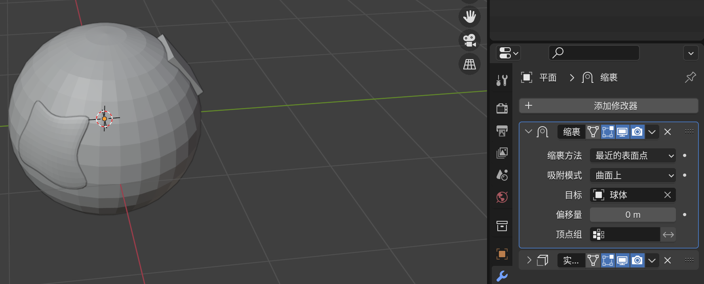

* **阵列**: 将一个物体按照某种规则, 重复生成多次
  * 相对偏移: 相对于前一个物体偏移的比例;
  * 恒定偏移: 以物体原点为基准偏移指定的尺寸;
  * 物体偏移: 通过物体来决定偏移程度, 原始物体相对偏移物体位移了多少, 阵列的物体就相对偏移多少, 原物体相对偏移物体旋转了多少, 阵列物体就旋转多少.

* **曲线**

通过曲线修改器, 可以使物体按照指定的曲线形态进行形变

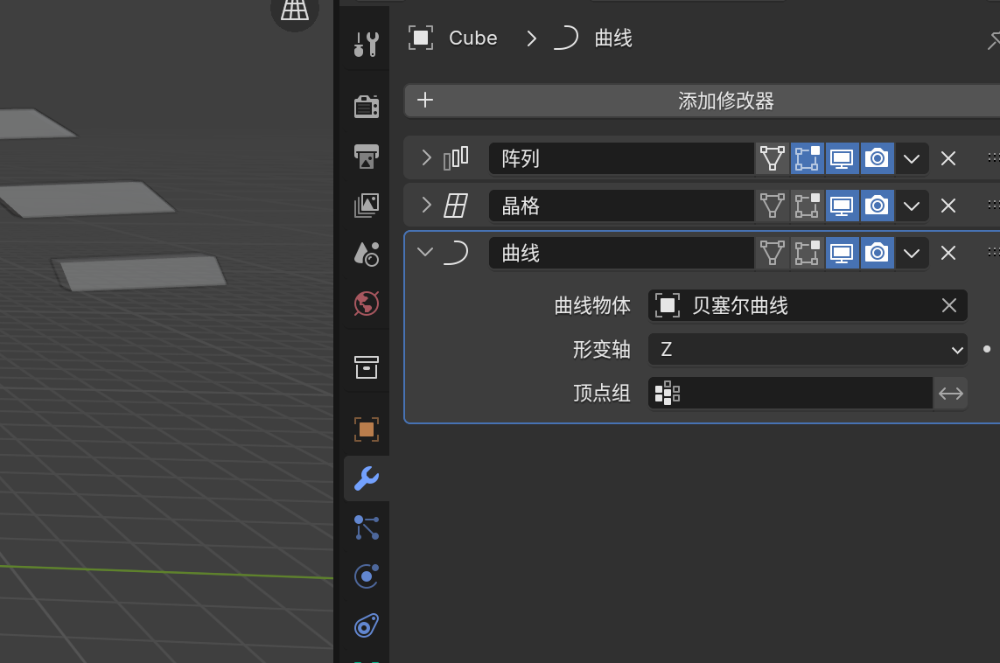

* **蒙皮**

可以用来做出分叉的结构, 很灵活.

主要有两个操作:

1. 可以选中任意一个点, 'E'挤出一个分叉
2. 选中任意点, Ctrl + A修改半径

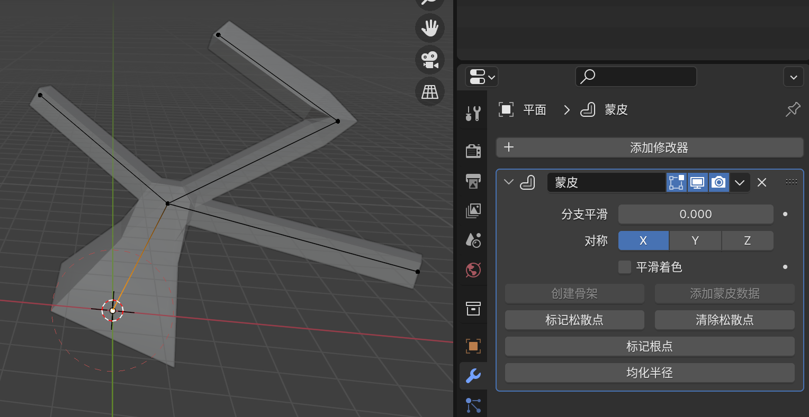

> 勾选蒙皮修改器的平滑着色, 可以让模型平滑着色

> Tip: 如何创建一个点? 新建一个平面, 编辑模式, 选中四个点, M合并-到中心

* **置换**

置换修改器可以将一张图片, 将一个平面变成凹凸的

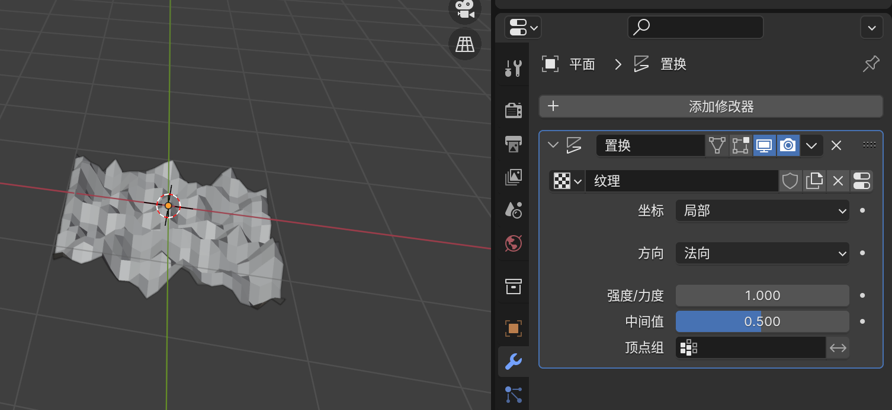

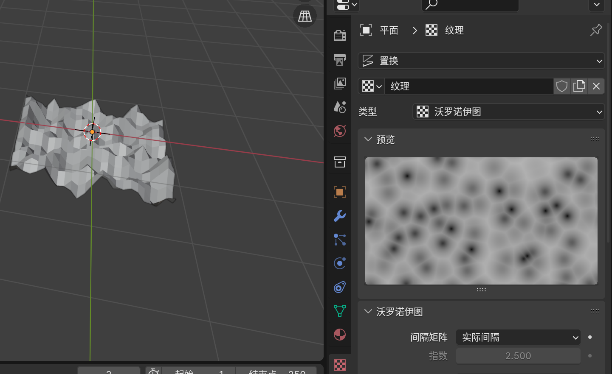

* **镜像**

* Clipping: 避免顶点在变换时穿过镜像

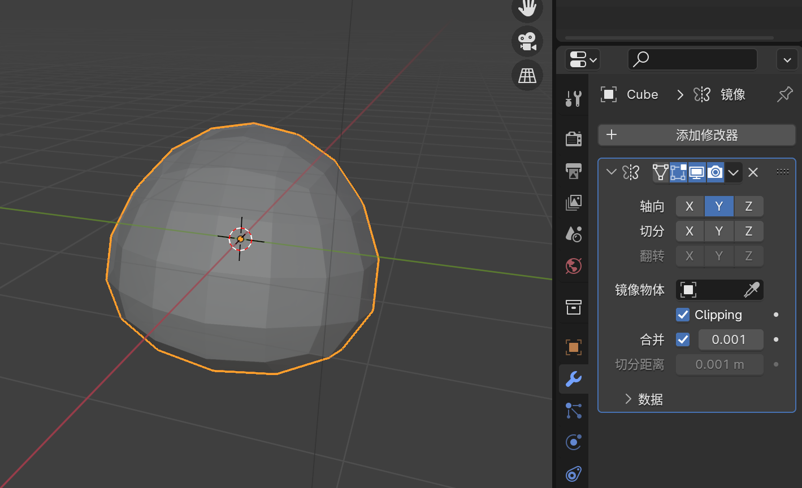

### 辅助工具

**衰减编辑** 

不开启衰减时, 对一个元素的变换只影响这个元素本身, 开启衰减之后, 在指定范围内的其他同类元素也会不同程度的进行变换

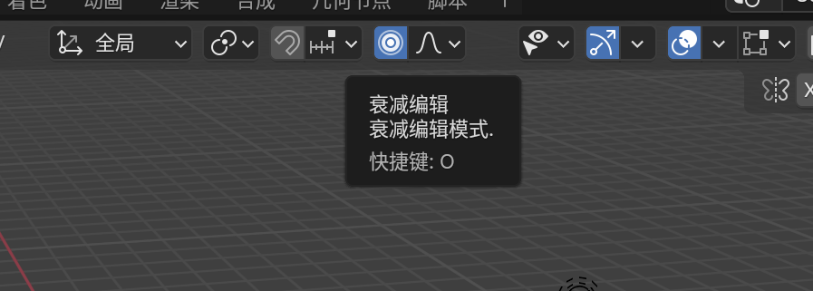

**吸附工具**

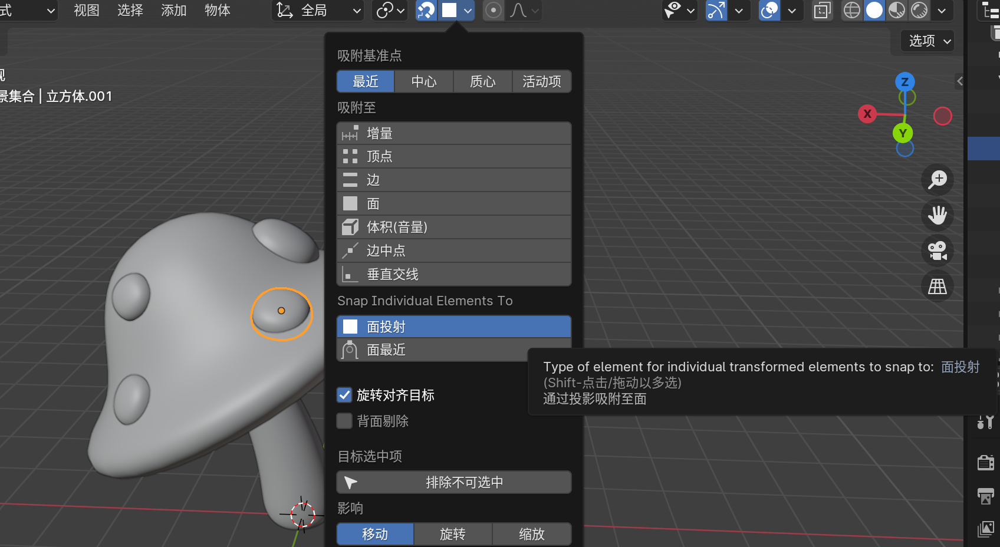

> 注意这里选择了面投射和旋转对齐

**旋绕工具**

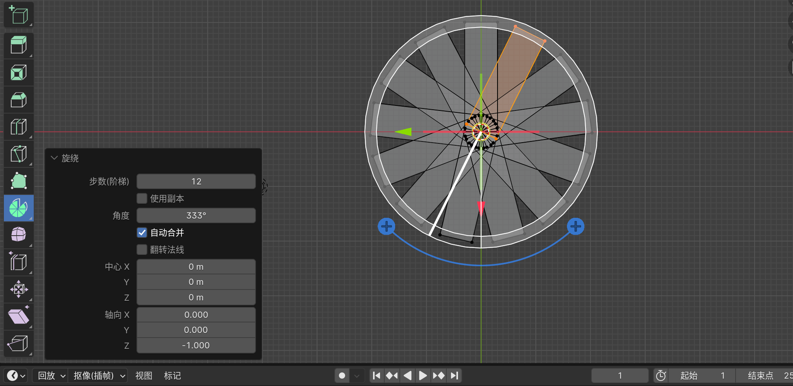

**晶格形变**

晶格形变通过晶格将晶格做"包裹"的子级实体同步进行形变, 可以用于对一组实体进行整体的形变.

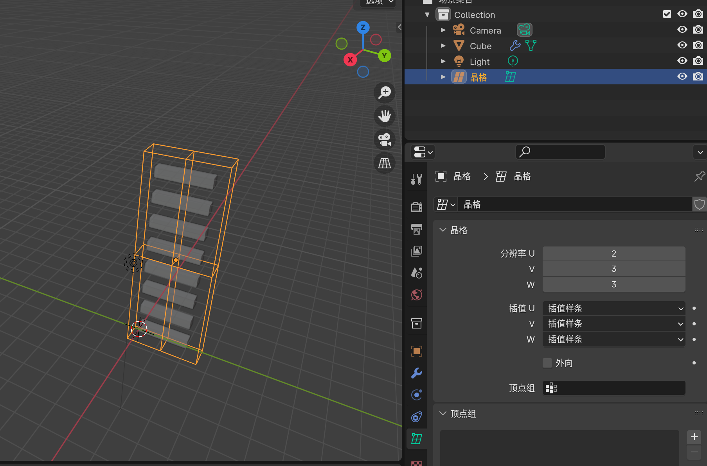

1. 新建晶格;
2. 放在适当的位置;
3. 选中子级, 再选中晶格, Ctrl + P, 在弹出菜单中, 选择晶格形变, 使得子级和晶格形成一个整体;
4. 对晶格的各种变换会同时影响到自己实体.

> 晶格形变实际上也是一个修改器

**曲线建模**

曲线分为两大类:
1. 贝塞尔曲线
2. NURBS曲线

* 曲线通过曲线菜单中的倒角可以变成有粗细的实体;
  * 倒角中有"封盖"选项, 可以将"管"变成"柱"
  * 选中曲线中的点, Alt + S可以单独正对这个点位置进行粗细调整
  * 倒角可以选中另一个曲线物体, 就会以这个曲线为轮廓生成"管道"
* 闭合曲线
  * 选中要闭合的两个点, F闭合
  * 选中一个点, Alt + C
* 断开曲线
  * 选中两个点, X删除-段数

## 材质

### 基础

基本界面:

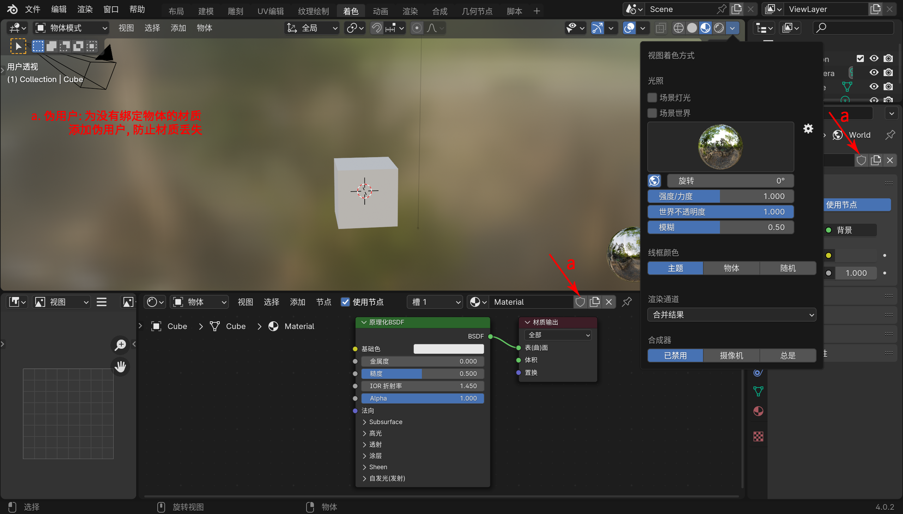

常用快捷键:

* Ctrl + J : 将选中的节点归为一个组

在着色器编辑器中, 可以添加各种材质节点, 例如:

* 着色器
  * 原理化BSDF
  * 混合着色器
* 纹理
  * 图像纹理
* 矢量
  * 映射
  * 凹凸
* 输入
  * 纹理坐标
* 转换器
  * 颜色渐变
  * 分离XYZ
  * 混合

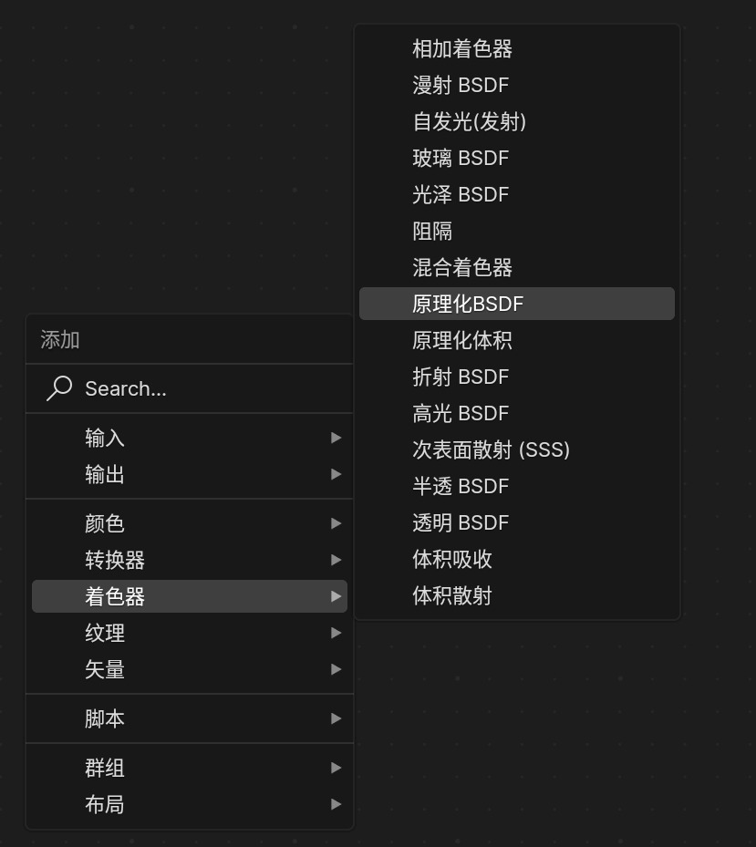

### 原理化BSDF

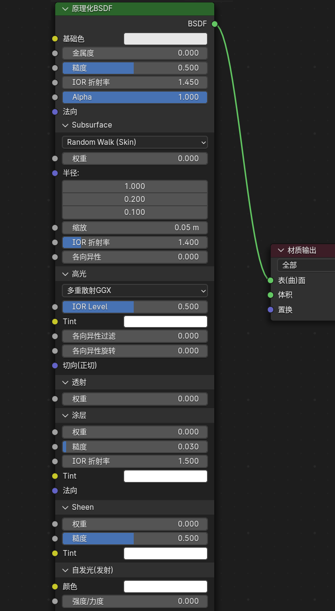

* 基础色: 模型的颜色, 也可以接一个颜色贴图, 一般不要纯黑或者纯白
* 金属度: 0代表非金属, 1代表金属, 一般我们要么选0, 要么选1
* 糙度: 0代表平滑, 1代表粗糙, 确定漫反射和镜面反射时物体表面的粗糙程度
* IOR折射率: 透明材质常用的光折射率, 可以网上搜索各种材质的IOR
* Alpha: 透明度, 默认是1, 当是0的时候, 物体完全消失不可见
* 法向: 通常这个会链接PBR的normal map法线贴图
* Subsurface(次表面) - 决定模型是不是透光, 用于皮肤, 窗帘等的通透程度
  * 随机游走: 一种模拟次表面的渲染方式(仅支持Cycles)
  * 权重: 决定模型的透光程度, 一般不会调太大, 没有那么通透的东西
  * 半径: 决定半透光散射的距离, 三个值分别代表RGB三个通道的散射半径, 可以通过改变半径的三个值改变次表面颜色, 决定透过去的颜色是什么样的
  * 缩放: 用来和半径相乘输出最终结果, 从而改变次表面颜色的明显程度
  * IOR折射率: 次表面散射的折射率(仅在Random Walking(Skin)模式下可选, 仅支持Cycles)
  * 各向异性: 代表次表面散射方向(仅支持Cycles)
* 高光 - 代表物体菲涅尔效应反射率程度, 数值越大, 高光反射量越大, 高光越亮
  * GGX: 是一种微表面反射光照模型, 有比较好的渲染效果
  * 多重散射GGX: 比GGX会在计算一些微平面间的光线反弹和散射, 但是比GGX慢, 一般肉眼也有看不出来区别, 所以默认都用GGX
  * IOR Level: 代表菲涅尔效应反射率程度, 数值越大, 高光反射量越大, 高光越亮, 因为所有物体都是有一些菲涅尔效应的, 所以高光值不要设置为0, 默认是0.5
  * Tint: 高光染色, 不设置时, 默认高光是白色的, 可以将高光设置成其他颜色
  * 各向异性过滤: 调大可以把一些高光转换成沿切线方向的细长高管(仅支持cycles)
  * 各向异性旋转: 比较常用的是金属部分, 可以控制金属的高光分布方向(仅支持cycles)
  * 切向: 就是各向异性这种金属的高光方向, 可以作为切向贴图
* 透射 - 让你的模型透明, 只有打开这个, IOR折射率才起作用
  * 权重: 透射的权重
* 涂层 - 类似给材质加了一层包光, 多一层白色高光, 常用于制作车漆材质.
  * 权重: 涂层的权重
  * 糙度: 增加的这层涂层的粗糙程度
  * 法向: 涂层法线, 类似于汽车涂层的法线, 可以接法线贴图
  * IOR折射率: 调整涂层的质感, 做出透明漆感
  * Tint: 可以单独设置涂层有颜色
* Sheen(光泽)
  * 权重: 用于布料的部分, 调到1, 有天鹅绒的效果, 控制的是褶皱的反光数量, 数值越大越明显 
  * 糙度: 控制布料等表面的反光强度
  * Tint: 设置光泽的颜色
* 自发光 - 让你的模型发光, 霓虹灯等效果, 并且可以设置颜色
  * 颜色: 自发光颜色
  * 强度: 自发光强度

### 图像纹理

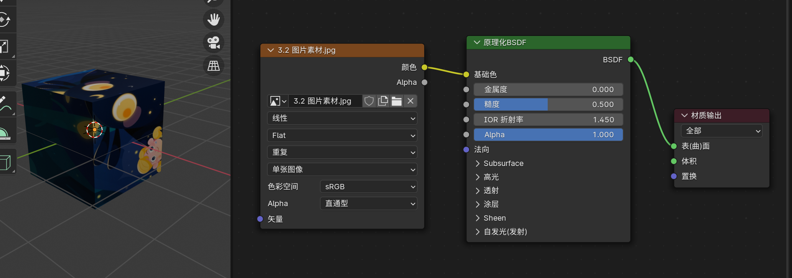

> 默认情况下, 图像纹理采用的是UV坐标

### 映射

用于控制纹理的位置

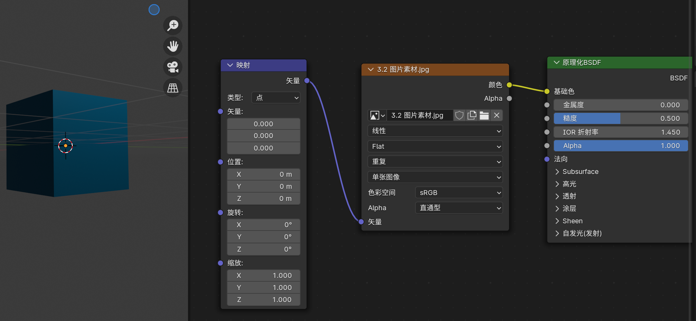

> 单纯添加映射节点, 纹理的显示会有问题, 需要"纹理坐标"节点配合使用

### 纹理坐标

纹理坐标用于指示怎样将一张2D的图片映射到3D物体上

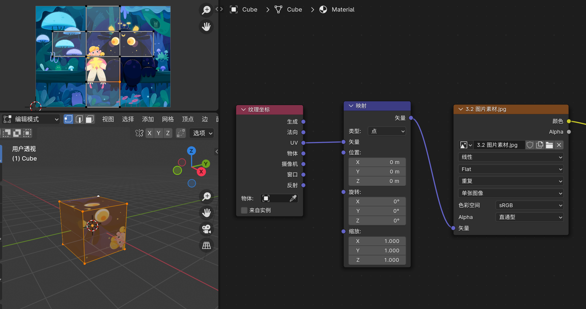

常用的纹理坐标

* 生成: 基于全局的坐标进行图像投射
* UV: 将物体展开为二维表面, 然后进行投射
* 物体: 基于物体本身原点进行图像投射

### 颜色渐变

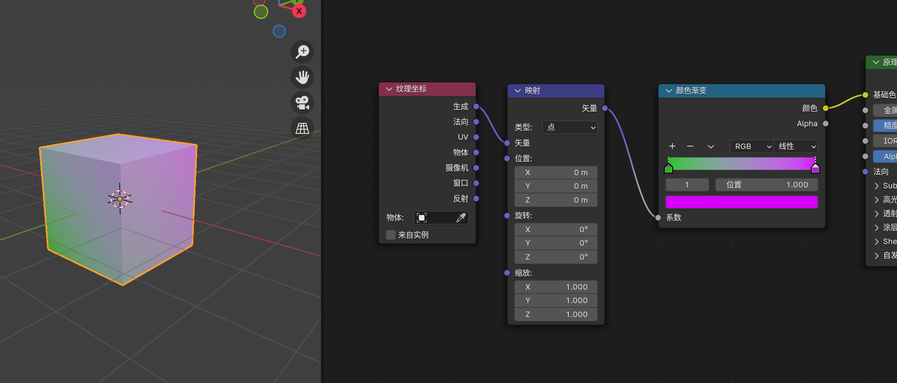

> 单独的颜色渐变节点并不会产生渐变效果, 至少需要配合"纹理坐标", "映射"一起使用
> 一般情况下, 还需要配合"分离XYZ"

### 分离XYZ

把单独的一个轴保留, 其余两个轴清零

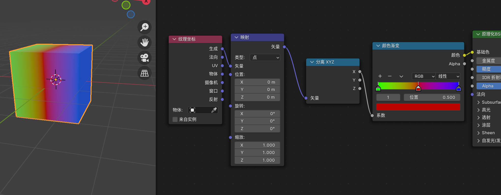

### 程序化纹理

在纹理菜单下, 有各种各样的内置纹理, 可以统称为程序化纹理.

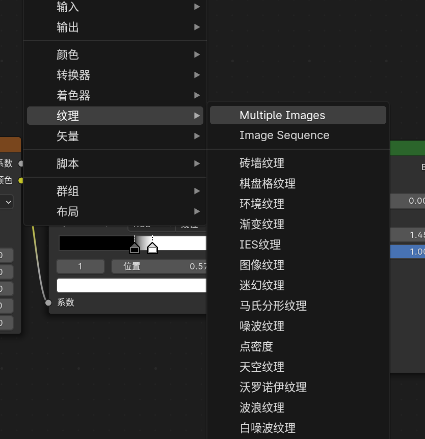

利用"噪波纹理"做出的一种类大理石效果:

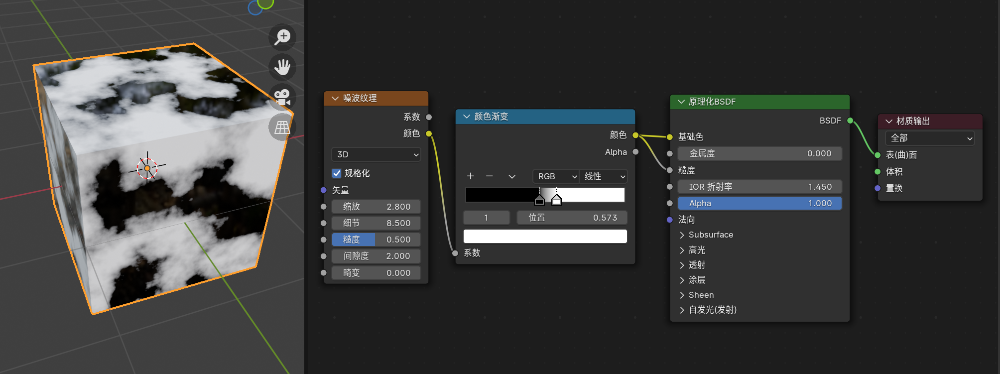

### 混合

* 混合节点可以将两个颜色输入混合在一起
* 混合方式有正片叠底, 柔光等等(类PS)
* 混合有一个系数, 系数越接近0, 颜色越接近A, 系数越接近1, 颜色越接近B

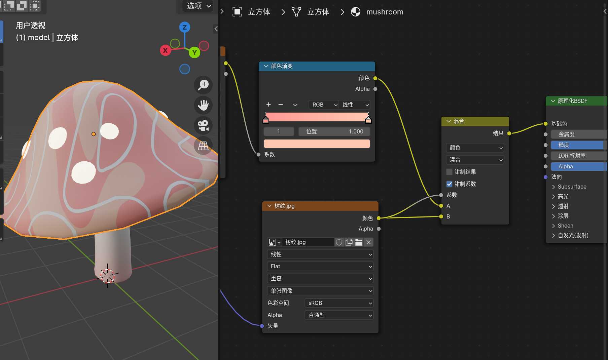

> 在Blender中, 可以使用灰度图表示一个数值, 例如上面混合节点中, 将图片的灰度值作为系数. 白色表示系数值为1, 黑色表示系数值为0

### 凹凸

* 首先有一个灰度图, 代表从0到1的数值
  * 0.5以上是凸, 0.5以下是凹
* 将灰度图输入给凹凸节点的高度
* 将凹凸节点的输出(法向)与原理化BSDF的法向相连
  * 凹凸是通过原理化BSDF的法向来控制的(法向用来控制光线如何反射的, 从而模拟出一种凹凸感)
  * 凹凸节点输出的值如何直接连接到原理化BSDF的颜色节点上, 可以看到彩色, 这是因为凹凸节点输出的法向值是一个向量, 向量有三个维度, 同构于颜色的RGB三个通道, 所以blender里边, 通过RGB颜色和矢量之间可以互相映射
* 凹凸节点生成的凹凸效果是伪凹凸, 实际上还是平面

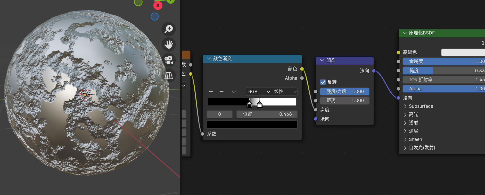

### 置换

* 置换节点非常耗性能, 一般不用, 而是用置换修改器来做
* 首先需要将材质的设置中置换由默认的"仅凹凸"改为"置换与凹凸"(Cycles下采用这个选项)
* 置换只在Cycles下有效
* 使用置换节点时, 目标物体需要先加细分

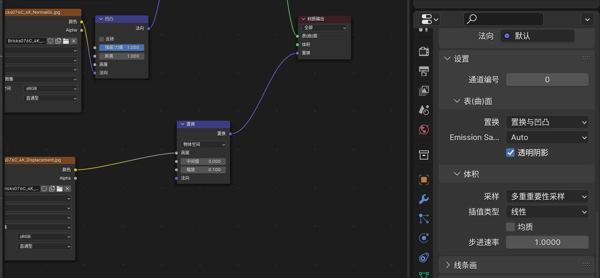

### UV纹理绘制

* 窗口1: 纹理绘制
  * 按F, 然后移动鼠标, 可以缩放笔刷大小
* 窗口2: UV编辑器
* 窗口3: 着色器编辑器
* 窗口4: 模型编辑
  * U - UV映射菜单
    * 可以使用智能展开
    * 可以选中一组线, 标记缝合边, 然后点击"展开"

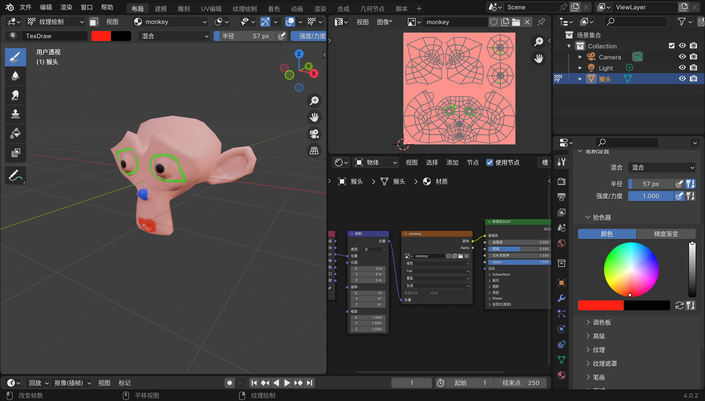

## 插件

* Loop Tools: 网格建模工具包, 方便的进行一些操作, 可以提升建模效率.

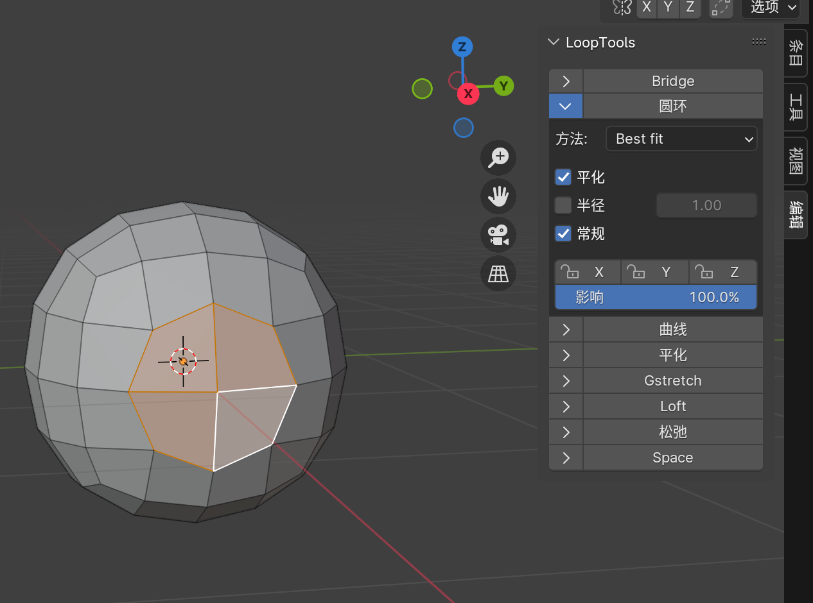

* Node Wrangler: 增强和加速基于节点的工作流的各种工具
  * 着色器编辑器
    * 选中一个节点, 按Ctrl + T, 自动补全上游节点
    * Ctrl + Shift, 单击一个节点, 将这个节点连接到输出节点上(用于快速预览)
    * Ctrl + Shift + T 可以选择材质图, 自动生成一系列置换材质节点(细分以及材质渲染设置需要手动调整)

## 偏好设置

> 编辑 - 偏好设置

* 视图切换 - 围绕物体旋转
* 视图切换 - 缩放至鼠标位置
* 插件