# VisualBox网络

## 概述

VirtualBox中有4中网络连接方式:

1. NAT -- 网络地址转换模式(Network Address Translation)
2. Bridged Adapter -- 桥接
3. Internal -- 内部网络模式
4. Host-only Adapter -- 主机模式

VMWare中有三种(NAT, Bridged Adapter, Host-only Adapter), Virtual Box比VM ware多了一种(Internal). 其余都是一样的.

&nbsp;|NAT|Bridged Adapter|Internal|Host-only Adapter
-|-|-|-|-
虚拟机→宿主机|√|√|×|默认不能设置
宿主机→虚拟机|×|√|×|默认不能设置
虚拟机→外网|√|√|×|默认不能设置
外网→虚拟机|×|√|×|默认不能设置
虚拟机之间|×|√|同网络名可以|√

## NAT

NAT : Network Address Translation, 网络地址转换

NAT模式是最简单的实现虚拟机上网的方式, 你可以这样理解:

```txt
Guest访问网络的所有数据都是由主机提供的, Guest并不真实存在于网络中, 主机与网络中的任何机器都不能查看和访问到Guest的存在
Guest可以访问主机能访问到的所有网络, 但是对于主机以及主机网络上的其他机器, Guest又是不可见的, 甚至主机也访问不到Guest
```

**IP分配策略**

一台虚拟机的多个网卡可以被设定使用NAT, 第一个网卡连接了到专用网 10.0.2.0, 第二个网卡连接到专用网络 10.0.3.0, 等等. 
默认得到的客户端ip(IP Address)是10.0.2.15, 网关(Gateway)是10.0.2.2, 域名服务器(DNS)是10.0.2.3, 可以手动进行修改.

> 在做端口映射以后, 主机可以访问虚拟机


这种方式下, 虚拟机的网卡连接到宿主的 VMnetX 上. 此时系统的 VMWare NAT Service 服务就充当了路由器的作用, 负责将虚拟机发到 VMnetX 的包进行地址转换之后发到实际的网络上, 再将实际网络上返回的包进行地址转换后通过 VMnetX 发送给虚拟机. VMWare DHCP Service 负责为虚拟机提供 DHCP 服务

## Bridged Adapter

可以这样理解:

```txt
它是通过主机网卡，架设了一条桥，直接连入到网络中了。因此，它使得虚拟机能被分配到一个网络中独立的IP，所有网络功能完全和在网络中的真实机器一样。
网桥模式下的虚拟机，你把它认为是真实计算机就行了。

这种方式下, 虚拟机就像一台真正的计算机一样, 直接连接到实际的网络上, 与宿主机没有任何联系.
```

**IP分配策略**

一般是DHCP分配的, 与主机的"本地连接"的IP是同一网段的. 虚拟机就能与主机互相通信

> 当主机不能访问外部网络时. 虚拟机和主机之间不能相互通信. 主机的"本地连接"有红叉, 就不能手工指定IP. 虚拟机也不能通过DHCP得到IP地址, 手工指定IP后, 也无法与主机通信, 因为主机无IP.

## Internal

顾名思义就是内部网络模式:

```txt
虚拟机与外网完全断开, 只实现虚拟机于虚拟机之间的内部网络模式
```

**IP分配策略**

VirtualBox的DHCP服务器会为它分配IP, 一般得到的是192.168.56.101, 因为是从101起分的, 也可手工指定192.168.56.*

> 虚拟机可以与主机的VirtualBox Host-Only Network网卡通信

## Host-only Adapter

主机模式, 这是一种比较复杂的模式, 需要有比较扎实的网络基础知识才能玩转. 可以说前面几种模式所实现的功能, 在这种模式下, 通过虚拟机及网卡的设置都可以被实现.

可以理解为:

```txt
Guest在主机中模拟出一张专供虚拟机使用的网卡, 所有虚拟机都是连接到该网卡上的, 我们可以通过设置这张网卡来实现上网及其他很多功能, 比如(网卡共享、网卡桥接等)
```

虚拟机访问主机, 用的是主机的VirtualBox Host-Only Network网卡的IP: 192.168.56.1, 不管主机"本地连接"有无红叉, 永远通
主机访问虚拟机, 用是的虚拟机的网卡3的IP: 192.168.56.101, 不管主机“本地连接”有无红叉, 永远通
虚拟机访问互联网, 用的是自己的网卡2, 这时主机要能通过“本地连接”有线上网, (无线网卡不行)

这种方式下, 虚拟机的网卡连接到宿主的 VMnetX 上, 但系统并不为虚拟机提供任何路由服务, 因此虚拟机只能和宿主机进行通信, 而不能连接到实际网络上

## NAT设置端口映射

**1. 使能访问外网**

Virtual Box安装好CentOS6之后, 网络状态如下:

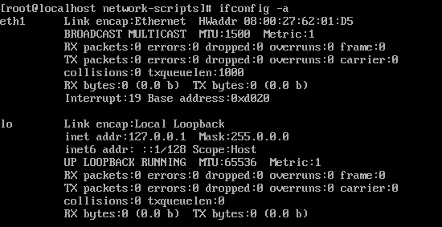

与外界完全隔离, 不能访问外网, 也不能被宿主机访问.

```shell
> vi /etc/sysconfig/network-scripts/ifcfg-eth0
```

当前配置如下图所示:

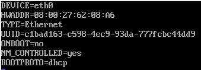

更改配置:

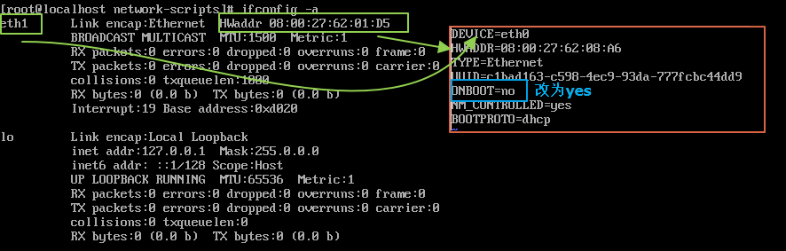

如图所示, 有三处需要更改:

1. Device改为与ifconfig显示的一致
2. HWADDR改为与ifconfig显示的一致
3. ONBOOT值改为yes

最终配置如下:

```txt
DEVICE=eth1
HWADDR=08:00:27:62:01:D5
TYPE=Ethernet
UUID=c1bad163-c598-4ec9-93da-777fcbc44dd9
ONBOOT=yes
NM_CONTROLLED=yes
BOOTPROTO=dhcp
```

重启网卡:

```shell
service network restart
```

测试一下:

```shell
[root@localhost ~]# ifconfig
eth1      Link encap:Ethernet  HWaddr 08:00:27:62:01:D5
          inet addr:10.0.2.15  Bcast:10.0.2.255  Mask:255.255.255.0
          inet6 addr: fe80::a00:27ff:fe62:1d5/64 Scope:Link
          UP BROADCAST RUNNING MULTICAST  MTU:1500  Metric:1
          RX packets:337 errors:0 dropped:0 overruns:0 frame:0
          TX packets:279 errors:0 dropped:0 overruns:0 carrier:0
          collisions:0 txqueuelen:1000
          RX bytes:38427 (37.5 KiB)  TX bytes:46353 (45.2 KiB)
          Interrupt:19 Base address:0xd020

lo        Link encap:Local Loopback
          inet addr:127.0.0.1  Mask:255.0.0.0
          inet6 addr: ::1/128 Scope:Host
          UP LOOPBACK RUNNING  MTU:65536  Metric:1
          RX packets:0 errors:0 dropped:0 overruns:0 frame:0
          TX packets:0 errors:0 dropped:0 overruns:0 carrier:0
          collisions:0 txqueuelen:0
          RX bytes:0 (0.0 b)  TX bytes:0 (0.0 b)

[root@localhost ~]# ping www.baidu.com
PING www.a.shifen.com (180.101.49.11) 56(84) bytes of data.
64 bytes from 180.101.49.11: icmp_seq=1 ttl=43 time=28.0 ms
64 bytes from 180.101.49.11: icmp_seq=2 ttl=43 time=37.3 ms
64 bytes from 180.101.49.11: icmp_seq=3 ttl=43 time=31.4 ms
64 bytes from 180.101.49.11: icmp_seq=4 ttl=43 time=37.9 ms
64 bytes from 180.101.49.11: icmp_seq=5 ttl=43 time=33.9 ms
```

**2. 配置端口映射, 使能被宿主机访问**

为了使得宿主机可以访问到虚拟机, 需要配置端口映射.

配置方式如图所示:

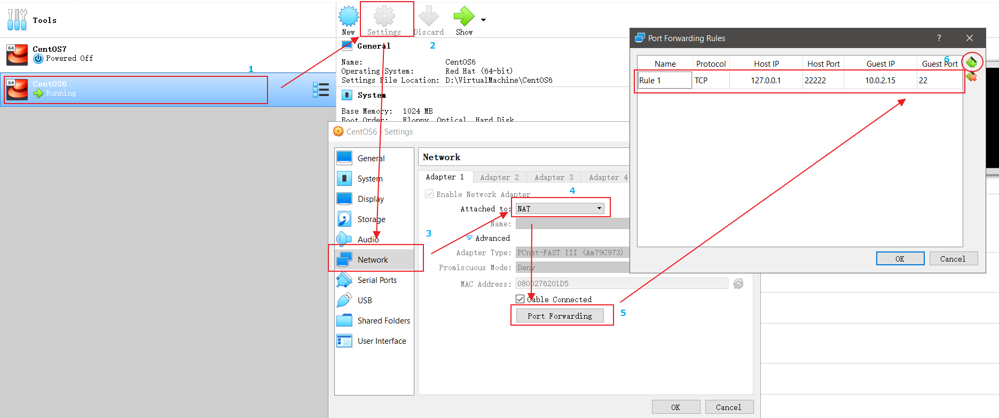

需要注意的是端口映射中GuestIP需要和虚拟机本身的IP保持一致. GuestPort需要根据需求来配置, 这里接下来需要使用终端访问虚拟机, 所以映射到22端口.

在宿主机上使用puTTY终端连接虚拟机:

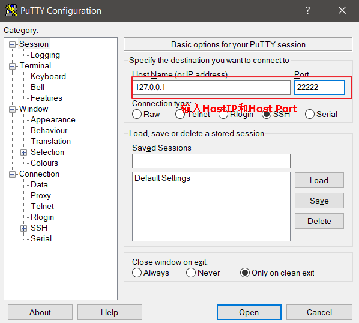

连接成功:

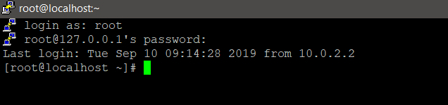

**注意**

配置端口映射, 需要保证映射的端口在虚拟机的防火墙中是放行的:

```shell
[root@localhost ~]# more /etc/sysconfig/iptables
# Firewall configuration written by system-config-firewall
# Manual customization of this file is not recommended.
*filter
:INPUT ACCEPT [0:0]
:FORWARD ACCEPT [0:0]
:OUTPUT ACCEPT [0:0]
-A INPUT -m state --state ESTABLISHED,RELATED -j ACCEPT
-A INPUT -p icmp -j ACCEPT
-A INPUT -i lo -j ACCEPT
-A INPUT -m state --state NEW -m tcp -p tcp --dport 22 -j ACCEPT
-A INPUT -j REJECT --reject-with icmp-host-prohibited
-A FORWARD -j REJECT --reject-with icmp-host-prohibited
COMMIT
```

从上面可以看出22端口是放行的.

**3. 自定义静态IP**

上面由于是动态IP, 一旦虚拟机的IP发生变化, 有会导致很多问题, 所以可以把虚拟机配置成静态IP. 这里同时演示了重新配置了虚拟机IP所处网段.

由于NAT模式实际上从网络上获取到的数据都是宿主机提供的, 虚拟机并不真实存在于网络当中, 所以不论如何配置IP, 都不会与外界产生IP冲突.

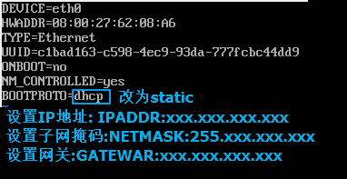

最终配置如下:

```txt
DEVICE=eth1
HWADDR=08:00:27:62:01:D5
TYPE=Ethernet
UUID=c1bad163-c598-4ec9-93da-777fcbc44dd9
ONBOOT=yes
NM_CONTROLLED=yes
BOOTPROTO=static
IPADDR=192.168.1.135
NETMASK=255.255.255.0
GATEWAY=192.168.1.1
```

> 可以看出这里使用了与上面10网段完全不同的192.168网段

重启网络服务
```shell
service network restart
```

这时发现虚拟机完全不能访问外网了, 需要修改Virtual Box的网络配置:

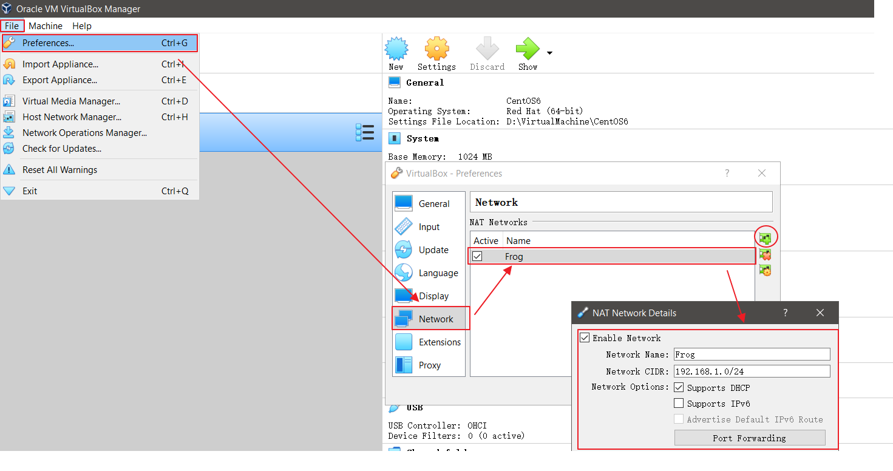

分析一下, 这个CIDR:

```txt
CIDR, IP地址表示法是: IP地址 ::= {<网络前缀>， <主机号>} / 网络前缀所占位数
所以:
192.168.1.0 -> 1100 0000 1010 1000 0000 0001 0000 0000
网络前缀是24位, 主机号8位 -> 1111 1111 1111 1111 1111 1111 0000 0000 -> 子网掩码 : 255.255.255.0
最大地址为 : 192.168.1.255
最小地址为 : 192.168.1.0
```

上面的配置可以保证虚拟机访问到外网(当然, 还需要把上面的配置应用到虚拟机上), 下面的配置是让宿主机可以访问到虚拟机, 配置端口映射:

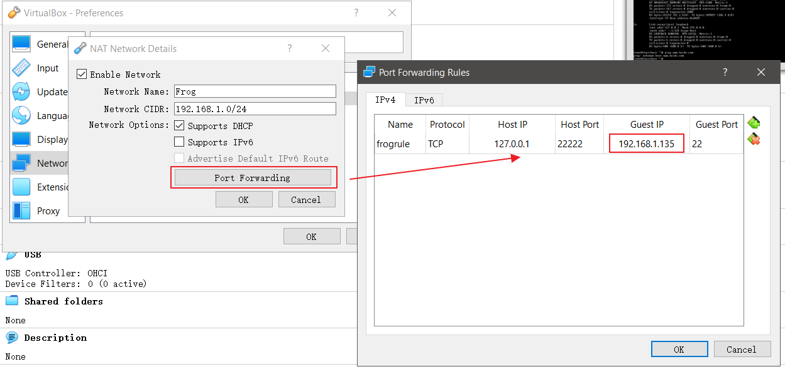

这里GuestIP就是虚拟机中配置的静态IP了.

经过上面的配置, 一个自定义的NAT network就配置好了, 下面, 将其应用到虚拟机上:

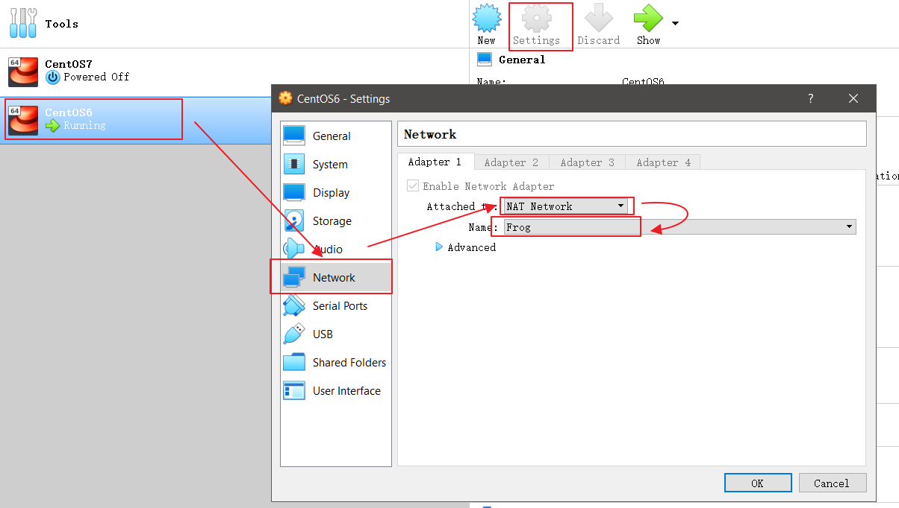


至此, 完成虚拟机静态IP配置, 并保证虚拟机可以访问到外网, 宿主机可以访问到虚拟机.

使用FileZilla连接试一下:

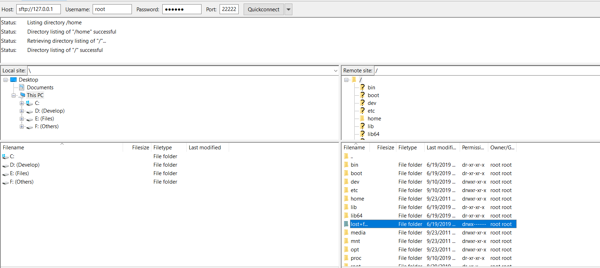

没有问题.